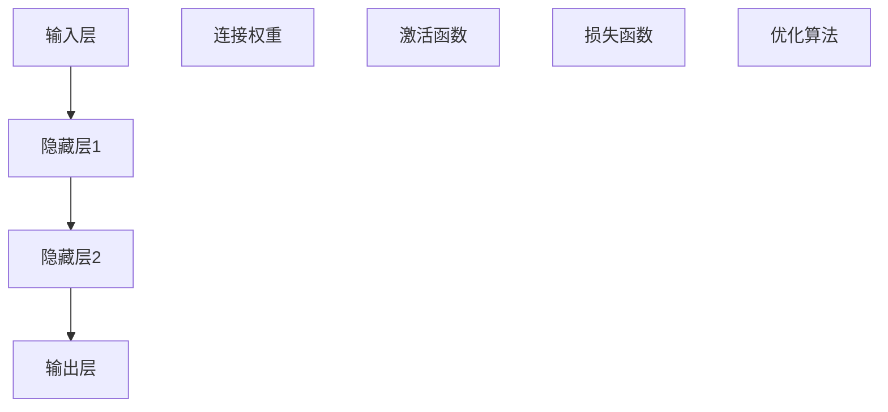
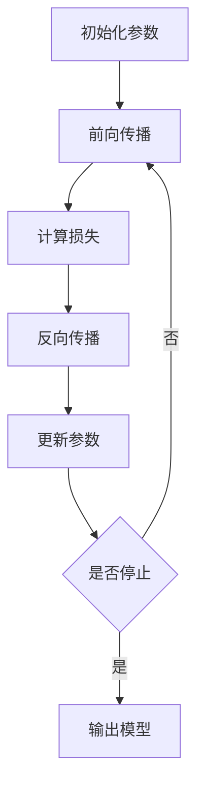

# 人工神经网络:了解常见的人工神经网络及其应用

## 1.背景介绍

### 1.1 人工神经网络概述

人工神经网络(Artificial Neural Networks, ANNs)是一种受生物神经系统启发而设计的计算模型,旨在模拟人脑的信息处理方式。它由大量互相连接的节点(神经元)组成,这些节点可以接收输入数据,经过内部加权求和和非线性激活函数处理后,产生输出信号传递给下一层节点。通过调整连接权重和偏置值,神经网络可以学习到输入和输出之间的映射关系,从而解决诸如模式识别、数据预测、决策制定等各种复杂任务。

### 1.2 人工神经网络发展历程

人工神经网络的理论可以追溯到20世纪40年代,当时神经科学家沃伦·麦卡洛克(Warren McCulloch)和数理逻辑学家沃尔特·皮茨(Walter Pitts)提出了第一个神经网络计算模型。20世纪60年代,马文·明斯基(Marvin Minsky)和西摩尔·珀普特(Seymour Papert)对神经网络的局限性提出了批评,导致神经网络研究进入了一个相对停滞的时期。

直到20世纪80年代,随着反向传播算法(Backpropagation)的发明和计算能力的提高,神经网络研究重新兴起。此后,卷积神经网络(Convolutional Neural Networks, CNNs)、递归神经网络(Recurrent Neural Networks, RNNs)等新型神经网络模型不断涌现,极大地推动了深度学习的发展。近年来,随着大数据、高性能计算和新算法的不断涌现,神经网络在计算机视觉、自然语言处理、语音识别等领域取得了突破性的进展。

### 1.3 人工神经网络的优势

与传统的机器学习算法相比,人工神经网络具有以下优势:

1. **自动特征提取**: 神经网络可以直接从原始数据中自动学习特征表示,无需人工设计特征。
2. **泛化能力强**: 神经网络通过训练可以学习到输入和输出之间的复杂映射关系,具有很强的泛化能力。
3. **并行处理**: 神经网络的结构天生支持并行计算,可以有效利用现代硬件(如GPU)的计算能力。
4. **容错性好**: 由于神经网络是由大量节点组成的分布式系统,单个节点的故障不会对整体造成太大影响。
5. **适用于非线性问题**: 神经网络通过非线性激活函数可以很好地拟合非线性映射关系。

## 2.核心概念与联系

### 2.1 神经网络的基本组成

一个典型的人工神经网络由以下几个核心组成部分构成:

1. **输入层(Input Layer)**: 接收外部输入数据,如图像、文本等。
2. **隐藏层(Hidden Layers)**: 对输入数据进行特征提取和转换,可以有多个隐藏层。
3. **输出层(Output Layer)**: 根据隐藏层的输出,产生最终的输出结果。
4. **连接权重(Connection Weights)**: 连接每两个节点的权重,决定了信号在传递过程中的加权程度。
5. **激活函数(Activation Function)**: 对每个节点的加权输入进行非线性转换,引入非线性因素。
6. **损失函数(Loss Function)**: 用于衡量神经网络输出与期望输出之间的差异,是训练过程中需要优化的目标函数。
7. **优化算法(Optimization Algorithm)**: 通过调整连接权重和偏置值,最小化损失函数,实现神经网络的训练。

这些组成部分相互协作,构成了一个端到端的数据处理系统。输入数据经过多层非线性变换后,最终输出所需的结果。在训练过程中,通过优化算法不断调整网络参数,使得输出结果逐渐逼近期望值。

### 2.2 神经网络的训练过程

神经网络的训练过程可以概括为以下几个步骤:

1. **初始化**: 随机初始化神经网络中的所有可训练参数(连接权重和偏置值)。
2. **前向传播(Forward Propagation)**: 将输入数据传递至输出层,计算输出结果。
3. **损失计算**: 根据损失函数计算输出结果与期望输出之间的差异。
4. **反向传播(Backpropagation)**: 利用链式法则,计算损失函数相对于每个参数的梯度。
5. **参数更新**: 根据梯度下降等优化算法,更新网络参数,使损失函数值下降。
6. **重复训练**: 重复执行步骤2-5,直至满足停止条件(如损失函数收敛或达到最大迭代次数)。

通过不断迭代训练,神经网络可以逐步学习到输入和输出之间的映射关系,从而实现对新数据的预测或分类等任务。

## 3.核心算法原理具体操作步骤

### 3.1 前向传播算法

前向传播(Forward Propagation)是神经网络的基本运算过程,它将输入数据通过网络层层传递,最终得到输出结果。具体步骤如下:

1. 输入层接收外部输入数据$x$。
2. 对于每个隐藏层节点$j$,计算加权输入$z_j$:

$$z_j = \sum_{i} w_{ij}x_i + b_j$$

其中$w_{ij}$是连接输入节点$i$和隐藏层节点$j$的权重,

 $b_j$是节点$j$的偏置值。
3. 通过激活函数$f$计算隐藏层节点$j$的输出$a_j$:

$$a_j = f(z_j)$$

常用的激活函数包括Sigmoid、ReLU、Tanh等。
4. 重复步骤2-3,将隐藏层的输出作为下一层的输入,直至输出层。
5. 输出层节点的输出即为神经网络的最终输出结果$y$。

前向传播过程可以用矩阵运算高效实现,适合在GPU等并行硬件上加速计算。

### 3.2 反向传播算法

反向传播(Backpropagation)算法是训练神经网络的关键,它通过计算损失函数相对于每个参数的梯度,指导参数的更新方向。具体步骤如下:

1. 计算输出层节点的损失函数值$L$,如均方误差:

$$L = \frac{1}{2}\sum_k(y_k - t_k)^2$$

其中$y_k$是输出节点$k$的实际输出,$t_k$是期望输出。
2. 计算输出层节点$k$的误差项$\delta_k$:

$$\delta_k = \frac{\partial L}{\partial z_k} = (y_k - t_k)f'(z_k)$$

其中$f'(z_k)$是激活函数的导数。
3. 对于每个隐藏层节点$j$,计算其误差项$\delta_j$:

$$\delta_j = f'(z_j)\sum_k w_{jk}\delta_k$$

即将来自输出层的误差项加权求和。
4. 计算每个连接权重$w_{ij}$和偏置值$b_j$的梯度:

$$\frac{\partial L}{\partial w_{ij}} = a_i\delta_j, \quad \frac{\partial L}{\partial b_j} = \delta_j$$

5. 根据梯度下降等优化算法,更新权重和偏置值:

$$w_{ij} \leftarrow w_{ij} - \eta\frac{\partial L}{\partial w_{ij}}, \quad b_j \leftarrow b_j - \eta\frac{\partial L}{\partial b_j}$$

其中$\eta$是学习率,控制更新步长。
6. 重复步骤2-5,逐层向前传播误差项,直至输入层。

通过不断迭代训练,神经网络可以逐步减小损失函数值,使输出结果逐渐逼近期望值。

## 4.数学模型和公式详细讲解举例说明

### 4.1 激活函数

激活函数引入了神经网络的非线性因素,使其能够拟合复杂的非线性映射关系。常见的激活函数包括:

1. **Sigmoid函数**:

$$\sigma(x) = \frac{1}{1 + e^{-x}}$$

Sigmoid函数的输出范围在(0,1)之间,常用于二分类问题的输出层。但由于存在梯度消失问题,现在较少使用。

2. **Tanh函数**:

$$\tanh(x) = \frac{e^x - e^{-x}}{e^x + e^{-x}}$$

Tanh函数的输出范围在(-1,1)之间,形状与Sigmoid类似,但梯度更大,收敛速度更快。

3. **ReLU函数**:

$$\text{ReLU}(x) = \max(0, x)$$

ReLU函数在正半区线性,在负半区为0,计算简单且不存在梯度消失问题,是目前最常用的激活函数之一。

4. **Leaky ReLU函数**:

$$\text{Leaky ReLU}(x) = \begin{cases}
x, & \text{if } x > 0 \\
\alpha x, & \text{otherwise}
\end{cases}$$

Leaky ReLU在负半区保留了一定的梯度,避免了ReLU的"死亡"神经元问题,常用于深层网络。

不同的激活函数具有不同的特性,在实际应用中需要根据具体问题进行选择和调优。

### 4.2 损失函数

损失函数(Loss Function)用于衡量神经网络输出与期望输出之间的差异,是训练过程中需要优化的目标函数。常见的损失函数包括:

1. **均方误差(Mean Squared Error, MSE)**: 

$$\text{MSE} = \frac{1}{n}\sum_{i=1}^n(y_i - t_i)^2$$

其中$y_i$是神经网络的输出,$t_i$是期望输出,n是样本数量。MSE常用于回归问题。

2. **交叉熵损失(Cross-Entropy Loss)**: 

对于二分类问题:

$$\text{CE} = -\frac{1}{n}\sum_{i=1}^n[t_i\log(y_i) + (1 - t_i)\log(1 - y_i)]$$

对于多分类问题:

$$\text{CE} = -\frac{1}{n}\sum_{i=1}^n\sum_{j=1}^kt_{ij}\log(y_{ij})$$

其中$t_{ij}$是one-hot编码的期望输出,$y_{ij}$是神经网络对第$j$类的预测概率。交叉熵损失常用于分类问题。

3. **Hinge损失(Hinge Loss)**: 

$$\text{Hinge} = \frac{1}{n}\sum_{i=1}^n\max(0, 1 - t_iy_i)$$

Hinge损失常用于支持向量机(SVM)等最大间隔分类器。

4. **Huber损失(Huber Loss)**: 

$$\text{Huber}(x) = \begin{cases}
\frac{1}{2}x^2, & \text{if }|x| \leq \delta \\
\delta(|x| - \frac{1}{2}\delta), & \text{otherwise}
\end{cases}$$

Huber损失结合了均方误差和绝对值损失的优点,对异常值较为鲁棒,常用于回归问题。

不同的损失函数适用于不同的任务,选择合适的损失函数对于神经网络的训练效果至关重要。

### 4.3 优化算法

优化算法的作用是通过调整神经网络的参数(权重和偏置值),最小化损失函数,使输出结果逐渐逼近期望值。常见的优化算法包括:

1. **梯度下降(Gradient Descent)**: 

$$\theta \leftarrow \theta - \eta\nabla_\theta L(\theta)$$

其中$\theta$是神经网络的参数,$\eta$是学习率,$\nabla_\theta L(\theta)$是损失函数$L$相对于$\