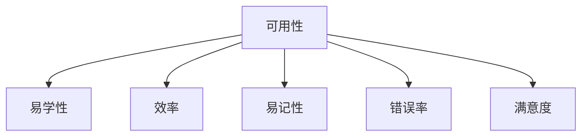
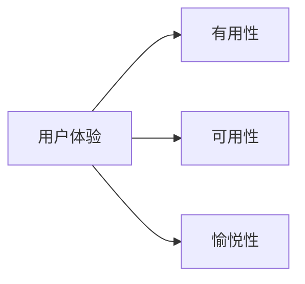
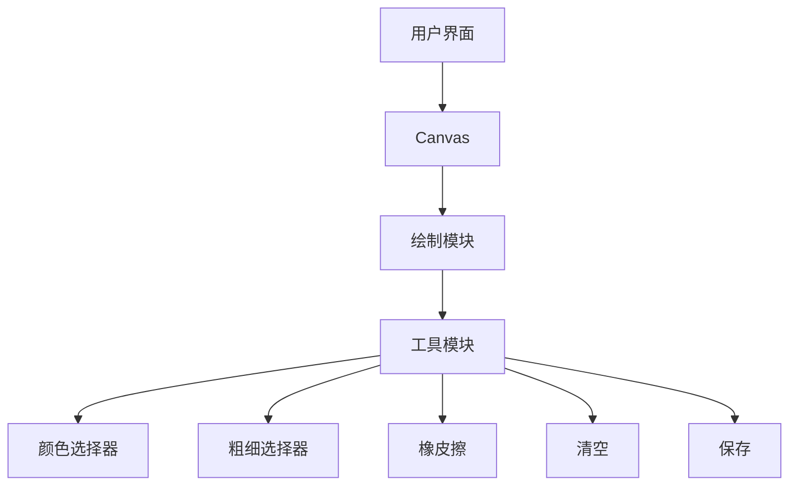

# 人机交互与用户界面设计原理与代码实战案例讲解

## 1.背景介绍

人机交互(Human-Computer Interaction, HCI)是一门研究人与计算机之间交互过程、交互方式和界面设计的学科。随着计算机技术的飞速发展,人机交互的重要性日益凸显。良好的用户界面设计可以提高用户体验,增强软件的实用性和易用性。本文将探讨人机交互和用户界面设计的核心概念、算法原理、实践案例和未来趋势。

### 1.1 人机交互的重要性

人机交互是软件开发过程中不可或缺的一环。用户体验直接影响软件的使用率和受欢迎程度。优秀的用户界面设计可以:

- 提高工作效率
- 减少操作错误
- 增强用户满意度
- 提升软件竞争力

### 1.2 用户界面设计的挑战

设计一个优秀的用户界面面临诸多挑战:

- 用户需求多样化
- 设备种类繁多
- 技术更新迭代快
- 需要多学科知识

## 2.核心概念与联系

设计优秀的用户界面需要掌握一些核心概念。

### 2.1 可用性(Usability)

可用性是评价用户界面优劣的关键标准,包括:

- 易学性(Learnability)
- 效率(Efficiency)  
- 易记性(Memorability)
- 错误率(Error Rate)
- 满意度(Satisfaction)



### 2.2 可访问性(Accessibility)

可访问性指界面设计要满足残障人士等特殊群体的需求,例如:

- 色盲模式
- 语音控制
- 大字体显示

### 2.3 用户体验(User Experience)

用户体验是用户对产品的主观感受,包括:

- 有用性(Utility)
- 可用性(Usability)
- 愉悦性(Desirability)



## 3.核心算法原理具体操作步骤

人机交互和用户界面设计涉及多种算法原理,例如:

### 3.1 布局算法

自动布局是UI设计的基础,常用算法有:

- 约束求解(Constraint Solving)
- 线性规划(Linear Programming)
- 力导向算法(Force-directed)

#### 3.1.1 约束求解

约束求解通过满足一系列约束条件来确定UI元素的大小和位置。

步骤:

1. 建立约束模型
2. 添加硬约束(必须满足)
3. 添加软约束(尽量满足)
4. 使用求解器求解最优解

例如,一个按钮的位置可以由"水平居中"和"距顶部50px"两个约束确定。

#### 3.1.2 线性规划

线性规划将布局问题建模为线性优化问题:

$$
\begin{aligned}
\text{minimize} \quad & \sum_{i=1}^n w_i |x_i - x_i^*|\\
\text{subject to} \quad & Ax \leq b
\end{aligned}
$$

其中$x$是元素位置的变量,$x^*$是期望位置,$w$是权重。通过求解这个优化问题,可以获得满足所有约束条件的最优布局方案。

### 3.2 响应式设计

响应式设计使UI能自动适配不同尺寸的设备。核心思想是使用媒体查询(Media Query)根据设备特征调整布局。

```css
/* 小屏幕 */
@media (max-width: 600px) {
  .container {
    flex-direction: column;
  }
}

/* 大屏幕 */
@media (min-width: 900px) {
  .sidebar {
    width: 300px;
  }
}
```

### 3.3 手势识别

手势识别广泛应用于触控设备。主要算法有:

- 模板匹配(Template Matching)
- 统计模型(Statistical Models)
- 机器学习(Machine Learning)

以$n$笔手写数字识别为例,可以使用隐马尔可夫模型(HMM)或条件随机场(CRF)等统计模型。HMM的基本思路是:

1. 提取特征序列$O = (o_1, o_2, \ldots, o_T)$
2. 对每个数字$k$,计算$P(O|\lambda_k)$
3. 选择最大概率的数字作为识别结果

## 4.数学模型和公式详细讲解举例说明

### 4.1 菲茨定律(Fitts' Law)

菲茨定律描述了在人机交互中,用户通过某种输入设备(如鼠标、触控板等)指向目标的难易程度。公式为:

$$
T = a + b \log_2\left(\frac{D}{W} + 1\right)
$$

其中:
- $T$是完成指向目标所需的时间
- $D$是指向目标的距离
- $W$是目标的大小
- $a$和$b$是与输入设备和用户相关的常数

根据菲茨定律,我们可以得出以下设计原则:

- 让目标足够大,方便用户指向
- 缩短用户需要移动的距离
- 对于小目标,可以使用区域扩大技术(如鼠标悬停扩大)

### 4.2 计算机视觉在人机交互中的应用

计算机视觉技术可以让计算机"看到"用户,实现更自然的交互方式。例如:

- 面部识别解锁
- 手势控制
- 眼球跟踪

以眼球跟踪为例,常用的数学模型是高斯混合模型(GMM)。对于一个像素点$(x, y)$,其在眼睛/非眼睛两个类别上的概率可表示为:

$$
P(x, y) = \sum_{i=1}^{M} \pi_i \cdot \mathcal{N}(x, y | \mu_i, \Sigma_i)
$$

其中$\pi_i$是第$i$个高斯分量的权重,$\mu_i$和$\Sigma_i$分别是均值向量和协方差矩阵。通过训练获得GMM的参数后,即可对新的像素点进行分类。

## 5.项目实践:代码实例和详细解释说明

这里将通过一个简单的在线画板程序,演示如何实现基本的人机交互功能。

### 5.1 需求分析

我们希望实现以下功能:

- 鼠标拖动绘制线条
- 支持选择画笔颜色和粗细
- 支持橡皮擦清除部分内容
- 支持清空画板
- 支持保存画板内容为图片

### 5.2 架构设计



### 5.3 关键代码解释

#### 5.3.1 Canvas基本操作

```javascript
// 获取Canvas元素
const canvas = document.getElementById('canvas');
const ctx = canvas.getContext('2d');

// 开始绘制
ctx.beginPath();
ctx.moveTo(30, 30);
ctx.lineTo(100, 100);
ctx.stroke();
```

#### 5.3.2 鼠标交互

```javascript
let isDrawing = false;
let lastX = 0;
let lastY = 0;

// 鼠标按下事件
canvas.addEventListener('mousedown', (e) => {
  isDrawing = true;
  lastX = e.offsetX;
  lastY = e.offsetY;
});

// 鼠标移动事件
canvas.addEventListener('mousemove', (e) => {
  if (!isDrawing) return;
  
  ctx.beginPath();
  ctx.moveTo(lastX, lastY);
  ctx.lineTo(e.offsetX, e.offsetY);
  ctx.stroke();

  lastX = e.offsetX;
  lastY = e.offsetY;
});

// 鼠标抬起事件
canvas.addEventListener('mouseup', () => isDrawing = false);
```

#### 5.3.3 工具选择

```javascript
// 选择画笔颜色
const colorPicker = document.getElementById('colorPicker');
colorPicker.addEventListener('change', () => ctx.strokeStyle = colorPicker.value);

// 选择画笔粗细
const brushSize = document.getElementById('brushSize');
brushSize.addEventListener('change', () => ctx.lineWidth = brushSize.value);

// 橡皮擦功能
const eraser = document.getElementById('eraser');
eraser.addEventListener('click', () => ctx.strokeStyle = 'white');

// 清空画板
const clear = document.getElementById('clear');
clear.addEventListener('click', () => ctx.clearRect(0, 0, canvas.width, canvas.height));
```

#### 5.3.4 保存画板

```javascript
const save = document.getElementById('save');
save.addEventListener('click', () => {
  const dataURL = canvas.toDataURL('image/png');
  const tempLink = document.createElement('a');
  tempLink.download = 'my-drawing.png';
  tempLink.href = dataURL;
  tempLink.click();
});
```

通过这个简单的示例,我们可以看到如何通过JavaScript操作Canvas元素实现基本的绘图功能,以及如何结合HTML和CSS实现人机交互界面。

## 6.实际应用场景

人机交互和用户界面设计在各个领域都有广泛的应用,例如:

### 6.1 移动应用

移动设备的屏幕尺寸有限,因此需要精心设计紧凑而高效的UI。常见的交互方式包括手势操作、语音控制等。

### 6.2 游戏

游戏需要高度身临其境的用户体验,UI设计需要考虑沉浸式、反应灵敏等因素。例如虚拟现实(VR)游戏中的手势交互。

### 6.3 可视化

数据可视化的目的是将抽象的数据以直观的方式呈现给用户。良好的UI设计可以帮助用户高效获取信息。

### 6.4 辅助技术

人机交互为残障人士提供了更好的计算机使用体验,如语音识别、眼球跟踪等技术。

## 7.工具和资源推荐

设计优秀的用户界面需要专业的工具和资源。

### 7.1 设计工具

- Sketch - 流行的UI设计工具
- Adobe XD - 支持网页设计和原型制作
- Figma - 在线协作式设计工具

### 7.2 原型工具

- InVisionApp - 高保真原型制作工具
- Marvel - 简单易用的移动应用原型工具

### 7.3 资源网站

- Dribbble - 设计作品分享平台
- Behance - Adobe旗下的设计社区
- MaterialUI - Google Material Design风格的React组件库

### 7.4 设计规范

- Apple Human Interface Guidelines
- Google Material Design
- Microsoft Fluent Design System

## 8.总结:未来发展趋势与挑战

人机交互是一个不断发展的领域,未来将面临以下趋势和挑战:

### 8.1 自然用户界面(NUI)

传统的图形用户界面(GUI)将逐渐被自然用户界面(NUI)所取代,如语音交互、手势交互、眼球跟踪等,使交互方式更加自然。

### 8.2 人工智能

人工智能技术可以赋予计算机理解和学习能力,从而实现更智能化的人机交互。例如智能助手、自适应UI等。

### 8.3 多模态交互

未来的交互方式将是多模态的,综合利用语音、视觉、手势等多种输入输出方式,提供无缝体验。

### 8.4 可访问性

提高可访问性将是一个长期的目标,需要在硬件和软件层面为残障人士提供支持。

### 8.5 隐私与安全

随着交互方式的多样化,如何保护用户隐私和系统安全将是一个新的挑战。

## 9.附录:常见问题与解答

### 9.1 如何评估用户界面的可用性?

常用的可用性评估方法包括:

- 用户测试(User Testing)
- 可用性检查表(Usability Checklist)
- 可用性评分卡(System Usability Scale, SUS)
- 眼动跟踪(Eye Tracking)

### 9.2 响应式设计和自适应设计有什么区别?

- 响应式设计(Responsive Design)使用CSS媒体查询根据设备特征调整布局
- 自适应设计(Adaptive Design)为每种设备维护单独的布局

响应式设计相对更灵活