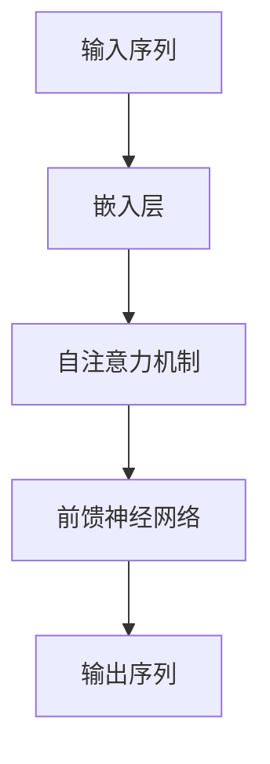

# 从GPT到ChatGPT

## 1.背景介绍

在过去的十年中，人工智能（AI）和自然语言处理（NLP）领域取得了显著的进展。特别是生成式预训练模型（GPT）的出现，彻底改变了我们与计算机交互的方式。GPT（Generative Pre-trained Transformer）是由OpenAI开发的一种语言模型，它能够生成类似人类的文本。随着技术的不断进步，GPT逐渐演变为更强大的ChatGPT，能够进行更复杂和自然的对话。

### 1.1 生成式预训练模型的起源

生成式预训练模型的概念最早可以追溯到2018年，当时OpenAI发布了GPT-1。这一模型基于Transformer架构，能够通过大量的文本数据进行预训练，然后在特定任务上进行微调。GPT-1的成功为后续版本的开发奠定了基础。

### 1.2 GPT-2和GPT-3的突破

GPT-2和GPT-3在模型规模和性能上都取得了显著的突破。GPT-2拥有15亿参数，而GPT-3则拥有惊人的1750亿参数。这些模型不仅能够生成高质量的文本，还能够执行各种NLP任务，如翻译、摘要和问答。

### 1.3 ChatGPT的诞生

ChatGPT是GPT模型的一个特定应用，专注于对话生成。通过进一步的优化和微调，ChatGPT能够进行更自然和连贯的对话，广泛应用于客服、教育和娱乐等领域。

## 2.核心概念与联系

在深入探讨GPT和ChatGPT之前，我们需要理解一些核心概念和它们之间的联系。

### 2.1 Transformer架构

Transformer是GPT的基础架构，它由Vaswani等人在2017年提出。Transformer通过自注意力机制（Self-Attention）和多头注意力机制（Multi-Head Attention）实现了高效的并行计算。



### 2.2 预训练和微调

预训练是指在大规模无监督数据上训练模型，使其学习语言的基本结构和模式。微调则是在特定任务上进行有监督训练，使模型能够执行特定任务。

### 2.3 生成式模型与判别式模型

生成式模型（如GPT）通过学习数据的分布来生成新数据，而判别式模型（如BERT）则通过学习数据的边界来进行分类或回归。

## 3.核心算法原理具体操作步骤

GPT和ChatGPT的核心算法基于Transformer架构，以下是其具体操作步骤。

### 3.1 数据预处理

数据预处理包括文本的清洗、分词和嵌入。文本清洗是去除噪声数据，分词是将文本分解为单词或子词，嵌入是将分词后的文本转换为向量表示。

### 3.2 模型预训练

模型预训练是通过大规模无监督数据进行训练，使模型学习语言的基本结构和模式。预训练的目标是最大化下一个单词的概率。

### 3.3 模型微调

模型微调是在特定任务上进行有监督训练，使模型能够执行特定任务。微调的目标是最小化任务的损失函数。

### 3.4 模型推理

模型推理是使用训练好的模型生成文本或执行任务。推理的过程包括输入处理、模型计算和输出生成。

## 4.数学模型和公式详细讲解举例说明

在这一部分，我们将详细讲解GPT和ChatGPT的数学模型和公式。

### 4.1 自注意力机制

自注意力机制是Transformer的核心，它通过计算输入序列中每个位置的注意力权重来捕捉全局信息。自注意力机制的公式如下：

$$
\text{Attention}(Q, K, V) = \text{softmax}\left(\frac{QK^T}{\sqrt{d_k}}\right)V
$$

其中，$Q$、$K$和$V$分别是查询、键和值的矩阵，$d_k$是键的维度。

### 4.2 多头注意力机制

多头注意力机制是将自注意力机制应用于多个子空间，然后将结果拼接起来。多头注意力机制的公式如下：

$$
\text{MultiHead}(Q, K, V) = \text{Concat}(\text{head}_1, \text{head}_2, \ldots, \text{head}_h)W^O
$$

其中，$\text{head}_i = \text{Attention}(QW_i^Q, KW_i^K, VW_i^V)$，$W_i^Q$、$W_i^K$、$W_i^V$和$W^O$是可训练的权重矩阵。

### 4.3 位置编码

由于Transformer不具有序列信息，位置编码用于为输入序列添加位置信息。位置编码的公式如下：

$$
PE_{(pos, 2i)} = \sin\left(\frac{pos}{10000^{2i/d_{model}}}\right)
$$

$$
PE_{(pos, 2i+1)} = \cos\left(\frac{pos}{10000^{2i/d_{model}}}\right)
$$

其中，$pos$是位置，$i$是维度索引，$d_{model}$是模型的维度。

## 5.项目实践：代码实例和详细解释说明

在这一部分，我们将通过一个简单的代码实例来展示如何使用GPT进行文本生成。

### 5.1 环境配置

首先，我们需要安装必要的库，如Transformers和Torch。

```bash
pip install transformers torch
```

### 5.2 加载预训练模型

接下来，我们加载一个预训练的GPT模型和对应的分词器。

```python
from transformers import GPT2LMHeadModel, GPT2Tokenizer

model_name = 'gpt2'
model = GPT2LMHeadModel.from_pretrained(model_name)
tokenizer = GPT2Tokenizer.from_pretrained(model_name)
```

### 5.3 文本生成

我们可以使用加载的模型和分词器生成文本。

```python
input_text = "从GPT到ChatGPT的演变"
input_ids = tokenizer.encode(input_text, return_tensors='pt')

output = model.generate(input_ids, max_length=100, num_return_sequences=1)
generated_text = tokenizer.decode(output[0], skip_special_tokens=True)

print(generated_text)
```

### 5.4 代码解释

上述代码首先加载了预训练的GPT模型和分词器，然后将输入文本编码为模型可以处理的格式。接着，使用模型生成文本，并将生成的文本解码为可读格式。

## 6.实际应用场景

GPT和ChatGPT在多个领域有广泛的应用，以下是一些实际应用场景。

### 6.1 客服系统

ChatGPT可以用于自动化客服系统，通过自然语言处理技术，提供即时和准确的客户支持。

### 6.2 教育领域

在教育领域，ChatGPT可以用于智能辅导系统，帮助学生解答问题，提供学习建议。

### 6.3 内容生成

GPT可以用于自动生成文章、新闻报道和社交媒体内容，提高内容创作的效率。

### 6.4 医疗咨询

在医疗领域，ChatGPT可以用于初步的医疗咨询，帮助患者了解病情，提供健康建议。

## 7.工具和资源推荐

在这一部分，我们将推荐一些有助于理解和使用GPT和ChatGPT的工具和资源。

### 7.1 开源库

- [Transformers](https://github.com/huggingface/transformers): 由Hugging Face提供的开源库，支持多种预训练模型。
- [GPT-3 Sandbox](https://beta.openai.com/): OpenAI提供的GPT-3在线测试平台。

### 7.2 学术论文

- [Attention is All You Need](https://arxiv.org/abs/1706.03762): Transformer架构的原始论文。
- [Language Models are Few-Shot Learners](https://arxiv.org/abs/2005.14165): GPT-3的原始论文。

### 7.3 在线课程

- [Deep Learning Specialization](https://www.coursera.org/specializations/deep-learning): 由Andrew Ng教授提供的深度学习课程。
- [Natural Language Processing with Deep Learning](https://www.coursera.org/learn/natural-language-processing): 由斯坦福大学提供的NLP课程。

## 8.总结：未来发展趋势与挑战

GPT和ChatGPT的成功展示了生成式预训练模型在NLP领域的巨大潜力。然而，随着技术的不断发展，我们也面临一些挑战和未来的发展趋势。

### 8.1 模型规模与计算资源

随着模型规模的不断增加，训练和推理所需的计算资源也在急剧增加。这对硬件和能源提出了更高的要求。

### 8.2 数据隐私与安全

生成式模型在处理敏感数据时，可能会引发数据隐私和安全问题。如何在保证模型性能的同时，保护用户隐私，是一个重要的研究方向。

### 8.3 模型解释性

尽管生成式模型在性能上取得了显著进展，但其内部机制仍然难以解释。提高模型的可解释性，有助于增强用户的信任和接受度。

### 8.4 多模态学习

未来的发展趋势之一是多模态学习，即结合文本、图像、音频等多种数据类型，提升模型的综合能力。

## 9.附录：常见问题与解答

在这一部分，我们将解答一些关于GPT和ChatGPT的常见问题。

### 9.1 GPT和BERT的区别是什么？

GPT是生成式模型，主要用于生成文本；BERT是判别式模型，主要用于分类和回归任务。GPT通过自回归方式生成文本，而BERT通过掩码语言模型进行训练。

### 9.2 如何选择合适的预训练模型？

选择预训练模型时，需要考虑任务的具体需求和模型的性能。对于生成文本任务，GPT是一个不错的选择；对于分类任务，BERT可能更适合。

### 9.3 如何提高模型的生成质量？

提高模型生成质量的方法包括增加训练数据、优化模型架构和调整超参数。此外，可以通过微调模型，使其更适应特定任务。

### 9.4 ChatGPT是否可以替代人工客服？

ChatGPT可以在一定程度上替代人工客服，提供即时和准确的客户支持。然而，对于复杂和敏感的问题，仍然需要人工客服的介入。

### 9.5 如何保护生成式模型中的数据隐私？

保护数据隐私的方法包括数据加密、差分隐私和联邦学习等技术。这些方法可以在保证模型性能的同时，保护用户隐私。

---

作者：禅与计算机程序设计艺术 / Zen and the Art of Computer Programming