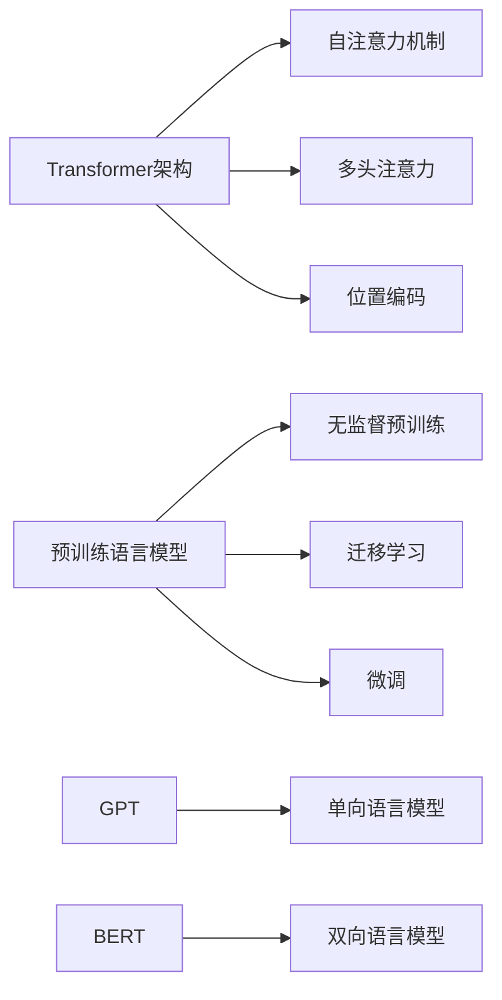

# 从GPT到ChatGPT

## 1. 背景介绍

### 1.1 人工智能的发展历程

#### 1.1.1 早期人工智能的探索
#### 1.1.2 机器学习的崛起
#### 1.1.3 深度学习的突破

### 1.2 自然语言处理的演进

#### 1.2.1 基于规则的自然语言处理
#### 1.2.2 统计学习方法的应用
#### 1.2.3 神经网络在自然语言处理中的应用

### 1.3 GPT的诞生

#### 1.3.1 Transformer架构的提出
#### 1.3.2 GPT模型的特点
#### 1.3.3 GPT在自然语言处理领域的影响

## 2. 核心概念与联系

### 2.1 Transformer架构

#### 2.1.1 自注意力机制
#### 2.1.2 多头注意力
#### 2.1.3 位置编码

### 2.2 预训练语言模型

#### 2.2.1 无监督预训练
#### 2.2.2 迁移学习
#### 2.2.3 微调

### 2.3 GPT与BERT的比较

#### 2.3.1 模型架构差异
#### 2.3.2 训练方式差异
#### 2.3.3 应用场景差异



## 3. 核心算法原理具体操作步骤

### 3.1 Transformer的编码器

#### 3.1.1 输入嵌入
#### 3.1.2 位置编码
#### 3.1.3 自注意力层
#### 3.1.4 前馈神经网络层

### 3.2 Transformer的解码器

#### 3.2.1 输入嵌入和位置编码
#### 3.2.2 掩码自注意力层
#### 3.2.3 编码-解码注意力层
#### 3.2.4 前馈神经网络层

### 3.3 GPT的训练过程

#### 3.3.1 语料库的选择与预处理
#### 3.3.2 模型参数的初始化
#### 3.3.3 无监督预训练
#### 3.3.4 微调与应用

## 4. 数学模型和公式详细讲解举例说明

### 4.1 自注意力机制的数学表示

#### 4.1.1 查询、键、值的计算
$$
\begin{aligned}
Q &= X W^Q \\
K &= X W^K \\
V &= X W^V
\end{aligned}
$$

#### 4.1.2 注意力权重的计算
$$
\text{Attention}(Q, K, V) = \text{softmax}\left(\frac{QK^T}{\sqrt{d_k}}\right)V
$$

#### 4.1.3 多头注意力的计算
$$
\begin{aligned}
\text{MultiHead}(Q, K, V) &= \text{Concat}(\text{head}_1, ..., \text{head}_h)W^O \\
\text{head}_i &= \text{Attention}(QW_i^Q, KW_i^K, VW_i^V)
\end{aligned}
$$

### 4.2 位置编码的数学表示

#### 4.2.1 正弦和余弦函数的位置编码
$$
\begin{aligned}
PE_{(pos, 2i)} &= \sin\left(\frac{pos}{10000^{2i/d_{model}}}\right) \\
PE_{(pos, 2i+1)} &= \cos\left(\frac{pos}{10000^{2i/d_{model}}}\right)
\end{aligned}
$$

#### 4.2.2 位置编码的作用与特点

### 4.3 语言模型的概率计算

#### 4.3.1 n-gram语言模型
$$
P(w_1, w_2, ..., w_n) = \prod_{i=1}^n P(w_i | w_1, ..., w_{i-1})
$$

#### 4.3.2 神经网络语言模型
$$
P(w_1, w_2, ..., w_n) = \prod_{i=1}^n P(w_i | \text{NN}(w_1, ..., w_{i-1}))
$$

## 5. 项目实践：代码实例和详细解释说明

### 5.1 使用PyTorch实现Transformer

#### 5.1.1 定义模型组件
```python
import torch
import torch.nn as nn

class MultiHeadAttention(nn.Module):
    def __init__(self, d_model, num_heads):
        super().__init__()
        # 实现多头注意力机制
        pass

class PositionalEncoding(nn.Module):
    def __init__(self, d_model, max_len):
        super().__init__()
        # 实现位置编码
        pass

class TransformerEncoderLayer(nn.Module):
    def __init__(self, d_model, num_heads, d_ff):
        super().__init__()
        # 实现Transformer编码器层
        pass

class TransformerDecoderLayer(nn.Module):
    def __init__(self, d_model, num_heads, d_ff):
        super().__init__()
        # 实现Transformer解码器层
        pass
```

#### 5.1.2 组装Transformer模型
```python
class Transformer(nn.Module):
    def __init__(self, num_encoder_layers, num_decoder_layers, d_model, num_heads, d_ff, src_vocab_size, tgt_vocab_size):
        super().__init__()
        # 组装Transformer模型
        pass
    
    def forward(self, src, tgt):
        # 定义前向传播过程
        pass
```

#### 5.1.3 训练与评估
```python
# 定义损失函数和优化器
criterion = nn.CrossEntropyLoss()
optimizer = torch.optim.Adam(model.parameters(), lr=0.0001)

# 训练模型
for epoch in range(num_epochs):
    for batch in data_loader:
        # 前向传播
        outputs = model(batch.src, batch.tgt)
        loss = criterion(outputs.view(-1, tgt_vocab_size), batch.tgt_y.view(-1))
        
        # 反向传播和优化
        optimizer.zero_grad()
        loss.backward()
        optimizer.step()

# 评估模型
with torch.no_grad():
    # 在测试集上评估模型性能
    pass
```

### 5.2 使用TensorFlow实现GPT

#### 5.2.1 定义GPT模型
```python
import tensorflow as tf

class GPT(tf.keras.Model):
    def __init__(self, vocab_size, d_model, num_layers, num_heads, d_ff):
        super().__init__()
        # 定义GPT模型组件
        pass
    
    def call(self, inputs):
        # 定义前向传播过程
        pass
```

#### 5.2.2 训练与评估
```python
# 定义损失函数和优化器
loss_fn = tf.keras.losses.SparseCategoricalCrossentropy(from_logits=True)
optimizer = tf.keras.optimizers.Adam(learning_rate=0.0001)

# 训练模型
for epoch in range(num_epochs):
    for batch in dataset:
        with tf.GradientTape() as tape:
            # 前向传播
            logits = model(batch)
            loss = loss_fn(batch[:, 1:], logits[:, :-1])
        
        # 反向传播和优化
        gradients = tape.gradient(loss, model.trainable_variables)
        optimizer.apply_gradients(zip(gradients, model.trainable_variables))

# 评估模型
# 在测试集上评估模型性能
pass
```

## 6. 实际应用场景

### 6.1 机器翻译

#### 6.1.1 使用Transformer进行机器翻译
#### 6.1.2 GPT在机器翻译中的应用

### 6.2 文本摘要

#### 6.2.1 使用GPT生成文本摘要
#### 6.2.2 摘要质量评估与优化

### 6.3 对话系统

#### 6.3.1 基于GPT的对话生成
#### 6.3.2 个性化对话生成
#### 6.3.3 多轮对话管理

### 6.4 知识问答

#### 6.4.1 使用GPT进行知识问答
#### 6.4.2 知识库的构建与管理
#### 6.4.3 问答质量评估与优化

## 7. 工具和资源推荐

### 7.1 开源工具与框架

#### 7.1.1 Hugging Face Transformers
#### 7.1.2 OpenAI GPT
#### 7.1.3 Google BERT

### 7.2 预训练模型

#### 7.2.1 GPT-2
#### 7.2.2 GPT-3
#### 7.2.3 BERT

### 7.3 数据集与语料库

#### 7.3.1 WikiText
#### 7.3.2 BookCorpus
#### 7.3.3 Common Crawl

## 8. 总结：未来发展趋势与挑战

### 8.1 模型规模与性能的提升

#### 8.1.1 更大规模的预训练模型
#### 8.1.2 模型压缩与加速技术

### 8.2 多模态学习

#### 8.2.1 文本-图像跨模态学习
#### 8.2.2 文本-语音跨模态学习

### 8.3 可解释性与可控性

#### 8.3.1 模型可解释性研究
#### 8.3.2 可控文本生成

### 8.4 数据隐私与安全

#### 8.4.1 隐私保护技术
#### 8.4.2 模型鲁棒性与安全性

## 9. 附录：常见问题与解答

### 9.1 GPT和BERT的区别是什么？
### 9.2 如何微调预训练模型以适应特定任务？
### 9.3 Transformer模型的计算复杂度如何？
### 9.4 如何处理输入序列的长度限制问题？
### 9.5 预训练语言模型存在哪些局限性？

作者：禅与计算机程序设计艺术 / Zen and the Art of Computer Programming