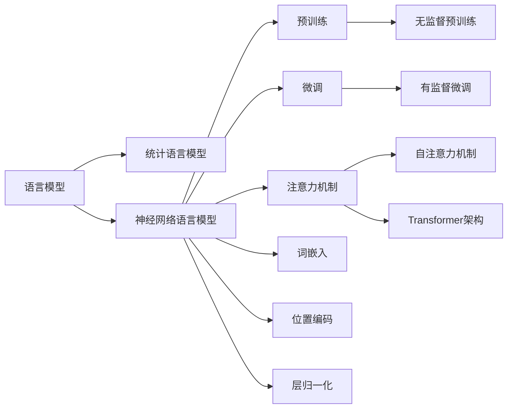

# 从关键概念到应用：深入了解大规模语言模型（LLM）

## 1. 背景介绍

### 1.1 人工智能与自然语言处理的发展
#### 1.1.1 人工智能的历史与现状
#### 1.1.2 自然语言处理的演进
#### 1.1.3 深度学习在NLP中的应用

### 1.2 大规模语言模型（LLM）的兴起
#### 1.2.1 LLM的定义与特点 
#### 1.2.2 LLM的发展历程
#### 1.2.3 LLM的研究意义

## 2. 核心概念与联系

### 2.1 语言模型
#### 2.1.1 语言模型的定义
#### 2.1.2 统计语言模型
#### 2.1.3 神经网络语言模型

### 2.2 预训练与微调
#### 2.2.1 预训练的概念与优势
#### 2.2.2 无监督预训练
#### 2.2.3 有监督微调

### 2.3 注意力机制与Transformer
#### 2.3.1 注意力机制的原理
#### 2.3.2 自注意力机制
#### 2.3.3 Transformer架构

### 2.4 LLM的关键技术
#### 2.4.1 词嵌入
#### 2.4.2 位置编码
#### 2.4.3 层归一化



## 3. 核心算法原理具体操作步骤

### 3.1 Transformer的编码器-解码器结构
#### 3.1.1 编码器的组成
#### 3.1.2 解码器的组成 
#### 3.1.3 编码器-解码器的连接

### 3.2 自注意力机制的计算过程
#### 3.2.1 计算Query、Key、Value矩阵
#### 3.2.2 计算注意力权重
#### 3.2.3 计算注意力输出

### 3.3 前馈神经网络
#### 3.3.1 前馈神经网络的结构
#### 3.3.2 残差连接
#### 3.3.3 层归一化

### 3.4 位置编码
#### 3.4.1 绝对位置编码
#### 3.4.2 相对位置编码
#### 3.4.3 可学习的位置编码

## 4. 数学模型和公式详细讲解举例说明

### 4.1 Transformer的数学表示
#### 4.1.1 编码器的数学表示
编码器由$N$个相同的层堆叠而成，每一层包括两个子层：多头自注意力机制和前馈神经网络。对于第$l$层的编码器，其输入为$\mathbf{z}^{(l-1)}$，输出为$\mathbf{z}^{(l)}$。

多头自注意力机制可以表示为：

$$
\begin{aligned}
\mathbf{z}^{(l)}_{att} &= \text{MultiHead}(\mathbf{z}^{(l-1)}, \mathbf{z}^{(l-1)}, \mathbf{z}^{(l-1)}) \\
&= \text{Concat}(\text{head}_1, \ldots, \text{head}_h)\mathbf{W}^O
\end{aligned}
$$

其中，$\text{head}_i$表示：

$$
\text{head}_i = \text{Attention}(\mathbf{z}^{(l-1)}\mathbf{W}_i^Q, \mathbf{z}^{(l-1)}\mathbf{W}_i^K, \mathbf{z}^{(l-1)}\mathbf{W}_i^V)
$$

前馈神经网络可以表示为：

$$
\mathbf{z}^{(l)} = \text{FFN}(\mathbf{z}^{(l)}_{att}) = \max(0, \mathbf{z}^{(l)}_{att}\mathbf{W}_1 + \mathbf{b}_1)\mathbf{W}_2 + \mathbf{b}_2
$$

#### 4.1.2 解码器的数学表示
解码器同样由$N$个相同的层堆叠而成，每一层包括三个子层：带掩码的多头自注意力机制、编码-解码注意力机制和前馈神经网络。对于第$l$层的解码器，其输入为$\mathbf{y}^{(l-1)}$和编码器的输出$\mathbf{z}^{(N)}$，输出为$\mathbf{y}^{(l)}$。

带掩码的多头自注意力机制可以表示为：

$$
\begin{aligned}
\mathbf{y}^{(l)}_{att} &= \text{MultiHead}(\mathbf{y}^{(l-1)}, \mathbf{y}^{(l-1)}, \mathbf{y}^{(l-1)}) \\
&= \text{Concat}(\text{head}_1, \ldots, \text{head}_h)\mathbf{W}^O
\end{aligned}
$$

其中，$\text{head}_i$表示：

$$
\text{head}_i = \text{MaskedAttention}(\mathbf{y}^{(l-1)}\mathbf{W}_i^Q, \mathbf{y}^{(l-1)}\mathbf{W}_i^K, \mathbf{y}^{(l-1)}\mathbf{W}_i^V)
$$

编码-解码注意力机制可以表示为：

$$
\begin{aligned}
\mathbf{y}^{(l)}_{enc-dec} &= \text{MultiHead}(\mathbf{y}^{(l)}_{att}, \mathbf{z}^{(N)}, \mathbf{z}^{(N)}) \\
&= \text{Concat}(\text{head}_1, \ldots, \text{head}_h)\mathbf{W}^O
\end{aligned}
$$

其中，$\text{head}_i$表示：

$$
\text{head}_i = \text{Attention}(\mathbf{y}^{(l)}_{att}\mathbf{W}_i^Q, \mathbf{z}^{(N)}\mathbf{W}_i^K, \mathbf{z}^{(N)}\mathbf{W}_i^V)
$$

前馈神经网络可以表示为：

$$
\mathbf{y}^{(l)} = \text{FFN}(\mathbf{y}^{(l)}_{enc-dec}) = \max(0, \mathbf{y}^{(l)}_{enc-dec}\mathbf{W}_1 + \mathbf{b}_1)\mathbf{W}_2 + \mathbf{b}_2
$$

### 4.2 自注意力机制的数学表示
#### 4.2.1 计算Query、Key、Value矩阵
对于输入序列$\mathbf{X} \in \mathbb{R}^{n \times d}$，其中$n$为序列长度，$d$为词嵌入维度，自注意力机制首先计算Query矩阵$\mathbf{Q}$、Key矩阵$\mathbf{K}$和Value矩阵$\mathbf{V}$：

$$
\begin{aligned}
\mathbf{Q} &= \mathbf{X}\mathbf{W}^Q \\
\mathbf{K} &= \mathbf{X}\mathbf{W}^K \\
\mathbf{V} &= \mathbf{X}\mathbf{W}^V
\end{aligned}
$$

其中，$\mathbf{W}^Q, \mathbf{W}^K, \mathbf{W}^V \in \mathbb{R}^{d \times d_k}$为可学习的权重矩阵，$d_k$为注意力机制的维度。

#### 4.2.2 计算注意力权重
根据Query矩阵和Key矩阵计算注意力权重：

$$
\mathbf{A} = \text{softmax}(\frac{\mathbf{Q}\mathbf{K}^T}{\sqrt{d_k}})
$$

其中，$\mathbf{A} \in \mathbb{R}^{n \times n}$为注意力权重矩阵，$\sqrt{d_k}$为缩放因子，用于防止内积过大导致softmax函数梯度消失。

#### 4.2.3 计算注意力输出
根据注意力权重矩阵和Value矩阵计算注意力输出：

$$
\text{Attention}(\mathbf{Q}, \mathbf{K}, \mathbf{V}) = \mathbf{A}\mathbf{V}
$$

### 4.3 位置编码的数学表示
#### 4.3.1 绝对位置编码
对于序列中的第$i$个位置，其绝对位置编码$\mathbf{p}_i \in \mathbb{R}^d$为：

$$
\begin{aligned}
\mathbf{p}_{i,2j} &= \sin(i / 10000^{2j/d}) \\
\mathbf{p}_{i,2j+1} &= \cos(i / 10000^{2j/d})
\end{aligned}
$$

其中，$j \in [0, d/2)$为位置编码的维度索引。

#### 4.3.2 相对位置编码
对于序列中的第$i$个位置和第$j$个位置，其相对位置编码$\mathbf{r}_{i-j} \in \mathbb{R}^d$为：

$$
\begin{aligned}
\mathbf{r}_{i-j,2k} &= \sin((i-j) / 10000^{2k/d}) \\
\mathbf{r}_{i-j,2k+1} &= \cos((i-j) / 10000^{2k/d})
\end{aligned}
$$

其中，$k \in [0, d/2)$为位置编码的维度索引。

## 5. 项目实践：代码实例和详细解释说明

### 5.1 使用PyTorch实现Transformer
#### 5.1.1 定义Transformer模型类

```python
import torch
import torch.nn as nn

class Transformer(nn.Module):
    def __init__(self, vocab_size, d_model, nhead, num_layers, dim_feedforward, dropout=0.1):
        super(Transformer, self).__init__()
        self.encoder = TransformerEncoder(d_model, nhead, num_layers, dim_feedforward, dropout)
        self.decoder = TransformerDecoder(d_model, nhead, num_layers, dim_feedforward, dropout)
        self.embedding = nn.Embedding(vocab_size, d_model)
        self.fc = nn.Linear(d_model, vocab_size)
        
    def forward(self, src, tgt, src_mask=None, tgt_mask=None):
        src_emb = self.embedding(src)
        tgt_emb = self.embedding(tgt)
        memory = self.encoder(src_emb, src_mask)
        output = self.decoder(tgt_emb, memory, tgt_mask, src_mask)
        output = self.fc(output)
        return output
```

#### 5.1.2 定义编码器类

```python
class TransformerEncoder(nn.Module):
    def __init__(self, d_model, nhead, num_layers, dim_feedforward, dropout=0.1):
        super(TransformerEncoder, self).__init__()
        self.layers = nn.ModuleList([
            TransformerEncoderLayer(d_model, nhead, dim_feedforward, dropout)
            for _ in range(num_layers)
        ])
        
    def forward(self, src, mask=None):
        for layer in self.layers:
            src = layer(src, mask)
        return src
```

#### 5.1.3 定义解码器类

```python
class TransformerDecoder(nn.Module):
    def __init__(self, d_model, nhead, num_layers, dim_feedforward, dropout=0.1):
        super(TransformerDecoder, self).__init__()
        self.layers = nn.ModuleList([
            TransformerDecoderLayer(d_model, nhead, dim_feedforward, dropout)
            for _ in range(num_layers)
        ])
        
    def forward(self, tgt, memory, tgt_mask=None, memory_mask=None):
        for layer in self.layers:
            tgt = layer(tgt, memory, tgt_mask, memory_mask)
        return tgt
```

#### 5.1.4 定义编码器层类

```python
class TransformerEncoderLayer(nn.Module):
    def __init__(self, d_model, nhead, dim_feedforward, dropout=0.1):
        super(TransformerEncoderLayer, self).__init__()
        self.self_attn = nn.MultiheadAttention(d_model, nhead, dropout=dropout)
        self.linear1 = nn.Linear(d_model, dim_feedforward)
        self.linear2 = nn.Linear(dim_feedforward, d_model)
        self.norm1 = nn.LayerNorm(d_model)
        self.norm2 = nn.LayerNorm(d_model)
        self.dropout = nn.Dropout(dropout)
        
    def forward(self, src, mask=None):
        src2 = self.self_attn(src, src, src, attn_mask=mask)[0]
        src = src + self.dropout(src2)
        src = self.norm1(src)
        src2 = self.linear2(self.dropout(torch.relu(self.linear1(src))))
        src = src + self.dropout(src2)
        src = self.norm2(src)
        return src
```

#### 5.1.5 定义解码器层类

```python