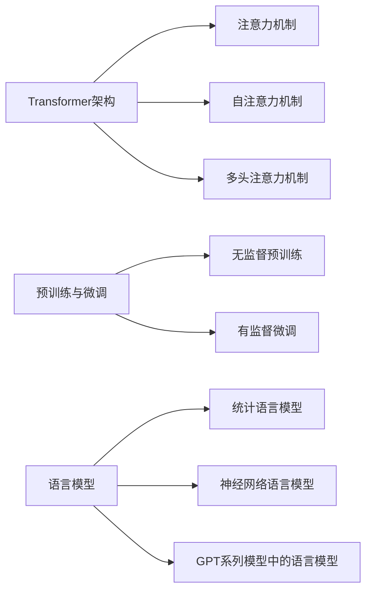

# 从初代GPT到ChatGPT，再到GPT-4

## 1. 背景介绍
### 1.1 人工智能的发展历程
#### 1.1.1 早期人工智能的探索
#### 1.1.2 机器学习的崛起
#### 1.1.3 深度学习的突破

### 1.2 自然语言处理的演进
#### 1.2.1 早期的自然语言处理技术
#### 1.2.2 基于统计学习的自然语言处理
#### 1.2.3 基于深度学习的自然语言处理

### 1.3 GPT系列模型的诞生
#### 1.3.1 OpenAI的成立与发展
#### 1.3.2 GPT模型的提出
#### 1.3.3 GPT系列模型的迭代与进化

## 2. 核心概念与联系
### 2.1 Transformer架构
#### 2.1.1 注意力机制
#### 2.1.2 自注意力机制
#### 2.1.3 多头注意力机制

### 2.2 预训练与微调
#### 2.2.1 无监督预训练
#### 2.2.2 有监督微调
#### 2.2.3 预训练与微调的优势

### 2.3 语言模型
#### 2.3.1 统计语言模型
#### 2.3.2 神经网络语言模型
#### 2.3.3 GPT系列模型中的语言模型

## 3. 核心算法原理具体操作步骤
### 3.1 Transformer的编码器-解码器结构
#### 3.1.1 编码器的组成与作用
#### 3.1.2 解码器的组成与作用
#### 3.1.3 编码器-解码器的交互

### 3.2 自注意力机制的计算过程
#### 3.2.1 查询、键、值的计算
#### 3.2.2 注意力权重的计算
#### 3.2.3 注意力输出的计算

### 3.3 位置编码
#### 3.3.1 位置编码的必要性
#### 3.3.2 正弦位置编码
#### 3.3.3 可学习的位置编码

## 4. 数学模型和公式详细讲解举例说明
### 4.1 注意力机制的数学表示
#### 4.1.1 注意力权重的计算公式
$Attention(Q,K,V) = softmax(\frac{QK^T}{\sqrt{d_k}})V$
#### 4.1.2 多头注意力的计算公式
$MultiHead(Q,K,V) = Concat(head_1, ..., head_h)W^O$
其中，$head_i = Attention(QW_i^Q, KW_i^K, VW_i^V)$

### 4.2 Transformer的前向传播过程
#### 4.2.1 编码器的前向传播
#### 4.2.2 解码器的前向传播
#### 4.2.3 编码器-解码器的交互

### 4.3 损失函数与优化算法
#### 4.3.1 交叉熵损失函数
$L(y, \hat{y}) = -\sum_{i=1}^{n} y_i \log(\hat{y}_i)$
#### 4.3.2 AdamW优化算法
#### 4.3.3 学习率调度策略

## 5. 项目实践：代码实例和详细解释说明
### 5.1 使用PyTorch实现Transformer
#### 5.1.1 定义Transformer模型类
#### 5.1.2 编码器和解码器的实现
#### 5.1.3 自注意力机制的实现

### 5.2 使用Hugging Face的Transformers库
#### 5.2.1 加载预训练模型
#### 5.2.2 微调预训练模型
#### 5.2.3 模型推理与生成

### 5.3 使用GPT-3 API进行应用开发
#### 5.3.1 注册OpenAI API账号
#### 5.3.2 使用API进行文本生成
#### 5.3.3 使用API进行对话系统开发

## 6. 实际应用场景
### 6.1 文本生成
#### 6.1.1 创意写作辅助
#### 6.1.2 新闻文章生成
#### 6.1.3 广告文案生成

### 6.2 对话系统
#### 6.2.1 客服聊天机器人
#### 6.2.2 个人助理
#### 6.2.3 教育领域的智能辅导

### 6.3 语言翻译
#### 6.3.1 机器翻译
#### 6.3.2 同声传译
#### 6.3.3 多语言对话系统

## 7. 工具和资源推荐
### 7.1 开源框架与库
#### 7.1.1 PyTorch
#### 7.1.2 TensorFlow
#### 7.1.3 Hugging Face Transformers

### 7.2 预训练模型
#### 7.2.1 BERT
#### 7.2.2 GPT-2
#### 7.2.3 T5

### 7.3 数据集
#### 7.3.1 WikiText
#### 7.3.2 BookCorpus
#### 7.3.3 Common Crawl

## 8. 总结：未来发展趋势与挑战
### 8.1 模型的持续优化与扩展
#### 8.1.1 模型架构的改进
#### 8.1.2 训练数据的扩充
#### 8.1.3 计算资源的提升

### 8.2 多模态融合
#### 8.2.1 文本-图像融合
#### 8.2.2 文本-语音融合
#### 8.2.3 多模态预训练模型

### 8.3 可解释性与可控性
#### 8.3.1 模型决策过程的可解释性
#### 8.3.2 生成内容的可控性
#### 8.3.3 偏见与公平性问题

## 9. 附录：常见问题与解答
### 9.1 GPT模型与传统自然语言处理方法的区别
### 9.2 如何选择合适的预训练模型进行微调
### 9.3 GPT模型在实际应用中的局限性与应对策略

作者：禅与计算机程序设计艺术 / Zen and the Art of Computer Programming