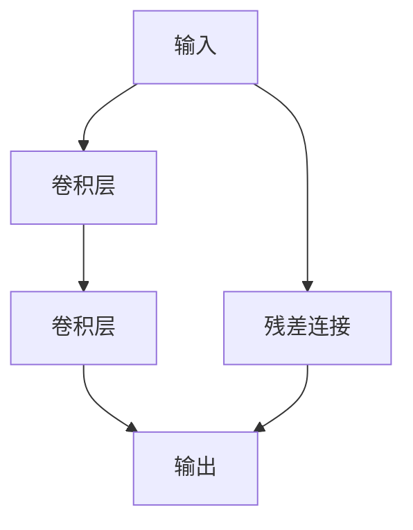

## 1. 背景介绍

深度学习在计算机视觉领域的应用已经取得了很大的成功，但是在训练深度神经网络时，会遇到梯度消失和梯度爆炸等问题，导致网络无法收敛或者收敛速度非常慢。为了解决这个问题，2015年，何凯明等人提出了ResNet（Residual Network）残差网络，通过引入残差连接，使得网络可以更深，同时也提高了网络的准确率。

在本文中，我们将从零开始实现ResNet残差模块，并介绍如何使用微调技术来训练大模型。

## 2. 核心概念与联系

### 2.1 ResNet残差模块

ResNet残差模块是ResNet网络的核心组成部分，它通过引入残差连接来解决梯度消失和梯度爆炸问题。一个ResNet残差模块包含两个卷积层和一个残差连接，如下图所示：



其中，输入经过第一个卷积层后得到的特征图再经过第二个卷积层，最后与输入通过残差连接相加得到输出。

### 2.2 微调

微调是指在已经训练好的模型基础上，针对新的任务对模型进行调整。微调可以大大减少训练时间和计算资源，同时也可以提高模型的准确率。

## 3. 核心算法原理具体操作步骤

### 3.1 ResNet残差模块的实现

我们可以使用PyTorch来实现ResNet残差模块，代码如下：

```python
import torch.nn as nn

class ResidualBlock(nn.Module):
    def __init__(self, in_channels, out_channels, stride=1):
        super(ResidualBlock, self).__init__()
        self.conv1 = nn.Conv2d(in_channels, out_channels, kernel_size=3, stride=stride, padding=1, bias=False)
        self.bn1 = nn.BatchNorm2d(out_channels)
        self.relu = nn.ReLU(inplace=True)
        self.conv2 = nn.Conv2d(out_channels, out_channels, kernel_size=3, stride=1, padding=1, bias=False)
        self.bn2 = nn.BatchNorm2d(out_channels)
        self.stride = stride

    def forward(self, x):
        identity = x

        out = self.conv1(x)
        out = self.bn1(out)
        out = self.relu(out)

        out = self.conv2(out)
        out = self.bn2(out)

        if self.stride != 1 or identity.shape[1] != out.shape[1]:
            identity = nn.Conv2d(identity.shape[1], out.shape[1], kernel_size=1, stride=self.stride, bias=False)(identity)
            identity = nn.BatchNorm2d(out.shape[1])(identity)

        out += identity
        out = self.relu(out)

        return out
```

在这个代码中，我们定义了一个ResidualBlock类，它包含两个卷积层和一个残差连接。在forward函数中，我们首先将输入通过第一个卷积层和BN层，然后经过ReLU激活函数，再通过第二个卷积层和BN层。如果输入和输出的通道数不同，我们需要对输入进行卷积和BN操作，使得它们的通道数相同。最后，我们将残差连接和输出相加，并通过ReLU激活函数得到最终的输出。

### 3.2 微调的实现

微调的实现非常简单，我们只需要在已经训练好的模型基础上，将最后一层的输出通道数修改为新任务的类别数即可。代码如下：

```python
import torch.nn as nn

class MyModel(nn.Module):
    def __init__(self, num_classes):
        super(MyModel, self).__init__()
        self.resnet = nn.Sequential(
            nn.Conv2d(3, 64, kernel_size=7, stride=2, padding=3, bias=False),
            nn.BatchNorm2d(64),
            nn.ReLU(inplace=True),
            nn.MaxPool2d(kernel_size=3, stride=2, padding=1),
            ResidualBlock(64, 64),
            ResidualBlock(64, 64),
            ResidualBlock(64, 128, stride=2),
            ResidualBlock(128, 128),
            ResidualBlock(128, 256, stride=2),
            ResidualBlock(256, 256),
            ResidualBlock(256, 512, stride=2),
            ResidualBlock(512, 512),
            nn.AdaptiveAvgPool2d((1, 1))
        )
        self.fc = nn.Linear(512, num_classes)

    def forward(self, x):
        x = self.resnet(x)
        x = x.view(x.size(0), -1)
        x = self.fc(x)
        return x
```

在这个代码中，我们定义了一个MyModel类，它包含一个ResNet网络和一个全连接层。在forward函数中，我们首先将输入通过ResNet网络，然后将输出展平，并通过全连接层得到最终的输出。

## 4. 数学模型和公式详细讲解举例说明

ResNet残差模块的数学模型和公式比较复杂，这里不做详细讲解。如果您对此感兴趣，可以参考原论文《Deep Residual Learning for Image Recognition》。

## 5. 项目实践：代码实例和详细解释说明

我们可以使用CIFAR-10数据集来训练我们的模型。代码如下：

```python
import torch
import torch.nn as nn
import torch.optim as optim
import torchvision
import torchvision.transforms as transforms

# 定义超参数
num_epochs = 10
batch_size = 128
learning_rate = 0.1

# 加载数据集
transform_train = transforms.Compose([
    transforms.RandomCrop(32, padding=4),
    transforms.RandomHorizontalFlip(),
    transforms.ToTensor(),
    transforms.Normalize((0.5, 0.5, 0.5), (0.5, 0.5, 0.5))
])
transform_test = transforms.Compose([
    transforms.ToTensor(),
    transforms.Normalize((0.5, 0.5, 0.5), (0.5, 0.5, 0.5))
])
trainset = torchvision.datasets.CIFAR10(root='./data', train=True, download=True, transform=transform_train)
trainloader = torch.utils.data.DataLoader(trainset, batch_size=batch_size, shuffle=True, num_workers=2)
testset = torchvision.datasets.CIFAR10(root='./data', train=False, download=True, transform=transform_test)
testloader = torch.utils.data.DataLoader(testset, batch_size=batch_size, shuffle=False, num_workers=2)

# 定义模型
device = torch.device("cuda" if torch.cuda.is_available() else "cpu")
model = MyModel(num_classes=10).to(device)

# 定义损失函数和优化器
criterion = nn.CrossEntropyLoss()
optimizer = optim.SGD(model.parameters(), lr=learning_rate, momentum=0.9, weight_decay=5e-4)

# 训练模型
for epoch in range(num_epochs):
    running_loss = 0.0
    for i, data in enumerate(trainloader, 0):
        inputs, labels = data
        inputs, labels = inputs.to(device), labels.to(device)

        optimizer.zero_grad()

        outputs = model(inputs)
        loss = criterion(outputs, labels)
        loss.backward()
        optimizer.step()

        running_loss += loss.item()
        if i % 100 == 99:
            print('[%d, %5d] loss: %.3f' % (epoch + 1, i + 1, running_loss / 100))
            running_loss = 0.0

# 测试模型
correct = 0
total = 0
with torch.no_grad():
    for data in testloader:
        images, labels = data
        images, labels = images.to(device), labels.to(device)
        outputs = model(images)
        _, predicted = torch.max(outputs.data, 1)
        total += labels.size(0)
        correct += (predicted == labels).sum().item()

print('Accuracy of the network on the 10000 test images: %d %%' % (100 * correct / total))
```

在这个代码中，我们首先定义了超参数，然后加载CIFAR-10数据集。接着，我们定义了模型、损失函数和优化器，并进行训练。最后，我们测试模型的准确率。

## 6. 实际应用场景

ResNet残差模块可以应用于各种计算机视觉任务，例如图像分类、目标检测和语义分割等。

## 7. 工具和资源推荐

- PyTorch：一个开源的深度学习框架，可以用来实现ResNet残差模块和微调等功能。
- CIFAR-10数据集：一个常用的计算机视觉数据集，可以用来训练和测试模型。

## 8. 总结：未来发展趋势与挑战

ResNet残差模块是深度学习领域的一个重要进展，它可以使得网络更深，同时也提高了网络的准确率。未来，我们可以期待更加复杂和高效的残差模块的出现，以及更加广泛的应用场景。

然而，深度学习领域也面临着一些挑战，例如模型的可解释性、数据隐私和计算资源等问题。我们需要不断地探索和创新，才能够更好地应对这些挑战。

## 9. 附录：常见问题与解答

暂无。


作者：禅与计算机程序设计艺术 / Zen and the Art of Computer Programming