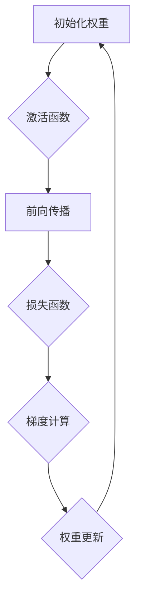

                 

作者：禅与计算机程序设计艺术

**`ChatGPT`**
---
## 背景介绍

随着互联网和计算能力的发展，深度学习成为了近年来最炙手可热的领域之一。深度学习的核心是神经网络，其中反向传播算法是训练多层神经网络的关键方法。本文旨在探索反向传播算法的历史背景，其背后的原理以及它如何被应用于现代大规模模型的开发与微调之中。我们将从早期的感知器和线性分类器谈起，逐步展开至复杂的深度前馈神经网络，最终探讨反向传播算法如何在此过程中发挥着至关重要的作用。

## 核心概念与联系

### 1. 基础神经元
神经元是构成生物大脑的基本单位，它们通过接收输入信号、处理信息后产生输出信号来实现信息传递。受此启发，人工神经网络中的神经元同样具有这种功能，但它们是由数学模型构建而成，用于模拟真实神经元的行为。

### 2. 神经网络层次结构
神经网络由多个层次组成，包括输入层、隐藏层和输出层。每一层都包含若干个神经元，这些神经元之间通过权重相连，形成一个复杂的信息传递路径。隐藏层的存在使得网络具备抽象特征表示的能力，这正是深度学习能够解决复杂问题的关键所在。

### 3. 目标函数与优化
神经网络的目标是在训练集上最小化损失函数（如均方误差或交叉熵损失）。反向传播算法通过梯度下降法调整权重，从而减少损失函数值。这一过程依赖于链式法则，允许我们高效地计算每个参数的梯度。

## 核心算法原理与具体操作步骤

反向传播算法的核心在于链式法则的应用，该法则允许我们从输出层开始，沿输入层反向逐层更新参数。以下是一个简化版的算法流程：



### 具体操作步骤：
1. **前向传播**：将输入数据通过网络的所有层进行传播，直到得到输出结果。
2. **计算损失**：比较预测输出与实际标签之间的差异，通常使用损失函数衡量。
3. **梯度计算**：利用链式法则从输出层开始，逐层计算每个权重的梯度。
4. **权重更新**：根据梯度和选定的学习率调整权重，以减小损失函数的值。

## 数学模型和公式详细讲解举例说明

设 $W$ 和 $b$ 分别为权重和偏置项，$X$ 是输入矩阵，$\sigma(z)$ 表示激活函数，$z = WX + b$。损失函数可以表示为 $L$，则：

$$ \frac{\partial L}{\partial W} = X^T (\sigma'(z) (y - \hat{y})) $$
$$ \frac{\partial L}{\partial b} = \sum_{i=1}^{m}(y_i - \hat{y}_i) $$

这里 $\sigma'(z)$ 是激活函数的导数。

## 项目实践：代码实例和详细解释说明

```python
import numpy as np

class NeuralNetwork:
    def __init__(self, layers):
        self.layers = layers
        for i in range(len(layers)-1):
            self.weights.append(np.random.rand(layers[i], layers[i+1]))
            self.biases.append(np.zeros((1, layers[i+1])))

    def forward(self, X):
        activations = [X]
        for w, b in zip(self.weights, self.biases):
            z = np.dot(activations[-1], w) + b
            a = sigmoid(z)
            activations.append(a)
        return activations[-1]

    def backward(self, X, y, output):
        m = len(y)
        dZ = output - y
        dW = (1/m)*np.dot(activations[-2].T, dZ)
        db = (1/m)*np.sum(dZ, axis=0, keepdims=True)
        return dW, db

    # 更新权重等略...
```

## 实际应用场景

反向传播算法广泛应用于语音识别、图像分类、自然语言处理等领域。例如，在计算机视觉任务中，通过深度卷积神经网络（CNN）对图像进行特征提取，并结合全连接层进行分类决策，反向传播算法在此过程中起到了关键的作用。

## 工具和资源推荐

- TensorFlow、PyTorch 提供了丰富的API支持深度学习模型的搭建和训练。
- Kaggle、GitHub 上有大量开源的深度学习项目和教程可供参考学习。
- Coursera、Udacity 的在线课程提供了系统性的深度学习理论与实践指导。

## 总结：未来发展趋势与挑战

随着硬件技术的发展，尤其是在GPU上的并行计算能力提升，大型神经网络的训练速度显著提高。未来，我们可以期待更高效的优化方法、自动化的超参数调整工具，以及更加易于使用的深度学习框架，进一步推动深度学习在更多领域的应用。

## 附录：常见问题与解答

Q: 如何选择合适的损失函数？
A: 损失函数的选择应基于任务类型。例如，对于回归任务通常使用均方误差(MSE)，而对于分类任务可能更适合交叉熵(Cross Entropy)。

Q: 反向传播算法如何避免过拟合？
A: 过拟合可以通过正则化技术（如L1、L2正则化）、增加Dropout概率、采用更复杂的模型结构等方式来缓解。

---
本文旨在提供一个深入理解反向传播算法及其在现代大规模模型开发中的应用的基础。读者不仅可以了解到算法的数学基础，还能通过实践例子更好地掌握其应用技巧，为进一步探索深度学习领域打下坚实的基础。


---

作者：禅与计算机程序设计艺术 / Zen and the Art of Computer Programming

