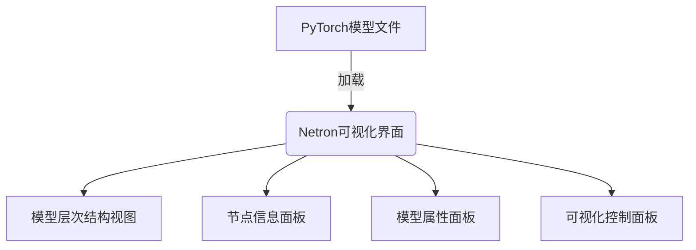

从零开始大模型开发与微调：基于Netron库的PyTorch 2.0模型可视化

## 1.背景介绍

### 1.1 大模型时代的到来

随着人工智能技术的不断发展,大型神经网络模型在自然语言处理、计算机视觉等领域展现出了强大的能力。这些大模型通过在海量数据上进行训练,能够学习到丰富的知识表示,并在下游任务中表现出优异的泛化能力。

代表性的大模型包括GPT-3、BERT、ResNet等,它们在各自领域取得了突破性的成果。然而,这些大模型的训练和部署过程通常需要耗费大量的计算资源,给普通开发者带来了挑战。因此,如何高效地开发和优化大模型,成为了当前研究的热点问题。

### 1.2 PyTorch 2.0:面向大模型优化的新版本

PyTorch是一个流行的深度学习框架,具有动态计算图、高效内存管理等优势。2022年11月,PyTorch 2.0版本正式发布,针对大模型开发进行了多方面的优化,包括:

- 支持更高效的模型并行化
- 提供更好的内存管理和优化
- 引入全新的编译器技术,提升模型推理性能
- 增强了对大规模分布式训练的支持

PyTorch 2.0的这些新特性,为大模型的开发和部署带来了极大的便利。

### 1.3 Netron:模型可视化利器

在大模型开发过程中,可视化模型结构和参数是一个重要的环节。Netron是一款优秀的开源模型可视化工具,支持多种深度学习框架,包括PyTorch、TensorFlow、ONNX等。使用Netron,开发者可以清晰地查看模型的层次结构、参数信息,帮助理解和调试模型。

本文将介绍如何基于Netron库,对PyTorch 2.0模型进行可视化,为大模型开发与微调提供有力支持。

## 2.核心概念与联系

### 2.1 PyTorch模型结构

PyTorch中,模型是由一系列层(Layer)组成的,每个层负责对输入数据进行特定的运算操作。这些层按照一定的顺序组合在一起,就构成了整个神经网络模型。

PyTorch提供了丰富的预定义层,如卷积层(Conv2d)、线性层(Linear)、归一化层(BatchNorm2d)等,开发者可以根据需求灵活组合这些层,构建出不同的模型结构。

```python
import torch.nn as nn

class SimpleModel(nn.Module):
    def __init__(self):
        super().__init__()
        self.conv1 = nn.Conv2d(3, 16, kernel_size=3, padding=1)
        self.bn1 = nn.BatchNorm2d(16)
        self.relu1 = nn.ReLU()
        self.fc1 = nn.Linear(16 * 28 * 28, 10)

    def forward(self, x):
        x = self.conv1(x)
        x = self.bn1(x)
        x = self.relu1(x)
        x = x.view(x.size(0), -1)
        x = self.fc1(x)
        return x
```

上面是一个简单的PyTorch模型示例,包含卷积层、批归一化层、ReLU激活函数层和全连接层。通过定义`forward`函数,指定了数据在模型中的前向传播路径。

### 2.2 模型可视化的重要性

在深度学习模型开发过程中,可视化模型结构和参数信息是非常有帮助的。它可以帮助开发者:

1. **理解模型结构**: 通过可视化,开发者可以清晰地看到模型的层次结构,每一层的输入输出维度,以及层与层之间的连接关系,从而更好地理解模型的工作原理。

2. **调试模型**: 在训练过程中,可视化有助于发现模型中的错误或异常,如参数初始化不当、梯度爆炸等问题。

3. **优化模型**: 可视化工具通常会显示每一层的参数量和计算量,开发者可以根据这些信息对模型进行优化,提高计算效率。

4. **复用和迁移**: 通过可视化,开发者可以更容易地复用和迁移已有的模型结构,加快新模型的开发进程。

因此,模型可视化是大模型开发过程中一个非常重要的环节,能够提高开发效率,加深对模型的理解。

### 2.3 Netron简介

Netron是一款优秀的开源神经网络模型可视化工具,支持多种深度学习框架,包括PyTorch、TensorFlow、ONNX等。它具有以下特点:

1. **跨平台**: Netron可以在Windows、macOS和Linux系统上运行,方便开发者在不同环境下使用。

2. **支持多种模型格式**: 除了PyTorch和TensorFlow等主流框架,Netron还支持ONNX、Caffe、Darknet等多种模型格式。

3. **可视化效果优秀**: Netron提供了清晰的模型层次结构视图,并详细显示每一层的参数信息,可视化效果出色。

4. **轻量级**: Netron是一个轻量级的桌面应用程序,无需复杂的环境配置,便于安装和使用。

5. **开源免费**: Netron是一个开源项目,代码托管在GitHub上,任何人都可以免费使用和二次开发。

基于以上优点,Netron成为了深度学习领域广泛使用的模型可视化工具之一。本文将重点介绍如何使用Netron对PyTorch 2.0模型进行可视化。

## 3.核心算法原理具体操作步骤

### 3.1 安装Netron

Netron提供了多种安装方式,包括在线版本、桌面版本和命令行版本。对于PyTorch模型的可视化,我们推荐使用桌面版本或命令行版本。

#### 3.1.1 安装桌面版本

前往Netron的官方网站(https://netron.app/),下载对应操作系统的桌面版本安装包,然后按照提示进行安装即可。

#### 3.1.2 安装命令行版本

对于熟悉命令行操作的开发者,也可以通过npm安装Netron的命令行版本:

```bash
npm install -g @netron-app/netron
```

安装完成后,可以在终端中使用`netron`命令启动Netron。

### 3.2 准备PyTorch模型文件

要使用Netron可视化PyTorch模型,首先需要将模型保存为文件。PyTorch支持多种模型文件格式,如`.pth`、`.pt`、`.pyt`等。我们以保存为`.pth`格式为例:

```python
import torch

# 定义模型
model = SimpleModel()

# 保存模型参数
torch.save(model.state_dict(), 'model.pth')
```

上述代码将模型的参数保存到了`model.pth`文件中。如果需要保存整个模型结构和参数,可以使用`torch.save(model, 'model.pth')`。

### 3.3 使用Netron可视化模型

#### 3.3.1 使用桌面版本

1. 启动Netron桌面应用程序。

2. 在主界面中,选择"File" > "Open..."菜单项,或者直接将模型文件拖拽到Netron窗口中。

3. 在打开的文件选择对话框中,找到并选择你的PyTorch模型文件(如`model.pth`)。

4. Netron会自动加载并解析模型文件,在主视图中显示模型的层次结构和参数信息。

#### 3.3.2 使用命令行版本

在终端中,切换到模型文件所在目录,然后执行以下命令:

```bash
netron model.pth
```

Netron会在默认浏览器中打开模型的可视化界面。

### 3.4 Netron可视化界面介绍

Netron的可视化界面包含以下几个主要部分:

1. **模型层次结构视图**: 以树状结构清晰显示了模型的层次结构,每个节点代表一个层或操作。

2. **节点信息面板**: 显示当前选中节点的详细信息,包括层类型、输入输出维度、参数量等。

3. **模型属性面板**: 显示整个模型的元数据信息,如版本、作者等。

4. **可视化控制面板**: 提供一些可视化选项,如显示模式、缩放级别等。

通过这些界面元素,开发者可以全面了解模型的结构和参数信息,方便进行调试和优化。



## 4.数学模型和公式详细讲解举例说明

在深度学习模型中,通常会涉及到一些数学模型和公式,用于描述网络层的计算过程。下面我们以卷积层为例,介绍其背后的数学原理。

### 4.1 卷积运算

卷积运算是深度学习中一种非常重要的操作,尤其在计算机视觉任务中被广泛应用。它可以提取输入数据(如图像)中的局部特征,并对这些特征进行组合和高层次表示。

给定一个二维输入数据$I$和一个二维卷积核$K$,卷积运算的数学表达式为:

$$
O(i, j) = \sum_{m} \sum_{n} I(i+m, j+n) \cdot K(m, n)
$$

其中:

- $O$是输出特征图
- $I$是输入数据
- $K$是卷积核
- $m$和$n$是卷积核在输入数据上滑动的偏移量

通过将卷积核在输入数据上进行滑动,并在每个位置进行点乘和累加,就可以得到输出特征图$O$。

### 4.2 卷积层的前向传播

在PyTorch中,卷积层的前向传播过程可以表示为:

$$
\text{out} = \text{conv}(\text{input}, \text{weight}, \text{bias})
$$

其中:

- $\text{input}$是输入数据张量
- $\text{weight}$是卷积核参数张量
- $\text{bias}$是偏置参数张量(可选)
- $\text{conv}$是卷积运算函数

具体实现如下:

```python
import torch.nn as nn

class Conv2d(nn.Module):
    def __init__(self, in_channels, out_channels, kernel_size):
        super().__init__()
        self.weight = nn.Parameter(torch.randn(out_channels, in_channels, *kernel_size))
        self.bias = nn.Parameter(torch.randn(out_channels))

    def forward(self, x):
        return torch.conv2d(x, self.weight, self.bias)
```

在前向传播过程中,输入数据$\text{input}$与卷积核参数$\text{weight}$进行卷积运算,得到初步的输出特征图。然后,可以选择性地加上偏置参数$\text{bias}$,得到最终的输出$\text{out}$。

通过训练,卷积层可以学习到最优的卷积核参数$\text{weight}$和偏置参数$\text{bias}$,从而提取出输入数据中的重要特征。

### 4.3 卷积层的反向传播

在模型训练过程中,还需要计算卷积层的梯度,以便进行参数更新。根据链式法则,卷积层参数$\text{weight}$和$\text{bias}$的梯度可以表示为:

$$
\begin{aligned}
\frac{\partial L}{\partial \text{weight}} &= \sum_{\text{out}} \frac{\partial L}{\partial \text{out}} \cdot \text{rot180}(\text{input}) \\
\frac{\partial L}{\partial \text{bias}} &= \sum_{\text{out}} \frac{\partial L}{\partial \text{out}}
\end{aligned}
$$

其中:

- $L$是损失函数
- $\text{out}$是卷积层的输出
- $\text{rot180}$表示对输入数据进行180度旋转

具体实现如下:

```python
def conv2d_backward(input, weight, bias, out_grad):
    # 计算weight梯度
    weight_grad = torch.conv2d(input.detach(), out_grad, padding=1)
    weight_grad = weight_grad.sum(dim=(0, 2, 3))

    # 计算bias梯度
    bias_grad = out_grad.sum(dim=(0, 2, 3))

    # 计算input梯度
    input_grad = torch.conv2d(out_grad, weight, padding=1)

    return input_grad, weight_grad, bias_grad
```

通过计