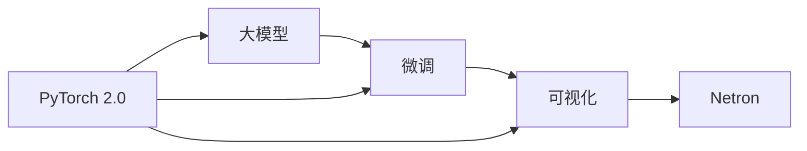

# 从零开始大模型开发与微调：基于Netron库的PyTorch 2.0模型可视化

## 1. 背景介绍
### 1.1 大模型开发的兴起
近年来,随着深度学习技术的快速发展,大规模预训练语言模型(Large Pre-trained Language Models,PLMs)引起了学术界和工业界的广泛关注。从2018年的BERT[1],到2019年的GPT-2[2],再到2020年的GPT-3[3]等,大模型不断刷新着NLP领域的SOTA成绩。这些大模型通过在大规模无标注语料上进行预训练,学习到了丰富的语言知识,具备强大的语言理解和生成能力,为下游任务提供了更好的特征表示。

### 1.2 大模型微调的必要性
尽管预训练大模型展现出了优异的性能,但它们在实际应用中仍然面临诸多挑战。首先,大模型通常需要在特定领域的数据上进行微调(Fine-tuning),以适应不同任务的需求。其次,大模型的参数量巨大(动辄上亿),给部署和推理带来很大压力。因此,如何高效地开发和微调大模型,成为了NLP研究的重要课题。

### 1.3 可视化在大模型开发中的作用
模型可视化是深度学习不可或缺的一部分。通过可视化模型结构、数据流向、参数分布等,我们可以更直观地理解模型的工作原理,发现潜在的问题,并对模型进行优化。特别是对于大模型而言,由于其结构复杂、层数众多,可视化就显得尤为重要。借助可视化工具,我们能够以更高效、更准确的方式对大模型进行开发、调试和微调。

### 1.4 Netron与PyTorch 2.0
Netron[4]是一款功能强大的神经网络可视化工具,支持主流的深度学习框架,如TensorFlow、PyTorch、Caffe等。它以直观的图形化界面呈现模型的计算图,便于用户探索模型内部结构。

PyTorch[5]是当前最流行的深度学习框架之一,其动态计算图、命令式编程等特性备受青睐。2022年3月,PyTorch发布了2.0版本[6],引入了一系列新特性,如即时编译器(TorchInductor)、向量化Transformer(VecTransformer)、功能增强的分布式训练库torchrec等,极大地提升了框架性能和易用性。

本文将重点介绍如何基于Netron库,对PyTorch 2.0实现的大模型进行可视化,并讨论可视化在大模型开发与微调中的应用。通过可视化分析,我们能够更好地洞察大模型的内在机制,为后续的优化提供指导。

## 2. 核心概念与联系
### 2.1 大模型
大模型泛指参数量巨大(通常在亿级以上)的深度神经网络模型,尤其是自然语言处理领域的预训练语言模型,如BERT、GPT系列等。这些模型在大规模语料上进行预训练,通过自监督学习等方式习得通用的语言表示,再针对下游任务进行微调,可以显著提升任务性能。大模型之所以强大,归因于其庞大的参数空间和海量的训练数据,使其能够学到丰富而精细的语言知识。

### 2.2 微调
微调(Fine-tuning)是指在预训练模型的基础上,使用任务特定的数据对模型进行二次训练,使其适应具体任务。相比从头训练,微调能够显著减少所需的数据量和计算资源,同时达到更好的效果。微调的核心思想在于,预训练模型已经学习到了语言的一般特征,而微调只需要在此基础上进行局部调整,以适应特定任务。常见的微调方式包括特征提取(Feature Extraction)和全参数微调(Full Fine-tuning)。

### 2.3 可视化
可视化是将数据和模型以图形化的方式呈现,便于人类理解和分析。在深度学习中,可视化的对象包括模型结构、数据流向、参数分布、特征图等。可视化的目的在于提供一种直观而全面的模型解释,帮助用户洞察模型行为,发现潜在问题,并指导模型优化。对于大模型而言,由于其结构复杂、层数众多,可视化显得尤为重要。借助可视化,我们能够更好地理解大模型的工作原理,优化模型设计。

### 2.4 Netron
Netron是一款开源的神经网络可视化工具,支持主流的深度学习框架。它能够读取不同格式的模型文件,并生成直观的计算图,展示模型的层次结构、数据流向等。Netron提供了图形化的用户界面,用户可以通过点击、拖拽等操作与模型进行交互,深入探索模型细节。Netron的一大特色在于其跨平台性,支持Windows、Linux、macOS等操作系统,并提供了Python API,方便集成到开发流程中。

### 2.5 PyTorch 2.0
PyTorch是由Facebook开源的深度学习框架,其动态计算图、命令式编程等特性深受开发者青睐。2022年发布的PyTorch 2.0引入了一系列新特性,如及时编译器、向量化Transformer、分布式训练增强等,显著提升了框架的性能和易用性。得益于其灵活性和高性能,PyTorch已成为大模型开发的主流框架之一。

下图展示了上述核心概念之间的联系:



## 3. 核心算法原理与具体操作步骤
下面我们以BERT为例,介绍大模型的核心算法原理,并给出基于PyTorch 2.0和Netron的可视化步骤。

### 3.1 BERT的核心算法原理
BERT(Bidirectional Encoder Representations from Transformers)[1]是一种基于Transformer[7]的预训练语言模型,其核心思想在于双向编码和自监督预训练。与传统的单向语言模型不同,BERT在编码每个token时,不仅考虑其左侧上下文,还考虑其右侧上下文,从而获得更全面的语义表示。

BERT的预训练包括两个任务:
1. Masked Language Model(MLM):随机遮蔽一定比例的输入token,并训练模型预测被遮蔽的token。这促使模型学习上下文信息,掌握词汇的语义。 
2. Next Sentence Prediction(NSP):给定两个句子,训练模型预测它们是否前后相邻。这有助于模型学习句间关系,捕捉长距离依赖。

通过在大规模语料上进行预训练,BERT学习到了丰富的语言知识,可以作为下游任务的特征提取器或fine-tuning的初始化参数,显著提升任务性能。

### 3.2 基于PyTorch 2.0实现BERT
借助PyTorch 2.0的新特性,我们可以更高效地实现BERT模型。以下是一个简化版的PyTorch 2.0实现示例:

```python
import torch
from torch import nn

class BertEmbedding(nn.Module):
    def __init__(self, vocab_size, hidden_size, max_position_embeddings, type_vocab_size, dropout_prob):
        super().__init__()
        self.word_embeddings = nn.Embedding(vocab_size, hidden_size)
        self.position_embeddings = nn.Embedding(max_position_embeddings, hidden_size)
        self.token_type_embeddings = nn.Embedding(type_vocab_size, hidden_size)
        self.LayerNorm = nn.LayerNorm(hidden_size)
        self.dropout = nn.Dropout(dropout_prob)

    def forward(self, input_ids, token_type_ids):
        seq_length = input_ids.size(1)
        position_ids = torch.arange(seq_length, dtype=torch.long, device=input_ids.device)
        position_ids = position_ids.unsqueeze(0).expand_as(input_ids)
        
        words_embeddings = self.word_embeddings(input_ids)
        position_embeddings = self.position_embeddings(position_ids)
        token_type_embeddings = self.token_type_embeddings(token_type_ids)
        
        embeddings = words_embeddings + position_embeddings + token_type_embeddings
        embeddings = self.LayerNorm(embeddings)
        embeddings = self.dropout(embeddings)
        return embeddings

class BertSelfAttention(nn.Module):
    def __init__(self, hidden_size, num_attention_heads, attention_probs_dropout_prob):
        super().__init__()
        self.num_attention_heads = num_attention_heads
        self.attention_head_size = int(hidden_size / num_attention_heads)
        self.all_head_size = self.num_attention_heads * self.attention_head_size
        
        self.query = nn.Linear(hidden_size, self.all_head_size)
        self.key = nn.Linear(hidden_size, self.all_head_size)
        self.value = nn.Linear(hidden_size, self.all_head_size)
        
        self.dropout = nn.Dropout(attention_probs_dropout_prob)

    def transpose_for_scores(self, x):
        new_x_shape = x.size()[:-1] + (self.num_attention_heads, self.attention_head_size)
        x = x.view(*new_x_shape)
        return x.permute(0, 2, 1, 3)

    def forward(self, hidden_states, attention_mask):
        mixed_query_layer = self.query(hidden_states)
        mixed_key_layer = self.key(hidden_states)
        mixed_value_layer = self.value(hidden_states)
        
        query_layer = self.transpose_for_scores(mixed_query_layer)
        key_layer = self.transpose_for_scores(mixed_key_layer)
        value_layer = self.transpose_for_scores(mixed_value_layer)
        
        attention_scores = torch.matmul(query_layer, key_layer.transpose(-1, -2))
        attention_scores = attention_scores / math.sqrt(self.attention_head_size)
        attention_scores = attention_scores + attention_mask
        
        attention_probs = nn.Softmax(dim=-1)(attention_scores)
        attention_probs = self.dropout(attention_probs)
        
        context_layer = torch.matmul(attention_probs, value_layer)
        context_layer = context_layer.permute(0, 2, 1, 3).contiguous()
        new_context_layer_shape = context_layer.size()[:-2] + (self.all_head_size,)
        context_layer = context_layer.view(*new_context_layer_shape)
        return context_layer

class BertLayer(nn.Module):
    def __init__(self, hidden_size, num_attention_heads, attention_probs_dropout_prob, hidden_dropout_prob, intermediate_size):
        super().__init__()
        self.attention = BertSelfAttention(hidden_size, num_attention_heads, attention_probs_dropout_prob)
        self.intermediate = nn.Linear(hidden_size, intermediate_size)
        self.output = nn.Linear(intermediate_size, hidden_size)
        self.attention_output_dropout = nn.Dropout(hidden_dropout_prob)
        self.intermediate_act_fn = nn.GELU()
        self.output_dropout = nn.Dropout(hidden_dropout_prob)
        self.attention_output_LayerNorm = nn.LayerNorm(hidden_size)
        self.output_LayerNorm = nn.LayerNorm(hidden_size)

    def forward(self, hidden_states, attention_mask):
        attention_output = self.attention(hidden_states, attention_mask)
        attention_output = self.attention_output_dropout(attention_output)
        attention_output = self.attention_output_LayerNorm(attention_output + hidden_states)
        
        intermediate_output = self.intermediate(attention_output)
        intermediate_output = self.intermediate_act_fn(intermediate_output)
        
        layer_output = self.output(intermediate_output)
        layer_output = self.output_dropout(layer_output)
        layer_output = self.output_LayerNorm(layer_output + attention_output)
        return layer_output

class BertModel(nn.Module):
    def __init__(self, config):
        super().__init__()
        self.embeddings = BertEmbedding(config.vocab_size, config.hidden_size, 
                                        config.max_position_embeddings, config.type_vocab_size, 
                                        config.hidden_dropout_prob)
        self.encoder = nn.ModuleList([BertLayer(config.hidden_size, config.num_attention_heads, 
                                                config.attention_probs_dropout_prob, config.hidden_dropout_prob,
                                                config.intermediate_size) for _ in range(config.num_hidden_layers)])

    def forward(self, input_ids, attention_mask, token_type_ids):
        extended_attention_mask = attention_mask.unsqueeze(1).unsqueeze(2)
        extended_attention_mask = extended_attention_mask.to(dtype=next(self.parameters()).dtype)
        extended_attention_mask = (1.0 - extended_attention_mask) * -10000.0
        
        embedding_output = self.embeddings(input_ids, token_type_ids)
        hidden_states = embedding_output
        for layer in self.encoder:
            hidden_states = layer(hidden_states, extended_attention_mask)
        return hidden_states
```

上述代码定义了