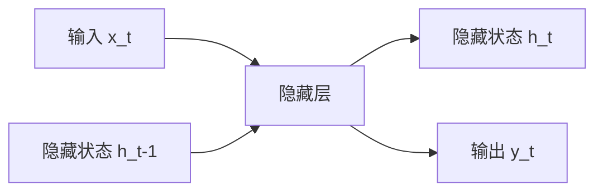
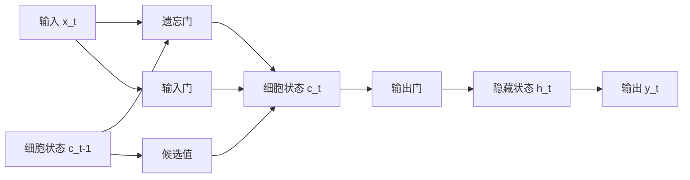

# 从零开始大模型开发与微调：循环神经网络理论讲解

## 1.背景介绍

### 1.1 人工智能发展简史

人工智能(Artificial Intelligence, AI)是当代最具革命性和颠覆性的技术之一。自20世纪50年代AI概念被正式提出以来,经历了多个起伏阶段,但总体呈现出蓬勃发展的态势。

### 1.2 深度学习的兴起

近年来,深度学习(Deep Learning)作为AI的核心驱动力,取得了令人瞩目的进展。在计算机视觉、自然语言处理、语音识别等领域,深度学习展现出超越传统方法的卓越性能。

### 1.3 大模型的重要性

在深度学习领域,大规模神经网络模型(通常称为"大模型")正成为研究的热点和趋势。大模型通过增加参数量和训练数据规模,能够捕捉更复杂的模式,提高泛化能力。著名的大模型包括GPT、BERT、AlphaFold等。

### 1.4 循环神经网络在序列建模中的地位

循环神经网络(Recurrent Neural Networks, RNNs)是处理序列数据(如文本、语音、视频)的关键模型。它们能够捕捉序列中的长期依赖关系,在自然语言处理、时间序列预测等任务中发挥重要作用。

## 2.核心概念与联系

### 2.1 循环神经网络的基本原理

循环神经网络的核心思想是在隐藏层中引入循环连接,使得网络具有"记忆"能力,能够处理序列数据。每个时间步,RNN会根据当前输入和上一时间步的隐藏状态,计算出新的隐藏状态。



### 2.2 梯度消失和梯度爆炸问题

传统的RNN在处理长序列时存在梯度消失和梯度爆炸问题,导致无法有效捕捉长期依赖关系。这是由于反向传播算法中,梯度会在时间步之间累乘,容易出现数值不稳定的情况。

### 2.3 长短期记忆网络(LSTM)

为解决梯度问题,Hochreiter和Schmidhuber在1997年提出了LSTM(Long Short-Term Memory)。LSTM通过引入门控机制(包括遗忘门、输入门和输出门),使得网络能够自主决定何时保留、更新或忽略信息,从而有效捕捉长期依赖关系。



### 2.4 门控循环单元(GRU)

GRU(Gated Recurrent Unit)是LSTM的一种变体,由Cho等人在2014年提出。GRU通过合并遗忘门和输入门,降低了模型复杂度,在一定程度上提高了计算效率。

### 2.5 注意力机制与Transformer

注意力机制(Attention Mechanism)是一种有效捕捉长期依赖关系的方法。Transformer模型通过完全基于注意力机制,摒弃了RNN的循环结构,在机器翻译等任务上取得了卓越表现。

### 2.6 大模型与迁移学习

大模型通过在大规模数据集上预训练,能够学习到通用的表示能力。通过在下游任务上进行微调(Fine-tuning),可以将预训练模型中的知识迁移过来,提高性能并减少训练开销。

## 3.核心算法原理具体操作步骤

### 3.1 RNN前向传播算法

对于长度为T的序列,RNN的前向传播算法可表述为:

$$
\begin{aligned}
h_t &= \tanh(W_{hx}x_t + W_{hh}h_{t-1} + b_h) \\
y_t &= W_{yh}h_t + b_y
\end{aligned}
$$

其中$x_t$是当前时间步的输入,$h_t$是隐藏状态,$y_t$是输出。$W$是权重矩阵,包括输入到隐藏层的权重$W_{hx}$、隐藏层到隐藏层的权重$W_{hh}$和隐藏层到输出层的权重$W_{yh}$。$b$是偏置项。

### 3.2 LSTM前向传播算法

LSTM的前向传播算法可表述为:

$$
\begin{aligned}
f_t &= \sigma(W_f[h_{t-1}, x_t] + b_f) & \text{遗忘门} \\
i_t &= \sigma(W_i[h_{t-1}, x_t] + b_i) & \text{输入门} \\
\tilde{c}_t &= \tanh(W_c[h_{t-1}, x_t] + b_c) & \text{候选细胞状态} \\
c_t &= f_t \odot c_{t-1} + i_t \odot \tilde{c}_t & \text{细胞状态} \\
o_t &= \sigma(W_o[h_{t-1}, x_t] + b_o) & \text{输出门} \\
h_t &= o_t \odot \tanh(c_t) & \text{隐藏状态}
\end{aligned}
$$

其中$\sigma$是sigmoid函数,$\odot$是元素wise乘积。$f_t$、$i_t$、$o_t$分别是遗忘门、输入门和输出门的激活值,$\tilde{c}_t$是候选细胞状态,$c_t$是当前细胞状态。

### 3.3 LSTM反向传播算法

LSTM的反向传播算法需要计算各个门和状态的梯度,并通过链式法则进行传播。以细胞状态$c_t$的梯度为例:

$$
\frac{\partial L}{\partial c_t} = \frac{\partial L}{\partial h_t} \odot o_t \odot (1 - \tanh^2(c_t)) + \frac{\partial L}{\partial c_{t+1}} \odot i_{t+1}
$$

其中$L$是损失函数。梯度的计算涉及大量中间变量,需要注意避免出现数值不稳定的情况。

### 3.4 GRU前向传播算法

GRU的前向传播算法可表述为:

$$
\begin{aligned}
z_t &= \sigma(W_z[h_{t-1}, x_t] + b_z) & \text{更新门} \\
r_t &= \sigma(W_r[h_{t-1}, x_t] + b_r) & \text{重置门} \\
\tilde{h}_t &= \tanh(W_h[r_t \odot h_{t-1}, x_t] + b_h) & \text{候选隐藏状态} \\
h_t &= (1 - z_t) \odot h_{t-1} + z_t \odot \tilde{h}_t & \text{隐藏状态}
\end{aligned}
$$

其中$z_t$是更新门,$r_t$是重置门,$\tilde{h}_t$是候选隐藏状态。GRU通过更新门和重置门控制信息的流动,相比LSTM结构更加简洁。

## 4.数学模型和公式详细讲解举例说明

### 4.1 循环神经网络的数学表示

对于长度为T的序列$(x_1, x_2, \dots, x_T)$,循环神经网络的计算过程可以表示为:

$$
\begin{aligned}
h_t &= f_W(x_t, h_{t-1}) \\
y_t &= g_V(h_t)
\end{aligned}
$$

其中$f_W$是根据当前输入$x_t$和上一时间步隐藏状态$h_{t-1}$计算新隐藏状态$h_t$的函数,参数为$W$。$g_V$是根据隐藏状态$h_t$计算输出$y_t$的函数,参数为$V$。

对于不同类型的RNN,如LSTM和GRU,$f_W$的具体形式会有所不同,但都遵循上述基本框架。

### 4.2 反向传播算法

反向传播算法(Backpropagation Through Time, BPTT)是训练循环神经网络的核心算法。它通过计算损失函数相对于模型参数的梯度,并使用优化算法(如随机梯度下降)更新参数,从而最小化损失函数。

对于时间步$t$,损失函数$L_t$相对于权重$W$的梯度可以表示为:

$$
\frac{\partial L_t}{\partial W} = \frac{\partial L_t}{\partial y_t} \frac{\partial y_t}{\partial h_t} \frac{\partial h_t}{\partial W}
$$

通过链式法则,我们可以计算$\frac{\partial L_t}{\partial h_t}$和$\frac{\partial h_t}{\partial W}$,从而得到$\frac{\partial L_t}{\partial W}$。

对于整个序列,损失函数$L$相对于权重$W$的梯度为:

$$
\frac{\partial L}{\partial W} = \sum_{t=1}^T \frac{\partial L_t}{\partial W}
$$

### 4.3 梯度裁剪

在训练过程中,梯度可能会出现爆炸或消失的情况,导致模型无法收敛或收敛缓慢。为了缓解这个问题,我们可以采用梯度裁剪(Gradient Clipping)技术。

梯度裁剪的基本思想是,如果梯度的范数超过了预设的阈值,就对梯度进行归一化,使其范数等于阈值。具体来说,如果$\|\nabla L\|_2 > c$,那么:

$$
\nabla L \leftarrow \frac{c}{\|\nabla L\|_2} \nabla L
$$

其中$c$是预设的阈值,$\|\nabla L\|_2$是梯度的$L_2$范数。

### 4.4 注意力机制

注意力机制是一种有效捕捉长期依赖关系的方法。它通过计算查询(Query)和键(Key)之间的相似性分数,从而确定对值(Value)的注意力分配。

对于查询$q$、键$k$和值$v$,注意力分数可以计算为:

$$
\text{Attention}(q, k, v) = \text{softmax}\left(\frac{qk^\top}{\sqrt{d_k}}\right)v
$$

其中$d_k$是键的维度,用于对分数进行缩放。softmax函数用于将分数归一化为概率分布。

注意力机制可以应用于不同的场景,如自注意力(Self-Attention)、多头注意力(Multi-Head Attention)等,从而捕捉序列中的长期依赖关系。

## 5.项目实践：代码实例和详细解释说明

### 5.1 PyTorch实现RNN

以下是使用PyTorch实现基本RNN的示例代码:

```python
import torch
import torch.nn as nn

class RNN(nn.Module):
    def __init__(self, input_size, hidden_size, output_size):
        super(RNN, self).__init__()
        self.hidden_size = hidden_size
        self.rnn = nn.RNN(input_size, hidden_size, batch_first=True)
        self.fc = nn.Linear(hidden_size, output_size)

    def forward(self, x):
        batch_size = x.size(0)
        h_0 = torch.zeros(1, batch_size, self.hidden_size)
        out, _ = self.rnn(x, h_0)
        out = self.fc(out[:, -1, :])
        return out
```

在这个示例中,我们定义了一个基本的RNN模型,包括RNN层和全连接层。`forward`函数实现了前向传播过程,其中`h_0`是初始隐藏状态。

### 5.2 PyTorch实现LSTM

以下是使用PyTorch实现LSTM的示例代码:

```python
import torch
import torch.nn as nn

class LSTM(nn.Module):
    def __init__(self, input_size, hidden_size, output_size):
        super(LSTM, self).__init__()
        self.hidden_size = hidden_size
        self.lstm = nn.LSTM(input_size, hidden_size, batch_first=True)
        self.fc = nn.Linear(hidden_size, output_size)

    def forward(self, x):
        batch_size = x.size(0)
        h_0 = torch.zeros(1, batch_size, self.hidden_size)
        c_0 = torch.zeros(1, batch_size, self.hidden_size)
        out, _ = self.lstm(x, (h_0, c_0))
        out