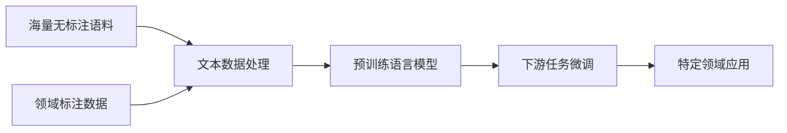

# 从零开始大模型开发与微调：文本数据处理

## 1. 背景介绍
### 1.1 大模型的兴起与应用
近年来,随着深度学习技术的不断突破,大规模预训练语言模型(Large Pre-trained Language Models,简称大模型)逐渐成为自然语言处理(NLP)领域的研究热点。从2018年的BERT到2020年的GPT-3,再到最近的ChatGPT,大模型展现出了惊人的语言理解和生成能力,在问答、对话、文本分类、命名实体识别等诸多NLP任务上取得了突破性的进展。大模型正在深刻地改变着NLP技术的发展格局,并在搜索引擎、智能客服、内容创作等领域得到广泛应用。

### 1.2 大模型开发面临的挑战  
尽管大模型取得了瞩目的成就,但其开发与应用仍然面临诸多挑战:
1. 大模型通常包含数亿甚至上千亿的参数,训练成本极其昂贵,对算力和存储提出了极高的要求。  
2. 大模型在特定领域的微调fine-tuning需要大量高质量的标注数据,人工标注的成本很高。
3. 许多NLP任务的训练数据存在标注噪声、类别不平衡等问题,直接用于微调会影响模型性能。
4. 大模型的训练和推理对计算资源的需求巨大,模型的推理速度和响应时延也面临考验。

### 1.3 文本数据处理的重要性
大模型的开发与应用离不开高质量的文本数据。从海量的无标注语料中学习通用语言知识是大模型的基础,而从标注数据中学习特定任务的知识则是大模型应用的关键。因此,如何高效地获取、清洗、预处理文本数据,并从中构建高质量的训练集,是大模型开发与应用的重要课题。本文将重点探讨大模型开发中的文本数据处理技术,分享实践经验和思考。

## 2. 核心概念与联系
### 2.1 大模型的定义与分类
大模型泛指基于 Transformer 架构、参数量巨大(通常在数亿到上千亿量级)的预训练语言模型。根据训练任务的不同,大模型可分为以下三类:
1. 自回归语言模型(Autoregressive LM):通过从左到右地预测下一个词,来学习语言的概率分布。代表模型有 GPT 系列。
2. 自编码语言模型(Autoencoder LM):通过随机遮挡词语并预测被遮挡词语,来学习词语的上下文表示。代表模型有 BERT、RoBERTa 等。
3. 序列到序列语言模型(Seq2seq LM):通过编码输入序列并解码生成输出序列,来完成机器翻译、文本摘要等任务。代表模型有 T5、BART 等。

### 2.2 文本数据处理的主要步骤
文本数据处理通常包括以下主要步骤:
1. 数据采集:从网页、文档、数据库等渠道采集原始文本数据。
2. 数据清洗:去除文本中的噪声,如HTML标签、特殊字符、重复内容等。
3. 文本预处理:对文本进行分词、词性标注、命名实体识别、依存句法分析等处理。
4. 文本表示:将文本转化为数值特征,常见的方法有词袋模型、TF-IDF、词向量等。
5. 数据增强:通过同义词替换、回译、句法变换等方法,扩充训练数据的多样性。
6. 数据标注:为文本数据添加标签,用于有监督任务的训练。常见任务如文本分类、序列标注等。
7. 数据集构建:将处理后的文本数据和标签整合为标准的数据集格式,用于模型训练和评估。

### 2.3 文本数据处理与大模型的关系
文本数据处理是大模型开发与应用的基石。高质量的文本数据可以:
1. 提供更丰富、更真实的语言知识,提升大模型的语言理解和生成能力。
2. 降低大模型学习噪声和偏差的风险,提高模型的泛化性能。
3. 为大模型在特定领域的微调提供有针对性的训练数据,提升模型的任务适配能力。
4. 扩大大模型的训练数据规模,进一步提升模型性能的上限。

下图展示了文本数据处理在大模型开发与应用流程中的重要地位:

## 3. 核心算法原理具体操作步骤
本节将重点介绍文本数据处理中的几个核心算法,包括文本预处理、文本表示、数据增强等,并给出详细的操作步骤。

### 3.1 文本预处理
文本预处理旨在将原始文本转化为结构化、规范化的形式,为后续的特征提取和模型训练做准备。主要步骤包括:

1. 分词:将连续的文本切分为独立的词语。常见的分词方法有:
   - 基于规则的分词:如正向最大匹配、逆向最大匹配等。
   - 基于统计的分词:如条件随机场(CRF)、隐马尔可夫模型(HMM)等。
   - 基于深度学习的分词:如 Bi-LSTM+CRF、BERT+CRF 等。
2. 词性标注:为每个词语标注词性(如名词、动词、形容词等)。常见方法有:
   - 基于规则的词性标注:根据词语的上下文和词典,制定词性标注规则。
   - 基于统计的词性标注:如隐马尔可夫模型、最大熵模型等。
   - 基于深度学习的词性标注:如 Bi-LSTM+CRF、BERT+CRF 等。
3. 命名实体识别:识别文本中的实体(如人名、地名、机构名等)。常见方法有:
   - 基于规则的命名实体识别:根据实体的构成规律,制定识别规则。
   - 基于统计的命名实体识别:如条件随机场、支持向量机等。
   - 基于深度学习的命名实体识别:如 Bi-LSTM+CRF、BERT+CRF 等。
4. 依存句法分析:分析句子中词语之间的依存关系。常见方法有:
   - 基于统计的依存句法分析:如最大熵模型、神经网络等。
   - 基于深度学习的依存句法分析:如 Bi-LSTM、BERT 等。
5. 去除停用词:过滤对文本语义贡献不大的常见词,如"的"、"是"等。
6. 词干提取和词形还原:将词语还原为原型,如"apples"->"apple"。

### 3.2 文本表示
文本表示旨在将离散、高维的文本转化为连续、低维的数值向量,便于机器学习模型处理。主要方法包括:

1. 词袋模型(Bag-of-Words):将文本表示为其所包含词语的多重集,忽略词序和语法。
2. TF-IDF:在词袋模型的基础上,考虑词语在文本集合中的重要性,赋予权重。
3. 词嵌入(Word Embedding):将词语映射为低维连续向量,如 Word2Vec、GloVe 等。
4. 句嵌入(Sentence Embedding):将句子映射为低维连续向量,如 Doc2Vec、Sent2Vec 等。
5. 预训练语言模型:利用预训练语言模型(如 BERT、GPT)提取文本特征。

词嵌入是文本表示的重要方法,其核心思想是基于分布假说(Distributional Hypothesis),即语义相似的词语在大规模语料中的共现模式也相似。以 Word2Vec 为例,其主要步骤如下:

1. 构建词语共现矩阵:统计每个词语在上下文窗口内的共现词语及其频次。
2. 定义损失函数:最大化中心词预测上下文词(CBOW)或上下文词预测中心词(Skip-gram)的概率。
3. 随机初始化词向量:为每个词语随机初始化一个低维向量。
4. 训练词向量:通过梯度下降等优化算法,最小化损失函数,更新词向量。
5. 应用词向量:将训练好的词向量用于下游任务,如文本分类、聚类、相似度计算等。

### 3.3 数据增强
数据增强旨在扩充训练数据的规模和多样性,提高模型的鲁棒性和泛化能力。主要方法包括:

1. 同义词替换(Synonym Replacement):用同义词替换句子中的某些词语。
2. 随机插入(Random Insertion):在句子中随机位置插入与上下文无关的词语。
3. 随机交换(Random Swap):随机交换句子中两个词语的位置。
4. 随机删除(Random Deletion):以一定概率随机删除句子中的词语。
5. 回译(Back Translation):将文本翻译为另一种语言,再翻译回原语言。
6. 句法变换(Syntactic Transformation):改变句子的语法结构,如主被动、肯定否定等。

以同义词替换为例,其主要步骤如下:

1. 加载预训练词向量:如 Word2Vec、GloVe 等。
2. 对于句子中的每个词语:
   - 在词向量空间中找到与其最相似的 K 个词语(如余弦相似度最高)。
   - 从 K 个相似词语中随机选择一个,替换原词语。
3. 重复步骤 2,直到达到预设的替换比例(如 20%)。
4. 将增强后的句子添加到训练集中。

数据增强可以有效缓解标注数据不足、类别不平衡等问题,提高模型的泛化性能。但需注意增强后的数据要保持原有的语义和标签,避免引入噪声。

## 4. 数学模型和公式详细讲解举例说明
本节将以词嵌入中的 Skip-gram 模型为例,详细讲解其数学原理和公式推导。

Skip-gram 模型的目标是通过中心词预测其上下文词,从而学习到词语的低维向量表示。其数学模型可表示为:

给定语料库 $\mathcal{D}=\{w_1,w_2,...,w_T\}$,Skip-gram 模型的目标是最大化条件概率 $\prod_{t=1}^{T}\prod_{-c \leq j \leq c, j \neq 0} P(w_{t+j}|w_t)$,其中 $c$ 为上下文窗口大小。

假设上下文词的生成是相互独立的,则有:

$$
P(w_{t+j}|w_t) = \frac{\exp(\mathbf{v}_{w_t}^{\top} \mathbf{u}_{w_{t+j}})}{\sum_{w=1}^{V} \exp(\mathbf{v}_{w_t}^{\top} \mathbf{u}_w)}
$$

其中 $\mathbf{v}_{w_t} \in \mathbb{R}^d$ 为中心词 $w_t$ 的词向量,$\mathbf{u}_{w_{t+j}} \in \mathbb{R}^d$ 为上下文词 $w_{t+j}$ 的词向量,$V$ 为词表大小。

Skip-gram 模型的损失函数定义为负对数似然:

$$
\mathcal{L} = -\sum_{t=1}^{T}\sum_{-c \leq j \leq c, j \neq 0} \log P(w_{t+j}|w_t)
$$

将条件概率公式代入,可得:

$$
\mathcal{L} = -\sum_{t=1}^{T}\sum_{-c \leq j \leq c, j \neq 0} \left(\mathbf{v}_{w_t}^{\top} \mathbf{u}_{w_{t+j}} - \log\sum_{w=1}^{V} \exp(\mathbf{v}_{w_t}^{\top} \mathbf{u}_w)\right)
$$

Skip-gram 模型通过梯度下降法最小化损失函数,更新词向量。但由于 softmax 函数中的归一化因子 $\sum_{w=1}^{V} \exp(\mathbf{v}_{w_t}^{\top} \mathbf{u}_w)$ 计算复杂度高,实际应用中常用负采样(Negative