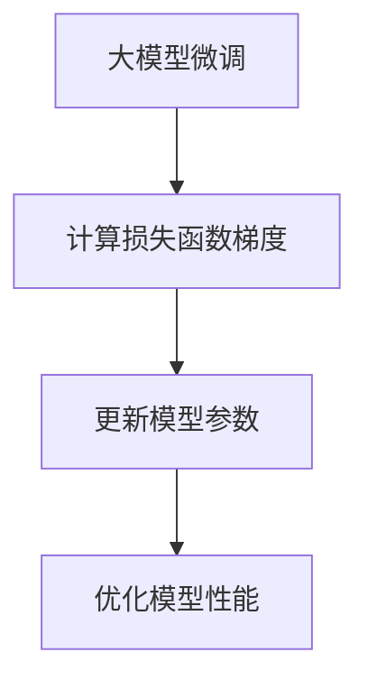
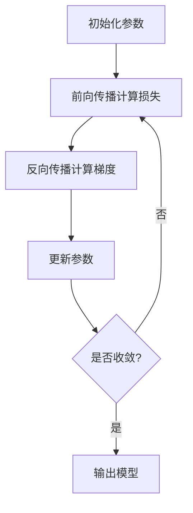

# 从零开始大模型开发与微调：梯度下降算法

## 1.背景介绍

### 1.1 大模型的兴起

近年来,大型神经网络模型在自然语言处理、计算机视觉等多个领域展现出了令人惊叹的性能表现。这些模型通常包含数十亿甚至数万亿个参数,被称为"大模型"。大模型的出现主要得益于三个关键因素:

1. 算力的飞速发展
2. 海量训练数据的积累
3. 有效训练算法的创新

### 1.2 大模型的挑战

尽管大模型取得了卓越的成绩,但训练这些庞大的模型也面临着诸多挑战:

1. 计算资源消耗巨大
2. 训练时间极长
3. 模型容易过拟合
4. 推理效率低下

为了有效解决这些问题,一种常用的技术是模型微调(Model Fine-tuning)。

## 2.核心概念与联系  

### 2.1 模型微调

模型微调是指在一个预训练的大模型基础上,使用与目标任务相关的数据进行进一步训练,以获得针对特定任务的优化模型。这种方法可以显著减少所需的计算资源和训练时间。

### 2.2 梯度下降算法

梯度下降是模型训练中最常用的优化算法之一。它通过计算模型损失函数相对于参数的梯度,并沿着梯度的反方向更新参数,从而有效地最小化损失函数。

### 2.3 两者的关系

在大模型微调过程中,梯度下降算法扮演着至关重要的角色。通过计算损失函数相对于模型参数的梯度,并沿着梯度的反方向更新参数,我们可以有效地调整预训练模型,使其更好地适应目标任务。



## 3.核心算法原理具体操作步骤

梯度下降算法的核心思想是通过迭代方式不断更新模型参数,以最小化损失函数。具体操作步骤如下:

1. 初始化模型参数
2. 前向传播计算损失函数值
3. 反向传播计算损失函数相对于每个参数的梯度
4. 根据梯度更新参数值
5. 重复步骤2-4,直到模型收敛或达到最大迭代次数



### 3.1 前向传播

前向传播是指将输入数据通过神经网络层层传递,计算最终的输出和损失函数值。对于监督学习任务,损失函数通常是输出与标签之间的差异度量。

### 3.2 反向传播

反向传播是梯度下降算法的关键步骤。它通过链式法则,从输出层开始逐层计算每个参数相对于损失函数的梯度。这个过程被称为"反向传播误差"。

### 3.3 参数更新

获得每个参数的梯度后,我们可以根据预定义的学习率,沿着梯度的反方向更新参数值:

$$\theta_{t+1} = \theta_t - \eta \frac{\partial L}{\partial \theta_t}$$

其中$\theta$是参数,$L$是损失函数,$\eta$是学习率。

### 3.4 收敛条件

在训练过程中,我们需要设置合理的停止条件,例如:

- 损失函数值小于预设阈值
- 验证集上的性能不再提升
- 达到最大迭代次数

满足任一条件时,训练过程终止,输出最终模型。

## 4.数学模型和公式详细讲解举例说明

### 4.1 损失函数

在监督学习任务中,我们需要定义一个损失函数$L$来衡量模型输出与真实标签之间的差异。常用的损失函数包括均方误差(MSE)、交叉熵损失(CE Loss)等。

对于回归任务,均方误差损失函数定义为:

$$L_{MSE}(y, \hat{y}) = \frac{1}{n}\sum_{i=1}^{n}(y_i - \hat{y}_i)^2$$

其中$y$是真实标签,$\hat{y}$是模型输出,$n$是样本数量。

对于分类任务,交叉熵损失函数定义为:

$$L_{CE}(y, p) = -\frac{1}{n}\sum_{i=1}^{n}\sum_{j=1}^{m}y_{ij}\log p_{ij}$$

其中$y$是one-hot编码的真实标签,$p$是模型输出的概率分布,$m$是类别数量。

### 4.2 梯度计算

通过链式法则,我们可以计算损失函数相对于任意参数$\theta$的梯度:

$$\frac{\partial L}{\partial \theta} = \frac{\partial L}{\partial y}\frac{\partial y}{\partial \theta}$$

其中$\frac{\partial L}{\partial y}$可以直接计算,而$\frac{\partial y}{\partial \theta}$需要通过反向传播得到。

以简单的线性回归为例:

$$y = \theta_0 + \theta_1x$$
$$L_{MSE} = \frac{1}{n}\sum_{i=1}^{n}(y_i - \hat{y}_i)^2$$

我们可以计算:

$$\frac{\partial L_{MSE}}{\partial \theta_0} = \frac{2}{n}\sum_{i=1}^{n}(\hat{y}_i - y_i)$$
$$\frac{\partial L_{MSE}}{\partial \theta_1} = \frac{2}{n}\sum_{i=1}^{n}(\hat{y}_i - y_i)x_i$$

### 4.3 参数更新

获得每个参数的梯度后,我们使用预定义的学习率$\eta$,沿着梯度的反方向更新参数值:

$$\theta_{t+1} = \theta_t - \eta \frac{\partial L}{\partial \theta_t}$$

这种基于梯度的参数更新策略被称为梯度下降(Gradient Descent)。

### 4.4 优化方法

基于梯度下降的基础上,研究人员提出了多种优化方法,如动量优化(Momentum)、RMSProp、Adam等,以加快收敛速度和提高收敛性能。

以Adam优化器为例,它对每个参数使用自适应学习率:

$$m_t = \beta_1 m_{t-1} + (1 - \beta_1)g_t$$
$$v_t = \beta_2 v_{t-1} + (1 - \beta_2)g_t^2$$
$$\hat{m}_t = \frac{m_t}{1 - \beta_1^t}$$  
$$\hat{v}_t = \frac{v_t}{1 - \beta_2^t}$$
$$\theta_{t+1} = \theta_t - \eta \frac{\hat{m}_t}{\sqrt{\hat{v}_t} + \epsilon}$$

其中$m_t$和$v_t$分别是一阶矩估计和二阶矩估计,$\beta_1$和$\beta_2$是衰减率,$\epsilon$是一个很小的数防止除零错误。

## 5.项目实践：代码实例和详细解释说明

为了更好地理解梯度下降在大模型微调中的应用,我们以一个简单的文本分类任务为例,使用Hugging Face的Transformers库对BERT模型进行微调。

### 5.1 导入所需库

```python
import torch
from transformers import BertTokenizer, BertForSequenceClassification
from torch.utils.data import DataLoader
from tqdm import tqdm
```

### 5.2 准备数据

```python
# 加载数据
train_data = [...] # 训练数据
val_data = [...] # 验证数据

# 标记化
tokenizer = BertTokenizer.from_pretrained('bert-base-uncased')
train_encodings = tokenizer(train_data.text.values.tolist(), truncation=True, padding=True)
val_encodings = tokenizer(val_data.text.values.tolist(), truncation=True, padding=True)

# 创建Dataset和DataLoader
train_dataset = MyDataset(train_encodings, train_data.label.values)
val_dataset = MyDataset(val_encodings, val_data.label.values)
train_loader = DataLoader(train_dataset, batch_size=16, shuffle=True)
val_loader = DataLoader(val_dataset, batch_size=16)
```

### 5.3 加载预训练模型

```python
model = BertForSequenceClassification.from_pretrained('bert-base-uncased', num_labels=2)
```

### 5.4 定义损失函数和优化器

```python
criterion = torch.nn.CrossEntropyLoss()
optimizer = torch.optim.AdamW(model.parameters(), lr=2e-5)
```

### 5.5 训练循环

```python
epochs = 3
for epoch in range(epochs):
    model.train()
    loop = tqdm(train_loader)
    for batch in loop:
        # 前向传播
        outputs = model(batch[0], attention_mask=batch[1], labels=batch[2])
        loss = outputs.loss
        
        # 反向传播
        loss.backward()
        
        # 梯度裁剪
        torch.nn.utils.clip_grad_norm_(model.parameters(), 1.0)
        
        # 更新参数
        optimizer.step()
        optimizer.zero_grad()
        
        loop.set_postfix(loss=loss.item())
    
    # 验证
    model.eval()
    val_acc = 0
    for batch in val_loader:
        with torch.no_grad():
            outputs = model(batch[0], attention_mask=batch[1], labels=batch[2])
        logits = outputs.logits
        predictions = torch.argmax(logits, dim=-1)
        val_acc += (predictions == batch[2]).sum().item()
    
    val_acc = val_acc / len(val_dataset)
    print(f'Epoch {epoch+1} | Val Acc: {val_acc:.4f}')
```

上述代码实现了一个标准的梯度下降训练循环,包括前向传播、反向传播、梯度裁剪和参数更新等步骤。同时,我们在每个epoch结束后对验证集进行评估,以监控模型性能。

通过这个实例,您可以更好地理解如何在实际项目中应用梯度下降算法对大模型进行微调。

## 6.实际应用场景

梯度下降算法在大模型微调中有着广泛的应用,涉及自然语言处理、计算机视觉等多个领域。以下是一些典型的应用场景:

### 6.1 自然语言处理

- 文本分类: 对新闻、评论等文本进行分类,如情感分析、主题识别等。
- 机器翻译: 对预训练的语言模型进行微调,提高翻译质量。
- 问答系统: 基于大模型构建智能问答系统,回答用户提出的各种问题。
- 文本生成: 利用大模型生成高质量的文本内容,如新闻、小说等。

### 6.2 计算机视觉

- 图像分类: 对图像进行分类,如识别物体、场景等。
- 目标检测: 在图像中定位并识别特定目标。
- 图像分割: 将图像分割为不同的语义区域。
- 图像生成: 基于大模型生成逼真的图像。

### 6.3 多模态任务

- 视觉问答: 根据图像内容回答相关的自然语言问题。
- 图文生成: 根据文本描述生成相应的图像,或根据图像生成相应的文本描述。
- 多模态融合: 将来自不同模态(如文本、图像、视频等)的信息融合,完成复杂的任务。

## 7.工具和资源推荐

在大模型开发与微调过程中,有许多优秀的工具和资源可以为您提供帮助:

### 7.1 深度学习框架

- PyTorch: 功能强大、使用灵活的深度学习框架,提供了丰富的模型和优化器。
- TensorFlow: 另一个广泛使用的深度学习框架,具有良好的可扩展性和部署能力。
- Jax: 基于XLA编译器的高性能NumPy库,适合于研究和实验。

### 7.2 预训练模型库

- Hugging Face Transformers: 提供了多种预训练的Transformer模型,如BERT、GPT、ViT等,并支持多种下游任务的微调。
- PyTorch Image Models (PyTorch-Image-Models): 包含多种计算机视觉预训练模型,如ResNet、EfficientNet等。

### 7.3 数据集

- GLUE Benchmark: 自然语言理解任务的基准数据集集合。
- ImageNet: 计算机视觉领域最著名的图像分类数据