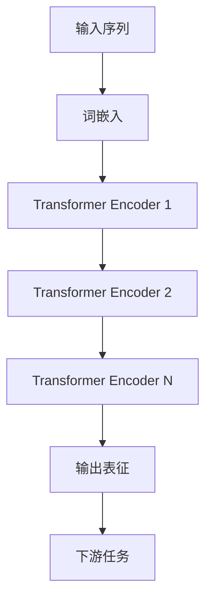

# 从零开始大模型开发与微调：站在巨人肩膀上的预训练模型BERT

## 1. 背景介绍

近年来,随着深度学习的蓬勃发展,自然语言处理(NLP)领域也取得了巨大的进步。而其中最具代表性和影响力的突破之一,就是预训练语言模型(Pre-trained Language Model)的诞生。从2018年Google推出的BERT(Bidirectional Encoder Representations from Transformers)开始,预训练模型引领了NLP的新浪潮,在各大NLP任务上不断刷新性能记录,成为当前NLP技术的主流范式。

### 1.1 预训练语言模型的崛起

传统的NLP模型大多采用监督学习的方式,在特定任务的标注数据集上进行训练,模型学习到的知识很难迁移到其他任务中。而预训练语言模型则是先在大规模无标注语料上进行自监督学习,学习通用的语言表征,再针对下游任务进行微调。这种"预训练+微调"的范式极大地提高了模型的泛化能力和数据利用效率。

### 1.2 BERT的革命性影响

BERT作为预训练语言模型的代表作,引入了多项创新:

- 采用Transformer的双向编码结构,克服了传统单向语言模型的局限性,可以更好地建模语境信息。
- 提出了Masked Language Model和Next Sentence Prediction两种预训练任务,让模型学习到更加丰富的语言知识。
- 在大规模语料(Wikipedia+BookCorpus)上进行预训练,并开源了模型权重,极大降低了训练成本。

BERT一经推出便在11项NLP任务上创下最佳性能,掀起了预训练模型的研究热潮。此后,各种基于BERT改进的模型如RoBERTa、ALBERT、ELECTRA等不断涌现,进一步推动了NLP技术的发展。

### 1.3 BERT在工业界的广泛应用

得益于其强大的语言理解能力,BERT在工业界得到了广泛应用,覆盖了搜索、问答、对话、文本分类、命名实体识别等各大场景。许多科技巨头都开发了基于BERT的落地系统,如Google的搜索算法BERT、微软的对话系统DialoGPT等。BERT已经成为NLP领域的基础设施,在推动人工智能产业化方面发挥着关键作用。

## 2. 核心概念与联系

要理解BERT的工作原理,首先需要了解其背后的一些核心概念。

### 2.1 Transformer 

Transformer是BERT的核心组件,最早由Google于2017年提出,是一种基于自注意力机制(Self-Attention)的序列建模架构。与传统的RNN、CNN等结构相比,Transformer具有以下优势:

- 并行计算能力强,训练速度快
- 可以建模长距离依赖关系
- 可解释性好

Transformer包含编码器(Encoder)和解码器(Decoder)两部分,BERT只使用了编码器部分进行双向建模。

### 2.2 自注意力机制

自注意力机制是Transformer的核心,用于捕捉序列内部的依赖关系。对于序列中的每个位置,通过注意力计算来聚合其他位置的信息,得到该位置的上下文表征。具体来说,自注意力分为以下几个步骤:

1. 将输入序列映射为三个矩阵:Query、Key、Value 
2. 计算Query和Key的点积并归一化,得到注意力分布
3. 将注意力分布与Value相乘,得到加权求和的上下文表征
4. 将上下文表征与原始输入相加,并经过前馈神经网络,得到最终的输出表征

通过堆叠多层自注意力模块,Transformer可以建模复杂的语义关系。

### 2.3 预训练任务

BERT采用了两种预训练任务来学习通用语言知识:

- Masked Language Model(MLM):随机遮挡部分词,并让模型根据上下文预测被遮挡的词。这使得BERT能够学习到丰富的语义信息。
- Next Sentence Prediction(NSP):给定两个句子,让模型判断它们是否前后相邻。这使得BERT能够学习到句间关系。

通过在大规模语料上进行这两种自监督学习,BERT可以学习到高质量的语言表征,为下游任务提供良好的初始化。

### 2.4 微调

微调(Fine-tuning)是利用预训练模型解决下游任务的关键。具体来说,就是在预训练好的BERT上添加任务特定的输出层,并在下游任务的标注数据上进行端到端的训练。由于BERT已经学习到了通用语言知识,因此微调通常只需少量数据和训练步数即可取得不错的效果。

微调使得BERT可以灵活地应用于各种NLP任务,极大地提高了模型的实用性。同时,微调也大大降低了NLP系统的开发成本。

## 3. 核心算法原理与具体操作步骤

接下来,我们详细介绍BERT的算法原理和训练流程。

### 3.1 模型结构

BERT的整体结构如下图所示:



可以看到,BERT的主体是一个多层的Transformer编码器。输入序列经过词嵌入后,通过N个编码器层逐层编码,最后输出每个位置的表征向量。这些表征向量可以用于各种下游任务。

其中,每个编码器层包含两个子层:

1. 多头自注意力(Multi-Head Self-Attention):将自注意力计算多次,并将结果拼接,增强模型的表达能力。
2. 前馈神经网络(Feed-Forward Network):两层全连接网络,用于非线性变换。

此外,BERT还采用了残差连接(Residual Connection)和层归一化(Layer Normalization)来加速训练和提高泛化性能。

### 3.2 输入表示

BERT的输入是一个token序列,每个token可以是单词、子词或特殊符号。为了区分不同的句子和位置,BERT在输入中加入了特殊的标记:

- [CLS]:序列的起始标记,其最终表征可用于分类等任务
- [SEP]:句子的分隔标记
- 位置嵌入(Position Embedding):表示每个token在序列中的位置信息

BERT将token嵌入、段嵌入(Segment Embedding)和位置嵌入相加,得到最终的输入表示。

### 3.3 预训练

BERT的预训练分为两个阶段:

1. 在无标注语料上进行MLM和NSP任务的预训练
2. 在下游任务的标注数据上进行微调

在第一阶段,BERT随机遮挡一定比例(通常为15%)的token,并让模型根据上下文预测这些token。同时,BERT还随机取两个句子,让模型判断它们是否相邻。这两个任务使得BERT能够学习到词级和句子级的语言知识。

具体的训练流程如下:

```
For each batch:
    1. 随机遮挡15%的token,用[MASK]替换
    2. 将遮挡位置的token作为目标,计算MLM损失
    3. 随机取两个句子,计算NSP损失
    4. 将MLM和NSP损失相加,并进行反向传播和参数更新
```

通过大规模的预训练,BERT可以学习到高质量的语言表征。Google在Wikipedia和BookCorpus语料上训练BERT长达40天,使用了64个TPU,可见其计算开销之大。

### 3.4 微调

在预训练完成后,BERT可以应用于各种下游任务。以文本分类任务为例,微调的流程如下:

```
1. 在BERT顶层添加分类器(通常为一层全连接网络)
2. 将任务的标注数据转换为BERT的输入格式
3. 端到端地在标注数据上训练整个模型
4. 使用微调后的模型对测试集进行预测
```

微调通常只需要较少的数据和训练步数,即可在下游任务上取得不错的效果。这归功于BERT强大的语言理解能力和迁移学习能力。

## 4. 数学模型和公式详细讲解

BERT的核心是自注意力机制和Transformer结构。下面我们用数学公式来详细说明其计算过程。

### 4.1 自注意力计算

假设我们有一个长度为$n$的输入序列$X \in \mathbb{R}^{n \times d}$,其中$d$为嵌入维度。自注意力的计算步骤如下:

1. 将$X$乘以三个权重矩阵$W_q, W_k, W_v \in \mathbb{R}^{d \times d_k}$,得到Query、Key、Value矩阵:

$$
\begin{aligned}
Q &= XW_q \\
K &= XW_k \\
V &= XW_v
\end{aligned}
$$

2. 计算$Q$和$K$的点积并除以$\sqrt{d_k}$,得到注意力分布:

$$
A = \text{softmax}(\frac{QK^T}{\sqrt{d_k}})
$$

其中,$A \in \mathbb{R}^{n \times n}$表示每个位置对其他位置的注意力权重。

3. 将$A$与$V$相乘,得到加权求和的上下文表征:

$$
C = AV
$$

其中,$C \in \mathbb{R}^{n \times d_k}$表示每个位置的上下文信息。

4. 将$C$乘以输出权重矩阵$W_o \in \mathbb{R}^{d_k \times d}$,并与原始输入$X$相加,得到最终的输出表征:

$$
O = CW_o + X
$$

以上就是自注意力的完整计算过程。直观地说,自注意力通过Query和Key的相似度计算来确定每个位置对其他位置的关注程度,并根据Value进行加权求和,从而捕捉序列内部的依赖关系。

### 4.2 多头自注意力

为了增强表达能力,Transformer采用了多头自注意力(Multi-Head Self-Attention)。具体来说,就是将$Q、K、V$划分为$h$个子空间(Head),分别进行自注意力计算,再将结果拼接起来:

$$
\begin{aligned}
Q_i &= XW_{q_i}, \quad K_i = XW_{k_i}, \quad V_i = XW_{v_i} \\
C_i &= \text{Attention}(Q_i, K_i, V_i) \\
O &= [C_1; C_2; ...; C_h]W_o
\end{aligned}
$$

其中,$W_{q_i}, W_{k_i}, W_{v_i} \in \mathbb{R}^{d \times d_k}, W_o \in \mathbb{R}^{hd_k \times d}$,$[;]$表示拼接操作。

多头自注意力允许模型在不同的子空间中学习不同的注意力模式,从而提高了建模能力。

### 4.3 前馈网络

除了自注意力子层,Transformer编码器还包含一个前馈网络子层。前馈网络由两层全连接网络组成,用于对特征进行非线性变换:

$$
\text{FFN}(x) = \text{ReLU}(xW_1 + b_1)W_2 + b_2
$$

其中$W_1 \in \mathbb{R}^{d \times d_{ff}}, b_1 \in \mathbb{R}^{d_{ff}}, W_2 \in \mathbb{R}^{d_{ff} \times d}, b_2 \in \mathbb{R}^d$为可学习参数,$d_{ff}$为隐藏层维度(通常设为$4d$)。

前馈网络可以看作是对自注意力表征的进一步增强,使得模型能够学习到更加抽象和高层次的特征。

### 4.4 层归一化和残差连接

为了加速训练和提高泛化性能,Transformer还采用了层归一化(Layer Normalization)和残差连接(Residual Connection)。

层归一化对每一层的输出进行归一化,使其均值为0、方差为1:

$$
\text{LayerNorm}(x) = \frac{x-\mu}{\sqrt{\sigma^2+\epsilon}} * \gamma + \beta
$$

其中$\mu,\sigma^2$为$x$的均值和方差,$\gamma,\beta$为可学习的缩放和偏移参数。

残差连接将每一层的输入与输