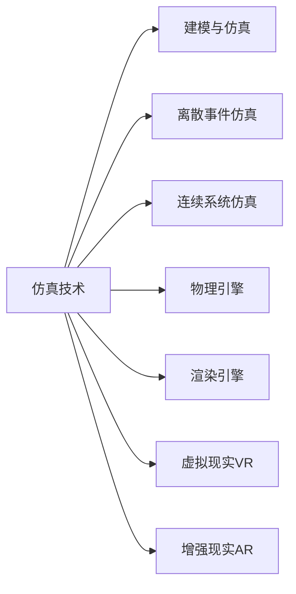

# 仿真技术：模拟现实的未来

## 1. 背景介绍
### 1.1 仿真技术的定义
仿真技术是利用计算机软硬件资源,对实际系统或过程进行建模和模拟,从而研究其行为和性能的一门技术。它通过创建虚拟环境来模拟真实世界中的各种场景,以预测、分析和优化系统的运行状况。

### 1.2 仿真技术的发展历程
仿真技术的发展可以追溯到20世纪40年代,最初主要应用于军事领域。随着计算机技术的不断进步,仿真技术逐渐扩展到航空航天、制造业、医疗、教育等众多领域。近年来,随着虚拟现实(VR)、增强现实(AR)等技术的兴起,仿真技术迎来了新的发展机遇。

### 1.3 仿真技术的重要性
仿真技术在现代社会中扮演着越来越重要的角色。它可以帮助我们在虚拟环境中测试和优化各种设计方案,降低成本和风险;可以用于培训和教育,提高学习效率;还可以应用于娱乐和游戏领域,带来身临其境的体验。随着技术的不断发展,仿真技术必将在更多领域发挥重要作用。

## 2. 核心概念与联系
### 2.1 建模与仿真
- 建模:根据实际系统或过程,建立相应的数学模型或计算机模型的过程。
- 仿真:利用已建立的模型,在计算机上进行模拟试验,研究系统行为的过程。

### 2.2 离散事件仿真与连续系统仿真
- 离散事件仿真:针对离散事件系统(如排队系统、生产线等)进行建模和仿真。
- 连续系统仿真:针对连续变化的系统(如飞行器、化工过程等)进行建模和仿真。

### 2.3 物理引擎与渲染引擎
- 物理引擎:模拟虚拟环境中物体的物理属性和相互作用,如重力、碰撞等。
- 渲染引擎:将虚拟场景渲染成逼真的图像或视频,提供沉浸式体验。

### 2.4 虚拟现实与增强现实
- 虚拟现实(VR):通过计算机生成的交互式三维环境,提供沉浸式体验。
- 增强现实(AR):将虚拟信息叠加到真实环境中,增强用户的感知和交互能力。

下图展示了仿真技术的核心概念及其相互关系:



## 3. 核心算法原理具体操作步骤
### 3.1 建模过程
1. 问题定义:明确仿真目标,确定系统边界和关键要素。
2. 概念模型构建:抽象系统,确定组成部分及其相互关系。
3. 数学模型构建:根据概念模型,建立数学方程或逻辑关系。
4. 计算机模型实现:利用编程语言将数学模型转化为计算机程序。
5. 验证与确认:检验模型是否正确反映了实际系统。

### 3.2 离散事件仿真算法
1. 事件调度:根据事件发生的时间顺序,依次处理事件。
2. 时钟推进:更新系统时钟,推进到下一个事件发生的时刻。
3. 状态转移:根据事件类型,更新系统状态变量。
4. 统计数据收集:记录关键性能指标,如等待时间、利用率等。
5. 结果分析:对仿真结果进行统计分析,得出结论和改进建议。

### 3.3 物理引擎中的碰撞检测
1. 粗略检测:使用包围盒等方法快速筛选出可能发生碰撞的物体对。
2. 精确检测:对筛选出的物体对进行精确的几何碰撞检测。
3. 碰撞响应:根据碰撞检测结果,计算碰撞冲量并更新物体的速度和位置。
4. 约束求解:处理物体间的约束关系,如铰链、绳索等。
5. 刚体动力学积分:根据受力情况,积分计算物体的运动状态。

## 4. 数学模型和公式详细讲解举例说明
### 4.1 离散事件仿真中的排队论模型
以下是一个 M/M/1 排队模型的数学描述:

- 顾客到达服从泊松分布,到达率为 $\lambda$
- 服务时间服从指数分布,服务率为 $\mu$
- 系统容量无限,排队规则为 FCFS(先到先服务)

该系统的状态转移方程为:

$$
\begin{aligned}
\frac{dp_0(t)}{dt} &= -\lambda p_0(t) + \mu p_1(t) \\
\frac{dp_n(t)}{dt} &= \lambda p_{n-1}(t) - (\lambda+\mu)p_n(t) + \mu p_{n+1}(t), \quad n\geq1
\end{aligned}
$$

其中,$p_n(t)$表示 $t$ 时刻系统中有 $n$ 个顾客的概率。

在稳态条件下,各状态概率为:

$$
p_n = (1-\rho)\rho^n, \quad n\geq0
$$

其中,$\rho=\frac{\lambda}{\mu}$为服务强度。

系统的平均队长 $L_s$ 和平均逗留时间 $W_s$ 分别为:

$$
L_s = \frac{\rho}{1-\rho}, \quad W_s = \frac{1}{\mu-\lambda}
$$

### 4.2 物理引擎中的刚体动力学方程
考虑一个质量为 $m$,转动惯量为 $\mathbf{I}$ 的刚体,其运动方程为:

$$
\begin{aligned}
m\frac{d\mathbf{v}}{dt} &= \mathbf{F} \\
\mathbf{I}\frac{d\boldsymbol{\omega}}{dt} &= \boldsymbol{\tau}
\end{aligned}
$$

其中,$\mathbf{v}$为刚体质心的速度,$\mathbf{F}$为作用在刚体上的合外力; $\boldsymbol{\omega}$为刚体的角速度,$\boldsymbol{\tau}$为作用在刚体上的合外力矩。

求解上述微分方程,可以得到刚体任意时刻的位置和姿态。常用的数值积分方法有欧拉法、龙格-库塔法等。以欧拉法为例,刚体的位置 $\mathbf{x}$ 和姿态四元数 $\mathbf{q}$ 的更新公式为:

$$
\begin{aligned}
\mathbf{x}_{t+\Delta t} &= \mathbf{x}_t + \mathbf{v}_t\Delta t \\
\mathbf{q}_{t+\Delta t} &= \mathbf{q}_t + \frac{1}{2}\mathbf{q}_t\otimes\begin{bmatrix}0\\\boldsymbol{\omega}_t\end{bmatrix}\Delta t
\end{aligned}
$$

其中,$\Delta t$为时间步长,$\otimes$为四元数乘法。

## 5. 项目实践：代码实例和详细解释说明
下面是一个使用Python实现的简单M/M/1排队系统仿真的示例代码:

```python
import numpy as np

class MM1Queue:
    def __init__(self, lam, mu):
        self.lam = lam  # 到达率
        self.mu = mu    # 服务率
        self.t = 0      # 当前时间
        self.n = 0      # 系统中的顾客数
        self.arrivals = []  # 到达事件列表
        self.departures = []  # 离开事件列表
    
    def generate_arrival(self):
        t = self.t + np.random.exponential(1/self.lam)
        self.arrivals.append(t)
    
    def generate_departure(self):
        t = self.t + np.random.exponential(1/self.mu)
        self.departures.append(t)
    
    def run(self, T):
        self.generate_arrival()  # 生成第一个顾客到达事件
        
        while self.t < T:
            if self.arrivals[0] < self.departures[0]:
                self.t = self.arrivals.pop(0)
                self.n += 1
                self.generate_arrival()
                if self.n == 1:
                    self.generate_departure()
            else:
                self.t = self.departures.pop(0)
                self.n -= 1
                if self.n > 0:
                    self.generate_departure()
        
        return self.n
    
if __name__ == '__main__':
    lam, mu = 0.8, 1.0
    T = 1000
    q = MM1Queue(lam, mu)
    n = q.run(T)
    print(f"Time {T}: {n} customers in system")
```

代码解释:

1. 定义了一个`MM1Queue`类,表示M/M/1排队系统。构造函数接受到达率`lam`和服务率`mu`作为参数。
2. `generate_arrival`和`generate_departure`方法分别生成下一个顾客到达和离开事件的时间,并将其加入相应的事件列表。
3. `run`方法模拟系统运行过程。它比较最早的到达事件和离开事件,将时间推进到较早的事件,并更新系统状态。
4. 在主程序中,设置到达率为0.8,服务率为1.0,模拟时间为1000。创建一个`MM1Queue`对象,调用`run`方法进行仿真,并输出结束时系统中的顾客数。

运行该程序,可以得到类似如下的输出结果:

```
Time 1000: 3 customers in system
```

表示在时刻1000时,系统中有3个顾客。

## 6. 实际应用场景
仿真技术在各行各业中都有广泛的应用,下面列举几个典型场景:

### 6.1 航空航天
- 飞行模拟器:训练飞行员,测试新型飞行器设计。
- 航天器设计:模拟航天器在太空环境中的运动和状态。

### 6.2 制造业
- 生产线优化:模拟不同的生产调度方案,寻找最优策略。
- 虚拟装配:在虚拟环境中验证产品设计和装配过程。

### 6.3 交通运输
- 交通流仿真:研究交通网络的拥堵情况,优化交通管理策略。
- 自动驾驶仿真:测试无人驾驶汽车的算法和性能。

### 6.4 医疗保健
- 手术模拟:医学生使用虚拟现实设备进行手术训练。
- 药物研发:模拟药物在人体内的代谢和作用过程。

### 6.5 教育培训
- 虚拟实验室:学生在虚拟环境中进行各种实验操作。
- 安全培训:模拟危险场景,训练人们的应急处置能力。

### 6.6 游戏娱乐
- 电子游戏:利用物理引擎和渲染技术,创造逼真的游戏场景。
- 虚拟旅游:在虚拟现实中体验各地的风土人情。

## 7. 工具和资源推荐
### 7.1 建模与仿真软件
- MATLAB/Simulink:提供了丰富的建模和仿真工具箱。
- AnyLogic:支持多种建模范式,如系统动力学、离散事件等。
- Arena:专业的离散事件仿真软件,广泛用于生产制造领域。

### 7.2 物理引擎
- PhysX:由NVIDIA开发,被众多游戏和仿真软件采用。
- Havok:由微软收购,提供了强大的物理模拟功能。
- Bullet:开源物理引擎,支持多种编程语言接口。

### 7.3 虚拟现实/增强现实开发平台
- Unity:知名的游戏开发引擎,提供了VR/AR开发工具。
- Unreal Engine:虚幻引擎,被广泛用于高端VR/AR内容制作。
- ARKit/ARCore:苹果和谷歌推出的移动AR开发工具包。

### 7.4 在线教程和课程
- Coursera - Simulation and modeling of natural processes
- edX - Simulation Neuroscience
- Udemy - Discrete Event Simulation Modeling

### 7.5 学术会议和期刊