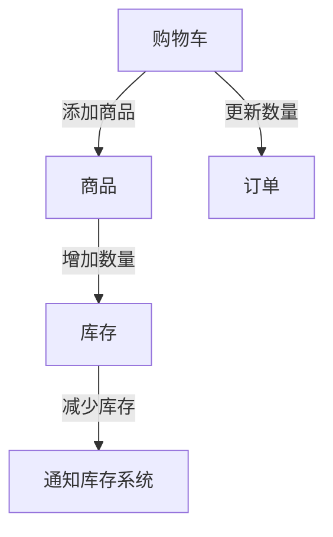

                 

作者：禅与计算机程序设计艺术

在电子商务的世界里，构建一个高效且用户友好的系统是关键。领域驱动设计(Domain-driven Design, DDD) 是一种帮助团队开发复杂系统的软件工程方法论，特别适合处理像电商这种业务逻辑复杂的场景。本文旨在详细介绍如何利用DDD原则设计电商系统，包括理论基础、核心算法应用、案例分析以及未来的趋势预测。

## 1. 背景介绍
随着互联网的发展，电子商务已经成为全球经济的重要组成部分。然而，电商平台往往面临着高并发访问量、复杂业务流程管理、个性化需求多样化等一系列挑战。面对这些复杂性，传统的软件设计方法可能难以适应，而DDD提供了针对此类问题的独特解决方案。

## 2. 核心概念与联系
### **域模型** (Domain Model)
域模型是DDD的核心，它基于业务逻辑的抽象层次构建，涵盖了业务的所有关键方面。在电商系统中，这包括商品管理、订单处理、库存控制、支付结算等多个模块。

### **边界上下文** (Boundary Contexts)
不同团队或部门之间可能存在不同的视角和关注点。边界上下文描述了如何将域模型与其他外部系统交互，例如前端UI、API接口、数据库等。

### **聚合根** (Aggregate Roots)
聚合根负责协调多个实体之间的行为，确保一致性。例如，在电商系统中，购物车可以被视为一个聚合根，因为它包含了所有与单个客户购物相关的操作。

### **值对象** (Value Objects)
值对象用于封装不可变的数据，其值本身具有意义。在电商系统中，产品规格、价格历史等都是典型的应用场景。

## 3. 核心算法原理与具体操作步骤
### **事件风暴** (Event Storming)
通过聚合作家、利益相关方等一起探讨系统事件，识别出系统的功能边界和关键事件流，从而构建初始的领域模型。

### **领域服务** (Domain Services)
定义一组服务于整个应用范围内的通用业务逻辑，如计算折扣、验证地址有效性等。

### **服务层架构** (Service Layer Architecture)
将业务逻辑从数据访问层分离出来，提高代码重用性和可测试性。

## 4. 数学模型和公式详细讲解与举例说明
尽管在DDD中，我们更多地依赖于业务逻辑而非传统算法，但数学模型有时可以在建模某些特定情况时起到辅助作用。例如，对于库存管理，可以使用简单的供需平衡方程式来预测库存水平。

## 5. 项目实践：代码实例与详细解释
以购物车聚合根为例，展示如何设计实现，包括添加/删除商品、更新数量等操作，同时保证状态的一致性。

## 6. 实际应用场景
### **个性化推荐**
根据用户的购买历史和浏览记录，使用机器学习算法生成个性化的商品推荐列表。

### **实时库存管理**
通过集成库存系统，实现实时库存更新，避免超卖或缺货的情况发生。

## 7. 工具和资源推荐
### **Model Driven Architecture (MDA)**
用于自动化模型转换为源代码的工具，如Papyrus for UML。

### **DDD Frameworks**
如Spring Domain-Driven Design框架，提供支持DDD实践的库和约定。

## 8. 总结：未来发展趋势与挑战
随着技术的进步和市场的需求变化，电商系统的设计需要持续迭代。未来，我们可以期待更加智能的推荐系统、更强大的实时数据分析能力以及对隐私保护的更高要求。挑战在于如何在提升用户体验的同时，保持系统性能和成本的有效平衡。

## 9. 附录：常见问题与解答
### Q&A:
#### 如何处理系统中的不确定性？
- 使用事件和命令来捕获和响应不确定性的来源，并通过领域模型进行事件风暴会议来明确这些事件的含义。

#### 基于DDD设计的系统是否容易维护？
- 通过清晰的界限、复用的服务层和事件驱动的架构，使得系统易于理解和维护。

---

以上就是使用DDD设计电商系统的一个全面指南，希望这篇博客能够帮助开发者们更好地理解并运用这一先进的设计模式。在实践中不断探索和完善，您将会发现，DDD不仅是一种设计理念，更是实现复杂系统优雅、健壮的基础。

作者：禅与计算机程序设计艺术 / Zen and the Art of Computer Programming

