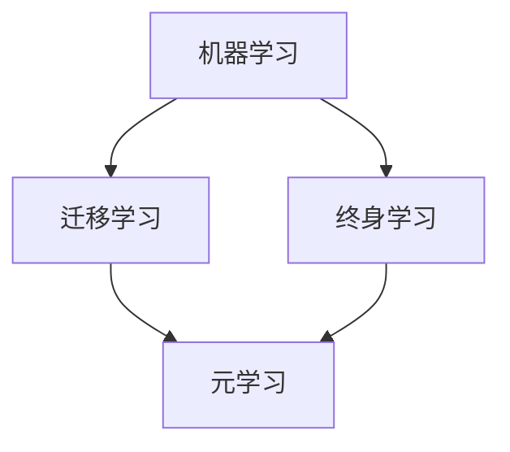

# 元学习 (Meta Learning) 原理与代码实例讲解

## 1.背景介绍

### 1.1 元学习的定义与起源

元学习(Meta Learning)是机器学习领域的一个重要分支,其目标是让机器学习算法能够快速适应新的任务和环境。与传统的机器学习方法不同,元学习不是直接学习如何解决特定问题,而是学习如何学习,即学习学习算法本身。元学习的概念最早由 Jurgen Schmidhuber 在1987年提出,他认为机器学习系统应该具备自我改进的能力,通过学习如何学习来不断提升性能。

### 1.2 元学习的研究意义

元学习的研究对于推动机器学习的发展具有重要意义:

1. 提高学习效率:通过学习如何学习,元学习可以大大提高机器学习算法在新任务上的学习效率,减少所需的训练样本数量。

2. 增强泛化能力:元学习得到的学习算法通常具有更好的泛化能力,能够适应不同的任务和环境。

3. 实现少样本学习:在现实应用中,很多任务的训练样本非常有限,元学习为解决少样本学习问题提供了新的思路。

4. 探索机器学习的本质:元学习对学习过程进行建模,有助于我们更好地理解机器学习的内在机制。

### 1.3 元学习的应用领域

元学习已经在多个领域得到了广泛应用,主要包括:

1. 计算机视觉:如小样本图像分类、单次学习(one-shot learning)等。

2. 自然语言处理:如少样本文本分类、跨语言学习等。

3. 强化学习:如快速适应环境变化、提高探索效率等。

4. 机器人控制:如快速适应不同任务、提高鲁棒性等。

## 2.核心概念与联系

### 2.1 元学习的分类

根据学习范式的不同,元学习可以分为以下三类:

1. 基于度量的元学习(Metric-based Meta Learning):通过学习任务之间的相似性度量,实现对新任务的快速适应。代表算法包括 Siamese Networks、Matching Networks、Prototypical Networks 等。

2. 基于优化的元学习(Optimization-based Meta Learning):通过学习优化算法本身的参数,实现对新任务的快速优化。代表算法包括 MAML、Reptile、Meta-SGD 等。

3. 基于模型的元学习(Model-based Meta Learning):通过学习任务之间的共享模型,实现对新任务的快速建模。代表算法包括 SNAIL、MetaNetworks 等。

### 2.2 元学习与迁移学习、终身学习的关系

元学习与迁移学习、终身学习有着密切的联系:

1. 迁移学习(Transfer Learning):旨在将已学习的知识迁移到新的任务中,提高新任务的学习效率。元学习可以看作是一种特殊的迁移学习,它不仅迁移知识,还迁移学习算法本身。

2. 终身学习(Lifelong Learning):旨在让机器持续学习,不断积累和利用过去的知识来解决新的问题。元学习通过学习如何学习,使得机器能够更高效地进行终身学习。

下图展示了元学习、迁移学习和终身学习三者之间的关系:



## 3.核心算法原理具体操作步骤

下面我们以 MAML(Model-Agnostic Meta-Learning)算法为例,详细介绍元学习的核心算法原理和操作步骤。

### 3.1 MAML 算法原理

MAML 的核心思想是学习一个好的初始化参数,使得模型能够在少量梯度步骤内快速适应新任务。具体来说,MAML 分为两个阶段:

1. 元训练阶段(Meta-Training):在一系列训练任务上,通过二次梯度优化来学习模型的初始化参数。

2. 元测试阶段(Meta-Testing):在新的测试任务上,使用元训练阶段学到的初始化参数,经过少量梯度步骤进行微调,得到适应新任务的模型。

### 3.2 MAML 算法步骤

MAML 的具体算法步骤如下:

1. 输入:一组训练任务 $\{\mathcal{T}_i\}$,每个任务包含支持集 $\mathcal{D}^{tr}_i$ 和查询集 $\mathcal{D}^{ts}_i$;学习率 $\alpha$,$\beta$;迭代次数 $T$。

2. 随机初始化模型参数 $\theta$。

3. 对于每个迭代步 $t=1,2,...,T$:
   
   3.1 对于每个训练任务 $\mathcal{T}_i$:
      
      3.1.1 在支持集 $\mathcal{D}^{tr}_i$ 上计算损失 $\mathcal{L}_{\mathcal{T}_i}(f_\theta)$。
      
      3.1.2 计算梯度 $\nabla_\theta \mathcal{L}_{\mathcal{T}_i}(f_\theta)$,并更新参数:$\theta'_i=\theta-\alpha \nabla_\theta \mathcal{L}_{\mathcal{T}_i}(f_\theta)$。
      
      3.1.3 在查询集 $\mathcal{D}^{ts}_i$ 上计算更新后参数的损失 $\mathcal{L}_{\mathcal{T}_i}(f_{\theta'_i})$。
   
   3.2 计算元梯度:$\nabla_\theta \sum_{\mathcal{T}_i \sim p(\mathcal{T})} \mathcal{L}_{\mathcal{T}_i}(f_{\theta'_i})$。
   
   3.3 更新初始参数:$\theta \leftarrow \theta - \beta \nabla_\theta \sum_{\mathcal{T}_i \sim p(\mathcal{T})} \mathcal{L}_{\mathcal{T}_i}(f_{\theta'_i})$。

4. 输出:学习到的初始化参数 $\theta$。

在元测试阶段,对于新任务 $\mathcal{T}_{new}$,使用学习到的初始化参数 $\theta$,在支持集上进行少量梯度步骤微调,得到适应新任务的模型参数 $\theta'_{new}$。

## 4.数学模型和公式详细讲解举例说明

为了更好地理解 MAML 的数学原理,下面我们对其中的关键公式进行详细讲解。

### 4.1 任务分布与损失函数

我们假设任务服从一个分布 $p(\mathcal{T})$,每个任务 $\mathcal{T}_i$ 包含一个支持集 $\mathcal{D}^{tr}_i$ 和一个查询集 $\mathcal{D}^{ts}_i$。我们的目标是学习一个模型 $f_\theta$,使其能够在支持集上快速适应,并在查询集上取得良好性能。

对于任务 $\mathcal{T}_i$,我们定义其损失函数为:

$$
\mathcal{L}_{\mathcal{T}_i}(f_\theta) = \mathbb{E}_{(x,y) \sim \mathcal{D}^{tr}_i} [\ell(f_\theta(x), y)]
$$

其中 $\ell(\cdot,\cdot)$ 是一个预定义的损失函数,如交叉熵损失等。

### 4.2 内循环更新

在 MAML 的元训练阶段,对于每个任务 $\mathcal{T}_i$,我们首先在支持集 $\mathcal{D}^{tr}_i$ 上计算梯度,并更新模型参数:

$$
\theta'_i = \theta - \alpha \nabla_\theta \mathcal{L}_{\mathcal{T}_i}(f_\theta)
$$

这一步称为内循环更新(Inner Loop Update),目的是在支持集上对模型进行快速适应。$\alpha$ 是内循环学习率。

### 4.3 外循环更新

在内循环更新之后,我们在查询集 $\mathcal{D}^{ts}_i$ 上计算更新后参数的损失:

$$
\mathcal{L}_{\mathcal{T}_i}(f_{\theta'_i}) = \mathbb{E}_{(x,y) \sim \mathcal{D}^{ts}_i} [\ell(f_{\theta'_i}(x), y)]
$$

然后,我们计算所有任务的损失之和,并对初始参数 $\theta$ 求梯度:

$$
\nabla_\theta \sum_{\mathcal{T}_i \sim p(\mathcal{T})} \mathcal{L}_{\mathcal{T}_i}(f_{\theta'_i})
$$

这一步称为外循环更新(Outer Loop Update),目的是优化初始参数 $\theta$,使其能够快速适应不同的任务。最后,我们使用梯度下降法更新初始参数:

$$
\theta \leftarrow \theta - \beta \nabla_\theta \sum_{\mathcal{T}_i \sim p(\mathcal{T})} \mathcal{L}_{\mathcal{T}_i}(f_{\theta'_i})
$$

其中 $\beta$ 是外循环学习率。

通过不断迭代内循环更新和外循环更新,MAML 最终学习到一个好的初始化参数 $\theta$,使得模型能够在新任务上快速适应。

## 5.项目实践：代码实例和详细解释说明

下面我们通过一个简单的代码实例,演示如何使用 PyTorch 实现 MAML 算法。

### 5.1 导入必要的库

```python
import torch
import torch.nn as nn
import torch.optim as optim
import numpy as np
```

### 5.2 定义模型架构

我们使用一个简单的前馈神经网络作为基础模型:

```python
class Net(nn.Module):
    def __init__(self, input_size, hidden_size, output_size):
        super(Net, self).__init__()
        self.fc1 = nn.Linear(input_size, hidden_size)
        self.relu = nn.ReLU()
        self.fc2 = nn.Linear(hidden_size, output_size)

    def forward(self, x):
        x = self.fc1(x)
        x = self.relu(x)
        x = self.fc2(x)
        return x
```

### 5.3 定义 MAML 算法

我们定义一个 `MAML` 类,实现元训练和元测试过程:

```python
class MAML:
    def __init__(self, model, inner_lr, outer_lr, inner_steps):
        self.model = model
        self.inner_lr = inner_lr
        self.outer_lr = outer_lr
        self.inner_steps = inner_steps

    def meta_train(self, tasks, num_iterations):
        optimizer = optim.Adam(self.model.parameters(), lr=self.outer_lr)
        for _ in range(num_iterations):
            meta_loss = 0
            for task in tasks:
                support_data, support_labels, query_data, query_labels = task
                inner_model = copy.deepcopy(self.model)
                for _ in range(self.inner_steps):
                    support_loss = nn.functional.cross_entropy(inner_model(support_data), support_labels)
                    inner_model.zero_grad()
                    support_loss.backward()
                    with torch.no_grad():
                        for param in inner_model.parameters():
                            param -= self.inner_lr * param.grad
                query_loss = nn.functional.cross_entropy(inner_model(query_data), query_labels)
                meta_loss += query_loss
            meta_loss /= len(tasks)
            optimizer.zero_grad()
            meta_loss.backward()
            optimizer.step()

    def meta_test(self, support_data, support_labels, query_data):
        inner_model = copy.deepcopy(self.model)
        for _ in range(self.inner_steps):
            support_loss = nn.functional.cross_entropy(inner_model(support_data), support_labels)
            inner_model.zero_grad()
            support_loss.backward()
            with torch.no_grad():
                for param in inner_model.parameters():
                    param -= self.inner_lr * param.grad
        query_logits = inner_model(query_data)
        return query_logits
```

在 `meta_train` 方法中,我们对每个任务进行内循环更新,计算查询集损失,并对所有任务的损失求平均得到元损失。然后,我们对元损失进行反向传播,更新初始参数。

在 `meta_test` 方法中,我们在支持集上对模型进行内循环更新,然后在查询集上进行预测。

### 5.4 生成任务数据

为了简单起见,我们随机生成一些任务数据:

```python
def generate_tasks(num_tasks, num_samples, input_size, output_size):
    tasks = []
    for _ in range(num_tasks):
        data = torch.randn(num_samples * 2, input_size)
        labels = torch.randint(output_size, size=(num_samples * 2,))
        