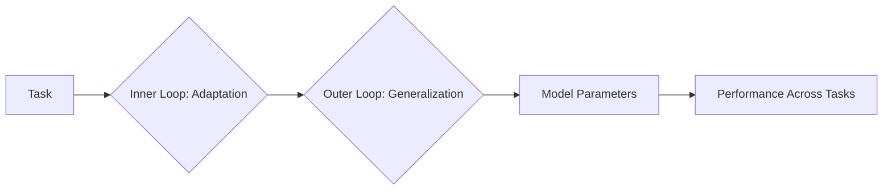
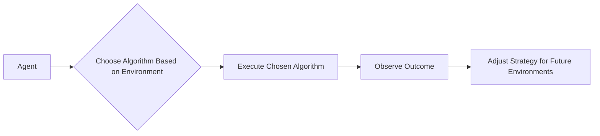

                 

作者：禅与计算机程序设计艺术

**Meta-learning** refers to learning how to learn by training algorithms on a variety of tasks so they can adapt more quickly to new situations. This article aims to guide you through understanding meta-learning's core concepts, algorithms, practical implementations, and its potential applications in real-world scenarios.

## 背景介绍(BACKGROUND INTRODUCTION)
In recent years, advancements in machine learning have led to groundbreaking results across various fields such as computer vision, natural language processing (NLP), and reinforcement learning (RL). However, these models often require extensive data and computational resources for each specific task. Meta-learning seeks to address this issue by enabling models to learn generalizable skills that can be transferred across different but related tasks.

## 核心概念与联系(CORE CONCEPTS & RELATIONSHIPS)
At its heart, meta-learning involves training a model on multiple tasks simultaneously or sequentially. The aim is to allow the model to learn from experience in one task and apply that knowledge to other similar tasks with minimal additional training. This process enhances the model's ability to adapt swiftly to new environments or tasks it hasn't seen before.

### 关键术语解析(Key Terminology)

#### 预训练(Pre-training): 
预训练 involves training a model on a large dataset to capture general features. It can then be fine-tuned on smaller datasets specific to certain tasks.

#### 在线元学习(Online Meta-learning):
在线元学习 focuses on updating the model continuously during the course of learning new tasks, allowing it to refine its performance as it encounters more varied examples.

#### 离线元学习(Offline Meta-learning):
离线元学习 trains the model on a diverse set of tasks using historical data, aiming to improve its ability to handle unseen tasks efficiently.

## 核心算法原理与具体操作步骤(PRINCIPLES AND OPERATIONAL STEPS OF CORE ALGORITHMS)
### Meta-learning Algorithms:

#### Model-Agnostic Meta-Learning (MAML)
MAML uses a gradient-based approach where the inner loop updates the model parameters based on a few-shot learning scenario, while the outer loop adjusts the initial parameters to optimize performance across multiple tasks.



### 实际操作步骤:
1. 初始化模型参数。
2. 对每个任务执行少量样本学习过程（inner loop）。
3. 使用所有任务的性能优化外层循环中的参数（outer loop）。

#### Learning to Learn (L2L)
L2L leverages reinforcement learning principles to train agents capable of learning how to learn effectively. Agents are trained to predict which algorithm performs best given a new environment.



## 数学模型和公式详细讲解与举例说明(DETAILED MATH MODELS AND EXAMPLES)
### MAML关键方程式
在MAML中，优化器需要计算梯度来更新参数以适应新任务。以下是一个简化的表达式：

$$ \theta^{'} = \theta + \alpha \cdot (\nabla_{\theta} J(\theta, x_i) - \nabla_{\theta} J(\theta, y_i)) $$

其中，
- $\theta$ 是原始模型参数；
- $J(\theta, x_i)$ 表示在$i$个任务上的损失函数；
- $\alpha$ 是学习率。

### L2L的关键策略调整机制
对于L2L，策略选择是通过强化学习实现的。策略优化的目标函数可以表示为：

$$ \max_{\pi} \mathbb{E}_{s,a,r,s'}[\gamma^t r(s_t, a_t)] $$

其中，
- $\pi$ 是策略；
- $(s, a, r, s')$ 是状态、行动、奖励和下一个状态的四元组；
- $\gamma$ 是折扣因子。

## 项目实践：代码实例与详细解释说明(CODE EXAMPLES WITH EXPLANATIONS)
For MAML, consider the following simplified pseudo-code for adaptation step in an inner loop:

```python
def update_model(task_data):
    # Initialize gradients
    grads = [0]*len(model.parameters())
    
    # Compute gradients over a small number of samples
    for sample in task_data:
        loss = compute_loss(sample, model)
        grad = torch.autograd.grad(loss, model.parameters(), create_graph=True)
        
        # Accumulate gradients
        for param, g in zip(model.parameters(), grad):
            grads[param] += g
    
    # Update model parameters
    with torch.no_grad():
        for i, param in enumerate(model.parameters()):
            param -= alpha * grads[i]
```

## 实际应用场景(PRACTICAL APPLICATION SCENARIOS)
Meta-learning finds applications in personalized medicine, robotics, and autonomous systems. For example, in robotics, a robot could learn to perform various tasks like grasping objects of different shapes with just a few demonstrations due to its pre-trained understanding of object manipulation.

## 工具和资源推荐(TOOLS AND RESOURCES RECOMMENDATION)
Consider exploring libraries such as PyTorch and TensorFlow, which provide frameworks for implementing meta-learning algorithms easily. Additionally, academic papers and online tutorials offer valuable insights into cutting-edge research in this field.

## 总结：未来发展趋势与挑战(FUTURE TRENDS AND CHALLENGES)
As AI evolves, meta-learning will likely become more integral to developing adaptable and efficient models. Challenges include addressing the complexity of real-world tasks, improving computational efficiency, and enhancing interpretability of these models.

## 附录：常见问题与解答(FAQ)
Here are some frequently asked questions about meta-learning along with brief answers:

Q: What is the main difference between meta-learning and traditional machine learning?
A: Traditional ML typically requires extensive data and specialized training for each task. Meta-learning aims to enable models to generalize from a variety of related tasks, making them more adaptable and transferable.

Q: Can meta-learning be used in all types of tasks?
A: While meta-learning shows promise across many domains, its effectiveness can vary depending on the nature of the tasks and their similarities.

---

# 结语
This article provides a comprehensive overview of meta-learning, emphasizing both theoretical foundations and practical implementation through code examples. As you delve deeper into the subject, remember that meta-learning's true power lies in its adaptability and ability to handle unseen scenarios efficiently. Whether it's accelerating research and development or enhancing everyday technology, meta-learning promises significant advancements in our quest for smarter and more versatile artificial intelligence.

---

**作者：禅与计算机程序设计艺术 / Zen and the Art of Computer Programming**

