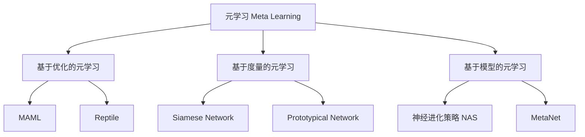

# 元学习Meta Learning原理与代码实例讲解

## 1.背景介绍

在传统的机器学习中,我们通常需要为每个任务定义一个数据集,并在该数据集上训练一个独立的模型。然而,这种方法存在一些缺陷:

1. **数据效率低下**: 每个任务都需要大量的数据来训练模型,这在某些领域(如医疗、机器人等)是非常困难的。

2. **泛化能力差**: 在新的任务上,需要从头开始训练新的模型,无法利用以前学习到的知识。

3. **缺乏智能**: 人类能够从有限的经验中快速学习新的概念和技能,而传统机器学习系统无法做到这一点。

为了解决这些问题,**元学习(Meta Learning)** 应运而生。元学习旨在设计一种能够从过去的经验中学习如何学习的机制,从而在新的任务上快速适应并获得良好的泛化性能。

## 2.核心概念与联系

元学习的核心思想是:在一组相似的任务上训练一个模型,使其能够捕捉到这些任务的共同模式,从而在遇到新的相似任务时,能够快速适应并取得良好的性能。

元学习可以分为三个主要范畴:

1. **基于优化的元学习(Optimization-Based Meta-Learning)**: 这种方法旨在学习一个好的初始化或优化策略,以便在新任务上快速收敛。代表算法有MAML、Reptile等。

2. **基于度量的元学习(Metric-Based Meta-Learning)**: 这种方法学习一个好的相似度度量,用于快速生成能够区分新类别的分类器。代表算法有Siamese Network、Prototypical Network等。

3. **基于模型的元学习(Model-Based Meta-Learning)**: 这种方法直接学习一个能够快速适应新任务的生成模型。代表算法有神经进化策略(Neural Architecture Search)、MetaNet等。

这些方法各有优缺点,需要根据具体问题选择合适的方法。



## 3.核心算法原理具体操作步骤

接下来,我们以MAML(Model-Agnostic Meta-Learning)算法为例,介绍基于优化的元学习的具体原理和操作步骤。

MAML算法的核心思想是:在一组任务上训练一个好的初始化参数,使得在新任务上只需少量梯度更新就能获得良好的性能。

具体的操作步骤如下:

1. **采样任务批次**: 从任务分布$p(\mathcal{T})$中采样一个任务批次$\mathcal{T}_i=\{T_1,T_2,...,T_n\}$。每个任务$T_i$包含支持集(Support Set)$\mathcal{D}_i^{tr}$和查询集(Query Set)$\mathcal{D}_i^{val}$。

2. **计算任务特定参数**: 对于每个任务$T_i$,使用支持集$\mathcal{D}_i^{tr}$在当前模型参数$\theta$的基础上进行少量梯度更新,得到任务特定参数$\phi_i$:

$$\phi_i = \theta - \alpha \nabla_\theta \mathcal{L}_{\mathcal{D}_i^{tr}}(f_\theta)$$

其中$\alpha$是学习率,$\mathcal{L}_{\mathcal{D}_i^{tr}}$是支持集上的损失函数。

3. **计算元更新梯度**: 使用查询集$\mathcal{D}_i^{val}$计算每个任务的损失,并对所有任务的损失求和,得到元损失(Meta Loss):

$$\mathcal{L}_{\mathcal{T}_i}(\phi_i) = \sum_{T_i \in \mathcal{T}_i} \mathcal{L}_{\mathcal{D}_i^{val}}(f_{\phi_i})$$

计算元损失相对于$\theta$的梯度,作为元更新(Meta Update)的梯度:

$$\nabla_\theta \mathcal{L}_{\mathcal{T}_i}(\phi_i) = \nabla_\theta \sum_{T_i \in \mathcal{T}_i} \mathcal{L}_{\mathcal{D}_i^{val}}(f_{\phi_i})$$

4. **元更新**: 使用梯度下降法更新模型参数$\theta$:

$$\theta \leftarrow \theta - \beta \nabla_\theta \mathcal{L}_{\mathcal{T}_i}(\phi_i)$$

其中$\beta$是元学习率(Meta Learning Rate)。

5. **重复训练**: 重复上述步骤,直到模型收敛。

通过上述操作,MAML算法能够学习到一个好的初始化参数$\theta$,使得在新任务上只需少量梯度更新就能获得良好的性能。

## 4.数学模型和公式详细讲解举例说明

在上一节中,我们介绍了MAML算法的核心步骤,其中涉及到一些重要的数学概念和公式,本节将对它们进行详细讲解和举例说明。

### 4.1 任务分布和任务批次

在元学习中,我们假设存在一个任务分布$p(\mathcal{T})$,每个任务$T_i$都是从这个分布中独立同分布采样得到的。在MAML算法中,我们需要从$p(\mathcal{T})$中采样一个任务批次$\mathcal{T}_i=\{T_1,T_2,...,T_n\}$,用于进行元训练。

例如,在Few-Shot图像分类任务中,每个任务$T_i$对应一个N-Way K-Shot问题,即从N个类别中选取K个样本作为支持集,剩余的样本作为查询集。��个数据集就构成了任务分布$p(\mathcal{T})$,我们从中采样一个批次进行训练。

### 4.2 支持集和查询集

对于每个任务$T_i$,我们将其划分为两个不相交的子集:支持集(Support Set)$\mathcal{D}_i^{tr}$和查询集(Query Set)$\mathcal{D}_i^{val}$。支持集用于计算任务特定参数,查询集用于计算元损失。

例如,在5-Way 1-Shot图像分类任务中,支持集包含5个类别,每个类别1个样本,共5个样本;查询集包含剩余的所有样本。我们使用支持集进行少量梯度更新,得到任务特定参数,然后在查询集上计算损失,作为元损失。

### 4.3 任务特定参数

对于每个任务$T_i$,我们使用其支持集$\mathcal{D}_i^{tr}$在当前模型参数$\theta$的基础上进行少量梯度更新,得到任务特定参数$\phi_i$:

$$\phi_i = \theta - \alpha \nabla_\theta \mathcal{L}_{\mathcal{D}_i^{tr}}(f_\theta)$$

其中$\alpha$是学习率,$\mathcal{L}_{\mathcal{D}_i^{tr}}$是支持集上的损失函数,例如交叉熵损失。这一步相当于使用支持集对模型进行少量Fine-Tuning,得到针对该任务的特定参数。

例如,在5-Way 1-Shot图像分类任务中,我们使用支持集(5个样本)对模型进行1步或几步梯度更新,得到任务特定参数$\phi_i$。

### 4.4 元损失和元更新

使用查询集$\mathcal{D}_i^{val}$计算每个任务的损失,并对所有任务的损失求和,得到元损失:

$$\mathcal{L}_{\mathcal{T}_i}(\phi_i) = \sum_{T_i \in \mathcal{T}_i} \mathcal{L}_{\mathcal{D}_i^{val}}(f_{\phi_i})$$

计算元损失相对于$\theta$的梯度,作为元更新的梯度:

$$\nabla_\theta \mathcal{L}_{\mathcal{T}_i}(\phi_i) = \nabla_\theta \sum_{T_i \in \mathcal{T}_i} \mathcal{L}_{\mathcal{D}_i^{val}}(f_{\phi_i})$$

使用梯度下降法更新模型参数$\theta$:

$$\theta \leftarrow \theta - \beta \nabla_\theta \mathcal{L}_{\mathcal{T}_i}(\phi_i)$$

其中$\beta$是元学习率。这一步相当于最小化所有任务在查询集上的损失,从而学习到一个好的初始化参数$\theta$。

例如,在5-Way 1-Shot图像分类任务中,我们使用任务特定参数$\phi_i$在查询集上计算损失,对所有任务的损失求和得到元损失,然后对$\theta$进行梯度更新,以最小化元损失。

通过上述步骤,MAML算法能够学习到一个好的初始化参数$\theta$,使得在新任务上只需少量梯度更新就能获得良好的性能。

## 5.项目实践:代码实例和详细解释说明

为了帮助读者更好地理解MAML算法,我们提供了一个基于PyTorch的代码实例,实现了MAML在Omniglot数据集上的Few-Shot分类任务。

### 5.1 环境配置

```python
import torch
import torch.nn as nn
import torch.nn.functional as F
from torch.utils.data import DataLoader
from omniglot import Omniglot
```

首先,我们导入必要的库,包括PyTorch、Omniglot数据集等。

### 5.2 模型定义

```python
class OmniglotModel(nn.Module):
    def __init__(self):
        super().__init__()
        self.conv1 = nn.Conv2d(1, 64, kernel_size=3, padding=1)
        self.bn1 = nn.BatchNorm2d(64)
        self.conv2 = nn.Conv2d(64, 64, kernel_size=3, padding=1)
        self.bn2 = nn.BatchNorm2d(64)
        self.conv3 = nn.Conv2d(64, 64, kernel_size=3, padding=1)
        self.bn3 = nn.BatchNorm2d(64)
        self.conv4 = nn.Conv2d(64, 64, kernel_size=3, padding=1)
        self.bn4 = nn.BatchNorm2d(64)
        self.fc = nn.Linear(64, 64)

    def forward(self, x):
        x = F.max_pool2d(F.relu(self.bn1(self.conv1(x))), 2)
        x = F.max_pool2d(F.relu(self.bn2(self.conv2(x))), 2)
        x = F.max_pool2d(F.relu(self.bn3(self.conv3(x))), 2)
        x = F.max_pool2d(F.relu(self.bn4(self.conv4(x))), 2)
        x = x.view(-1, 64)
        x = self.fc(x)
        return x
```

我们定义了一个用于Omniglot数据集的卷积神经网络模型,包含4个卷积层和1个全连接层。这个模型将作为MAML算法的基础模型。

### 5.3 MAML算法实现

```python
def maml(model, optimizer, loss_fn, tasks, k_shot, k_query, inner_steps=1, inner_lr=0.4, meta_lr=0.001, meta_batch_size=32):
    meta_loss = 0
    for task_batch in tasks:
        support_data, support_labels, query_data, query_labels = task_batch
        
        # 计算任务特定参数
        task_params = model.parameters()
        for _ in range(inner_steps):
            task_outputs = model(support_data)
            task_loss = loss_fn(task_outputs, support_labels)
            grads = torch.autograd.grad(task_loss, task_params, create_graph=True)
            task_params = [(param - inner_lr * grad) for param, grad in zip(task_params, grads)]
        
        # 计算元损失
        query_outputs = model(query_data, params=task_params)
        query_loss = loss_fn(query_outputs, query_labels)
        meta_loss += query_loss
        
    # 元更新
    meta_loss /= meta_batch_size
    optimizer.zero_grad()
    meta_loss.backward()
    optimizer.step()
    
    return meta_loss.item()
```

上面是MAML算法的核心实现。我们定义了一个`maml`函数,它接受模型、优化器、损失函数、任务批次、支持集和查询集大小等参数。

在函数内部,我们遍历每个任务批次,对于每个任务:

1. 计算任务特定参数:使用支持集进行`inner_steps`步梯度更新,得到任务特定参数。
2. 计算