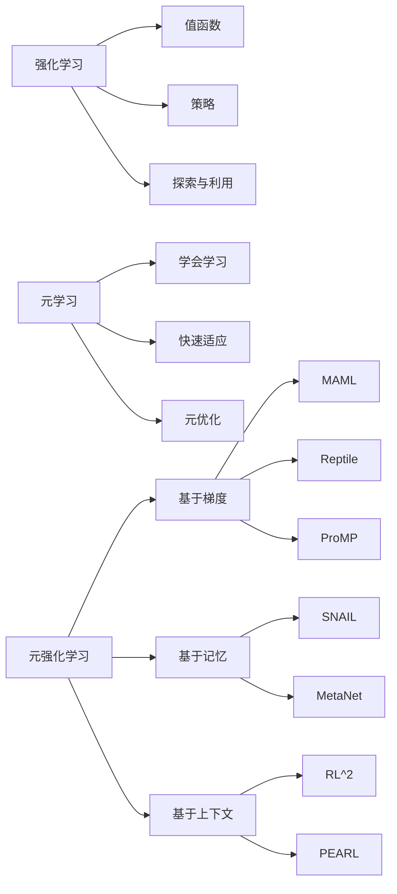

# 元强化学习(Meta-Reinforcement Learning) - 原理与代码实例讲解

## 1. 背景介绍
### 1.1 强化学习的局限性
### 1.2 元学习的兴起
### 1.3 元强化学习的提出

## 2. 核心概念与联系
### 2.1 强化学习
#### 2.1.1 马尔可夫决策过程
#### 2.1.2 值函数与策略
#### 2.1.3 探索与利用
### 2.2 元学习
#### 2.2.1 学会学习的能力
#### 2.2.2 快速适应新任务
#### 2.2.3 元学习的分类
### 2.3 元强化学习
#### 2.3.1 元强化学习的定义
#### 2.3.2 元强化学习与传统强化学习的区别
#### 2.3.3 元强化学习的优势

## 3. 核心算法原理具体操作步骤
### 3.1 基于梯度的元强化学习
#### 3.1.1 MAML算法
#### 3.1.2 Reptile算法
#### 3.1.3 ProMP算法
### 3.2 基于记忆的元强化学习  
#### 3.2.1 SNAIL算法
#### 3.2.2 MetaNet算法
### 3.3 基于上下文的元强化学习
#### 3.3.1 RL^2算法
#### 3.3.2 PEARL算法

## 4. 数学模型和公式详细讲解举例说明
### 4.1 马尔可夫决策过程(MDP)
#### 4.1.1 MDP的数学定义
#### 4.1.2 状态转移概率与奖励函数
#### 4.1.3 最优值函数与贝尔曼方程
### 4.2 策略梯度定理  
#### 4.2.1 策略梯度定理的数学推导
#### 4.2.2 随机策略梯度算法
### 4.3 元强化学习的数学建模
#### 4.3.1 任务分布与元目标
#### 4.3.2 内循环与外循环优化
#### 4.3.3 泛化性能度量

## 5. 项目实践：代码实例和详细解释说明
### 5.1 基于MAML的小样本图像分类
#### 5.1.1 Omniglot数据集介绍
#### 5.1.2 MAML算法的PyTorch实现
#### 5.1.3 实验结果与分析
### 5.2 基于RL^2的多臂老虎机问题
#### 5.2.1 多臂老虎机问题介绍  
#### 5.2.2 RL^2算法的TensorFlow实现
#### 5.2.3 实验结果与分析

## 6. 实际应用场景
### 6.1 机器人控制
#### 6.1.1 机器人运动规划
#### 6.1.2 机器人操纵技能学习
### 6.2 推荐系统
#### 6.2.1 冷启动问题
#### 6.2.2 跨域推荐
### 6.3 自然语言处理
#### 6.3.1 少样本文本分类
#### 6.3.2 领域自适应

## 7. 工具和资源推荐
### 7.1 常用的深度学习框架
#### 7.1.1 PyTorch
#### 7.1.2 TensorFlow
### 7.2 元强化学习的开源实现
#### 7.2.1 learn2learn
#### 7.2.2 higher
### 7.3 相关论文与学习资料
#### 7.3.1 必读论文列表
#### 7.3.2 在线课程与教程

## 8. 总结：未来发展趋势与挑战
### 8.1 元强化学习的研究进展
### 8.2 未来发展方向
#### 8.2.1 样本效率提升
#### 8.2.2 多任务与持续学习
#### 8.2.3 与其他领域结合
### 8.3 面临的挑战
#### 8.3.1 任务定义与设计
#### 8.3.2 元知识表征与泛化
#### 8.3.3 算法的鲁棒性与可解释性

## 9. 附录：常见问题与解答
### 9.1 元强化学习与迁移学习的区别？
### 9.2 MAML算法的优缺点？
### 9.3 如何选择合适的元强化学习算法？

元强化学习是近年来兴起的一种全新的强化学习范式，旨在让智能体具备快速学习和适应新任务的能力。与传统强化学习不同，元强化学习引入了元学习的思想，通过学习如何学习，使得智能体能够在面对新任务时，仅需很少的样本就能快速适应并取得良好的性能。

传统的强化学习虽然在单个任务上已经取得了显著的成功，但面对新的任务时，往往需要从头开始训练，学习效率低下。这极大地限制了强化学习的应用范围和实用性。而元强化学习通过引入任务分布的概念，让智能体在多个任务上进行训练，学习一种通用的学习策略，从而实现了跨任务的快速适应能力。

元强化学习的核心思想可以概括为"学会学习"。通过元训练阶段在一系列相关任务上的学习，智能体掌握了从少量样本中快速学习的能力。在元测试阶段，面对新的任务，智能体能够利用先前学习到的知识，仅需很少的交互样本就能快速适应并取得良好表现。这种学习范式打破了传统强化学习的限制，让智能体具备了更强的泛化和适应能力。

在算法层面，元强化学习可以分为基于梯度、基于记忆和基于上下文三大类。基于梯度的方法，如MAML和Reptile，通过元梯度下降优化模型参数，使得模型能够快速适应新任务。基于记忆的方法，如SNAIL和MetaNet，利用外部记忆模块存储过去经验，实现快速的经验回放与泛化。基于上下文的方法，如RL^2和PEARL，将任务上下文信息编码到智能体策略中，实现跨任务的适应。

在实践中，元强化学习已经在机器人控制、推荐系统、自然语言处理等领域展现出了广阔的应用前景。通过元强化学习，机器人能够快速学习新的运动技能，适应不同的环境；推荐系统能够利用跨域知识，缓解冷启动问题；自然语言处理任务能够在小样本设定下取得良好效果。这些应用展示了元强化学习的巨大潜力。

尽管元强化学习取得了诸多进展，但仍然面临着一些挑战。如何设计合适的任务分布，如何有效表征和利用元知识，如何提高算法的样本效率和鲁棒性，都是亟待解决的问题。此外，将元强化学习与其他领域，如迁移学习、持续学习等结合，也是未来的重要发展方向。

总的来说，元强化学习为智能体的快速学习和适应能力开辟了一条全新的途径。通过学习如何学习，智能体能够突破传统强化学习的限制，实现跨任务的快速泛化。展望未来，元强化学习必将在人工智能的发展历程中扮演越来越重要的角色，推动智能系统向更加通用和智能的方向迈进。

让我们一起探索元强化学习的奥秘，开启智能体学习的新纪元！

作者：禅与计算机程序设计艺术 / Zen and the Art of Computer Programming