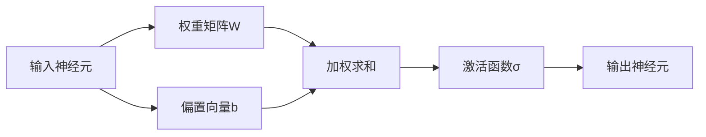

# 全连接层 (Fully Connected Layer) 原理与代码实例讲解

## 1. 背景介绍

### 1.1 全连接层在神经网络中的作用

全连接层(Fully Connected Layer，FC Layer)是神经网络中的一种常见层类型，尤其在卷积神经网络(CNN)和多层感知机(MLP)等网络架构中被广泛使用。它在网络的末端起到将学习到的分布式特征表示映射到样本标记空间的作用，是实现特征向量到输出的必要层。

### 1.2 全连接层的结构特点

全连接层由若干个并行的神经元组成，每个神经元与上一层的所有神经元相连，但同层神经元之间没有连接。这种"全连接"的连接方式使得网络可以学习特征之间的复杂非线性组合关系。

### 1.3 本文的主要内容

本文将深入探讨全连接层的工作原理，阐述其核心概念和数学模型，并结合具体的代码实例进行讲解说明。同时，也会介绍全连接层在实际应用中的一些场景和面临的挑战。通过本文的学习，读者可以全面地理解全连接层，并掌握在项目实践中使用全连接层的方法。

## 2. 核心概念与联系

### 2.1 神经元

神经元是神经网络的基本组成单元。在全连接层中，每个神经元接收上一层所有神经元的输出，并通过加权求和和非线性变换得到自己的输出。

### 2.2 权重和偏置

权重矩阵W和偏置向量b是全连接层的核心参数。权重矩阵的每个元素 $w_{ij}$ 表示第 $i$ 个输入神经元到第 $j$ 个输出神经元的连接权重，偏置向量的每个元素 $b_j$ 表示第 $j$ 个输出神经元的偏置项。

### 2.3 前向传播

前向传播是信息在神经网络中从输入层流向输出层的过程。对于第 $l$ 层的第 $j$ 个神经元，其输出 $a^{(l)}_j$ 的计算公式为：

$$a^{(l)}_j = \sigma(\sum_{i=1}^{n^{(l-1)}} w^{(l)}_{ij} a^{(l-1)}_i + b^{(l)}_j)$$

其中，$\sigma$ 是激活函数，$n^{(l-1)}$ 是第 $l-1$ 层的神经元数量。

### 2.4 反向传播

反向传播是神经网络的训练算法，用于计算损失函数对每个权重参数的梯度。对于第 $l$ 层第 $j$ 个神经元的偏置项 $b^{(l)}_j$，其梯度计算公式为：

$$\frac{\partial J}{\partial b^{(l)}_j} = \delta^{(l)}_j$$

对于权重 $w^{(l)}_{ij}$，其梯度计算公式为：

$$\frac{\partial J}{\partial w^{(l)}_{ij}} = a^{(l-1)}_i \delta^{(l)}_j$$

其中，$\delta^{(l)}_j$ 是第 $l$ 层第 $j$ 个神经元的误差项。

### 2.5 激活函数

激活函数为神经网络引入非线性，使其能够学习和表示复杂的特征。常见的激活函数包括sigmoid、tanh和ReLU等。

下图展示了全连接层中核心概念之间的联系：



## 3. 核心算法原理具体操作步骤

全连接层的前向传播和反向传播是其核心算法。下面详细介绍这两个算法的具体操作步骤。

### 3.1 前向传播算法

输入：上一层的输出 $\mathbf{a}^{(l-1)}$，当前层的权重矩阵 $\mathbf{W}^{(l)}$ 和偏置向量 $\mathbf{b}^{(l)}$。

1. 计算加权和：$\mathbf{z}^{(l)} = \mathbf{W}^{(l)} \mathbf{a}^{(l-1)} + \mathbf{b}^{(l)}$
2. 应用激活函数：$\mathbf{a}^{(l)} = \sigma(\mathbf{z}^{(l)})$

输出：当前层的输出 $\mathbf{a}^{(l)}$。

### 3.2 反向传播算法

输入：当前层的误差项 $\boldsymbol{\delta}^{(l)}$，当前层的输入 $\mathbf{a}^{(l-1)}$。

1. 计算权重梯度：$\frac{\partial J}{\partial \mathbf{W}^{(l)}} = \boldsymbol{\delta}^{(l)} (\mathbf{a}^{(l-1)})^T$
2. 计算偏置梯度：$\frac{\partial J}{\partial \mathbf{b}^{(l)}} = \boldsymbol{\delta}^{(l)}$
3. 计算上一层的误差项：$\boldsymbol{\delta}^{(l-1)} = (\mathbf{W}^{(l)})^T \boldsymbol{\delta}^{(l)} \odot \sigma'(\mathbf{z}^{(l-1)})$

输出：当前层的权重梯度 $\frac{\partial J}{\partial \mathbf{W}^{(l)}}$，偏置梯度 $\frac{\partial J}{\partial \mathbf{b}^{(l)}}$ 和上一层的误差项 $\boldsymbol{\delta}^{(l-1)}$。

## 4. 数学模型和公式详细讲解举例说明

### 4.1 前向传播的数学模型

对于第 $l$ 层的第 $j$ 个神经元，其输出 $a^{(l)}_j$ 的计算公式为：

$$a^{(l)}_j = \sigma(z^{(l)}_j)$$

其中，$z^{(l)}_j$ 是加权和，计算公式为：

$$z^{(l)}_j = \sum_{i=1}^{n^{(l-1)}} w^{(l)}_{ij} a^{(l-1)}_i + b^{(l)}_j$$

举例说明：假设第 $l-1$ 层有3个神经元，输出分别为 $a^{(l-1)}_1=0.5$，$a^{(l-1)}_2=0.8$，$a^{(l-1)}_3=0.2$。第 $l$ 层有2个神经元，权重矩阵为：

$$\mathbf{W}^{(l)} = \begin{bmatrix} 0.1 & 0.3 & 0.5 \\ 0.2 & 0.4 & 0.6 \end{bmatrix}$$

偏置向量为：

$$\mathbf{b}^{(l)} = \begin{bmatrix} 0.1 \\ 0.2 \end{bmatrix}$$

激活函数为sigmoid函数：

$$\sigma(x) = \frac{1}{1+e^{-x}}$$

则第 $l$ 层第1个神经元的输出为：

$$\begin{aligned} z^{(l)}_1 &= 0.1 \times 0.5 + 0.3 \times 0.8 + 0.5 \times 0.2 + 0.1 = 0.58 \\ a^{(l)}_1 &= \sigma(z^{(l)}_1) = \sigma(0.58) = 0.6406 \end{aligned}$$

同理可计算出第2个神经元的输出 $a^{(l)}_2=0.6792$。

### 4.2 反向传播的数学模型

对于第 $l$ 层第 $j$ 个神经元的偏置项 $b^{(l)}_j$，其梯度计算公式为：

$$\frac{\partial J}{\partial b^{(l)}_j} = \delta^{(l)}_j$$

对于权重 $w^{(l)}_{ij}$，其梯度计算公式为：

$$\frac{\partial J}{\partial w^{(l)}_{ij}} = a^{(l-1)}_i \delta^{(l)}_j$$

其中，误差项 $\delta^{(l)}_j$ 的计算公式为：

$$\delta^{(l)}_j = \frac{\partial J}{\partial z^{(l)}_j} = \frac{\partial J}{\partial a^{(l)}_j} \sigma'(z^{(l)}_j)$$

举例说明：假设第 $l$ 层有2个神经元，误差项分别为 $\delta^{(l)}_1=0.2$，$\delta^{(l)}_2=0.1$。第 $l-1$ 层神经元的输出和权重矩阵与前向传播举例相同。sigmoid函数的导数为：

$$\sigma'(x) = \sigma(x)(1-\sigma(x))$$

则权重 $w^{(l)}_{11}$ 的梯度为：

$$\frac{\partial J}{\partial w^{(l)}_{11}} = a^{(l-1)}_1 \delta^{(l)}_1 = 0.5 \times 0.2 = 0.1$$

偏置项 $b^{(l)}_1$ 的梯度为：

$$\frac{\partial J}{\partial b^{(l)}_1} = \delta^{(l)}_1 = 0.2$$

第 $l-1$ 层第1个神经元的误差项为：

$$\begin{aligned} \delta^{(l-1)}_1 &= (w^{(l)}_{11} \delta^{(l)}_1 + w^{(l)}_{21} \delta^{(l)}_2) \sigma'(z^{(l-1)}_1) \\ &= (0.1 \times 0.2 + 0.2 \times 0.1) \times \sigma(z^{(l-1)}_1)(1-\sigma(z^{(l-1)}_1)) \\ &= 0.04 \times 0.5 \times 0.5 = 0.01 \end{aligned}$$

其他神经元的梯度和误差项可以按照同样的方法计算。

## 5. 项目实践：代码实例和详细解释说明

下面使用Python和NumPy库实现一个简单的全连接层，并对其进行前向传播和反向传播。

```python
import numpy as np

class FullyConnectedLayer:
    def __init__(self, input_size, output_size, activation='sigmoid'):
        self.input_size = input_size
        self.output_size = output_size
        self.activation = activation
        self.W = np.random.randn(output_size, input_size) * 0.01
        self.b = np.zeros((output_size, 1))
    
    def forward(self, X):
        self.X = X
        self.z = np.dot(self.W, X) + self.b
        if self.activation == 'sigmoid':
            self.a = self.sigmoid(self.z)
        elif self.activation == 'relu':
            self.a = self.relu(self.z)
        return self.a
    
    def backward(self, dA):
        if self.activation == 'sigmoid':
            dZ = dA * self.sigmoid_derivative(self.a)
        elif self.activation == 'relu':
            dZ = dA * self.relu_derivative(self.z)
        self.dW = np.dot(dZ, self.X.T)
        self.db = np.sum(dZ, axis=1, keepdims=True)
        self.dX = np.dot(self.W.T, dZ)
        return self.dX
    
    def sigmoid(self, z):
        return 1 / (1 + np.exp(-z))
    
    def sigmoid_derivative(self, a):
        return a * (1 - a)
    
    def relu(self, z):
        return np.maximum(0, z)
    
    def relu_derivative(self, z):
        return (z > 0) * 1
```

代码解释：

- `__init__`方法初始化全连接层，包括输入大小、输出大小和激活函数类型。权重矩阵W和偏置向量b也在此初始化。
- `forward`方法实现前向传播，计算加权和z和激活函数输出a。支持sigmoid和ReLU两种激活函数。
- `backward`方法实现反向传播，计算损失函数对权重、偏置和输入的梯度。
- `sigmoid`和`sigmoid_derivative`方法分别计算sigmoid函数和其导数。
- `relu`和`relu_derivative`方法分别计算ReLU函数和其导数。

使用示例：

```python
# 创建一个输入大小为4，输出大小为3的全连接层，激活函数为sigmoid
fc_layer = FullyConnectedLayer(4, 3, activation='sigmoid')

# 生成随机输入数据
X = np.random.randn(4, 10)

# 前向传播
A = fc_layer.forward(X)

# 反向传播
dA = np.random.randn(3, 10)
dX = fc_layer.backward(dA)

# 打印权重梯度和偏置梯度
print('dW:', fc_layer.dW)
print('db:', fc_layer.db)
```

## 6. 实际