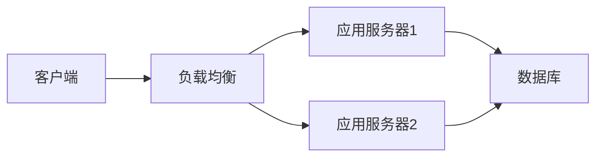

# 公司IT战略规划的制定、实施

## 1. 背景介绍

在数字化时代，企业的IT战略规划不再是可选项，而是确保企业竞争力和持续创新的必要条件。IT战略规划涉及到企业信息技术的长远布局，包括技术选型、系统架构设计、人才培养、数据管理等多个方面。一个合理的IT战略规划能够帮助企业更好地应对市场变化，把握技术发展趋势，实现业务目标。

## 2. 核心概念与联系

### 2.1 IT战略规划的定义
IT战略规划是指企业根据自身业务需求和市场环境，制定的长期信息技术发展蓝图。它包括了对企业未来信息技术发展方向、目标、路径的规划。

### 2.2 IT战略与企业战略的关系
IT战略规划不是孤立存在的，它必须与企业的整体战略紧密结合，支持企业的核心竞争力。

### 2.3 IT战略规划的主要内容
- 技术选型与架构设计
- 数据管理与分析
- 人才队伍建设
- IT治理与风险管理
- 创新与研发投入

## 3. 核心算法原理具体操作步骤

### 3.1 确定IT战略规划的目标
通过SWOT分析等工具，明确企业在信息技术方面的优势、劣势、机会和威胁。

### 3.2 制定IT战略规划
根据企业目标，制定IT战略规划，包括技术路线图、关键项目、预算分配等。

### 3.3 实施与监控
制定详细的实施计划，并通过KPI等指标进行监控和调整。

## 4. 数学模型和公式详细讲解举例说明

### 4.1 投资回报率(ROI)的计算
$$ ROI = \frac{收益 - 投资成本}{投资成本} \times 100\% $$

### 4.2 成本效益分析(CBA)
通过对比项目带来的收益和成本，评估项目的可行性。

## 5. 项目实践：代码实例和详细解释说明

### 5.1 数据分析项目
展示如何使用Python进行数据分析，支持决策制定。

```python
import pandas as pd

# 数据加载
data = pd.read_csv('sales_data.csv')

# 数据分析
summary = data.describe()

# 决策支持
print(summary)
```

### 5.2 系统架构设计
使用Mermaid流程图展示系统架构设计的过程。



## 6. 实际应用场景

### 6.1 云计算
介绍云计算在IT战略规划中的应用，如何帮助企业降低成本，提高效率。

### 6.2 大数据分析
探讨大数据分析在市场趋势预测、客户行为分析中的作用。

## 7. 工具和资源推荐

### 7.1 项目管理工具
推荐Jira、Trello等项目管理工具，帮助团队协作和进度跟踪。

### 7.2 技术社区
推荐Stack Overflow、GitHub等技术社区，作为学习和问题解决的平台。

## 8. 总结：未来发展趋势与挑战

### 8.1 人工智能
讨论人工智能如何影响IT战略规划，以及企业如何利用AI创造价值。

### 8.2 安全与隐私
强调在制定IT战略规划时，必须考虑数据安全和用户隐私保护。

## 9. 附录：常见问题与解答

### 9.1 IT战略规划的周期是多久？
一般来说，IT战略规划的周期为3-5年，但需要根据市场和技术变化进行调整。

### 9.2 如何衡量IT战略规划的成功？
可以通过项目完成度、ROI、用户满意度等多个维度来衡量。

作者：禅与计算机程序设计艺术 / Zen and the Art of Computer Programming