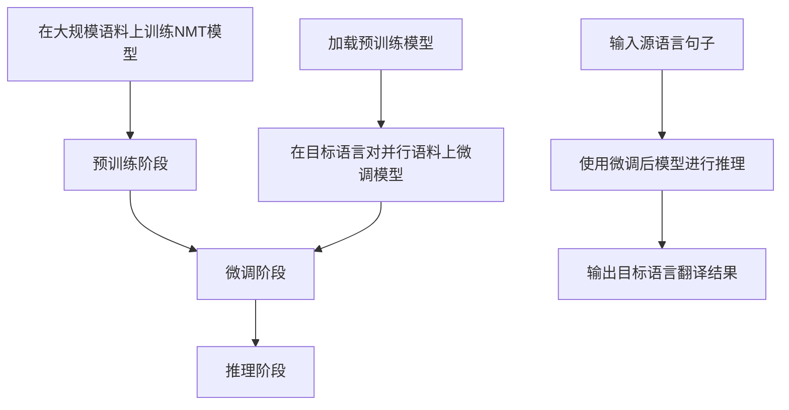

# 利用迁移学习进行机器翻译

## 1. 背景介绍

机器翻译是自然语言处理领域中一个具有挑战性的任务。传统的机器翻译系统通常采用基于规则的方法或统计机器翻译方法,这些方法存在一些局限性,难以处理语言的复杂性和多样性。近年来,随着深度学习技术的发展,神经机器翻译(Neural Machine Translation, NMT)取得了巨大的进步,显著提高了翻译质量。

然而,训练一个高质量的NMT系统需要大量的并行语料数据,对于资源匮乏的语言来说,这是一个巨大的挑战。为了解决这个问题,研究人员提出了迁移学习(Transfer Learning)的方法,通过利用已有的大规模语料训练好的模型,将知识迁移到目标任务上,从而提高翻译质量。

## 2. 核心概念与联系

### 2.1 神经机器翻译(NMT)

神经机器翻译是一种基于序列到序列(Sequence-to-Sequence)模型的机器翻译方法。它将源语言句子作为输入,经过编码器(Encoder)编码为向量表示,然后由解码器(Decoder)解码生成目标语言句子。

NMT模型通常采用注意力机制(Attention Mechanism),允许解码器在生成每个目标词时,关注源句子中的不同部分,从而捕获长距离依赖关系。

### 2.2 迁移学习

迁移学习是一种机器学习技术,旨在利用在源域(Source Domain)上学习到的知识,来帮助目标域(Target Domain)上的学习任务。在NMT中,我们可以将大规模语料训练好的模型视为源域模型,将其知识迁移到目标语言对的翻译任务上。

迁移学习的核心思想是,不同任务之间存在一些共享的底层知识,如词嵌入(Word Embeddings)、语法和语义信息等。通过迁移学习,我们可以避免从头开始训练,节省大量的计算资源和时间。

## 3. 核心算法原理具体操作步骤

利用迁移学习进行机器翻译的核心步骤如下:

1. **预训练阶段**: 在大规模语料上训练一个强大的NMT模型,作为源域模型。这个模型可以捕获通用的语言知识,如词嵌入、语法和语义信息等。

2. **微调阶段**: 将预训练模型作为初始化,在目标语言对的并行语料上进行微调(Fine-tuning)。在这个阶段,模型会进一步学习目标语言对之间的特定知识和翻译规则。

3. **推理阶段**: 使用微调后的模型进行推理,将源语言句子翻译成目标语言。

下面是一个具体的算法流程:



在预训练阶段,我们通常会使用大规模的多语种语料,如联合国语料库、欧盟语料库等,来训练一个强大的NMT模型。这个模型可以捕获通用的语言知识,为后续的微调奠定基础。

在微调阶段,我们将预训练模型作为初始化,在目标语言对的并行语料上进行进一步训练。这个阶段的目的是让模型学习目标语言对之间的特定知识和翻译规则,从而提高翻译质量。

最后,在推理阶段,我们使用微调后的模型对源语言句子进行翻译,得到目标语言的翻译结果。

## 4. 数学模型和公式详细讲解举例说明

在神经机器翻译中,常用的模型架构是基于注意力机制的序列到序列(Sequence-to-Sequence)模型。下面我们将详细介绍这个模型的数学原理。

### 4.1 序列到序列模型

序列到序列模型由编码器(Encoder)和解码器(Decoder)两部分组成。编码器将源语言句子$X=(x_1, x_2, \dots, x_n)$编码为向量表示$C$,解码器根据$C$生成目标语言句子$Y=(y_1, y_2, \dots, y_m)$。

编码器通常使用双向循环神经网络(Bidirectional RNN)或Transformer编码器来实现,将输入序列$X$映射为一系列隐藏状态$H=(h_1, h_2, \dots, h_n)$,然后使用某种方式(如取最后一个隐藏状态或所有隐藏状态的加权和)得到上下文向量$C$。

解码器根据$C$和前一个时间步的输出$y_{t-1}$,预测当前时间步的输出$y_t$,具体计算公式如下:

$$P(y_t|y_{<t}, C) = \text{DecoderRNN}(y_{t-1}, s_t, C)$$

其中$s_t$是解码器的隐藏状态。

### 4.2 注意力机制

注意力机制允许解码器在生成每个目标词时,关注源句子中的不同部分,从而捕获长距离依赖关系。具体来说,注意力机制计算出一个注意力权重向量$\alpha_t=(a_{t1}, a_{t2}, \dots, a_{tn})$,表示解码器在生成$y_t$时,对源句子每个词的关注程度。

注意力权重向量的计算公式如下:

$$a_{ti} = \frac{\exp(e_{ti})}{\sum_{j=1}^n \exp(e_{tj})}$$
$$e_{ti} = \text{score}(s_t, h_i)$$

其中$\text{score}$是一个评分函数,用于衡量解码器隐藏状态$s_t$和编码器隐藏状态$h_i$之间的相关性。常用的评分函数有点积、加性和缩放点积注意力等。

有了注意力权重向量$\alpha_t$,我们可以计算出上下文向量$c_t$,作为解码器的额外输入:

$$c_t = \sum_{i=1}^n a_{ti}h_i$$

将$c_t$与解码器隐藏状态$s_t$和前一个输出$y_{t-1}$一起作为输入,解码器可以更好地预测当前输出$y_t$:

$$P(y_t|y_{<t}, C, \alpha_t) = \text{DecoderRNN}(y_{t-1}, s_t, c_t)$$

### 4.3 迁移学习中的微调

在迁移学习中,我们首先在大规模语料上训练一个强大的NMT模型,作为预训练模型。然后,我们将预训练模型的参数作为初始化,在目标语言对的并行语料上进行微调。

微调过程中,我们需要计算模型在目标语料上的损失函数,并使用优化算法(如Adam或SGD)来更新模型参数,以最小化损失函数。常用的损失函数是交叉熵损失函数:

$$\mathcal{L}(\theta) = -\frac{1}{N}\sum_{i=1}^N\sum_{t=1}^{T_i}\log P(y_t^{(i)}|y_{<t}^{(i)}, X^{(i)}; \theta)$$

其中$N$是批次大小,$T_i$是第$i$个样本的目标序列长度,$\theta$是模型参数,$(X^{(i)}, Y^{(i)})$是第$i$个样本的源语言句子和目标语言句子。

在微调过程中,我们通常会使用较小的学习率,避免破坏预训练模型中已经学习到的有用知识。同时,我们还可以对不同层的参数使用不同的学习率,或者对某些层的参数进行冻结,以进一步控制微调过程。

## 5. 项目实践: 代码实例和详细解释说明

在这一部分,我们将提供一个使用PyTorch实现的迁移学习机器翻译系统的代码示例,并对关键部分进行详细解释。

### 5.1 数据预处理

首先,我们需要对源语言和目标语言的语料进行预处理,包括分词、构建词表、填充等操作。下面是一个使用PyTorch提供的`torchtext`库进行数据预处理的示例:

```python
import torchtext

# 定义字段
SRC = torchtext.legacy.data.Field(tokenize='spacy', tokenizer_language='en', init_token='<sos>', eos_token='<eos>', lower=True)
TGT = torchtext.legacy.data.Field(tokenize='spacy', tokenizer_language='fr', init_token='<sos>', eos_token='<eos>', lower=True)

# 加载数据
train_data, valid_data, test_data = torchtext.legacy.datasets.Multi30k.splits(exts=('.en', '.fr'), fields=(SRC, TGT))

# 构建词表
SRC.build_vocab(train_data, min_freq=2)
TGT.build_vocab(train_data, min_freq=2)

# 构建迭代器
train_iter, valid_iter, test_iter = torchtext.legacy.data.BucketIterator.splits((train_data, valid_data, test_data), batch_size=32, device='cuda')
```

在上面的代码中,我们首先定义了源语言字段`SRC`和目标语言字段`TGT`,并指定了分词器、起始符和结束符等参数。然后,我们加载了Multi30k数据集,并构建了源语言和目标语言的词表。最后,我们使用`BucketIterator`构建了训练、验证和测试的数据迭代器。

### 5.2 模型定义

接下来,我们定义序列到序列模型的编码器和解码器。下面是一个使用双向LSTM作为编码器,单向LSTM作为解码器的示例:

```python
import torch
import torch.nn as nn

class Encoder(nn.Module):
    def __init__(self, input_dim, emb_dim, hid_dim, n_layers, dropout):
        super().__init__()
        self.hid_dim = hid_dim
        self.n_layers = n_layers
        self.embedding = nn.Embedding(input_dim, emb_dim)
        self.rnn = nn.LSTM(emb_dim, hid_dim, n_layers, bidirectional=True, dropout=dropout)
        self.dropout = nn.Dropout(dropout)

    def forward(self, src):
        embedded = self.dropout(self.embedding(src))
        outputs, (hidden, cell) = self.rnn(embedded)
        hidden = torch.cat((hidden[-2, :, :], hidden[-1, :, :]), dim=1)
        return hidden

class Decoder(nn.Module):
    def __init__(self, output_dim, emb_dim, hid_dim, n_layers, dropout):
        super().__init__()
        self.output_dim = output_dim
        self.hid_dim = hid_dim
        self.n_layers = n_layers
        self.embedding = nn.Embedding(output_dim, emb_dim)
        self.rnn = nn.LSTM(emb_dim, hid_dim, n_layers, dropout=dropout)
        self.fc_out = nn.Linear(hid_dim, output_dim)
        self.dropout = nn.Dropout(dropout)

    def forward(self, input, hidden, cell):
        input = input.unsqueeze(0)
        embedded = self.dropout(self.embedding(input))
        output, (hidden, cell) = self.rnn(embedded, (hidden, cell))
        prediction = self.fc_out(output.squeeze(0))
        return prediction, hidden, cell

class Seq2Seq(nn.Module):
    def __init__(self, encoder, decoder, device):
        super().__init__()
        self.encoder = encoder
        self.decoder = decoder
        self.device = device

    def forward(self, src, trg, teacher_forcing_ratio=0.5):
        batch_size = src.shape[1]
        trg_len = trg.shape[0]
        trg_vocab_size = self.decoder.output_dim
        outputs = torch.zeros(trg_len, batch_size, trg_vocab_size).to(self.device)
        hidden, cell = self.encoder(src)
        input = trg[0, :]
        for t in range(1, trg_len):
            output, hidden, cell = self.decoder(input, hidden, cell)
            outputs[t] = output
            teacher_force = random.random() < teacher_forcing_ratio
            top1 = output.argmax(1)
            input = trg[t] if teacher_force else top1
        return outputs
```

在上面的代码中,我们定义了`Encoder`、`Decoder`和`Seq2Seq`三个模块。`Encoder`使用双向LSTM对源语言句子进行编码,得到最后一个时间步的隐藏状态作为上下文向量。`Decoder`使用单向LSTM根据上下文向量和前一个输出生成当前的输出。`