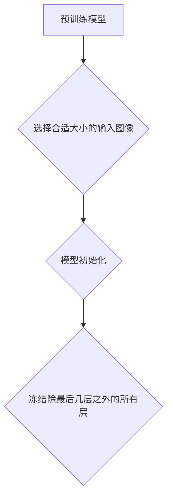

                 

作者：禅与计算机程序设计艺术

利用迁移学习在计算机视觉领域进行语义分割是一项极具潜力且发展迅速的前沿技术。本文旨在探讨如何通过迁移学习实现高效的语义图像分割，同时提供实用指导和最新研究成果概述。

## 1. 背景介绍
随着深度学习的兴起，基于卷积神经网络 (CNNs) 的方法已成为计算机视觉领域的主流。其中，语义分割任务的目标是将输入图像划分为多个类别，并为每个像素分配相应的标签。传统的语义分割方法通常需要大量的标注数据，而这些数据的收集成本高昂，限制了其广泛应用。

迁移学习作为一种策略，允许我们从一个预训练模型出发，该模型已经在大量数据上进行了学习，从而节省了大量的时间和计算资源。在语义图像分割领域应用迁移学习的关键在于如何有效地将已有的知识转移到特定的任务上，尤其是在资源有限的情况下。

## 2. 核心概念与联系
迁移学习的核心思想是利用一个在广泛任务上预先训练好的模型，然后根据目标任务调整模型参数。在语义图像分割场景下，这通常意味着使用在ImageNet或其他大型数据集上预训练的CNN模型，如ResNet、VGG等，然后针对特定的语义分割任务进行微调。

### 关键概念:
1. **特征提取** - 预训练模型通常已经学习到了通用的图像特征，这些特征对于各种视觉任务都是有用的。
2. **适应性微调** - 在特定任务上的小规模数据上调整模型参数，使得模型能够更好地针对新任务优化。
3. **损失函数** - 训练过程中使用的损失函数用于衡量预测结果与真实标记之间的差异，通常是交叉熵损失或加权交叉熵损失。

### 联系:
迁移学习通过共享权重或提取预训练模型的高层特征，降低了特定任务的学习难度，加快了收敛速度，同时也减少了所需的数据量和计算资源。这对于语义图像分割来说尤其重要，因为这个任务不仅依赖于复杂的空间关系处理，还涉及到大量的类别和细节识别。

## 3. 核心算法原理具体操作步骤
### 步骤一: 选择预训练模型
首先，选择一个适合目标任务的预训练模型。例如，使用带有全局平均池化层的ResNet-101作为基础模型。



### 步骤二: 数据准备
- **数据增强**: 对原始图像执行随机裁剪、翻转、色彩变换等操作以增加数据多样性。
- **数据加载器配置**: 使用PyTorch DataLoader进行批处理、随机化等操作。

### 步骤三: 架构修改与微调
- **添加分类层**：在模型末端添加新的全连接层，以便对分割任务进行分类决策。
- **调整超参数**：如学习率、批次大小等，以适应特定任务的需求。

### 步骤四: 训练过程
- **定义损失函数**：选择交叉熵损失函数。
- **优化器选择**：如Adam、SGD等。
- **训练循环**：迭代地前向传播、计算损失、反向传播并更新参数。

### 步骤五: 评估与验证
- **指标选择**：交并比(Intersection over Union, IoU)，准确度(Accuracy)等。
- **交叉验证**：确保模型泛化能力。

## 4. 数学模型和公式详细讲解举例说明
### 损失函数
#### 十字熵损失函数 ($$H$$)
在语义分割中，十字熵损失函数用来衡量预测概率分布$$P_{pred}$$与真实分布$$P_{true}$$之间的差异：

$$ H(P_{pred}, P_{true}) = -\sum_{i=1}^{n} P_{true}(x_i) \log P_{pred}(x_i) $$

### 优化器
#### Adam优化器
Adam是一个自适应梯度方法，结合了RMSprop和Momentum的优点，通过动态调整学习率来加速收敛：

$$ m_t = \beta_1 m_{t-1} + (1-\beta_1)g_t $$
$$ v_t = \beta_2 v_{t-1} + (1-\beta_2)g_t^2 $$
$$ \hat{v}_t = \frac{v_t}{1-(\beta_2)^t} $$
$$ \theta_{t+1} = \theta_t - \alpha \frac{m_t}{\sqrt{\hat{v}_t}+\epsilon} $$

其中，\(m_t\) 和 \(v_t\) 分别表示动量项和矩估计，\(\alpha\) 是学习率，\(\beta_1\) 和 \(\beta_2\) 是超参数控制动量项和矩估计的衰减率，\(\epsilon\) 是一个小常数以避免除法时分母接近零的情况。

## 5. 项目实践：代码实例和详细解释说明
下面是一个基于PyTorch的基本框架示例：
```python
import torch
from torchvision import models, transforms, datasets
from torch.utils.data import DataLoader
from PIL import Image

# 加载预训练模型
model = models.resnet101(pretrained=True)

# 修改模型尾部以适配语义分割任务
num_features = model.fc.in_features
model.fc = torch.nn.Linear(num_features, num_classes)

# 定义转换和数据加载器
transform = transforms.Compose([
    transforms.Resize((input_size, input_size)),
    transforms.ToTensor(),
    transforms.Normalize(mean=[0.485, 0.456, 0.406], std=[0.229, 0.224, 0.225])
])

dataset = datasets.ImageFolder(root="path_to_dataset", transform=transform)
dataloader = DataLoader(dataset, batch_size=batch_size, shuffle=True, num_workers=num_workers)

# 设置损失函数和优化器
criterion = torch.nn.CrossEntropyLoss()
optimizer = torch.optim.Adam(model.parameters(), lr=learning_rate)

# 开始训练循环
for epoch in range(num_epochs):
    for inputs, labels in dataloader:
        optimizer.zero_grad()
        
        outputs = model(inputs)
        loss = criterion(outputs, labels)
        
        loss.backward()
        optimizer.step()

# 保存模型
torch.save(model.state_dict(), "path_to_save_model")
```

## 6. 实际应用场景
迁移学习在语义图像分割中的应用广泛，包括但不限于自动驾驶、医疗影像分析、农业监测等领域。通过利用大规模预训练模型的知识，可以显著提升特定场景下的识别精度和效率。

## 7. 工具和资源推荐
- **深度学习框架**：PyTorch, TensorFlow, Keras
- **数据集**：COCO, Cityscapes, ADE20K
- **社区资源**：GitHub上的开源项目（如DeepLab系列）、论文库（arXiv、Google Scholar）

## 8. 总结：未来发展趋势与挑战
随着计算能力的不断提升以及大数据集的不断丰富，迁移学习在语义图像分割领域的潜力将进一步释放。未来的研究方向可能包括更有效的知识蒸馏技术、跨模态信息融合、实时处理大尺寸图像的技术改进等。同时，如何解决小样本学习问题、提高模型的鲁棒性和泛化能力仍然是重要的研究挑战。

## 9. 附录：常见问题与解答
### Q&A:
Q: 如何处理迁移学习中的特征匹配问题？
A: 可以通过添加注意力机制或使用多尺度特征融合策略来增强特征匹配效果。

Q: 迁移学习是否适用于所有类型的语义分割任务？
A: 不一定。不同任务的具体需求、数据特性等因素会影响迁移学习的效果。

Q: 如何平衡预训练模型的大小与任务性能之间的关系？
A: 需要根据目标任务的需求和可用硬件资源进行权衡，合理选择预训练模型的规模。

---

作者：禅与计算机程序设计艺术 / Zen and the Art of Computer Programming

