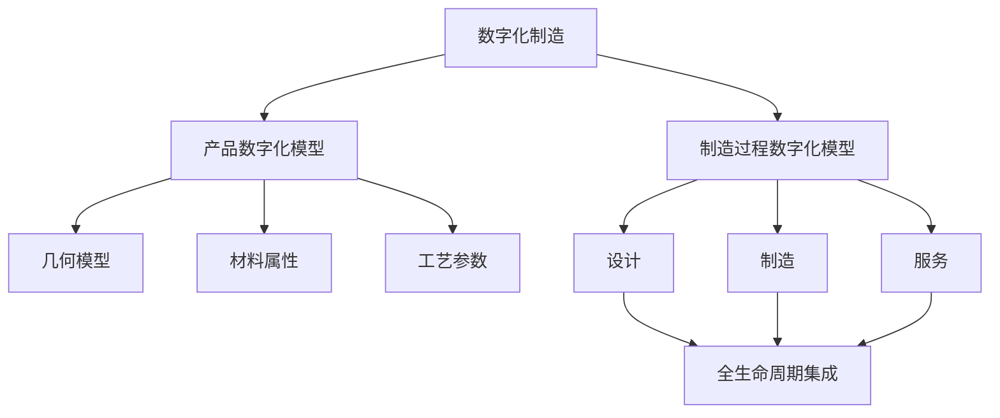
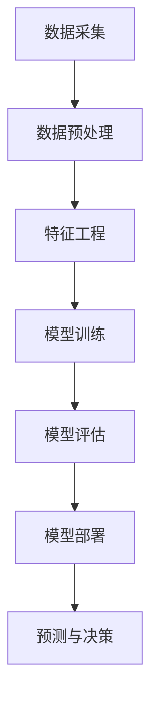
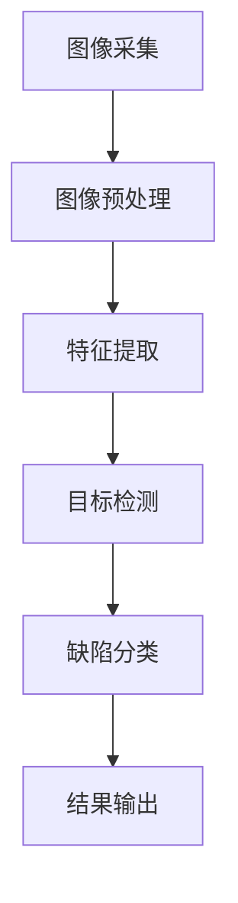
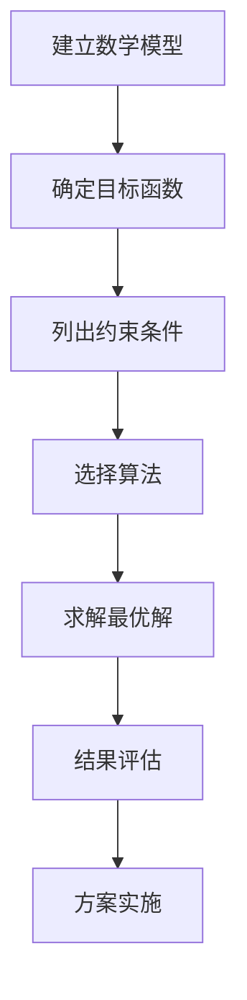

# 制造行业数字化、人工智能、大数据技术转型

## 1.背景介绍

在当今快速发展的数字时代,制造业正面临着前所未有的机遇与挑战。传统的制造模式已经无法满足日益增长的客户需求和市场竞争压力。为了保持竞争力,制造企业必须紧跟时代潮流,全面拥抱数字化、人工智能和大数据等新兴技术,实现技术转型升级。

数字化转型不仅可以提高生产效率、降低运营成本,更重要的是可以优化产品设计、个性化定制和服务增值,为客户带来全新的体验。人工智能技术可以在产品设计、工艺优化、预测维护等环节发挥重要作用。大数据分析则能够洞察市场趋势、客户需求和生产运营数据,为企业决策提供有力支撑。

制造业数字化转型是一个系统工程,涉及技术、流程、组织和文化等多个层面,需要制造企业高度重视并制定全面的转型战略。本文将全面解析制造业数字化、人工智能和大数据技术的核心理念、关键技术、实施路径和案例实践,为读者提供宝贵的指导和借鉴。

## 2.核心概念与联系

### 2.1 数字化制造

数字化制造(Digital Manufacturing)是指将数字技术、信息技术与制造技术相结合,建立产品全生命周期的数字化模型,并通过数字化模拟、优化和集成,实现制造过程的自动化、智能化和可视化管理。

数字化制造的核心是建立产品数字化模型(Digital Product Model)和制造过程数字化模型(Digital Manufacturing Process Model),并在两者之间实现无缝集成。其中,产品数字化模型包括产品的几何模型、材料属性、工艺参数等信息;制造过程数字化模型则描述了产品从设计到制造再到服务的全生命周期过程。

数字化制造技术可以支持产品的快速设计、工艺仿真优化、虚拟装配、智能制造执行系统等,极大提高了产品研发效率和制造质量。

### 2.2 人工智能在制造业的应用

人工智能(Artificial Intelligence)是一门研究如何模拟人类智能行为的理论与技术,包括机器学习、计算机视觉、自然语言处理、规划与决策等领域。在制造业中,人工智能技术可以广泛应用于以下场景:

- 产品设计优化:基于机器学习算法,优化产品结构和性能参数。
- 工艺规划与优化:利用规划与决策算法,自动生成最优工艺路线。
- 质量检测与缺陷识别:通过计算机视觉技术,实现自动化视觉检测。
- 预测性维护:基于大数据分析和机器学习模型,预测设备故障风险。
- 智能物流与调度:应用规划算法和优化模型,提高物料调度效率。

人工智能技术可以显著提升制造业的智能化水平,实现更加精准的决策、更高的生产效率和产品质量。

### 2.3 大数据分析在制造业的应用

大数据分析(Big Data Analytics)是指对海量、异构和动态的数据进行捕获、存储、整理、处理和分析,从中发现隐藏的知识和价值的技术与方法。在制造业中,大数据分析可以应用于以下场景:

- 产品数据分析:分析产品设计数据、测试数据,优化产品性能。
- 制造数据分析:分析生产过程数据,提高制造质量和效率。
- 设备数据分析:分析设备运行数据,实现设备状态监控和故障预测。
- 客户数据分析:分析客户需求和使用反馈数据,优化产品设计和服务。
- 供应链数据分析:分析供应链物流和库存数据,优化供应链管理。

大数据分析为制造企业提供了数据驱动的决策支持,有助于发现隐藏的业务规律和机遇,提高企业的运营效率和竞争力。

上述三大技术在制造业中相互关联、相互支撑。数字化制造为人工智能和大数据分析提供了数字化模型和数据基础;人工智能算法可以优化数字化模型和提高大数据分析的准确性;大数据分析则为人工智能模型提供训练数据,并为制造决策提供依据。三者的融合应用将加速制造业的智能化转型。

## 3.核心算法原理具体操作步骤

### 3.1 机器学习算法

机器学习是人工智能的核心技术之一,通过构建数学模型并利用算法从数据中学习知识,从而获得预测或决策能力。在制造业中,常用的机器学习算法包括:

1. **监督学习算法**
    - 回归算法:预测连续型目标变量,如产品性能参数预测。
    - 分类算法:预测离散型目标变量,如产品缺陷分类。
    - 支持向量机(SVM):用于分类和回归任务。

2. **无监督学习算法**
    - 聚类算法:对相似数据进行分组,如客户细分。
    - 关联规则挖掘:发现数据项之间的关联关系,如产品组合分析。

3. **强化学习算法**
    - Q-Learning:智能体通过与环境交互学习策略,如智能调度决策。

以预测性维护为例,机器学习算法的应用步骤如下:

1. **数据采集**: 收集设备运行数据,如温度、振动、电流等传感器数据。
2. **数据预处理**: 清洗异常数据,填充缺失值,进行标准化等。
3. **特征工程**: 从原始数据中提取有效特征,如统计特征、频域特征等。
4. **模型训练**: 使用监督学习算法(如随机森林)训练故障预测模型。
5. **模型评估**: 在测试集上评估模型性能,如准确率、召回率等指标。
6. **模型部署**: 将模型集成到预测系统中,实时预测设备故障风险。
7. **预测与决策**: 根据预测结果,制定维护策略,提高设备可用性。

### 3.2 计算机视觉算法

计算机视觉是人工智能的另一核心技术,通过图像处理和模式识别等技术,赋予计算机"视觉"能力。在制造业中,计算机视觉广泛应用于自动化视觉检测、缺陷识别、三维重构等场景。常用的计算机视觉算法包括:

1. **图像预处理算法**
    - 去噪、增强、分割等,提高图像质量。

2. **特征提取算法**
    - 边缘检测、角点检测等,提取图像特征。
    - 尺度不变特征转换(SIFT)、速度较高的强健特征(SURF)等,提取局部特征描述子。

3. **目标检测算法**
    - 基于模板匹配的算法,如均值匹配、相关滤波等。
    - 基于机器学习的算法,如Faster R-CNN、YOLO等。

4. **图像分割算法**
    - 基于阈值、边缘、区域等传统算法。
    - 基于深度学习的语义分割算法,如FCN、U-Net等。

以缺陷检测为例,计算机视觉算法的应用步骤如下:

1. **图像采集**: 使用工业相机获取产品图像。
2. **图像预处理**: 进行图像去噪、增强、校正等处理。
3. **特征提取**: 使用SIFT等算法提取图像局部特征描述子。
4. **目标检测**: 使用Faster R-CNN等算法检测产品缺陷区域。
5. **缺陷分类**: 使用机器学习算法(如SVM)对缺陷类型进行分类。
6. **结果输出**: 输出缺陷位置、类型及可视化结果。

### 3.3 优化算法

优化算法是一类用于求解最优解的数学算法,在制造业中广泛应用于工艺路线规划、参数优化、调度优化等场景。常用的优化算法包括:

1. **线性规划**
    - 单纯形算法:求解线性规划问题。
    - 内点算法:高效求解大规模线性规划问题。

2. **非线性规划**
    - 梯度下降法:利用目标函数梯度信息进行迭代优化。
    - 序列二次规划(SQP):将非线性问题序列近似为二次规划问题。

3. **整数规划**
    - 分支定界法:通过分支剪枝求解整数规划问题。
    - 切平面法:通过添加切平面约束逐步逼近最优解。

4. **启发式算法**
    - 遗传算法:模拟生物进化过程,求解组合优化问题。
    - 蚁群算法:模拟蚂蚁觅食行为,求解路径规划问题。

以工艺路线优化为例,优化算法的应用步骤如下:

1. **建立数学模型**: 将工艺路线优化问题形式化为数学模型。
2. **确定目标函数**: 根据优化目标(如成本最小化)构建目标函数。
3. **列出约束条件**: 列出工艺路线的各种约束条件,如时间、资源等。
4. **选择算法**: 根据问题特点选择合适的优化算法,如整数规划或遗传算法。
5. **求解最优解**: 使用选定的算法求解最优工艺路线方案。
6. **结果评估**: 评估优化结果是否满足实际需求。
7. **方案实施**: 将优化后的工艺路线方案应用到生产实践中。

## 4.数学模型和公式详细讲解举例说明

### 4.1 机器学习模型

#### 4.1.1 线性回归模型

线性回归是一种常用的监督学习算法,用于预测连续型目标变量。在制造业中,线性回归可用于产品性能参数预测、能耗预测等场景。

线性回归模型的数学表达式为:

$$y = w_0 + w_1x_1 + w_2x_2 + ... + w_nx_n + \epsilon$$

其中:
- $y$为目标变量
- $x_1, x_2, ..., x_n$为自变量(特征)
- $w_0, w_1, ..., w_n$为模型参数(权重)
- $\epsilon$为随机误差项

模型训练的目标是找到最优参数$w$,使得预测值$\hat{y}$与真实值$y$之间的误差最小化。通常采用最小二乘法求解,即最小化以下目标函数:

$$\min\limits_{w} \sum\limits_{i=1}^{m}(y_i - \hat{y}_i)^2 = \min\limits_{w} \sum\limits_{i=1}^{m}(y_i - w_0 - \sum\limits_{j=1}^{n}w_jx_{ij})^2$$

其中$m$为训练样本数量。

对于给定的训练数据$\{(x_i, y_i)\}_{i=1}^m$,可以使用普通最小二乘法(OLS)或梯度下降法等优化算法求解最优参数$w$。

#### 4.1.2 逻辑回归模型

逻辑回归是一种常用的分类算法,用于预测二