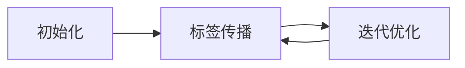

## 1.背景介绍

半监督学习是一种机器学习方法，它介于监督学习和无监督学习之间。在实际应用中，经常会遇到标签数据稀缺，而未标记数据却非常丰富的情况。半监督学习就是在这种背景下应运而生的。

## 2.核心概念与联系

半监督学习利用少量的标签数据和大量的未标记数据，通过学习数据的分布特性，提高学习模型的性能。其主要思想是假设数据的分布信息（如聚类、流形结构等）对于学习任务是有用的，并且这种信息可以从未标记数据中获取。

## 3.核心算法原理具体操作步骤

半监督学习的主要算法有自训练、多视图训练、协同训练、标签传播等。以标签传播算法为例，其操作步骤如下：

1. 初始化：将已标记数据的标签作为初始标签，未标记数据的标签设为未知。
2. 标签传播：根据数据的相似性，将已标记数据的标签传播给相似的未标记数据。
3. 迭代优化：反复执行标签传播步骤，直到标签稳定或达到预设的迭代次数。



## 4.数学模型和公式详细讲解举例说明

标签传播算法的数学模型基于图论，可以用拉普拉斯矩阵来表示数据的相似性。其中，$y_i$ 表示数据点 $i$ 的标签，$w_{ij}$ 表示数据点 $i$ 和 $j$ 的相似性，$D$ 是度矩阵，$L=D-W$ 是拉普拉斯矩阵。算法的目标是最小化以下能量函数：

$$E = \sum_{i,j} w_{ij} (y_i - y_j)^2 = y^T L y$$

## 5.项目实践：代码实例和详细解释说明

下面是一个使用标签传播算法的代码实例：

```python
from sklearn import datasets
from sklearn.semi_supervised import LabelSpreading

# 加载数据
digits = datasets.load_digits()
rng = np.random.RandomState(0)
indices = np.arange(len(digits.data))
rng.shuffle(indices)

# 设置标签和未标记数据
n_labeled_points = int(len(digits.data)/10)
labels = digits.target[indices[:n_labeled_points]]

# 创建和训练模型
lp_model = LabelSpreading(gamma=.25, max_iter=20)
lp_model.fit(digits.data[indices[:n_labeled_points]], labels)
```

## 6.实际应用场景

半监督学习在许多实际应用中都有广泛的应用，如图像识别、文本分类、生物信息学等，尤其在标签数据稀缺的情况下，其性能优于纯监督学习。

## 7.工具和资源推荐

推荐使用 Python 的 scikit-learn 库进行半监督学习，它提供了多种半监督学习算法的实现，如标签传播、标签传播等。

## 8.总结：未来发展趋势与挑战

随着大数据时代的到来，未标记数据的获取越来越容易，半监督学习的重要性也越来越大。然而，如何更好地利用未标记数据，如何处理标签噪声，如何评估和选择模型等问题，都是半监督学习面临的挑战。

## 9.附录：常见问题与解答

1. **问题**：半监督学习和无监督学习有什么区别？
   **答案**：半监督学习和无监督学习的主要区别在于，半监督学习同时使用了标签数据和未标记数据，而无监督学习只使用未标记数据。

2. **问题**：为什么半监督学习能提高模型性能？
   **答案**：半监督学习能提高模型性能的主要原因是，它利用了未标记数据的分布信息，这些信息可以帮助模型更好地理解数据的结构和模式。

作者：禅与计算机程序设计艺术 / Zen and the Art of Computer Programming