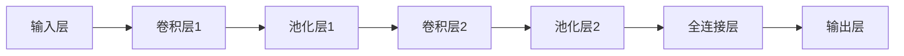

# 卷积神经网络在图像视觉领域的应用

## 1. 背景介绍
### 1.1 图像视觉的重要性
### 1.2 传统图像处理方法的局限性  
### 1.3 深度学习在图像视觉中的突破

## 2. 卷积神经网络的核心概念
### 2.1 卷积层
#### 2.1.1 卷积操作原理
#### 2.1.2 卷积核与特征提取
#### 2.1.3 感受野
### 2.2 池化层 
#### 2.2.1 最大池化
#### 2.2.2 平均池化
#### 2.2.3 池化层作用
### 2.3 激活函数
#### 2.3.1 ReLU
#### 2.3.2 Sigmoid
#### 2.3.3 Tanh
### 2.4 全连接层
### 2.5 卷积神经网络整体结构

## 3. 卷积神经网络算法步骤
### 3.1 前向传播
#### 3.1.1 卷积层前向传播
#### 3.1.2 池化层前向传播 
#### 3.1.3 激活函数前向传播
#### 3.1.4 全连接层前向传播
### 3.2 反向传播 
#### 3.2.1 全连接层反向传播
#### 3.2.2 激活函数反向传播
#### 3.2.3 池化层反向传播
#### 3.2.4 卷积层反向传播
### 3.3 参数更新
#### 3.3.1 学习率
#### 3.3.2 优化器
##### 3.3.2.1 SGD
##### 3.3.2.2 Adam

## 4. 卷积神经网络的数学原理
### 4.1 卷积操作的数学表示
#### 4.1.1 二维卷积
$$O(i,j) = \sum_{m}\sum_{n} I(i+m, j+n)K(m,n)$$
其中，$O$为输出特征图，$I$为输入特征图，$K$为卷积核。
#### 4.1.2 三维卷积
### 4.2 反向传播的数学推导
#### 4.2.1 卷积层反向传播推导
#### 4.2.2 池化层反向传播推导
#### 4.2.3 激活函数反向传播推导
### 4.3 损失函数 
#### 4.3.1 交叉熵损失
#### 4.3.2 均方误差损失

## 5. 卷积神经网络的实践应用
### 5.1 图像分类
#### 5.1.1 LeNet
#### 5.1.2 AlexNet
#### 5.1.3 VGGNet
#### 5.1.4 GoogLeNet
#### 5.1.5 ResNet
### 5.2 目标检测 
#### 5.2.1 R-CNN
#### 5.2.2 Fast R-CNN
#### 5.2.3 Faster R-CNN
#### 5.2.4 YOLO
#### 5.2.5 SSD
### 5.3 语义分割
#### 5.3.1 FCN
#### 5.3.2 U-Net
#### 5.3.3 SegNet
#### 5.3.4 DeepLab系列
### 5.4 代码实践
#### 5.4.1 使用Keras实现图像分类
#### 5.4.2 使用PyTorch实现目标检测
#### 5.4.3 使用TensorFlow实现语义分割

## 6. 卷积神经网络的应用场景
### 6.1 自动驾驶
### 6.2 医学影像分析
### 6.3 人脸识别
### 6.4 遥感图像分析
### 6.5 工业缺陷检测

## 7. 卷积神经网络相关工具和资源
### 7.1 深度学习框架
#### 7.1.1 TensorFlow
#### 7.1.2 PyTorch
#### 7.1.3 Keras
### 7.2 预训练模型库
#### 7.2.1 TensorFlow Hub
#### 7.2.2 PyTorch Hub
### 7.3 数据集资源
#### 7.3.1 ImageNet
#### 7.3.2 COCO
#### 7.3.3 PASCAL VOC
### 7.4 论文与教程
#### 7.4.1 卷积神经网络经典论文
#### 7.4.2 在线教程资源

## 8. 卷积神经网络的未来发展
### 8.1 模型压缩与加速
### 8.2 可解释性与可视化
### 8.3 小样本学习
### 8.4 域适应与迁移学习
### 8.5 三维视觉中的应用
### 8.6 未来挑战与机遇

## 9. 常见问题与解答
### 9.1 如何选择卷积神经网络的超参数？
### 9.2 卷积神经网络容易过拟合，如何解决？
### 9.3 卷积神经网络可以处理任意大小的输入图像吗？
### 9.4 如何平衡卷积神经网络的精度和速度？
### 9.5 卷积神经网络可以应用于哪些非视觉领域？

---

卷积神经网络（Convolutional Neural Network, CNN）是深度学习中一种专门用于处理网格拓扑结构数据（如图像）的人工神经网络。它在图像识别、图像分类、目标检测、人脸识别等计算机视觉任务中取得了巨大成功，成为当前图像视觉领域的主流方法。

传统的图像处理方法如模板匹配、特征提取等，在面对复杂多变的现实场景时往往难以取得理想效果。而卷积神经网络通过逐层提取图像特征，可以自动学习到图像数据中的高层语义信息，克服了人工设计特征的局限性。

卷积神经网络主要由卷积层、池化层和全连接层组成。其中，卷积层通过卷积操作提取局部特征；池化层通过降采样压缩特征图，提高特征的鲁棒性；全连接层对卷积和池化后的特征进行分类预测。多个这样的层级堆叠组合，逐步将低层局部特征组合为高层全局特征，最终映射到样本的类别标签。

卷积神经网络的训练过程通过前向传播和反向传播交替进行。前向传播时，输入数据经过逐层的卷积、激活、池化等操作得到输出；反向传播时，根据损失函数计算梯度，并将梯度反向传播到每一层，更新网络参数。重复这一过程，直到网络收敛。

卷积神经网络在图像分类、目标检测、语义分割等任务中都取得了瞩目成就。图像分类方面，从LeNet、AlexNet到VGGNet、GoogLeNet、ResNet等，卷积神经网络的精度不断刷新。目标检测方面，R-CNN系列、YOLO、SSD等算法使得实时检测成为可能。语义分割方面，FCN、U-Net、SegNet、DeepLab等网络逐步提升了像素级预测的精度。

卷积神经网络在自动驾驶、医疗影像分析、人脸识别、遥感图像分析、工业缺陷检测等领域得到广泛应用，极大地推动了人工智能技术的发展。各种深度学习框架如TensorFlow、PyTorch使得卷积神经网络的实现和训练变得更加便捷。ImageNet、COCO等大型数据集为算法提供了训练素材。

展望未来，卷积神经网络在模型压缩、可解释性、小样本学习、域适应、三维视觉等方面还有很大的发展空间。同时，其在非视觉领域如语音识别、自然语言处理等方面的应用也逐渐受到关注。

总之，卷积神经网络是当前图像视觉领域最重要的工具之一。掌握卷积神经网络的基本原理和实践技能，对于从事计算机视觉、人工智能相关工作的技术人员来说至关重要。

作者：禅与计算机程序设计艺术 / Zen and the Art of Computer Programming