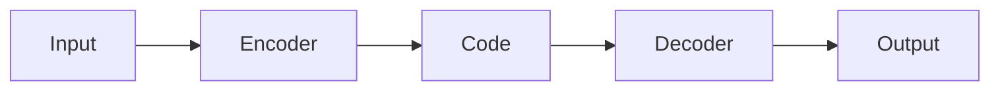

# 变分自编码器VAE原理与代码实例讲解

## 1.背景介绍

### 1.1 生成模型的挑战

在机器学习领域,生成模型是一类非常重要的模型,它们旨在从训练数据中学习数据的概率分布,并能够生成新的类似于训练数据的样本。生成模型在许多领域都有广泛的应用,例如计算机视觉、自然语言处理、音频合成等。然而,训练一个高质量的生成模型并非一件容易的事情。

传统的生成模型如高斯混合模型(GMM)和隐马尔可夫模型(HMM)在处理简单数据时表现良好,但是当数据变得复杂时,它们的性能就会迅速下降。这是因为这些模型在建模复杂数据分布时存在着固有的局限性。

### 1.2 变分自编码器的出现

为了解决传统生成模型的局限性,变分自编码器(Variational Autoencoder, VAE)应运而生。VAE是一种基于深度学习的生成模型,它借鉴了自编码器(Autoencoder)的思想,将数据压缩到一个低维的潜在空间(Latent Space),然后再从这个潜在空间生成新的数据。

VAE的核心思想是将数据的生成过程建模为一个潜在变量模型,通过最大化边际对数似然函数来学习模型参数。由于直接最大化边际对数似然函数是一个难以解决的问题,VAE引入了变分推断(Variational Inference)的思路,将其转化为一个更易于优化的下界问题。

VAE的出现为生成模型的发展带来了新的契机,它能够有效地学习复杂数据的分布,并生成高质量的新样本。自从提出以来,VAE已经在多个领域取得了巨大的成功,例如图像生成、语音合成、机器翻译等。

## 2.核心概念与联系

### 2.1 自编码器(Autoencoder)

为了理解VAE的原理,我们首先需要了解自编码器(Autoencoder)的概念。自编码器是一种无监督学习模型,它由两部分组成:编码器(Encoder)和解码器(Decoder)。

编码器的作用是将输入数据压缩到一个低维的潜在空间,而解码器则试图从这个潜在空间重构出原始数据。通过最小化输入数据和重构数据之间的差异,自编码器可以学习到数据的紧凑表示。

自编码器的结构如下图所示:



### 2.2 变分推断(Variational Inference)

变分推断是一种近似推断的方法,它在机器学习和贝叶斯统计中被广泛使用。在VAE中,我们需要推断出潜在变量的后验分布,但是由于模型的复杂性,这个后验分布通常是无法直接计算的。

变分推断的思路是引入一个可以计算的近似分布(通常称为变分分布)来近似真实的后验分布。通过最小化变分分布和真实后验分布之间的KL散度,我们可以得到一个较好的近似。

### 2.3 重参数技巧(Reparameterization Trick)

在训练VAE时,我们需要对潜在变量进行采样,但是由于采样过程是不可微的,这会导致梯度无法反向传播。为了解决这个问题,VAE引入了重参数技巧。

重参数技巧的核心思想是将采样过程转化为一个可微的形式,使得梯度可以顺利地反向传播。具体来说,我们将潜在变量表示为一个确定性的变换加上一个随机噪声项,从而使得采样过程变得可微。

## 3.核心算法原理具体操作步骤

### 3.1 VAE的生成过程

VAE的生成过程可以描述为以下概率模型:

$$
p(x,z) = p(x|z)p(z)
$$

其中,$$x$$表示观测数据,$$z$$表示潜在变量。我们假设潜在变量$$z$$服从一个简单的先验分布$$p(z)$$,通常选择标准正态分布。而条件分布$$p(x|z)$$则由解码器网络来建模。

在生成新数据时,我们首先从先验分布$$p(z)$$中采样一个潜在变量$$z$$,然后将其输入解码器网络,得到观测数据$$x$$的生成概率分布$$p(x|z)$$。

### 3.2 VAE的训练过程

VAE的训练目标是最大化观测数据$$x$$的边际对数似然函数:

$$
\log p(x) = \log \int p(x,z) dz = \log \int p(x|z)p(z) dz
$$

然而,由于积分项的存在,直接最大化这个目标函数是非常困难的。VAE的关键思想是引入一个变分分布$$q(z|x)$$来近似真实的后验分布$$p(z|x)$$,并最大化以下的证据下界(Evidence Lower Bound, ELBO):

$$
\begin{aligned}
\log p(x) &\geq \mathbb{E}_{q(z|x)}[\log p(x|z)] - D_{KL}(q(z|x)||p(z)) \\
&= \mathcal{L}(x,\theta,\phi)
\end{aligned}
$$

其中,$$\theta$$表示解码器网络的参数,$$\phi$$表示编码器网络的参数。编码器网络的作用是对给定的$$x$$输出变分分布$$q(z|x)$$的参数。

通过最大化ELBO,我们可以同时优化编码器和解码器网络的参数。具体的操作步骤如下:

1. 从训练数据中采样一个样本$$x$$。
2. 通过编码器网络计算变分分布$$q(z|x)$$的参数。
3. 从变分分布$$q(z|x)$$中采样一个潜在变量$$z$$。
4. 将$$z$$输入解码器网络,计算$$\log p(x|z)$$。
5. 计算KL散度项$$D_{KL}(q(z|x)||p(z))$$。
6. 计算ELBO损失函数$$-\mathcal{L}(x,\theta,\phi)$$。
7. 对损失函数进行反向传播,更新编码器和解码器网络的参数。

### 3.3 重构损失和KL散度项

在ELBO损失函数中,有两个重要的项需要计算:重构损失$$\mathbb{E}_{q(z|x)}[\log p(x|z)]$$和KL散度项$$D_{KL}(q(z|x)||p(z))$$。

重构损失衡量了解码器网络重构输入数据的能力。通常,我们会假设观测数据$$x$$服从某种分布(如高斯分布或者伯努利分布),并计算该分布的对数似然。

KL散度项则衡量了变分分布$$q(z|x)$$与先验分布$$p(z)$$之间的差异。由于我们通常会选择标准正态分布作为先验分布,因此KL散度项可以解析地计算出来。

在训练过程中,我们需要同时最小化这两个项,以达到一个平衡:重构损失越小,说明解码器网络的重构能力越强;KL散度项越小,说明变分分布与先验分布越接近,从而使得潜在空间的表示更加平滑。

## 4.数学模型和公式详细讲解举例说明

在上一节中,我们介绍了VAE的核心算法原理。现在,我们将更加详细地讨论VAE中涉及的数学模型和公式。

### 4.1 变分分布和重参数技巧

在VAE中,我们通常会选择具有某种参数形式的变分分布$$q(z|x)$$,例如高斯分布或者逻辑正态分布。假设我们选择了均值为$$\mu(x)$$、标准差为$$\sigma(x)$$的高斯分布作为变分分布,则其概率密度函数为:

$$
q(z|x) = \mathcal{N}(z|\mu(x),\sigma^2(x))
$$

其中,$$\mu(x)$$和$$\sigma(x)$$由编码器网络输出。

为了能够对潜在变量$$z$$进行采样并使得梯度可以反向传播,我们需要引入重参数技巧。具体来说,我们将$$z$$重写为:

$$
z = \mu(x) + \sigma(x) \odot \epsilon, \quad \epsilon \sim \mathcal{N}(0,1)
$$

其中,$$\odot$$表示元素wise乘积,$$\epsilon$$是一个标准正态分布的随机噪声项。通过这种重参数的方式,我们可以保证采样过程是可微的,从而使得梯度可以正常反向传播。

### 4.2 重构损失

在VAE中,我们需要计算重构损失$$\mathbb{E}_{q(z|x)}[\log p(x|z)]$$。这个期望项可以通过蒙特卡洛采样的方式来近似计算:

$$
\mathbb{E}_{q(z|x)}[\log p(x|z)] \approx \frac{1}{L} \sum_{l=1}^L \log p(x|z^{(l)}), \quad z^{(l)} \sim q(z|x)
$$

其中,$$L$$是采样的次数。

对于不同类型的观测数据$$x$$,我们需要选择不同的似然函数$$p(x|z)$$。例如,对于连续值的图像数据,我们可以假设像素值服从高斯分布:

$$
p(x|z) = \mathcal{N}(x|\mu_\theta(z),\sigma_\theta^2(z))
$$

其中,$$\mu_\theta(z)$$和$$\sigma_\theta(z)$$由解码器网络输出。对于二值化的图像数据,我们可以假设像素值服从伯努利分布:

$$
p(x|z) = \prod_{i=1}^D \text{Bern}(x_i|\mu_{\theta,i}(z))
$$

其中,$$D$$是数据的维度,$$\mu_{\theta,i}(z)$$表示第$$i$$个维度上的伯努利分布参数,由解码器网络输出。

### 4.3 KL散度项

另一个需要计算的项是KL散度项$$D_{KL}(q(z|x)||p(z))$$,它衡量了变分分布$$q(z|x)$$与先验分布$$p(z)$$之间的差异。

假设我们选择了标准正态分布作为先验分布,即$$p(z) = \mathcal{N}(z|0,1)$$,而变分分布为$$q(z|x) = \mathcal{N}(z|\mu(x),\sigma^2(x))$$,则KL散度项可以解析地计算出来:

$$
\begin{aligned}
D_{KL}(q(z|x)||p(z)) &= \int q(z|x) \log \frac{q(z|x)}{p(z)} dz \\
&= \frac{1}{2} \sum_{j=1}^J \left( 1 + \log(\sigma_j^2(x)) - \mu_j^2(x) - \sigma_j^2(x) \right)
\end{aligned}
$$

其中,$$J$$是潜在变量$$z$$的维度。

在实际训练中,我们需要最小化重构损失和KL散度项的加权和,以达到一个平衡。通常,我们会给KL散度项加一个权重系数$$\beta$$,从而控制潜在空间的平滑程度。

## 5.项目实践:代码实例和详细解释说明

在理解了VAE的原理之后,我们将通过一个实际的代码示例来进一步加深理解。我们将使用PyTorch框架,在MNIST手写数字数据集上训练一个VAE模型。

### 5.1 导入所需的库

```python
import torch
import torch.nn as nn
import torch.nn.functional as F
from torchvision import datasets, transforms
```

### 5.2 定义编码器和解码器网络

我们首先定义编码器和解码器网络的结构。编码器网络将输入图像编码为均值$$\mu$$和标准差$$\sigma$$,而解码器网络则将潜在变量$$z$$解码为重构图像。

```python
class Encoder(nn.Module):
    def __init__(self, latent_dim):
        super(Encoder, self).__init__()
        self.fc1 = nn.Linear(784, 400)
        self.fc2 = nn.Linear(400, latent_dim)
        self.fc3 = nn.Linear(400, latent_dim)

    def forward(self, x):
        x = x.view(-1, 784)
        h = F.relu(self.fc1(x))
        mu = self.fc2(h)
        log_var = self.fc3(h)
        return mu, log_var

class Decoder(nn.Module):
    def __init__(self, latent_dim):
        super(Decoder, self).__init__()
        self.fc