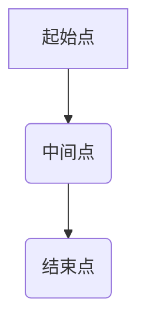

                 

作者：禅与计算机程序设计艺术

在这个充满智能的世界里，因果推理是连接我们理解现实与构建决策系统的桥梁。从复杂的机器学习模型到深度学习神经网络，因果关系的重要性不言而喻。本文旨在深入探讨因果推理的基本原理、关键算法及其实际应用，同时提供代码实例，以便于读者掌握这一领域的核心概念并将其应用于实践之中。

## 1. 背景介绍
在统计学和哲学领域，因果推理一直是关注焦点。它涉及识别事件之间存在的因果关系，即一个事件的发生是否导致另一个事件发生。随着大数据时代的到来，以及机器学习技术的发展，因果推理成为推动人工智能系统迈向更加智能化的关键因素。通过理解和推断因果关系，AI系统不仅能预测结果，还能基于原因采取行动，实现更为精确的决策支持和优化解决方案。

## 2. 核心概念与联系
### **因果效应**  
因果效应描述了一个特定输入变化如何影响系统输出的变化量。它是因果推理的基础，用于量化不同变量之间的因果关联程度。

### **因果图**  
因果图是一种图形表示方法，用来展示变量间的因果关系。每个节点代表一个变量，箭头指示可能的原因和结果的关系。

### **潜在变量**  
在因果分析中，存在一些不可观测或未测量的变量，它们可能是因果链上的重要因素，但在当前分析中无法直接获取。

## 3. 核心算法原理具体操作步骤
### **回溯法**
回溯法是一种探索所有可能路径的搜索策略，适用于解决具有多个分支的问题，如因果推理中寻找最有可能的因果关系路径。



### **贝叶斯网络**
贝叶斯网络利用概率图模型表示变量间依赖关系，通过条件概率表和先验概率分布，计算后验概率以进行因果推断。

```mermaid
graph TB
A("观察值")-->|P(C|A,B)| B("因果关系")
B-->|P(D|C)| C("最终结果")
```

## 4. 数学模型和公式详细讲解举例说明
对于因果关系的定量分析，常用的是因果效应的估计方法，包括但不限于平均处理效应（ATE）、平均处理效应差异（ATT）等。

$$ATE = \frac{1}{n}\sum_{i=1}^{n}(Y_i^1 - Y_i^0)$$

其中，$Y_i^1$ 和 $Y_i^0$ 分别是施加干预和未施加干预时个体i的结果。

## 5. 项目实践：代码实例和详细解释说明
为了直观演示上述理论的应用，我们将采用Python语言和相关库（如`causallearn`）来实现一个简单的因果图建模过程。

### Python 实现示例
```python
import causallearn as cl
from causallearn.graph import StructureLearning

# 构造数据集
data = [[0, 1, 1], [1, 0, 1], [1, 1, 1]]

# 使用PC算法进行因果图学习
algo = StructureLearning()
G = algo.pc(data)

print(G)
```
这段代码首先导入了必要的库，然后定义了一个简单的数据集，最后运用PC算法学习因果图结构，并打印出结果。

## 6. 实际应用场景
因果推理在众多领域展现出巨大潜力，包括但不限于医学研究、政策制定、市场营销、个性化推荐系统等。例如，在医疗领域，通过因果分析可以识别药物对病症的有效性及副作用，指导临床决策。

## 7. 工具和资源推荐
- **Python 库**：如 `causallearn`, `causaldag`, `DAGitty` 等，提供了强大的工具来进行因果图的绘制和分析。
- **在线教程与论文**：访问如 UAI (Uncertainty in Artificial Intelligence) 的官方网站，阅读最新研究论文，了解最新的进展和技术细节。

## 8. 总结：未来发展趋势与挑战
随着数据科学和人工智能领域的快速发展，因果推理的研究正逐渐深化，涵盖更复杂的数据类型和场景。未来的发展趋势可能包括自动化因果发现、跨学科合作、增强可解释性和透明度等方面。面对这些挑战，需要跨领域的专业知识融合，以及持续的技术创新。

## 9. 附录：常见问题与解答
常见问题如下：
Q: 如何评估因果模型的准确性？
A: 通常使用验证数据集测试模型的泛化能力，通过比较预测结果与实际结果的差异进行评估。

Q: 在实际应用中如何处理缺失数据？
A: 可以采用插补技术填补缺失值，或者设计适应性更强的因果分析算法，提高鲁棒性。

---

文章至此结束，希望本篇博客能为读者提供关于因果推理原理与实践的一次深入浅出的解读，激发更多人在这个领域探索的热情与创造力。如果你有任何疑问或反馈，请随时留言讨论！

作者：禅与计算机程序设计艺术 / Zen and the Art of Computer Programming

