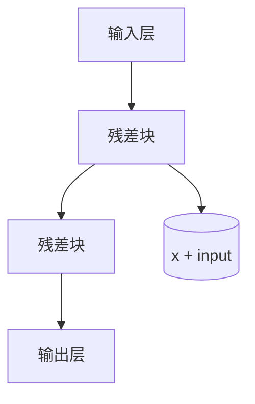

                 

作者：禅与计算机程序设计艺术

**Artificial Intelligence**; 大模型: **Large Models**

随着深度学习和大数据时代的到来，AI图像处理技术取得了飞速发展，推动了一系列重大突破和创新。本篇博客旨在探讨AI大模型如何深刻影响并重塑未来的视觉技术领域，包括其核心概念、算法原理、应用案例以及未来展望。

## 背景介绍
近年来，深度学习在计算机视觉领域的应用日益广泛，从物体检测、图像分割到风格迁移、图像生成，一系列基于AI的大规模模型展现出令人惊叹的能力。这些模型通常采用多层次的神经网络结构，通过大量的训练数据自动学习特征表示，实现了对复杂图像模式的有效捕获和理解。随着模型容量的不断增大，它们在解决现实世界复杂场景时表现出更强的泛化能力，从而推动了视觉技术向更高层次的发展。

## 核心概念与联系
### 模型架构：深层神经网络
深度学习的核心在于多层神经网络的设计，每一层提取不同的特征层级。这种自下而上的特征抽象过程使得模型能识别出更加复杂的图像结构，如边缘、纹理、形状直至对象本身。

### 数据驱动：大量标注数据
AI大模型的成功离不开海量的高质量标注数据集的支持。这些数据集不仅丰富多样，且经过精心标记，使模型能够在特定领域或广泛的场景中实现高精度的学习和预测。

### 训练策略：优化算法与大规模计算资源
为了训练如此庞大的模型，需要高效的优化算法，如Adam、SGD等，以及强大的计算资源支持。分布式训练成为可能，利用GPU集群、TPU等硬件加速器，极大地缩短了模型训练时间，同时也提升了模型性能。

## 核心算法原理具体操作步骤
以ResNet（残差网络）为例，它通过引入跳跃连接的方式解决深度网络的退化问题，允许模型学习更深层次的表征，同时保持梯度在反向传播过程中的稳定流动。以下是构建一个简单的ResNet的基本步骤：



## 数学模型和公式详细讲解举例说明
对于ResNet中的残差块，我们可以使用以下公式来描述其运作机制：

$$ y = F(x) + x $$

其中 $y$ 表示通过残差块后的输出，$F(x)$ 是残差块内部的所有运算过程（例如卷积、激活函数、池化等），而$x$ 则是原始输入。这一设计使得模型在网络加深时依然能够有效传递梯度，避免了常见的梯度消失问题。

## 项目实践：代码实例和详细解释说明
### 实例代码：
假设我们正在开发一个简单的ResNet模型用于图像分类任务。以下是一个简化的Python代码片段：

```python
import torch.nn as nn
from torch import Tensor

class BasicBlock(nn.Module):
    expansion = 1

    def __init__(self, in_channels: int, out_channels: int, stride: int = 1) -> None:
        super().__init__()
        self.conv1 = nn.Conv2d(in_channels, out_channels, kernel_size=3, stride=stride, padding=1)
        self.bn1 = nn.BatchNorm2d(out_channels)
        self.relu = nn.ReLU(inplace=True)
        self.conv2 = nn.Conv2d(out_channels, out_channels * self.expansion, kernel_size=3, padding=1)
        self.bn2 = nn.BatchNorm2d(out_channels * self.expansion)

    def forward(self, x: Tensor) -> Tensor:
        identity = x

        out = self.conv1(x)
        out = self.bn1(out)
        out = self.relu(out)

        out = self.conv2(out)
        out = self.bn2(out)

        if self.expansion != 1 or identity.shape[1] != out.shape[1]:
            identity = nn.Sequential(
                nn.Conv2d(identity.shape[1], out.shape[1] * self.expansion, kernel_size=1, stride=stride),
                nn.BatchNorm2d(out.shape[1] * self.expansion)
            )(identity)

        return self.relu(out + identity)

class ResNet(nn.Module):
    def __init__(self, block, layers, num_classes=10):
        super(ResNet, self).__init__()
        self.in_channels = 64
        self.conv1 = nn.Conv2d(3, 64, kernel_size=7, stride=2, padding=3, bias=False)
        self.bn1 = nn.BatchNorm2d(64)
        self.relu = nn.ReLU(inplace=True)
        self.maxpool = nn.MaxPool2d(kernel_size=3, stride=2, padding=1)
        self.layer1 = self._make_layer(block, 64, layers[0])
        self.layer2 = self._make_layer(block, 128, layers[1], stride=2)
        self.layer3 = self._make_layer(block, 256, layers[2], stride=2)
        self.layer4 = self._make_layer(block, 512, layers[3], stride=2)
        self.avg_pool = nn.AdaptiveAvgPool2d((1, 1))
        self.fc = nn.Linear(512 * block.expansion, num_classes)

    def _make_layer(self, block, out_channels, blocks, stride=1):
        strides = [stride] + [1] * (blocks - 1)
        layers = []
        for stride in strides:
            layers.append(block(self.in_channels, out_channels, stride))
            self.in_channels = out_channels * block.expansion
        return nn.Sequential(*layers)

    def forward(self, x):
        x = self.conv1(x)
        x = self.bn1(x)
        x = self.relu(x)
        x = self.maxpool(x)

        x = self.layer1(x)
        x = self.layer2(x)
        x = self.layer3(x)
        x = self.layer4(x)

        x = self.avg_pool(x)
        x = x.view(x.size(0), -1)
        x = self.fc(x)

        return x

model = ResNet(BasicBlock, [2, 2, 2, 2]) # 构建一个浅层的ResNet-18模型
```

这段代码展示了如何定义基本残差块`BasicBlock`以及整个ResNet模型结构，并实现了一个简单的前馈流程。

## 实际应用场景
AI大模型广泛应用于以下领域：
- **自动驾驶**：利用图像识别技术进行道路环境感知与决策。
- **医疗影像分析**：辅助医生诊断疾病，如癌症筛查、病理检测等。
- **安防监控**：实时监控、行为识别及异常事件报警。
- **虚拟现实/增强现实**：生成更加逼真的视觉效果和交互体验。

## 工具和资源推荐
为了促进学习和研究，以下是一些值得推荐的工具和资源：
- **TensorFlow** 和 **PyTorch**：这两款开源库提供了丰富的API支持深度学习模型构建。
- **Kaggle**：参与竞赛或访问公开数据集，提升实践能力。
- **Coursera & edX**：在线课程平台提供系统性学习资料。

## 总结：未来发展趋势与挑战
随着AI大模型在计算能力、训练效率和泛化能力上的持续优化，未来的视觉技术将更趋成熟且应用范围更为广阔。然而，随之而来的是对隐私保护、伦理道德以及可持续发展等方面的考量。未来的研究和发展应注重解决这些挑战，同时探索跨模态融合、解释性和可解释性的方法，以推动AI在视觉领域的健康发展。

## 附录：常见问题与解答
### Q&A:
- **Q**: 如何选择合适的超参数？
- **A**: 超参数的选择通常依赖于实验验证和经验法则，使用网格搜索、随机搜索或贝叶斯优化等方法可以帮助找到最佳配置。
- **Q**: AI模型如何处理小样本学习问题？
- **A**: 对于小样本学习，可以采用迁移学习、数据增强、主动学习等策略来提高模型性能。

通过深入探讨AI大模型在图像处理领域的最新进展及其实际应用案例，我们能够预见其在未来视觉技术创新中的巨大潜力。无论是学术研究还是工业应用，AI大模型都在不断重塑着我们的世界，驱动着科技的前沿发展。

---

作者：禅与计算机程序设计艺术 / Zen and the Art of Computer Programming

