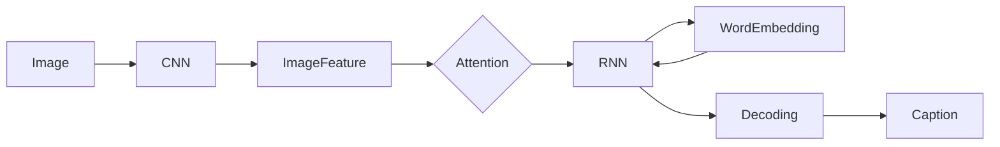

# 图像字幕生成原理与代码实战案例讲解

## 1. 背景介绍

图像字幕生成(Image Captioning)是一项非常有趣和具有挑战性的任务,它融合了计算机视觉(Computer Vision)和自然语言处理(Natural Language Processing)两大领域的前沿技术。其目标是让计算机能够像人一样,通过观察一张图片,自动生成一段自然语言描述,概括图片的主要内容。这对于图像检索、无障碍辅助、智能监控等诸多应用场景都有重要意义。

近年来,随着深度学习的蓬勃发展,特别是卷积神经网络(CNN)在计算机视觉领域和循环神经网络(RNN)在自然语言处理领域取得的突破性进展,图像字幕生成技术也迎来了飞速发展的黄金时期。各种创新的模型和方法不断涌现,使得生成的图像描述语句越来越接近人类的表达,甚至在一些评测指标上已经超越了人类水平。

本文将全面而系统地介绍图像字幕生成的原理、经典模型、关键技术、代码实战以及未来发展趋势。通过本文的学习,读者将对图像字幕生成有一个全面的认识和深入的理解,并能够动手实现一个完整的图像字幕生成系统。

## 2. 核心概念与联系

要理解图像字幕生成的原理,首先需要了解几个核心概念:

- 卷积神经网络(CNN):用于提取图像的高层语义特征
- 循环神经网络(RNN):用于生成序列化的文本描述
- 注意力机制(Attention Mechanism):用于在生成描述时选择性地关注图像的不同区域
- 词嵌入(Word Embedding):将单词映射为密集向量表示
- 解码策略(Decoding Strategy):在推理阶段用于生成最优描述序列

下图展示了这些核心概念在图像字幕生成模型中的作用和联系:



可以看到,输入的图像首先经过CNN提取高层语义特征,然后通过注意力机制选择性地关注图像的不同区域,再将其输入RNN进行序列解码生成描述。其中词嵌入用于将单词映射为密集向量便于模型处理,而解码策略则用于在推理阶段搜索最优的描述序列。

## 3. 核心算法原理具体操作步骤

图像字幕生成的核心是Encoder-Decoder框架,其中Encoder负责理解图像内容,Decoder负责根据图像特征生成描述文本。下面我们详细介绍其具体步骤。

### 3.1 图像特征提取

首先使用预训练的CNN模型(如ResNet、Inception等)对输入图像做前向传播,提取其高层语义特征。设输入图像为 $I$,提取到的图像特征为 $v=CNN(I) \in \mathbb{R}^{d}$,其中 $d$ 为特征维度。

### 3.2 特征编码

由于CNN提取到的特征是一个固定长度的向量,而描述文本是一个不定长序列,需要将图像特征重复多次输入到RNN中。设描述长度为 $T$,则将图像特征重复 $T$ 次得到特征序列 $V=[v_1,v_2,...,v_T], v_i=v$。

### 3.3 单词解码

RNN逐步解码生成描述,在每个时间步 $t$,根据上一步的隐状态 $h_{t-1}$、上一步生成的单词 $y_{t-1}$ 以及当前图像特征 $v_t$,更新隐状态并预测当前时刻的单词 $y_t$:

$$
h_t=RNN(h_{t-1},[y_{t-1},v_t]) \\
y_t \sim \text{softmax}(W_o h_t)
$$

其中 $[·]$ 表示拼接操作,$W_o$ 为输出映射矩阵。

### 3.4 注意力机制

传统方法中,每个时间步使用的都是同一个图像特征,忽略了图像不同区域的重要性。注意力机制能够让模型根据已生成的文本内容,自适应地分配不同区域的权重,更好地捕捉图像和文本的对应关系。

设在时间步 $t$,图像的 $L$ 个区域特征为 $a=[a_1,a_2,...,a_L]$,则注意力权重为:

$$
e_{ti} = f_{att}(a_i, h_{t-1}) \\
\alpha_{ti} = \text{softmax}(e_{ti})
$$

其中 $f_{att}$ 可以是一个多层感知机。然后根据注意力权重对图像特征进行加权求和,得到 $t$ 时刻的上下文向量 $c_t$:

$$
c_t=\sum_{i=1}^L \alpha_{ti} a_i
$$

最后将上下文向量 $c_t$ 输入到RNN中用于更新隐状态和预测单词。

### 3.5 训练目标

模型的训练目标是最大化生成序列的概率:

$$
\theta^* = \arg\max_\theta \sum_{n=1}^N \log p(y_n|x_n;\theta)
$$

其中 $\theta$ 为模型参数,$x_n$ 为第 $n$ 个样本的图像,$y_n$ 为对应的描述序列。

## 4. 数学模型和公式详细讲解举例说明

### 4.1 Encoder-Decoder框架

Encoder-Decoder框架是图像字幕生成的核心,其数学形式可以表示为:

$$
\begin{aligned}
v &= CNN(I) \\
h_t &= RNN(h_{t-1}, [y_{t-1},v_t]) \\
y_t &\sim \text{softmax}(W_o h_t)
\end{aligned}
$$

其中 $I$ 为输入图像,$v$ 为提取到的图像特征,$h_t$ 为 $t$ 时刻RNN的隐状态,$y_t$ 为 $t$ 时刻生成的单词。可以看到,Encoder负责将图像编码为特征向量,Decoder根据图像特征和已生成的单词序列预测下一个单词。

举例来说,假设我们要对一张狗的图片生成描述,Encoder首先将其编码为一个特征向量 $v$,然后Decoder逐步生成描述"A dog is sitting on the grass"。其中 $y_0$ 为起始符 $<start>$,$y_1$ 为第一个单词"A",以此类推。

### 4.2 注意力机制

传统的Encoder-Decoder模型中,Decoder在每个时间步使用的都是同一个图像特征,忽略了图像不同区域的重要性差异。注意力机制通过引入注意力权重,让模型能够根据已生成的文本内容,自适应地分配不同区域的权重,从而更好地捕捉图像和文本的对应关系。

设在 $t$ 时刻,图像的 $L$ 个区域特征为 $a=[a_1,a_2,...,a_L]$,注意力权重 $\alpha_t$ 的计算公式为:

$$
\begin{aligned}
e_{ti} &= f_{att}(a_i, h_{t-1}) \\
\alpha_{ti} &= \text{softmax}(e_{ti}) \\
&= \frac{\exp(e_{ti})}{\sum_{k=1}^L \exp(e_{tk})}
\end{aligned}
$$

其中 $f_{att}$ 可以是一个多层感知机,用于计算图像区域特征 $a_i$ 和上一时刻隐状态 $h_{t-1}$ 的相关性。然后使用softmax函数将相关性分数归一化为权重。

有了注意力权重后,可以对图像特征进行加权求和,得到 $t$ 时刻的上下文向量 $c_t$:

$$
c_t=\sum_{i=1}^L \alpha_{ti} a_i
$$

直观地说,注意力机制使得模型在生成每个单词时,都能够有选择性地关注图像中与当前单词最相关的区域,从而生成更加准确、细致的描述。

举例来说,当模型生成"dog"这个单词时,注意力机制会自动分配更高的权重给图像中狗所在的区域;而当模型生成"grass"时,又会将更多注意力放在草地所在的区域。这种自适应的特征选择能力是传统模型所不具备的。

## 5. 项目实践：代码实例和详细解释说明

下面我们使用PyTorch实现一个简单的图像字幕生成模型,代码如下:

```python
import torch
import torch.nn as nn
import torchvision.models as models

class EncoderCNN(nn.Module):
    def __init__(self):
        super(EncoderCNN, self).__init__()
        resnet = models.resnet50(pretrained=True)
        modules = list(resnet.children())[:-1]
        self.resnet = nn.Sequential(*modules)
        
    def forward(self, images):
        features = self.resnet(images)
        features = features.view(features.size(0), -1)
        return features

class DecoderRNN(nn.Module):
    def __init__(self, embed_size, hidden_size, vocab_size):
        super(DecoderRNN, self).__init__()
        self.embed = nn.Embedding(vocab_size, embed_size)
        self.lstm = nn.LSTM(embed_size, hidden_size, num_layers=1, batch_first=True)
        self.linear = nn.Linear(hidden_size, vocab_size)
        
    def forward(self, features, captions):
        embeddings = self.embed(captions[:,:-1])
        embeddings = torch.cat((features.unsqueeze(1), embeddings), 1)
        hiddens, _ = self.lstm(embeddings)
        outputs = self.linear(hiddens)
        return outputs

class CNNtoRNN(nn.Module):
    def __init__(self, embed_size, hidden_size, vocab_size):
        super(CNNtoRNN, self).__init__()
        self.encoderCNN = EncoderCNN()
        self.decoderRNN = DecoderRNN(embed_size, hidden_size, vocab_size)
        
    def forward(self, images, captions):
        features = self.encoderCNN(images)
        outputs = self.decoderRNN(features, captions)
        return outputs

    def caption_image(self, image, vocabulary, max_length=50):
        result_caption = []
        with torch.no_grad():
            x = self.encoderCNN(image).unsqueeze(0)
            states = None

            for _ in range(max_length):
                hiddens, states = self.decoderRNN.lstm(x, states)
                output = self.decoderRNN.linear(hiddens.squeeze(0))
                predicted = output.argmax(1)
                result_caption.append(predicted.item())
                x = self.decoderRNN.embed(predicted).unsqueeze(0)
                if vocabulary.itos[predicted.item()] == "<EOS>":
                    break

        return [vocabulary.itos[idx] for idx in result_caption]
```

### 5.1 Encoder

Encoder部分使用预训练的ResNet-50提取图像特征。首先去掉ResNet的最后一层全连接层,只保留前面的卷积层和池化层。然后将提取到的特征展平为一维向量。

### 5.2 Decoder

Decoder部分使用LSTM进行序列解码。它的输入包括图像特征和文本嵌入两部分:
- 图像特征:将Encoder提取到的特征复制 $T$ 次(T为描述长度),作为LSTM的初始隐状态输入
- 文本嵌入:将描述序列(去掉最后一个单词)通过嵌入层映射为密集向量,然后和图像特征拼接作为LSTM的输入序列

LSTM在每个时间步预测下一个单词,预测结果通过一个线性层映射为单词的概率分布。

### 5.3 模型训练

模型的训练目标是最小化预测单词序列和真实单词序列的交叉熵损失:

```python
criterion = nn.CrossEntropyLoss()
optimizer = torch.optim.Adam(model.parameters(), lr=0.001)

for epoch in range(num_epochs):
    for images, captions in data_loader:
        outputs = model(images, captions)
        loss = criterion(outputs.view(-1, vocab_size), captions[:,1:].contiguous().view(-1))
        optimizer.zero_grad()
        loss.backward()
        optimizer.step()
```

### 5.4 模型推理

模型推理时,给定一张图像,使用训练好的模型生成描述序列:

```python
image = load_image(image_path)
caption = model.caption_image(image, vocab)
print(caption)
```

其中`caption_image`方法的实现如下:
1. 将图像输入Encoder提取特征
2. 初始化一个空的描述序列,将图像特征作为Decoder的初始隐状态
3. 循环生成描述,每次将上一步预测