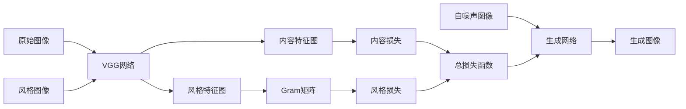

# 图像风格迁移(Style Transfer)原理与代码实战案例讲解

## 1. 背景介绍
### 1.1 什么是图像风格迁移
图像风格迁移(Style Transfer)是一种利用深度学习技术,将一幅图像的风格迁移到另一幅图像上,同时保留原图像的内容不变的技术。它可以让普通照片呈现出梵高、毕加索等大师级画家的艺术风格,或者将照片变成卡通画风格,让人眼前一亮。

### 1.2 图像风格迁移的发展历程
- 2015年,Gatys等人在论文《A Neural Algorithm of Artistic Style》中首次提出了利用卷积神经网络(CNN)实现图像风格迁移的思想,开创了这一领域的先河。 
- 2016年,Johnson等人提出了一种快速风格迁移方法,大大提升了生成速度。
- 2017年,Adobe和康奈尔大学提出了一种基于域适应的风格迁移方法AdaIN,可以任意指定风格图像。
- 近年来,图像风格迁移技术不断发展,出现了CartoonGAN、AnimeGAN等针对特定风格的模型,将这项技术推向了更广阔的应用。

### 1.3 图像风格迁移的应用价值
图像风格迁移不仅是一项很酷的技术,在工业和艺术领域也有广泛的应用前景:

- 电商美工:自动生成各种风格的商品图,提升视觉吸引力
- 影视后期:一键转换画面色调风格,还原经典电影的质感
- 游戏美术:快速生成个性化的游戏场景和角色材质贴图
- 艺术创作:帮助艺术家探索更多创意灵感,拓展表现力

总之,图像风格迁移大大降低了视觉内容创作的门槛,为设计师、艺术家提供了高效的辅助工具,推动了人工智能与艺术的跨界融合。

## 2. 核心概念与联系
要理解图像风格迁移的原理,首先需要了解几个核心概念:

### 2.1 卷积神经网络(CNN)
卷积神经网络是一种常用于图像识别的深度学习模型,由多个卷积层和池化层交替堆叠而成。CNN能够自动提取图像中的多尺度特征,可以很好地捕捉到图像的内容信息和纹理风格。

### 2.2 特征图(Feature Map)
特征图是卷积神经网络每一层的输出,记录了该层提取到的图像特征。浅层特征图提取到的是图像的细节纹理等低级特征,深层特征图提取到的是图像内容的高级语义特征。

### 2.3 Gram矩阵
Gram矩阵是风格迁移算法用来描述图像风格的数学工具。它通过计算特征图之间的内积,刻画了不同特征通道的相关性,体现了图像的纹理风格信息。

### 2.4 损失函数(Loss Function)
损失函数用来衡量生成图像与目标风格、内容图像的相似程度。风格损失通过Gram矩阵之间的均方差来度量,内容损失通过原始图像和生成图像在CNN高层特征图上的均方差来度量。通过最小化损失函数,可以得到理想的风格迁移结果。

下图展示了这些核心概念在风格迁移算法中的作用与联系:



## 3. 核心算法原理与步骤
图像风格迁移的核心算法可以分为以下几个步骤:

### 3.1 准备输入数据
选择一张内容图像和一张风格图像作为算法的输入。为了加速训练,通常需要将图像缩放到较小的尺寸如256x256。

### 3.2 搭建预训练的VGG网络
VGG网络是一种经典的CNN结构,在ImageNet图像分类任务上有出色表现。我们使用预训练的VGG网络来提取图像特征,但移除最后的全连接层,只保留卷积层和池化层。

### 3.3 提取内容特征
将内容图像输入VGG网络,在高层(如pool4)提取特征图,作为生成图像的内容特征目标。

### 3.4 提取风格特征  
将风格图像输入VGG网络,在多个中间层(如pool1到pool4)提取特征图,计算各层特征图的Gram矩阵,作为生成图像的风格特征目标。

### 3.5 随机初始化生成图像
生成图像初始化为与内容图像尺寸相同的随机噪声图像,像素值服从高斯分布。

### 3.6 计算内容损失
将生成图像输入VGG网络,在高层提取特征图,计算其与内容图像特征图的均方差作为内容损失。

### 3.7 计算风格损失
在多个层提取生成图像的特征图,计算各层特征图的Gram矩阵,与风格图像的Gram矩阵做均方差,加权求和作为风格损失。

### 3.8 计算总损失函数
将内容损失和风格损失按照一定权重相加,得到总的损失函数。通常内容权重设为1,风格权重设为100左右。

### 3.9 反向传播优化生成图像
计算损失函数对生成图像的梯度,用梯度下降法更新生成图像的像素值,如此迭代数百次,直到损失函数降到稳定为止。

### 3.10 输出最终的风格迁移结果
训练完成后,生成图像即为最终的风格迁移结果图像。

## 4. 数学模型与公式推导
接下来,我们用数学语言详细推导一下风格迁移算法的目标函数。

### 4.1 内容损失
设 $p$ 为内容图像在VGG高层pool4提取的特征图, $\hat{p}$ 为生成图像在相同层提取的特征图,则内容损失定义为:

$$L_c = \frac{1}{2}\sum_{i,j}(p_{ij}-\hat{p}_{ij})^2$$

其中 $i,j$ 为特征图的空间位置索引。

### 4.2 风格损失
设 $a^l$ 为风格图像在第 $l$ 层pool1~pool4提取的特征图, $\hat{a}^l$ 为生成图像在相同层提取的特征图,则第 $l$ 层的风格损失定义为:

$$L_s^l = \frac{1}{4N_l^2M_l^2}\sum_{i,j}(G_{ij}^l-\hat{G}_{ij}^l)^2$$

其中 $G^l$ 是风格图像第 $l$ 层特征图的Gram矩阵, $\hat{G}^l$ 是生成图像第 $l$ 层特征图的Gram矩阵:

$$G_{ij}^l = \sum_k a_{ik}^l a_{jk}^l$$

$$\hat{G}_{ij}^l = \sum_k \hat{a}_{ik}^l \hat{a}_{jk}^l$$

$N_l$ 为第 $l$ 层特征图的通道数, $M_l$ 为特征图的空间尺寸。

总的风格损失为各层风格损失的加权和:

$$L_s = \sum_{l=1}^L w_l L_s^l$$

其中 $w_l$ 为第 $l$ 层的权重,通常取 $w_l=\frac{1}{5}$ 。

### 4.3 总变差正则化项
为了使生成图像更加平滑,减少噪点和棋盘效应,我们在损失函数中引入总变差(Total Variation)正则化项:

$$L_{tv} = \sum_{i,j}((x_{i,j+1}-x_{i,j})^2 + (x_{i+1,j}-x_{i,j})^2)$$

其中 $x_{ij}$ 为生成图像在 $(i,j)$ 位置的像素值。

### 4.4 总损失函数
最终,风格迁移的目标函数由三部分组成:内容损失、风格损失和总变差正则化项,它们按照一定权重相加:

$$L_{total} = \alpha L_c + \beta L_s + \gamma L_{tv}$$

其中 $\alpha,\beta,\gamma$ 分别为内容损失、风格损失和总变差项的权重,通常取 $\alpha=1,\beta=100,\gamma=0.01$。

## 5. 项目实践:代码实例与讲解
下面我们用PyTorch来实现一个简单的图像风格迁移项目。

### 5.1 导入依赖库

```python
import torch
import torch.nn as nn
import torch.optim as optim
from torchvision import models,transforms
from PIL import Image
import matplotlib.pyplot as plt
```

### 5.2 定义图像加载与预处理函数

```python
def load_image(path,transform=None,max_size=None):
    image = Image.open(path)
    if max_size:
        scale = max_size / max(image.size)
        size = np.array(image.size) * scale
        image = image.resize(size.astype(int),Image.ANTIALIAS)
    if transform:
        image = transform(image).unsqueeze(0)
    return image
```

### 5.3 定义计算Gram矩阵的函数

```python
def gram_matrix(y):
    (b,c,h,w) = y.size()
    features = y.view(b,c,w*h)
    features_t = features.transpose(1,2)
    gram = features.bmm(features_t) / (c*h*w)
    return gram
```

### 5.4 加载预训练的VGG网络

```python
vgg = models.vgg19(pretrained=True).features
for param in vgg.parameters():
    param.requires_grad_(False)

device = torch.device("cuda" if torch.cuda.is_available() else "cpu")
vgg.to(device)
```

### 5.5 定义内容损失和风格损失

```python
class ContentLoss(nn.Module):
    def __init__(self,target):
        super(ContentLoss,self).__init__()
        self.target = target.detach()
        
    def forward(self,input):
        self.loss = F.mse_loss(input,self.target)
        return input
    
class StyleLoss(nn.Module):
    def __init__(self,target_feature):
        super(StyleLoss,self).__init__()
        self.target = gram_matrix(target_feature).detach()
        
    def forward(self,input):
        G = gram_matrix(input)
        self.loss = F.mse_loss(G,self.target)
        return input
```

### 5.6 定义用于风格迁移的模型

```python
class StyleTransferModel(nn.Module):
    def __init__(self,style_img,content_img,style_weight=100000,content_weight=1):
        super(StyleTransferModel,self).__init__()
        self.style_weight = style_weight
        self.content_weight = content_weight
        
        self.content_layers = ['conv_4']
        self.style_layers = ['conv_1','conv_2','conv_3','conv_4','conv_5'] 
        self.content_losses = []
        self.style_losses = []
        
        model = nn.Sequential()
        
        i = 1
        for layer in vgg.children():
            if isinstance(layer,nn.Conv2d):
                name = 'conv_{}'.format(i)
                model.add_module(name,layer)
                
                if name in self.content_layers:
                    target = model(content_img).detach()
                    content_loss = ContentLoss(target)
                    model.add_module('content_loss_{}'.format(i),content_loss)
                    self.content_losses.append(content_loss)
                    
                if name in self.style_layers:
                    target_feature = model(style_img).detach()
                    style_loss = StyleLoss(target_feature)
                    model.add_module('style_loss_{}'.format(i),style_loss)
                    self.style_losses.append(style_loss)
                    
            if isinstance(layer,nn.ReLU):
                name = 'relu_{}'.format(i)
                model.add_module(name,layer)
                
                if name in self.content_layers:
                    i += 1
            
            if isinstance(layer,nn.MaxPool2d):
                name = 'pool_{}'.format(i)
                model.add_module(name,layer)
            
            if isinstance(layer,nn.BatchNorm2d):
                name = 'bn_{}'.format(i)
                model.add_module(name,layer)
                
        self.model = model.to(device).eval()
                
    def forward(self,input):
        self.model(input)
        style_score = 0
        content_score = 0
        
        for sl in self.style_losses:
            style_score += sl.loss
        for cl in self.content_losses:
            content_score += cl.loss