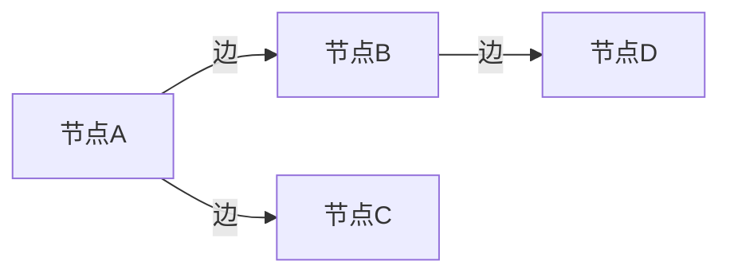
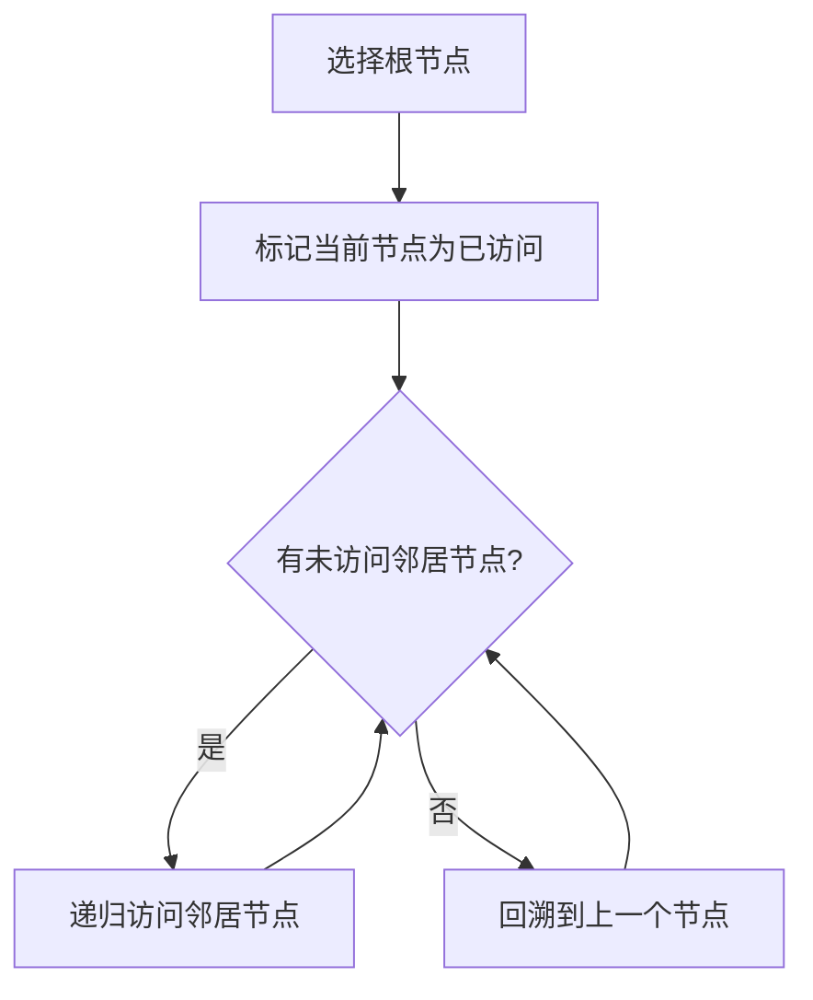
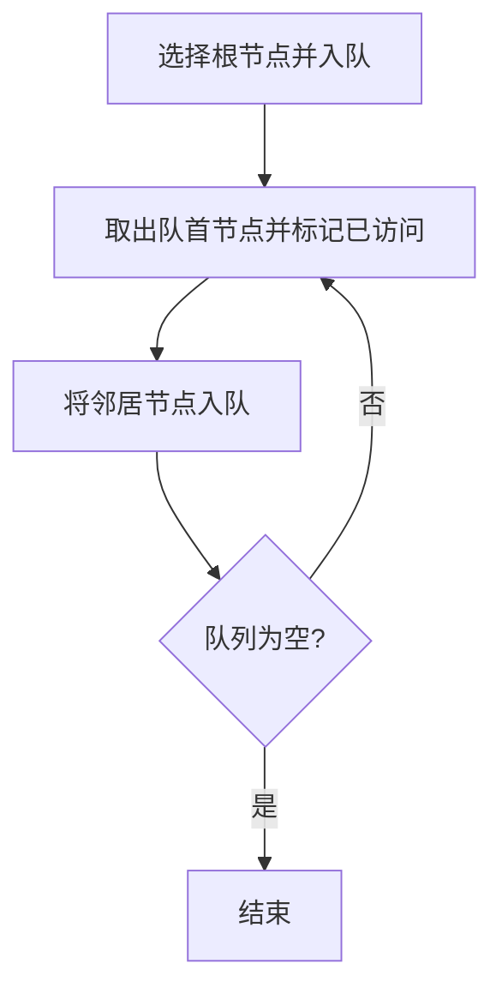

# 图计算引擎概述:从基础到实践

## 1.背景介绍

### 1.1 什么是图计算

图计算(Graph Computing)是一种基于图理论的数据处理范式,旨在高效地处理图形结构数据。图形结构数据是指由节点(Vertices)和边(Edges)组成的数据,广泛存在于社交网络、交通网络、知识图谱、金融交易等众多领域。与传统的关系型数据库和NoSQL数据库相比,图数据库更适合处理复杂的关系型数据。

图计算引擎是专门设计用于执行图计算任务的软件系统,通常包括数据存储、查询和分析等模块。它们提供了高效的图遍历、图分析和图计算算法,能够快速响应复杂的图查询和分析需求。

### 1.2 图计算的重要性

随着大数据时代的到来,越来越多的数据呈现出复杂的关系型结构,传统的关系型和NoSQL数据库难以高效处理这些数据。图计算凭借其天然的优势,在社交网络分析、知识图谱构建、金融欺诈检测、交通路线规划等领域发挥着重要作用。

图计算可以帮助我们更好地理解和利用复杂的关系数据,揭示隐藏其中的洞察和价值。它为解决现实世界中的复杂问题提供了强大的工具和方法。

## 2.核心概念与联系

### 2.1 图的基本概念

在介绍图计算引擎之前,我们需要先了解一些基本的图论概念:

- 节点(Vertex):图中的基本单元,用于表示实体。
- 边(Edge):连接两个节点的线,用于表示实体之间的关系。
- 属性(Property):附加在节点或边上的键值对,用于存储元数据信息。



### 2.2 图数据模型

图数据模型是图计算的核心,它定义了如何在计算机系统中表示和存储图形结构数据。常见的图数据模型包括:

- 属性图(Property Graph):节点和边都可以附加属性。
- RDF(Resource Description Framework):基于三元组(主语-谓语-宾语)的知识表示方式。
- 网络数据模型(Network Data Model):专注于表示复杂网络结构。

不同的图数据模型适用于不同的应用场景,选择合适的模型对于高效的图计算至关重要。

### 2.3 图计算与传统计算的区别

与传统的关系型和NoSQL数据库相比,图计算具有以下独特优势:

- 天然表达复杂关系:图结构能够直观地表达实体之间的复杂关系。
- 高效遍历和查询:图计算引擎针对图结构数据优化了遍历和查询算法。
- 丰富的分析能力:图计算提供了多种图分析算法,如最短路径、社区发现等。
- 可扩展性:图计算引擎通常支持分布式和并行计算,具有良好的扩展性。

## 3.核心算法原理具体操作步骤

图计算引擎通常包含多种核心算法,用于高效地执行图遍历、图查询和图分析等任务。下面我们介绍一些常见的核心算法原理和具体操作步骤。

### 3.1 图遍历算法

图遍历是图计算的基础操作,用于访问图中的所有节点和边。常见的图遍历算法包括:

#### 3.1.1 深度优先遍历(DFS)

深度优先遍历从一个根节点开始,沿着一条路径尽可能深入,直到无法继续前进,然后回溯到上一个节点,尝试另一条路径。

DFS算法步骤:

1. 选择一个根节点作为起点
2. 将当前节点标记为已访问
3. 对当前节点的所有未访问邻居节点递归执行步骤2和3
4. 当所有邻居节点都被访问过后,回溯到上一个节点



#### 3.1.2 广度优先遍历(BFS)

广度优先遍历从根节点开始,先访问所有距离根节点路径长度为1的节点,然后是路径长度为2的节点,依次类推。

BFS算法步骤:

1. 选择一个根节点作为起点,将其放入队列
2. 从队列中取出一个节点,标记为已访问
3. 将该节点的所有未访问邻居节点加入队列
4. 重复步骤2和3,直到队列为空



### 3.2 图查询语言

为了方便地查询和操作图形结构数据,图计算引擎通常提供专门的图查询语言。常见的图查询语言包括:

#### 3.2.1 Gremlin

Gremlin是一种流行的图遍历语言,它提供了一组基于流式处理的步骤,用于构建复杂的图遍历查询。Gremlin查询语句类似于构建管道,每个步骤对输入进行转换,最终得到所需的结果。

示例:查找出生于1990年的人的朋友

```
g.V().has('person', 'birthYear', 1990).outE('knows').inV()
```

1. `g.V()`: 从图中获取所有节点
2. `.has('person', 'birthYear', 1990)`: 过滤出生年份为1990年的人
3. `.outE('knows')`: 获取这些人的"knows"出边
4. `.inV()`: 遍历这些出边,得到目标节点(朋友)

#### 3.2.2 Cypher

Cypher是Neo4j图数据库的查询语言,它采用类SQL的语法,易于上手和理解。Cypher查询通过模式匹配来查找符合条件的子图。

示例:查找两个人是否是朋友关系

```cypher
MATCH (a:Person)-[:KNOWS]-(b:Person)
WHERE a.name = 'Alice' AND b.name = 'Bob'
RETURN a, b
```

1. `MATCH (a:Person)-[:KNOWS]-(b:Person)`: 匹配两个Person节点之间有KNOWS关系
2. `WHERE a.name = 'Alice' AND b.name = 'Bob'`: 过滤名字分别为Alice和Bob的节点
3. `RETURN a, b`: 返回匹配到的两个节点

### 3.3 图分析算法

除了基本的遍历和查询操作,图计算引擎还提供了多种图分析算法,用于从图形结构数据中挖掘有价值的信息和模式。

#### 3.3.1 最短路径算法

最短路径算法用于在图中查找两个节点之间的最短路径,常用于路径规划、网络优化等场景。常见的算法有:

- **Dijkstra算法**: 适用于计算单源最短路径
- **Bellman-Ford算法**: 能够处理负权边的情况
- **A*算法**: 通过启发式函数估计,加速搜索过程

#### 3.3.2 页面排名算法(PageRank)

PageRank算法最初用于网页排名,它通过网页之间的超链接关系,计算每个网页的重要性得分。该算法的核心思想是,一个网页被多个重要网页链接,则它本身也是重要的。

PageRank算法步骤:

1. 初始化所有网页的PR值为1/N(N为总网页数)
2. 计算每个网页的新PR值,等于所有链入该页面的其他页面PR值之和的$(1-d)$加上$d/N$
3. 重复步骤2,直到PR值收敛

$$PR(p_i) = (1-d) + d\sum_{p_j\in M(p_i)}\frac{PR(p_j)}{L(p_j)}$$

其中:
- $p_i$是待计算网页
- $M(p_i)$是所有链入$p_i$的网页集合
- $L(p_j)$是网页$p_j$的出链接数
- $d$是阻尼系数,通常取0.85

#### 3.3.3 社区发现算法

社区发现算法用于从图中发现密切相连的节点群组,这在社交网络分析、基因组学等领域有重要应用。常见的算法包括:

- 标签传播算法(Label Propagation)
- 行为值聚类算法(Modularity Clustering)
- 基于核的聚类算法(Kernel k-means)

## 4.数学模型和公式详细讲解举例说明

在图计算领域,数学模型和公式扮演着重要的角色,用于形式化地描述和解决各种图相关问题。下面我们详细介绍一些常见的数学模型和公式。

### 4.1 图的数学表示

图$G$可以用一个有序对$(V, E)$来表示,其中:

- $V$是一个非空集合,其元素称为**顶点(Vertex)**或**节点(Node)**
- $E$是一个有序或无序的顶点对的集合,其元素称为**边(Edge)**或**弧(Arc)**

对于有向图,边$(u, v)$表示从顶点$u$到顶点$v$的有向边。对于无向图,边$(u, v)$等价于$(v, u)$。

### 4.2 邻接矩阵

邻接矩阵是表示图的一种常用方式。对于一个有$n$个顶点的图$G$,它的邻接矩阵$A$是一个$n \times n$的矩阵,其中:

$$
A_{ij} = \begin{cases}
1, & \text{如果存在一条边 }(v_i, v_j) \\
0, & \text{否则}
\end{cases}
$$

对于无向图,邻接矩阵是对称的;对于有权图,$A_{ij}$可以是边的权重。

### 4.3 PageRank算法数学模型

我们之前介绍过PageRank算法的基本原理,现在让我们来看一下它的数学模型。

设$N$为网页总数,对于任意网页$p_i$,它的PageRank值$PR(p_i)$可以表示为:

$$PR(p_i) = (1-d) + d\sum_{p_j\in M(p_i)}\frac{PR(p_j)}{L(p_j)}$$

其中:

- $d$是阻尼系数,通常取0.85
- $M(p_i)$是所有链入$p_i$的网页集合
- $L(p_j)$是网页$p_j$的出链接数

我们可以将所有网页的PageRank值写成矩阵形式:

$$\begin{bmatrix}
PR(p_1) \\
PR(p_2) \\
\vdots \\
PR(p_N)
\end{bmatrix} = (1-d)\begin{bmatrix}
1/N \\
1/N \\
\vdots \\
1/N
\end{bmatrix} + d\begin{bmatrix}
\sum\limits_{p_j\in M(p_1)}\frac{PR(p_j)}{L(p_j)} \\
\sum\limits_{p_j\in M(p_2)}\frac{PR(p_j)}{L(p_j)} \\
\vdots \\
\sum\limits_{p_j\in M(p_N)}\frac{PR(p_j)}{L(p_j)}
\end{bmatrix}$$

我们可以构造一个$N\times N$的矩阵$M$,使得:

$$M_{ij} = \begin{cases}
\frac{1}{L(p_j)}, & \text{如果存在边 }(p_j, p_i) \\
0, & \text{否则}
\end{cases}$$

则PageRank值可以表示为:

$$PR = (1-d)\frac{1}{N}\vec{1} + dM^TPR$$

其中$\vec{1}$是全1向量。通过迭代计算,我们可以得到PageRank值的数值解。

### 4.4 图卷积网络(GCN)

图卷积网络(Graph Convolutional Network, GCN)是一种将卷积神经网络推广到图结构数据的深度学习模型。它能够有效地捕获图中节点的邻域结构信息,并对节点进行表示学习和预测任务。

GCN的核心思想是通过聚合邻居节点的表示,来