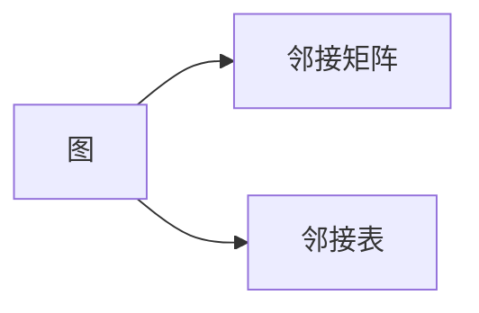
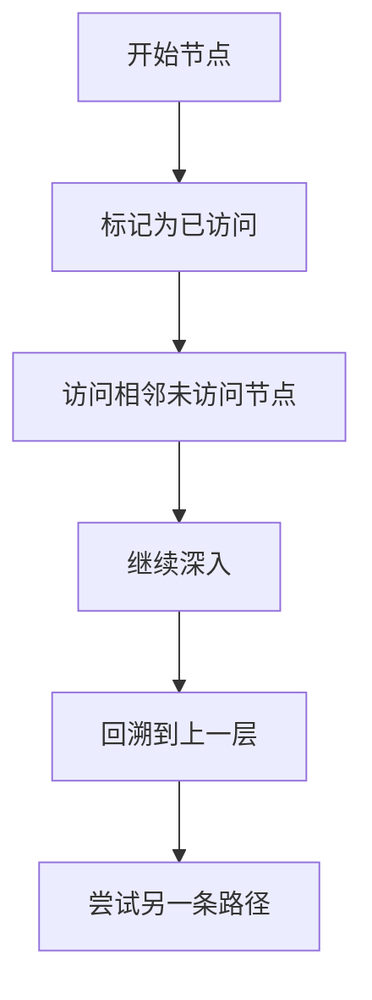

# 图计算引擎的核心概念:图的Depth-First Search算法

## 1.背景介绍

### 1.1 图计算的重要性

在当今的数据密集型世界中,图计算已经成为了一种极其重要的计算范式。从社交网络、推荐系统到知识图谱,图数据结构都扮演着关键角色。图计算能够高效地处理复杂的关系数据,挖掘隐藏的模式和洞察,因此受到了广泛的关注和应用。

### 1.2 图搜索算法概述  

图搜索算法是图计算的核心,用于遍历和探索图中的节点和边。其中,深度优先搜索(Depth-First Search,DFS)算法是最基本和最广为人知的图搜索算法之一。它通过沿着一条路径尽可能深入,直到无法继续前进,然后回溯并尝试另一条路径,从而系统地遍历整个图。

## 2.核心概念与联系

### 2.1 图的表示

在深入探讨DFS算法之前,我们需要了解图的表示方式。图通常使用邻接矩阵或邻接表来表示。

#### 2.1.1 邻接矩阵

邻接矩阵是一种二维数组,其中元素A[i][j]表示节点i和节点j之间是否存在边。如果存在边,则A[i][j]为1,否则为0。邻接矩阵适用于稠密图,但对于稀疏图来说,它会浪费大量内存空间。

#### 2.1.2 邻接表

邻接表使用链表或数组列表来表示每个节点的邻居。它比邻接矩阵更加节省空间,特别是对于稀疏图。在实现DFS算法时,通常使用邻接表作为图的表示形式。



### 2.2 DFS算法的核心思想

DFS算法的核心思想是尽可能深入地探索一条路径,直到无法继续前进,然后回溯并尝试另一条路径。它通过递归或显式堆栈来实现深度优先的遍历顺序。

在遍历过程中,DFS算法会将每个访问过的节点标记为"已访问",以避免重复访问。这种标记可以使用布尔值数组或集合来实现。



### 2.3 DFS算法的应用场景

DFS算法在许多领域都有广泛的应用,例如:

- 图遍历和连通性检测
- 拓扑排序
- 寻找图中的环
- 解决迷宫问题
- 人工智能中的决策树构建
- 编译器中的语法分析

## 3.核心算法原理具体操作步骤

### 3.1 递归实现

递归实现是DFS算法最直观和简洁的方式。它利用函数调用堆栈来模拟深度优先的遍历过程。

1. 创建一个布尔值数组或集合,用于标记已访问的节点。
2. 定义递归函数DFS(u),接受当前节点u作为参数。
3. 在DFS(u)函数中,首先标记节点u为已访问。
4. 遍历节点u的所有相邻节点v。
5. 对于每个未访问的相邻节点v,递归调用DFS(v)。
6. 当所有相邻节点都被访问后,递归函数将自动返回上一层。

```python
def dfs(graph, start):
    visited = set()
    
    def dfs_recursive(node):
        if node not in visited:
            visited.add(node)
            print(node, end=" ")
            
            for neighbor in graph[node]:
                dfs_recursive(neighbor)
    
    dfs_recursive(start)
```

### 3.2 迭代实现

迭代实现使用显式堆栈来模拟递归过程,避免了递归调用带来的额外开销。

1. 创建一个布尔值数组或集合,用于标记已访问的节点。
2. 创建一个空栈,用于存储待访问的节点。
3. 将起始节点推入栈中。
4. 循环执行以下步骤,直到栈为空:
   a. 从栈顶弹出一个节点u。
   b. 如果节点u未被访问,则标记为已访问并处理它(例如打印)。
   c. 将u的所有未访问的相邻节点按相反的顺序推入栈中。

```python
def dfs_iterative(graph, start):
    visited = set()
    stack = [start]
    
    while stack:
        node = stack.pop()
        if node not in visited:
            visited.add(node)
            print(node, end=" ")
            
            for neighbor in graph[node]:
                if neighbor not in visited:
                    stack.append(neighbor)
```

这两种实现方式都能够正确地执行DFS算法,但在不同场景下,它们的性能表现可能会有所不同。递归实现通常更加简洁和易于理解,但在遍历深度较大的图时,可能会遇到堆栈溢出的问题。迭代实现则更加灵活,可以更好地控制内存使用,但代码可能会稍微复杂一些。

## 4.数学模型和公式详细讲解举例说明

### 4.1 时间复杂度分析

我们来分析一下DFS算法的时间复杂度。假设图中有n个节点和m条边。

在最坏情况下,DFS算法需要访问每个节点和每条边。访问每个节点的时间复杂度为O(n),而访问每条边的时间复杂度为O(m)。因此,DFS算法的总时间复杂度为:

$$O(n + m)$$

对于稠密图(m接近于n^2),时间复杂度约为O(n^2)。对于稀疏图(m接近于n),时间复杂度约为O(n + n) = O(n)。

### 4.2 空间复杂度分析

DFS算法的空间复杂度取决于它的实现方式和图的结构。

对于递归实现,在最坏情况下(即图是一条链),递归调用堆栈的深度可能达到n。因此,递归实现的空间复杂度为O(n)。

对于迭代实现,需要使用一个额外的数据结构(通常是栈或队列)来存储待访问的节点。在最坏情况下,所有节点都需要存储在栈中,因此空间复杂度为O(n)。

综上所述,无论是递归实现还是迭代实现,DFS算法的空间复杂度都是O(n)。

### 4.3 图的连通性

DFS算法还可以用于检测图的连通性。如果从任意一个节点出发,DFS算法能够访问到所有其他节点,那么这个图就是连通的。否则,图就是非连通的。

我们可以使用DFS算法来计算图的连通分量数量。具体步骤如下:

1. 初始化一个计数器count,用于记录连通分量的数量。
2. 遍历所有节点:
   a. 如果当前节点未被访问,则执行DFS遍历,并将count加1。
   b. 如果当前节点已被访问,则跳过。
3. 最终,count的值就是图的连通分量数量。

如果count等于1,那么图就是连通的;否则,图是非连通的。

## 5.项目实践:代码实例和详细解释说明

为了更好地理解DFS算法,我们来看一个实际的代码示例。假设我们有一个无向图,使用邻接表来表示。我们将实现一个DFS函数,用于遍历整个图并打印出所有节点。

```python
graph = {
    'A': ['B', 'C'],
    'B': ['A', 'D', 'E'],
    'C': ['A', 'F'],
    'D': ['B'],
    'E': ['B', 'F'],
    'F': ['C', 'E']
}

def dfs(graph, start):
    visited = set()
    
    def dfs_recursive(node):
        if node not in visited:
            visited.add(node)
            print(node, end=" ")
            
            for neighbor in graph[node]:
                dfs_recursive(neighbor)
    
    dfs_recursive(start)

dfs(graph, 'A')  # 输出: A B D E C F
```

在这个示例中,我们使用递归实现的DFS算法。让我们逐步解释代码:

1. 首先,我们定义了一个无向图,使用字典来表示邻接表。每个键值对代表一个节点及其相邻节点列表。
2. 接下来,我们定义了dfs函数,它接受图和起始节点作为参数。
3. 在dfs函数内部,我们定义了一个名为dfs_recursive的嵌套函数,用于实现递归遍历。
4. dfs_recursive函数首先检查当前节点是否已被访问。如果未访问,则将其标记为已访问,并打印出该节点。
5. 然后,函数遍历当前节点的所有相邻节点,对于每个未访问的相邻节点,递归调用dfs_recursive函数。
6. 最后,我们调用dfs函数,传入图和起始节点'A'。

在这个示例中,DFS算法从节点'A'开始,首先访问并打印'A'。然后,它递归地访问'A'的相邻节点'B'和'C'。对于'B',它继续深入访问'D'和'E'。对于'C',它访问'F'。最终,所有节点都被访问并打印出来。

您可以尝试修改图的结构或起始节点,观察DFS算法的不同遍历顺序。

## 6.实际应用场景

DFS算法在许多实际应用场景中扮演着重要角色,例如:

### 6.1 网络爬虫

网络爬虫是一种自动化程序,用于从万维网上下载网页。DFS算法可以用于遍历网页之间的链接,以发现新的网页并下载它们。

### 6.2 社交网络分析

在社交网络中,每个用户可以被表示为一个节点,而用户之间的关系则表示为边。DFS算法可以用于分析社交网络的连通性、发现社区结构等。

### 6.3 编译器中的语法分析

在编译器的语法分析阶段,DFS算法可以用于构建抽象语法树(AST)。编译器会将源代码表示为一个图,然后使用DFS算法遍历这个图,生成相应的AST。

### 6.4 游戏中的人工智能

在某些游戏中,AI需要探索游戏世界中的可能路径,以找到最佳解决方案。DFS算法可以用于模拟这种探索过程,并帮助AI做出决策。

### 6.5 数据库查询优化

在数据库查询优化中,DFS算法可以用于生成查询执行计划。查询优化器会构建一个查询计划树,然后使用DFS算法遍历这个树,找到最优的执行路径。

## 7.工具和资源推荐

如果您想进一步学习和实践DFS算法,以下是一些推荐的工具和资源:

### 7.1 可视化工具

- [VisuAlgo](https://visualgo.net/en/dfsbfs) - 一个交互式的可视化工具,可以帮助您可视化DFS算法的执行过程。
- [Python Tutor](https://pythontutor.com/) - 一个在线的代码可视化工具,支持多种编程语言,包括Python。

### 7.2 在线练习平台

- [LeetCode](https://leetcode.com/) - 一个流行的在线编程练习平台,包含了许多与DFS算法相关的题目。
- [HackerRank](https://www.hackerrank.com/) - 另一个知名的在线编程练习平台,也提供了DFS算法相关的练习题。

### 7.3 教程和参考资料

- [DFS算法教程(Python)](https://www.programiz.com/dsa/graph-dfs) - 一个详细的Python教程,涵盖了DFS算法的理论和实现。
- [DFS算法可视化(JavaScript)](https://www.cs.usfca.edu/~galles/visualization/DFS.html) - 一个使用JavaScript实现的DFS算法可视化示例。
- [图算法导论](https://www.cs.princeton.edu/courses/archive/spr03/cs226/lectures/graphs.4up.pdf) - 普林斯顿大学的一份关于图算法的讲义,包括DFS算法的详细介绍。

## 8.总结:未来发展趋势与挑战

### 8.1 并行和分布式DFS