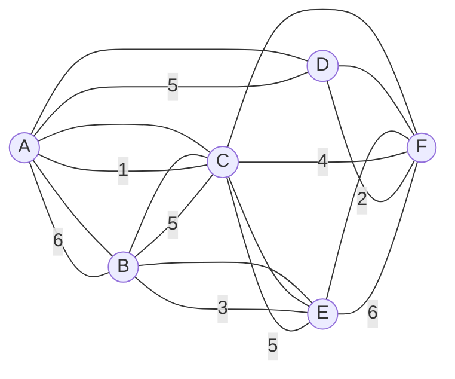
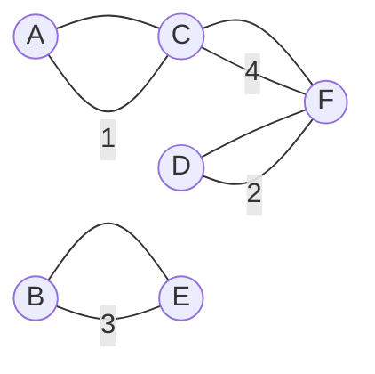

# 图计算引擎的核心概念:图的Prim算法与A*算法的比较

## 1.背景介绍

### 1.1 图计算引擎概述
#### 1.1.1 图计算引擎的定义
图计算引擎是一种专门用于处理图数据结构和执行图算法的软件系统。它提供了一组API和工具,使开发人员能够方便地操作和分析图数据。

#### 1.1.2 图计算引擎的应用领域
图计算引擎在许多领域都有广泛的应用,包括社交网络分析、推荐系统、网络路由、金融风控等。它能够高效地处理大规模的图数据,发掘其中蕴含的关联关系和模式。

### 1.2 图算法概述 
#### 1.2.1 图的基本概念
图由顶点(Vertex)和边(Edge)组成。顶点表示实体对象,边表示实体之间的关系。根据边是否有方向,图可分为有向图和无向图。

#### 1.2.2 常见的图算法
图算法是对图进行分析和计算的一系列方法。常见的图算法包括:
- 图的遍历:BFS、DFS
- 最短路径:Dijkstra、Floyd
- 最小生成树:Prim、Kruskal
- 拓扑排序
- 关键路径

### 1.3 Prim算法与A*算法
#### 1.3.1 Prim算法概述
Prim算法是一种用于求解加权连通图的最小生成树(Minimum Spanning Tree, MST)的贪心算法。该算法每次选择代价最小的边,逐步构建最小生成树。

#### 1.3.2 A*算法概述
A*算法是一种启发式搜索算法,常用于图中求解最短路径问题。它引入了启发函数来指导搜索方向,相比Dijkstra算法,A*算法更加高效。

## 2.核心概念与联系

### 2.1 最小生成树
#### 2.1.1 生成树
生成树是一个连通图的极小连通子图,它包含图中的所有顶点,但只有足以构成一棵树的 n-1 条边。一个有 n 个顶点的连通图的生成树有 n-1 条边,不会形成回路。 

#### 2.1.2 最小生成树  
最小生成树是所有生成树中权值之和最小的生成树。最小生成树不唯一,但其权值之和是唯一的。求最小生成树的算法主要有Prim算法和Kruskal算法。

### 2.2 最短路径
#### 2.2.1 单源最短路径
单源最短路径是指从某一固定源点出发,求其到图中其他所有顶点的最短路径。求单源最短路径的算法主要有Dijkstra算法和Bellman-Ford算法。

#### 2.2.2 任意两点间最短路径  
任意两点间最短路径是求图中任意两个顶点之间的最短路径。求任意两点间最短路径可以用Floyd算法。

### 2.3 Prim算法与最小生成树
Prim算法是一种求解最小生成树的方法。该算法从某一顶点开始,逐步向最小生成树中添加顶点,每次选择与当前生成树相连的权值最小的边,直到所有顶点都加入到生成树中。

### 2.4 A*算法与最短路径
A*算法是一种求解最短路径的启发式搜索算法。它在Dijkstra算法的基础上,引入了启发函数来估计顶点到目标顶点的距离,从而指导搜索方向。A*算法常用于游戏寻路、GPS导航等场景。

## 3.核心算法原理具体操作步骤

### 3.1 Prim算法
#### 3.1.1 算法思想
Prim算法的基本思想是:设G=(V,E)是连通网,T=(U,D)是最小生成树,V,U是顶点集合,E,D是边的集合。初始状态下,U只有一个顶点,即起始点v0,D为空集。
- 若 u 是U中顶点,v是V-U中顶点,则<u,v>的权值为两个顶点之间边的权值,若两个顶点之间没有边相连,则<u,v>权值为∞。
- 从V-U中选取一个顶点v,使<u,v>权值最小,加入到U中,同时将<u,v>加入到D中。
- 重复上述步骤,直到U=V为止。此时D中有n-1条边,则T=(V,D)为G的最小生成树。

#### 3.1.2 算法步骤
1. 初始化:U={v0},D={}
2. 重复以下步骤,直到U=V:
   a. 在V-U中找<u,v>权值最小的顶点v(u∈U)
   b. U=U∪{v},D=D∪{<u,v>}
3. 输出最小生成树T=(V,D)

#### 3.1.3 算法复杂度
Prim算法的时间复杂度为O(V^2),其中V为图的顶点数。如果使用最小堆优化,时间复杂度可以降低到O(ElogV),其中E为图的边数。

### 3.2 A*算法
#### 3.2.1 算法思想  
A*算法是一种启发式搜索算法,它在Dijkstra算法的基础上引入了启发函数h(n),用于估计顶点n到目标顶点的距离。A*算法的估价函数为:
$$f(n)=g(n)+h(n)$$
其中,g(n)为源点到顶点n的实际距离,h(n)为顶点n到目标顶点的估计距离。

A*算法的搜索过程如下:
1. 将起点加入 open list 。
2. 重复如下步骤:
   a. 遍历 open list ,查找 f(n) 最小的节点,把它作为当前要处理的节点。
   b. 把这个节点移到 close list 。
   c. 对当前方格的 8 个相邻方格一一进行检查,如果它们可以通过或者在 open list 中,则:
      - 如果不在 open list 中,将它们加入 open list ,并计算它们的 f(n) 值,把当前方格设置为它们的父节点。
      - 如果已经在 open list 中,检查这条路径是否更好,用 g(n) 值作参考。更小的 g(n) 值表示这是更好的路径。如果是这样,把它们的父节点改成当前方格,并重新计算它们的 g(n) 和 f(n) 值。
   d. 停止条件:
      - 把终点加入到了 open list 中,此时路径已经找到,或者
      - 查找终点失败,并且 open list 是空的,此时没有路径。
3. 保存路径。从终点开始,每个方格沿着父节点移动直至起点,这就是最优路径。

#### 3.2.2 算法步骤
1. 初始化 open list 和 close list ,将起点加入 open list 中。
2. 如果 open list 不为空,则:
   a. 找到 open list 中 f(n) 最小的节点,并把它作为当前要处理的节点。
   b. 把当前节点移到 close list 。
   c. 对当前节点相邻的节点进行检查:
      - 如果它是终点,停止搜索。
      - 如果它不可通过或者在 close list 中,忽略它。
      - 否则,做如下操作:
        - 如果它不在 open list 中,把它加入 open list ,并计算它的 f(n) 值,把当前节点设置为它的父节点。
        - 如果它已经在 open list 中,检查经过当前节点到达它的路径是否更好。如果更好,就把它的父节点改成当前节点,并重新计算它的 g(n) 和 f(n) 值。
3. 如果终点在 open list 中,则找到了最优路径,返回路径。
4. 如果 open list 为空,则不存在最优路径,返回空。

#### 3.2.3 算法复杂度
A*算法的时间复杂度与启发函数的选择有关。在最坏情况下,A*算法会退化为Dijkstra算法,时间复杂度为O((E+V)logV)。但在平均情况下,A*算法的时间复杂度优于Dijkstra算法。

## 4.数学模型和公式详细讲解举例说明

### 4.1 Prim算法的数学模型
设G=(V,E)是一个带权连通图,V是顶点集合,E是边的集合。Prim算法构造最小生成树的过程可以用如下数学模型描述:

1. 初始状态:U={v0},A={}
2. 重复以下步骤,直到U=V:
   $$A=A\cup\{(u,v)|u\in U,v\in V-U,\omega(u,v)=\min\{\omega(x,y)|x\in U,y\in V-U\}\}$$
   $$U=U\cup\{v|(u,v)\in A\}$$
3. 最小生成树为T=(V,A)

其中,ω(u,v)表示边(u,v)的权值。

例如,考虑如下带权连通图:

使用Prim算法求解该图的最小生成树的过程如下:

1. 初始状态:U={A},A={}
2. 第一步:
   - 选择边(A,C),因为ω(A,C)=1是所有与A相连的边中权值最小的。
   - U={A,C},A={(A,C)}
3. 第二步:  
   - 选择边(D,F),因为ω(D,F)=2是所有与{A,C}相连的边中权值最小的。
   - U={A,C,D,F},A={(A,C),(D,F)} 
4. 第三步:
   - 选择边(B,E),因为ω(B,E)=3是所有与{A,C,D,F}相连的边中权值最小的。
   - U={A,C,D,F,B,E},A={(A,C),(D,F),(B,E)}
5. 第四步:
   - 选择边(C,F),因为ω(C,F)=4是所有与{A,C,D,F,B,E}相连的边中权值最小的。
   - U={A,C,D,F,B,E},A={(A,C),(D,F),(B,E),(C,F)}

此时U=V,算法结束。最小生成树为:

### 4.2 A*算法的数学模型
A*算法使用估价函数f(n)来指导搜索方向,其中:
$$f(n)=g(n)+h(n)$$

- g(n):从起点到顶点n的实际代价。
- h(n):从顶点n到目标顶点的估计代价,即启发函数。

A*算法的数学模型可以描述为:
1. 初始化 open list 和 close list ,将起点加入 open list 中。
2. 如果 open list 不为空,则:
   a. 从 open list 中选择 f(n) 最小的节点 n ,并将其移到 close list 。
   b. 如果 n 是目标节点,则找到了最优路径,算法结束。
   c. 否则,扩展节点 n ,计算其相邻节点 n' 的 f(n') 值:
      $$f(n')=g(n')+h(n')$$
      其中,
      $$g(n')=g(n)+c(n,n')$$
      c(n,n') 为节点 n 到节点 n' 的实际代价。
   d. 对每个相邻节点 n' ,执行以下操作:
      - 如果 n' 在 close list 中,则忽略它。
      - 如果 n' 不在 open list 中,将其加入 open list ,并将 n 设置为它的父节点。
      - 如果 n' 已经在 open list 中,检查经过 n 到达 n' 的路径是否更好。如果更好,就把 n' 的父节点改为 n ,并更新 n' 的 g(n') 和 f(n') 值。
3. 如果 open list 为空,则