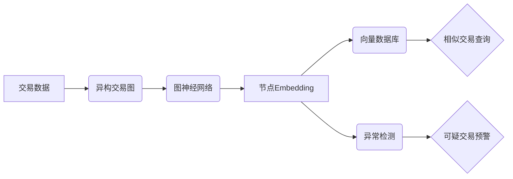

# 基于向量数据库的反欺诈系统：防御金融犯罪

## 1. 背景介绍
### 1.1 金融欺诈的严峻形势
在当今数字化时代,金融欺诈已成为一个日益严重的问题。随着金融服务的数字化转型,欺诈分子也在不断升级他们的手段,给金融机构和客户带来巨大损失。据统计,全球每年因金融欺诈造成的损失高达数千亿美元。
### 1.2 传统反欺诈方法的局限性
传统的反欺诈方法,如规则引擎和专家系统,在应对日益复杂的欺诈模式时显得力不从心。它们难以实时检测新型欺诈,且容易产生较高的误报率。此外,随着数据量的激增,传统方法的性能和扩展性也面临挑战。
### 1.3 人工智能在反欺诈领域的应用前景
近年来,人工智能技术在反欺诈领域崭露头角。机器学习算法能够从海量数据中自动学习欺诈模式,实现实时、高效、准确的欺诈检测。特别是向量数据库的出现,为构建高性能的 AI 反欺诈系统提供了新的可能。

## 2. 核心概念与联系
### 2.1 向量数据库
向量数据库是一种专门存储和检索高维向量的数据库系统。不同于传统的关系型和 NoSQL 数据库,向量数据库使用向量相似度(如欧氏距离、余弦相似度)来组织和查询数据,能够高效处理高维稀疏向量。
### 2.2 Embedding 技术 
Embedding 是一种将离散变量映射为连续向量表示的技术。在反欺诈场景中,我们可以将交易、用户、设备等实体转换为语义丰富的低维稠密向量,用于下游的相似度计算和异常检测任务。常见的 Embedding 方法有 Word2Vec、Node2Vec、Graph Embedding 等。
### 2.3 异常检测
异常检测是从数据中识别出罕见事件或异常模式的过程。在反欺诈语境下,我们希望发现那些偏离正常交易模式的可疑行为。基于向量的异常检测方法,如 LOF、Isolation Forest,能够有效挖掘高维向量空间中的异常点。
### 2.4 图神经网络
图神经网络(GNN)是专门处理图结构数据的深度学习模型。在反欺诈中,交易数据通常蕴含着复杂的关联关系,如用户、设备、IP 之间的交互。GNN 能够建模这些关系,学习出更准确的 Embedding 表示,提升整体检测性能。

## 3. 核心算法原理与具体步骤
### 3.1 构建异构交易图
- 将交易数据转换为异构图,节点类型包括交易、用户、设备、IP 等
- 节点属性为各实体的原始特征,边表示实体间的交互关系
### 3.2 Graph Embedding
- 使用 GNN 在异构图上学习节点 Embedding,捕捉实体间的高阶交互模式 
- 采用 GraphSAGE、GAT 等模型,引入注意力机制和采样策略,提升训练效率
- 得到的 Embedding 向量将用于下游异常检测任务
### 3.3 构建向量数据库
- 将 Embedding 向量存入向量数据库,如 Faiss、Milvus
- 创建基于向量相似度的索引,加速 KNN 查询
### 3.4 异常交易检测
- 对新交易的 Embedding 向量,在向量数据库中查询 Top-K 个最近邻
- 使用 LOF 等算法计算异常分数,设定阈值判断是否为欺诈交易
- 可结合规则引擎,提高检测的解释性和可信度

## 4. 数学模型与公式详解
### 4.1 Graph Embedding 目标函数
Graph Embedding 的核心是学习一个映射函数 $f:v \rightarrow \mathbb{R}^d$,将节点 $v$ 映射为 $d$ 维实向量。以 DeepWalk 为例,其目标函数为:

$$
\mathcal{L} = -\log \operatorname{Pr}(\{v_{i-w},\cdots,v_{i+w}\} \backslash v_i | f(v_i))
$$

其中 $\{v_{i-w},\cdots,v_{i+w}\} \backslash v_i$ 为节点 $v_i$ 在随机游走序列中的上下文节点,窗口大小为 $w$。直观地,DeepWalk 希望最大化节点 Embedding 向量对其上下文节点的预测概率。
### 4.2 LOF 异常分数
LOF(Local Outlier Factor)通过测量一个点相对于其局部邻域的密度偏离程度来判断异常性。对于样本点 $p$,其 LOF 分数定义为:

$$
\operatorname{LOF}_k(p)=\frac{\sum_{o \in N_k(p)} \frac{\operatorname{lrd}_k(o)}{\operatorname{lrd}_k(p)}}{|N_k(p)|}
$$

其中 $N_k(p)$ 为 $p$ 的 $k$ 近邻集合,$\operatorname{lrd}_k(p)$ 为 $p$ 的局部可达密度:

$$
\operatorname{lrd}_k(p)=1/\left(\frac{\sum_{o \in N_k(p)} \operatorname{reach-dist}_k(p, o)}{|N_k(p)|}\right)
$$

$\operatorname{reach-dist}_k(p, o)$ 为 $p$ 到其 $k$ 近邻 $o$ 的可达距离。直观地,LOF 分数越大,则样本点 $p$ 越有可能是异常点。

## 5. 项目实践：代码实例与详解
下面给出基于 Python 的反欺诈检测流程示例代码:

```python
import networkx as nx
import torch
import torch.nn.functional as F
from torch_geometric.nn import SAGEConv
from sklearn.neighbors import LocalOutlierFactor
from pymilvus import connections, FieldSchema, CollectionSchema, DataType, Collection

# 定义 GNN 模型
class FraudSAGE(torch.nn.Module):
    def __init__(self, in_channels, hidden_channels, out_channels):
        super().__init__()
        self.conv1 = SAGEConv(in_channels, hidden_channels)
        self.conv2 = SAGEConv(hidden_channels, out_channels)

    def forward(self, x, edge_index):
        x = self.conv1(x, edge_index)
        x = F.relu(x)
        x = self.conv2(x, edge_index)
        return x

# 构建异构交易图
G = nx.MultiDiGraph()
# 添加交易、用户、设备、IP 节点
...
# 添加交易相关边
...

# Graph Embedding
device = torch.device('cuda' if torch.cuda.is_available() else 'cpu')
model = FraudSAGE(in_feat_dim, 128, 64).to(device)
model.train()
optimizer = torch.optim.Adam(model.parameters(), lr=0.01)

embeddings = model(feat_mat, edge_index_mat)

# 异常检测
clf = LocalOutlierFactor(n_neighbors=20, metric="cosine")
y_pred = clf.fit_predict(embeddings)
scores = -clf.negative_outlier_factor_

# 存入向量数据库
connections.connect("default", host=MILVUS_HOST, port=MILVUS_PORT)

fraud_collection = Collection(name="fraud_detect", schema=CollectionSchema(
    fields=[
        FieldSchema(name="embedding", dtype=DataType.FLOAT_VECTOR, dim=64)
    ],
    description="Fraud Transaction Embeddings"
))

fraud_collection.insert([embeddings.tolist()])

# 查询可疑交易
search_params = {"metric_type": "L2", "params": {"nprobe": 10}}
results = fraud_collection.search([query_embedding], "embedding", param=search_params, limit=5, output_fields=["embedding"])
```

这个示例代码展示了如何使用图神经网络对交易图进行 Embedding 学习,然后利用 LOF 进行异常检测,最后将 Embedding 向量存入向量数据库 Milvus 进行相似度查询。实际项目中,还需要考虑数据预处理、特征工程、模型优化、工程部署等诸多因素。

## 6. 实际应用场景
基于向量数据库的反欺诈系统可应用于多种金融场景,包括:
- 信用卡欺诈检测:通过分析用户的交易行为模式,识别出异常交易
- 反洗钱:挖掘交易流中的可疑资金转移行为,如快进快出、循环交易等
- 保险反欺诈:发现虚假申报、夸大损失等欺诈行为
- 电商反作弊:识别刷单、虚假评论等作弊行为,维护平台生态

## 7. 工具与资源推荐
- 图嵌入工具:DeepWalk、node2vec、GraphSAGE、GAT、PinSAGE 等
- 向量数据库:Faiss、Milvus、Hnswlib、Annoy 等
- 机器学习库:PyTorch Geometric、TensorFlow GNN、DGL、PyG 等
- 异常检测工具:PyOD、Scikit-learn、Facebook Prophet 等
- 欺诈检测数据集:IEEE-CIS Fraud Detection、Kaggle Credit Card Fraud Detection 等

## 8. 总结：未来发展趋势与挑战
### 8.1 发展趋势
- 图神经网络将成为反欺诈领域的主流方法,可更好地建模复杂交易关系
- 向量数据库在反欺诈系统中的应用将不断深化,支撑实时检测和大规模部署
- 多模态学习将异构信息(如文本、图像)引入反欺诈,提升检测准确性
- 联邦学习有望解决数据孤岛问题,实现机构间的反欺诈协作
### 8.2 面临的挑战
- 欺诈手段不断升级,如何快速适应新型欺诈模式是一大挑战
- 如何在保护隐私的前提下开展反欺诈数据共享与建模
- 如何提高模型的可解释性,平衡检测性能与模型透明度
- 工程实现中,如何平衡计算效率、资源成本和检测效果

## 9. 附录：常见问题解答
### Q1: 向量数据库与传统数据库有何区别?
A1: 向量数据库专为存储和查询高维向量而设计,支持高效的相似度搜索。传统数据库则侧重于结构化数据的 CRUD 操作和关系建模。在查询语义相关性时,向量数据库通常性能更优。
### Q2: Embedding 如何选择合适的向量维度?
A2: Embedding 维度的选择需要权衡表示能力和计算开销。维度越高,语义表示越丰富,但计算复杂度也越大。通常可以从较低维度(如64)开始,根据下游任务的性能表现逐步调整。
### Q3: 反欺诈系统如何应对概念漂移问题?
A3: 概念漂移是指数据分布随时间发生变化,导致已训练模型的性能下降。应对策略包括:
- 持续学习:定期用新数据对模型进行增量训练,适应新的欺诈模式
- 主动学习:主动标注可疑样本,纳入训练集中学习
- 异常检测:监控模型性能指标,如果发生显著下降则触发告警和再训练

### Q4: 如何评估反欺诈模型的性能?
A4: 反欺诈模型的评估指标主要包括:
- 精确率(Precision):预测为欺诈的交易中,真正欺诈交易的比例
- 召回率(Recall):真实欺诈交易中,被正确预测为欺诈的比例
- F1分数:精确率和召回率的调和平均,综合考虑两个指标
- AUC:ROC曲线下面积,反映模型在不同阈值下的整体性能
- 欺诈检出率和误报率:在特定阈值下,欺诈交易的检出比例和正常交易的误判比例

在实际应用中,需要根据业务场景和成本收益权衡,选择合适的评估指标。通常我们希望在控制误报率的前提下,尽可能提高欺诈检出率。



以上是基于向量数据库的反欺诈系统的整体架构流程图。原始交易数据