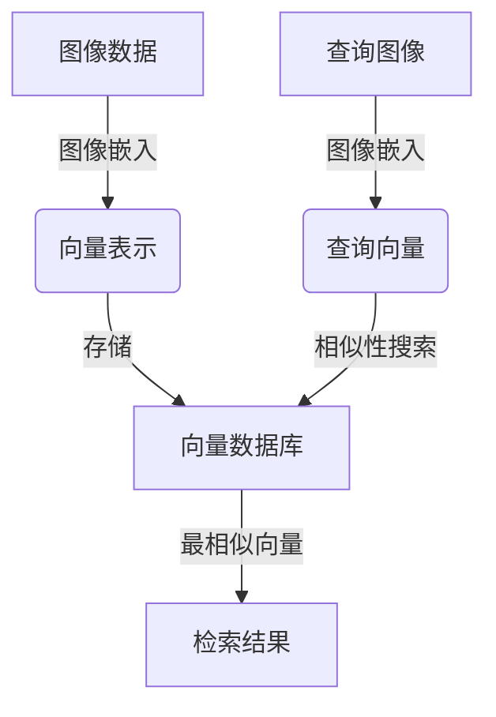
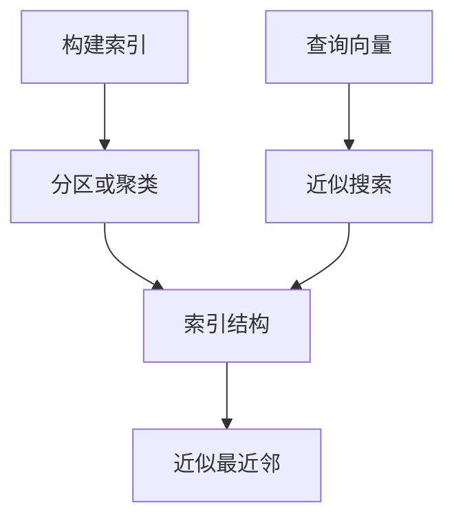
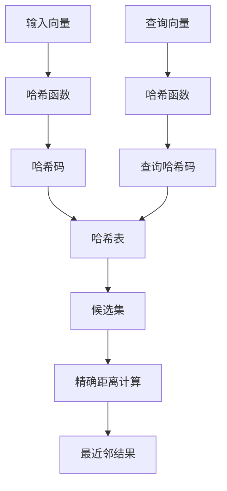
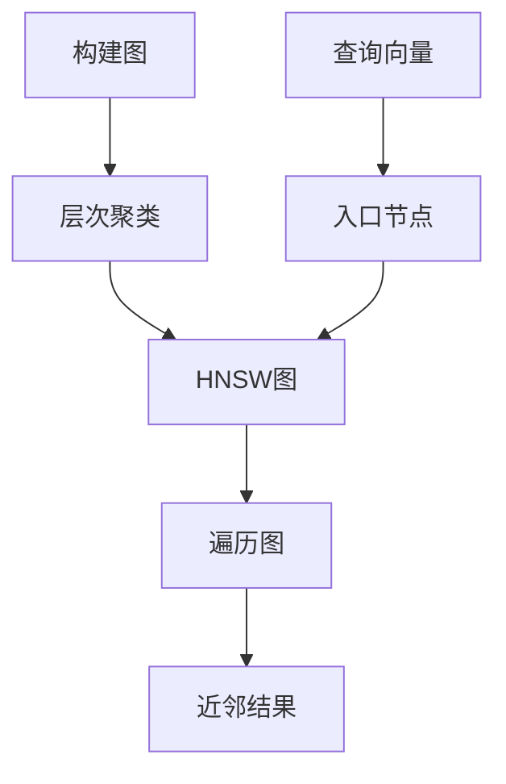

# 基于向量数据库的图像搜索技术进展

## 1. 背景介绍

在当今的数字时代,图像数据的爆炸式增长带来了巨大的挑战和机遇。传统的基于文本的搜索方式已经无法满足对图像内容的检索需求。图像搜索技术应运而生,旨在帮助用户快速准确地找到所需的图像信息。

随着深度学习技术的飞速发展,基于向量数据库的图像搜索技术成为了研究的热点。该技术将图像转换为高维向量表示,并利用向量相似性进行快速检索,展现出巨大的潜力。本文将深入探讨基于向量数据库的图像搜索技术的原理、算法、应用场景及未来发展趋势。

## 2. 核心概念与联系

### 2.1 图像嵌入 (Image Embedding)

图像嵌入是将图像数据映射到高维向量空间的过程。通过深度神经网络模型,如卷积神经网络(CNN)或视觉转former(ViT),可以提取图像的语义特征,并将其编码为固定长度的向量表示。

$$
f: \mathcal{I} \rightarrow \mathbb{R}^d
$$

其中 $\mathcal{I}$ 表示图像空间, $d$ 是向量的维度。相似的图像在向量空间中彼此靠近,而不同的图像则相距较远。

### 2.2 向量相似性 (Vector Similarity)

向量相似性度量是图像搜索的核心。常用的相似性度量包括欧几里得距离、余弦相似度和内积。对于高维稀疏向量,内积通常是更好的选择,因为它能够更好地捕捉向量之间的语义相关性。

$$
\text{sim}(\vec{u}, \vec{v}) = \vec{u} \cdot \vec{v} = \sum_{i=1}^{d} u_i v_i
$$

其中 $\vec{u}$ 和 $\vec{v}$ 是两个向量,  $\text{sim}(\vec{u}, \vec{v})$ 表示它们之间的相似性得分。

### 2.3 向量数据库 (Vector Database)

向量数据库是一种专门为高维向量数据设计的数据库系统。它支持高效的相似性搜索,可以快速找到与给定向量最相似的若干个向量。常见的向量数据库包括 Faiss、Milvus、SPTAG 等。



## 3. 核心算法原理具体操作步骤

### 3.1 图像嵌入算法

#### 3.1.1 卷积神经网络 (CNN)

卷积神经网络是图像嵌入的主流算法之一。它通过多层卷积、池化和非线性激活函数来提取图像的局部特征,并在最后几层全连接层中融合这些特征,生成图像的向量表示。


#### 3.1.2 视觉转换器 (ViT)

视觉转换器是一种基于 Transformer 架构的图像嵌入模型。它将图像分割成多个patch(图像块),并将每个patch投影到一个向量空间,然后通过 Transformer 编码器捕捉全局上下文信息,最终生成图像的向量表示。


### 3.2 相似性搜索算法

#### 3.2.1 暴力搜索 (Brute-Force Search)

暴力搜索是最简单的相似性搜索算法。它计算查询向量与数据库中所有向量的相似性,并返回最相似的 k 个向量。该算法的时间复杂度为 O(nd),其中 n 是数据库中向量的数量,d 是向量维度。

```python
import numpy as np

def brute_force_search(query, database, k):
    scores = np.dot(database, query.T)
    sorted_indices = np.argsort(-scores, axis=0)
    return sorted_indices[:k]
```

#### 3.2.2 近似最近邻搜索 (Approximate Nearest Neighbor Search)

对于大规模的向量数据库,暴力搜索的计算成本过高。近似最近邻搜索算法通过构建高效的索引结构,以较低的计算成本找到接近最相似的向量。常见的算法包括局部敏感哈希 (Locality Sensitive Hashing, LSH)、层次聚类树 (Hierarchical Navigable Small World, HNSW) 等。



## 4. 数学模型和公式详细讲解举例说明

### 4.1 图像嵌入损失函数

图像嵌入模型通常采用对比学习 (Contrastive Learning) 的方式进行训练。对比学习旨在学习一个embedding空间,使得相似的图像在该空间中彼此靠近,而不同的图像相距较远。常见的对比学习损失函数包括对比损失 (Contrastive Loss)、triplet损失 (Triplet Loss) 和 InfoNCE 损失。

#### 4.1.1 对比损失

对比损失将相似图像对和不相似图像对的embedding向量拉近和推开。

$$
\mathcal{L}_\text{contrast}(i, j) = (1 - y_{ij}) \frac{1}{2} D_{ij}^2 + y_{ij} \frac{1}{2} \max(0, m - D_{ij})^2
$$

其中 $y_{ij}$ 表示图像 $i$ 和 $j$ 是否属于同一类别, $D_{ij}$ 是它们的embedding向量之间的距离, $m$ 是一个超参数,控制相似图像对的最小距离。

#### 4.1.2 Triplet损失

Triplet损失将一个锚点图像与一个正样本图像的embedding向量拉近,同时将锚点图像与一个负样本图像的embedding向量推开。

$$
\mathcal{L}_\text{triplet}(a, p, n) = \max(0, D(a, p) - D(a, n) + m)
$$

其中 $a$ 是锚点图像, $p$ 是正样本图像, $n$ 是负样本图像, $D(\cdot, \cdot)$ 是embedding向量之间的距离函数, $m$ 是一个超参数,控制正负样本对的最小距离margin。

#### 4.1.3 InfoNCE损失

InfoNCE损失源自对比学习的信息论视角,它最大化相似图像对的互信息 (Mutual Information)。

$$
\mathcal{L}_\text{InfoNCE} = -\mathbb{E}_{(i, j) \sim p_\text{pos}} \left[ \log \frac{\exp(\text{sim}(i, j) / \tau)}{\sum_{k \in \mathcal{N}(i)} \exp(\text{sim}(i, k) / \tau)} \right]
$$

其中 $p_\text{pos}$ 是相似图像对的联合分布, $\mathcal{N}(i)$ 是图像 $i$ 的邻域(包括正样本和负样本), $\text{sim}(\cdot, \cdot)$ 是相似性函数(如内积), $\tau$ 是一个温度超参数。

### 4.2 近似最近邻搜索算法

#### 4.2.1 局部敏感哈希 (Locality Sensitive Hashing, LSH)

LSH是一种经典的近似最近邻搜索算法。它通过构建多个哈希函数将高维向量映射到低维哈希码,相似的向量具有相同的哈希码,从而实现快速的近似搜索。

对于一个向量 $\vec{v}$,LSH算法使用 $k$ 个哈希函数 $h_1, h_2, \ldots, h_k$ 计算它的哈希码 $H(\vec{v}) = (h_1(\vec{v}), h_2(\vec{v}), \ldots, h_k(\vec{v}))$。在搜索时,算法首先计算查询向量的哈希码,然后在哈希表中查找具有相同哈希码的向量作为候选集。最后,在候选集中进行精确距离计算,返回最相似的 $k$ 个向量。



#### 4.2.2 层次聚类树 (Hierarchical Navigable Small World, HNSW)

HNSW是一种基于图的近似最近邻搜索算法。它将高维向量组织成一个分层的导航小世界图,每个节点代表一个向量,边连接相似的向量。在搜索时,算法从入口节点出发,沿着相似度较高的边遍历图,直到找到足够多的近邻向量。



HNSW算法的时间复杂度为 $O(d \log n)$,其中 $d$ 是向量维度, $n$ 是数据库中向量的数量。它在保持较高精度的同时,实现了比暴力搜索更高的查询效率。

## 5. 项目实践: 代码实例和详细解释说明

在本节,我们将使用开源的向量数据库 Milvus 和深度学习框架 PyTorch 实现一个基于向量数据库的图像搜索系统。

### 5.1 环境配置

首先,我们需要安装所需的Python包:

```bash
pip install milvus pymilvus torch torchvision
```

### 5.2 图像嵌入

我们使用预训练的 ResNet-50 模型从图像中提取特征向量。

```python
import torch
import torchvision.models as models

# 加载预训练模型
resnet = models.resnet50(pretrained=True)

# 提取特征向量
def extract_feature(image):
    with torch.no_grad():
        image_tensor = preprocess(image).unsqueeze(0).to(device)
        feature_vector = resnet(image_tensor).flatten()
    return feature_vector.cpu().numpy()
```

### 5.3 向量数据库操作

接下来,我们连接到 Milvus 数据库,创建一个集合(Collection)来存储图像的特征向量。

```python
from pymilvus import connections, utility, Collection

# 连接到 Milvus 服务器
connections.connect(default_host='localhost', default_port='19530')

# 创建集合
collection_name = 'image_vectors'
dimension = 2048  # ResNet-50 特征向量维度
collection = utility.create_collection(collection_name, dimension)
```

我们可以将提取的特征向量插入到集合中,并执行相似性搜索。

```python
# 插入向量
collection.insert([feature_vector])

# 相似性搜索
search_params = {'metric_type': 'IP', 'params': {'nprobe': 10}}
results = collection.search([query_vector], 'vector', params=search_params, limit=10)
```

### 5.4 Web 应用程序

最后,我们可以构建一个简单的 Web 应用程序,允许用户上传图像并搜索相似图像。

```python
from flask import Flask, request, render_template
import base64

app = Flask(__name__)

@app.route('/', methods=['GET', 'POST'])
def index():
    if request.method == 'POST':
        image = request.files['image']
        query_vector = extract_feature(image)
        results = collection.search([query_vector], 'vector', params=search_params, limit=10)
        
        similar_images = []
        for result in results:
            image_id = result.id
            image_data = get_image_data(image_id)
            similar_images.append(base64.b64encode(image_data).decode