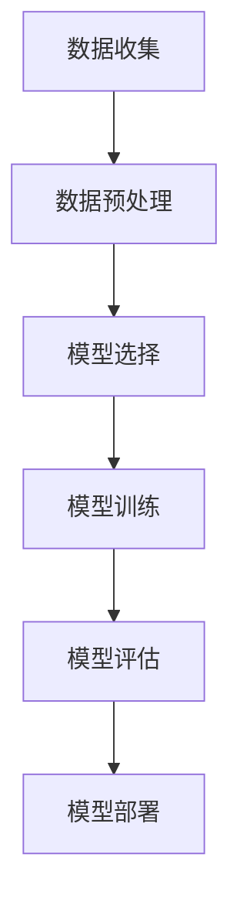

# 基于深度学习的AI代理工作流：案例与实践

## 1.背景介绍

在过去的十年中，深度学习技术取得了显著的进展，推动了人工智能（AI）代理在各个领域的应用。从自动驾驶汽车到智能客服系统，AI代理正在改变我们的生活和工作方式。然而，构建一个高效的AI代理并非易事，它需要综合运用多种深度学习技术和工具，并且需要一个系统化的工作流来指导开发过程。

## 2.核心概念与联系

### 2.1 深度学习

深度学习是一种基于人工神经网络的机器学习方法，能够自动从数据中提取特征并进行预测。其核心在于多层神经网络的训练和优化。

### 2.2 AI代理

AI代理是一个能够自主执行任务的智能系统。它可以感知环境、做出决策并采取行动。AI代理通常由感知模块、决策模块和执行模块组成。

### 2.3 工作流

工作流是指一系列有序的步骤和过程，用于完成特定任务。在AI代理的开发中，工作流包括数据收集、数据预处理、模型训练、模型评估和部署等步骤。

### 2.4 核心联系

深度学习技术是构建AI代理的基础，而工作流则是将这些技术有机结合起来的关键。通过系统化的工作流，可以提高开发效率和模型性能。

## 3.核心算法原理具体操作步骤

### 3.1 数据收集

数据是深度学习的基础。数据收集包括从各种来源获取原始数据，并对其进行标注和存储。

### 3.2 数据预处理

数据预处理是指对原始数据进行清洗、归一化、特征提取等操作，以便于模型训练。

### 3.3 模型选择

根据任务需求选择合适的深度学习模型，如卷积神经网络（CNN）、循环神经网络（RNN）等。

### 3.4 模型训练

使用预处理后的数据对模型进行训练。训练过程中需要调整超参数，并使用优化算法如梯度下降进行模型优化。

### 3.5 模型评估

使用验证集对模型进行评估，计算模型的准确率、精确率、召回率等指标。

### 3.6 模型部署

将训练好的模型部署到生产环境中，供实际应用使用。



## 4.数学模型和公式详细讲解举例说明

### 4.1 神经网络基础

神经网络由多个神经元组成，每个神经元接收输入并通过激活函数输出结果。常见的激活函数包括Sigmoid、ReLU等。

$$
y = f(Wx + b)
$$

其中，$W$ 是权重矩阵，$x$ 是输入向量，$b$ 是偏置，$f$ 是激活函数。

### 4.2 损失函数

损失函数用于衡量模型预测值与真实值之间的差距。常见的损失函数包括均方误差（MSE）和交叉熵损失。

$$
L = \frac{1}{N} \sum_{i=1}^{N} (y_i - \hat{y}_i)^2
$$

### 4.3 反向传播

反向传播算法用于计算损失函数对模型参数的梯度，并通过梯度下降法更新参数。

$$
W = W - \eta \frac{\partial L}{\partial W}
$$

其中，$\eta$ 是学习率。

## 5.项目实践：代码实例和详细解释说明

### 5.1 数据收集与预处理

```python
import pandas as pd
from sklearn.model_selection import train_test_split
from sklearn.preprocessing import StandardScaler

# 数据加载
data = pd.read_csv('data.csv')

# 数据分割
X = data.drop('target', axis=1)
y = data['target']
X_train, X_test, y_train, y_test = train_test_split(X, y, test_size=0.2, random_state=42)

# 数据标准化
scaler = StandardScaler()
X_train = scaler.fit_transform(X_train)
X_test = scaler.transform(X_test)
```

### 5.2 模型训练

```python
import tensorflow as tf
from tensorflow.keras.models import Sequential
from tensorflow.keras.layers import Dense

# 模型构建
model = Sequential([
    Dense(64, activation='relu', input_shape=(X_train.shape[1],)),
    Dense(64, activation='relu'),
    Dense(1, activation='sigmoid')
])

# 模型编译
model.compile(optimizer='adam', loss='binary_crossentropy', metrics=['accuracy'])

# 模型训练
history = model.fit(X_train, y_train, epochs=50, batch_size=32, validation_split=0.2)
```

### 5.3 模型评估

```python
# 模型评估
loss, accuracy = model.evaluate(X_test, y_test)
print(f'Loss: {loss}, Accuracy: {accuracy}')
```

### 5.4 模型部署

```python
import joblib

# 保存模型
model.save('model.h5')
scaler_filename = "scaler.save"
joblib.dump(scaler, scaler_filename)
```

## 6.实际应用场景

### 6.1 自动驾驶

AI代理在自动驾驶中扮演着关键角色，通过感知环境、规划路径和控制车辆，实现自动驾驶功能。

### 6.2 智能客服

智能客服系统利用AI代理进行自然语言处理和对话管理，提供高效的客户服务。

### 6.3 医疗诊断

AI代理在医疗诊断中通过分析医学影像和病历数据，辅助医生进行诊断和治疗。

## 7.工具和资源推荐

### 7.1 开发工具

- TensorFlow：一个开源的深度学习框架，支持多种神经网络模型的构建和训练。
- PyTorch：另一个流行的深度学习框架，具有灵活的动态计算图和强大的社区支持。

### 7.2 数据集

- ImageNet：一个大型图像数据集，广泛用于图像分类和物体检测任务。
- COCO：一个用于图像分割和物体检测的数据集，包含丰富的标注信息。

### 7.3 学习资源

- 《深度学习》：一本由Ian Goodfellow等人编写的经典教材，系统介绍了深度学习的基本概念和技术。
- Coursera深度学习课程：由Andrew Ng教授讲授的在线课程，涵盖了深度学习的核心内容。

## 8.总结：未来发展趋势与挑战

### 8.1 未来发展趋势

随着计算能力的提升和数据量的增加，深度学习技术将继续发展。未来，AI代理将在更多领域得到应用，如智能制造、金融分析和个性化推荐等。

### 8.2 挑战

尽管深度学习技术取得了显著进展，但仍面临一些挑战，如数据隐私、模型解释性和泛化能力等。解决这些问题需要多学科的合作和创新。

## 9.附录：常见问题与解答

### 9.1 如何选择合适的深度学习模型？

选择模型时需要考虑任务类型、数据特征和计算资源。对于图像处理任务，卷积神经网络（CNN）通常是首选；对于序列数据，循环神经网络（RNN）或长短期记忆网络（LSTM）更为适用。

### 9.2 如何提高模型的泛化能力？

提高模型泛化能力的方法包括数据增强、正则化和交叉验证等。数据增强通过对训练数据进行随机变换，增加数据多样性；正则化通过在损失函数中加入惩罚项，防止模型过拟合；交叉验证通过多次训练和验证，评估模型的稳定性。

### 9.3 如何处理数据不平衡问题？

数据不平衡问题可以通过重采样、数据增强和调整损失函数等方法解决。重采样包括过采样少数类和欠采样多数类；数据增强通过生成新的少数类样本，增加数据多样性；调整损失函数通过增加少数类样本的权重，平衡各类样本的影响。

---

作者：禅与计算机程序设计艺术 / Zen and the Art of Computer Programming