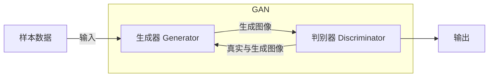
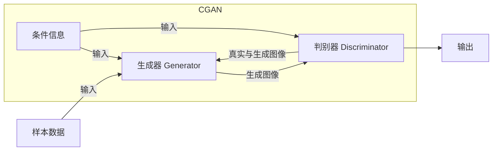
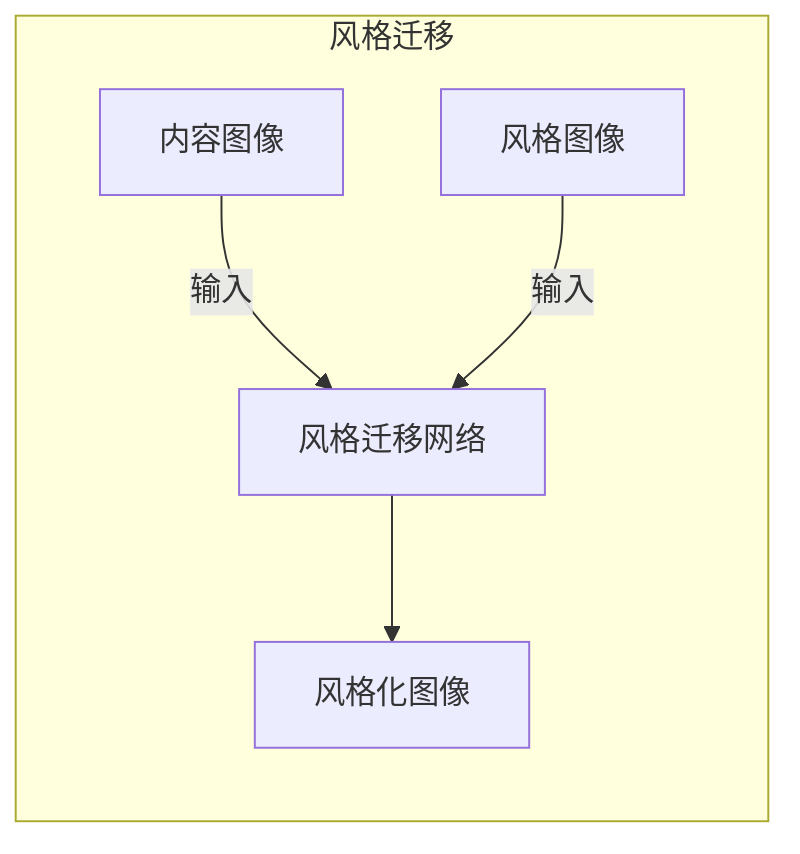

# 基于生成对抗网络的历史照片复原与风格迁移研究

## 1. 背景介绍

### 1.1 历史照片的价值与挑战

历史照片是记录过去时光的宝贵文化遗产,对于了解历史、保护文化传统具有重要意义。然而,由于时间流逝、保存条件差等原因,许多珍贵的历史照片都出现了不同程度的破损、老化和失真。这不仅影响了照片的观赏价值,也加大了保护和修复的难度。因此,如何有效地复原和修复受损的历史照片,成为了一个亟待解决的问题。

### 1.2 传统照片修复方法的局限性

传统的照片修复方法主要依赖人工操作,需要专业人员耗费大量时间和精力进行修复。这种方法不仅效率低下,而且容易受主观因素影响,难以保证修复质量的一致性。此外,对于严重受损的照片,传统方法往往力不从心。

### 1.3 生成对抗网络在图像处理中的应用

近年来,生成对抗网络(Generative Adversarial Networks, GAN)在图像处理领域取得了令人瞩目的成就。GAN能够从数据中学习到图像的内在特征,并生成逼真的图像。这种强大的生成能力为历史照片的复原和风格迁移提供了新的可能性。

## 2. 核心概念与联系

### 2.1 生成对抗网络(GAN)

生成对抗网络是一种由生成器(Generator)和判别器(Discriminator)组成的深度学习模型。生成器的目标是生成逼真的图像,而判别器则需要区分生成的图像和真实图像。通过生成器和判别器之间的对抗训练,模型可以学习到图像的真实分布,从而生成高质量的图像。



### 2.2 条件生成对抗网络(Conditional GAN)

条件生成对抗网络(Conditional GAN, CGAN)是GAN的一种变体,它在生成器和判别器中引入了条件信息,使得模型可以根据输入的条件生成特定类型的图像。在历史照片复原中,受损的照片可以作为条件信息输入到CGAN中,从而生成修复后的图像。



### 2.3 风格迁移(Style Transfer)

风格迁移是指将一种图像的风格迁移到另一种图像上,同时保留内容图像的主要结构和语义信息。通过将风格迁移应用于历史照片,可以赋予照片新的艺术风格,增加其观赏价值。



## 3. 核心算法原理具体操作步骤

### 3.1 CGAN用于历史照片复原

CGAN可以应用于历史照片复原任务。具体步骤如下:

1. **数据准备**: 收集受损的历史照片作为输入,以及对应的完好照片作为目标输出。
2. **数据预处理**: 对照片进行标准化、裁剪等预处理,以满足模型输入要求。
3. **模型构建**: 构建CGAN模型,包括生成器和判别器。生成器的输入为受损照片,输出为修复后的照片;判别器的输入为真实照片和生成器输出的照片,输出为真实/生成的概率。
4. **模型训练**: 使用对抗训练策略,交替优化生成器和判别器,使生成器能够生成逼真的修复照片,而判别器能够准确区分真实和生成的照片。
5. **模型评估**: 在测试集上评估模型性能,使用指标如峰值信噪比(PSNR)、结构相似性(SSIM)等。
6. **模型部署**: 将训练好的模型应用于实际的历史照片修复任务。

### 3.2 风格迁移网络用于历史照片风格化

风格迁移网络可以将艺术风格迁移到历史照片上,赋予照片新的视觉体验。具体步骤如下:

1. **数据准备**: 收集历史照片作为内容图像,以及艺术作品或风格参考图像。
2. **数据预处理**: 对图像进行标准化、裁剪等预处理,以满足模型输入要求。
3. **模型构建**: 构建风格迁移网络,通常采用卷积神经网络(CNN)结构。
4. **模型训练**: 使用损失函数优化网络参数,使得输出图像保留内容图像的内容特征,同时迁移风格图像的风格特征。
5. **模型评估**: 在测试集上评估模型性能,使用主观评价和客观指标(如内容损失、风格损失等)。
6. **模型部署**: 将训练好的模型应用于实际的历史照片风格化任务。

## 4. 数学模型和公式详细讲解举例说明

### 4.1 CGAN损失函数

CGAN的损失函数由两部分组成:生成器损失和判别器损失。

生成器损失:
$$\mathcal{L}_G = \mathbb{E}_{x,y}[\log(1 - D(G(x,y)))]$$

其中,$x$表示受损的输入图像,$y$表示目标完好图像,$G(x,y)$表示生成器输出的修复图像,$D$表示判别器。生成器的目标是使判别器无法区分生成的图像和真实图像,因此需要最小化$\log(1 - D(G(x,y)))$。

判别器损失:
$$\mathcal{L}_D = \mathbb{E}_{x,y}[\log D(x,y)] + \mathbb{E}_{x,y}[\log(1 - D(G(x,y)))]$$

判别器的目标是正确区分真实图像和生成图像,因此需要最大化$\log D(x,y)$和$\log(1 - D(G(x,y)))$的和。

在训练过程中,生成器和判别器交替优化,最小化各自的损失函数。

### 4.2 风格迁移损失函数

风格迁移网络的损失函数包括三个部分:内容损失、风格损失和总变差正则项。

内容损失:
$$\mathcal{L}_{\text{content}}(p,x,y) = \frac{1}{2}\sum_{i,j}(F_{ij}^l(x) - F_{ij}^l(y))^2$$

其中,$p$表示风格迁移网络,$x$表示内容图像,$y$表示输出图像,$F_{ij}^l$表示网络第$l$层的特征映射。内容损失衡量输出图像与内容图像在特征层的差异,确保输出图像保留了内容图像的主要内容。

风格损失:
$$\mathcal{L}_{\text{style}}(a,y) = \sum_l\frac{1}{N_l^2M_l^2}\sum_{i,j}\left(G_{ij}^l(y) - A_{ij}^l\right)^2$$

其中,$a$表示风格参考图像,$y$表示输出图像,$G^l$表示网络第$l$层的格拉姆矩阵(Gram Matrix),$A^l$表示风格参考图像在第$l$层的格拉姆矩阵,$N_l$和$M_l$分别表示第$l$层特征映射的高度和宽度。风格损失衡量输出图像与风格参考图像在特征层的风格差异,确保输出图像具有期望的风格特征。

总变差正则项:
$$\mathcal{L}_{\text{tv}}(y) = \sum_{i,j}((y_{i,j+1} - y_{i,j})^2 + (y_{i+1,j} - y_{i,j})^2)$$

总变差正则项用于平滑输出图像,避免出现过多的噪声和伪影。

最终的损失函数为:
$$\mathcal{L}(p,a,x,y) = \alpha\mathcal{L}_{\text{content}}(p,x,y) + \beta\mathcal{L}_{\text{style}}(a,y) + \gamma\mathcal{L}_{\text{tv}}(y)$$

其中,$\alpha$,$\beta$和$\gamma$分别是内容损失、风格损失和总变差正则项的权重系数,用于平衡三者之间的贡献。

## 5. 项目实践:代码实例和详细解释说明

### 5.1 CGAN for Photo Restoration

以下是使用PyTorch实现CGAN进行历史照片复原的代码示例:

```python
import torch
import torch.nn as nn

# 定义生成器
class Generator(nn.Module):
    def __init__(self, in_channels, out_channels):
        super(Generator, self).__init__()
        # 编码器
        self.encoder = nn.Sequential(
            nn.Conv2d(in_channels, 64, 4, 2, 1, padding_mode='reflect'),
            nn.LeakyReLU(0.2, inplace=True),
            # ...
        )
        # 解码器
        self.decoder = nn.Sequential(
            nn.ConvTranspose2d(64, 64, 4, 2, 1, padding_mode='reflect'),
            nn.ReLU(True),
            # ...
            nn.ConvTranspose2d(64, out_channels, 4, 2, 1, padding_mode='reflect'),
            nn.Tanh()
        )

    def forward(self, x):
        x = self.encoder(x)
        x = self.decoder(x)
        return x

# 定义判别器
class Discriminator(nn.Module):
    def __init__(self, in_channels):
        super(Discriminator, self).__init__()
        self.model = nn.Sequential(
            nn.Conv2d(in_channels, 64, 4, 2, 1, padding_mode='reflect'),
            nn.LeakyReLU(0.2, inplace=True),
            # ...
            nn.Conv2d(512, 1, 4, 1, 0, padding_mode='reflect'),
            nn.Sigmoid()
        )

    def forward(self, x):
        x = self.model(x)
        return x

# 训练代码
# ...
for epoch in range(num_epochs):
    for damaged_img, target_img in dataloader:
        # 训练生成器
        optimizer_G.zero_grad()
        generated_img = generator(damaged_img)
        validity = discriminator(generated_img, damaged_img)
        g_loss = adversarial_loss(validity, valid)
        g_loss.backward()
        optimizer_G.step()

        # 训练判别器
        optimizer_D.zero_grad()
        real_validity = discriminator(target_img, damaged_img)
        fake_validity = discriminator(generated_img.detach(), damaged_img)
        real_loss = adversarial_loss(real_validity, valid)
        fake_loss = adversarial_loss(fake_validity, fake)
        d_loss = (real_loss + fake_loss) / 2
        d_loss.backward()
        optimizer_D.step()
```

在这个示例中,我们定义了生成器和判别器两个网络。生成器的输入是受损的历史照片,输出是修复后的照片。判别器的输入是真实的完好照片和生成器输出的修复照片,输出是真实/生成的概率。

在训练过程中,生成器和判别器交替优化。生成器的目标是生成逼真的修复照片,使判别器无法区分真实和生成的照片。判别器的目标是正确区分真实和生成的照片。通过对抗训练,生成器和判别器相互促进,最终达到生成高质量修复照片的目标。

### 5.2 Style Transfer for Photo Stylization

以下是使用PyTorch实现风格迁移网络进行历史照片风格化的代码示例:

```python
import torch
import torch.nn as nn

# 定义风格迁移网络
class StyleTransferNet(nn.Module):
    def __init__(self):
        super(StyleTransferNet, self).__init__()
        self.encoder = nn.Sequential(
            nn.Conv2d(3, 64, 3, 1, 1),
            nn.ReLU(inplace=True),
            # ...
        )
        self.decoder = nn.Sequential(
            nn.ConvTranspose2d(512, 256, 3, 1, 1),
            nn.ReLU(inplace=True),
            # ...
            nn.ConvTranspose2d(64, 3, 3, 1, 1),
            nn.Tanh()
        )

    def forward(self, x):
        encoded = self.encoder(x)
        decode