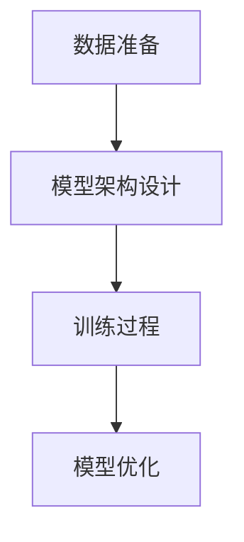

# 基于生成对抗网络的室内设计风格迁移工具研发

## 1.背景介绍

### 1.1 室内设计的现状与挑战

室内设计是一个融合艺术与技术的领域，设计师需要在美学、功能性和客户需求之间找到平衡。然而，传统的设计过程往往耗时且费力，设计师需要手动调整各种元素以达到理想效果。随着人工智能技术的发展，特别是生成对抗网络（GANs）的出现，为室内设计带来了新的可能性。

### 1.2 生成对抗网络的基本概念

生成对抗网络（GANs）由Ian Goodfellow等人在2014年提出，是一种深度学习模型，包含两个主要部分：生成器（Generator）和判别器（Discriminator）。生成器负责生成新的数据样本，而判别器则负责区分这些样本是真实的还是生成的。通过这种对抗训练，生成器逐渐学会生成更加逼真的数据。

### 1.3 GANs在图像处理中的应用

GANs在图像处理领域有着广泛的应用，包括图像生成、图像修复、图像超分辨率等。特别是在风格迁移方面，GANs可以将一种图像的风格迁移到另一种图像上，这为室内设计风格的自动化迁移提供了技术基础。

## 2.核心概念与联系

### 2.1 风格迁移的定义

风格迁移是指将一种图像的风格应用到另一种图像上，使得目标图像在保持原有内容的基础上，呈现出新的风格。这在艺术创作和设计领域有着广泛的应用。

### 2.2 GANs在风格迁移中的角色

在风格迁移任务中，GANs的生成器负责生成具有目标风格的图像，而判别器则用于评估生成图像的质量。通过不断优化生成器和判别器，最终可以得到高质量的风格迁移效果。

### 2.3 相关技术与工具

除了GANs，风格迁移还涉及到卷积神经网络（CNNs）、自编码器（Autoencoders）等技术。这些技术共同作用，使得风格迁移工具能够高效地完成任务。

## 3.核心算法原理具体操作步骤

### 3.1 数据准备

首先，需要准备大量的室内设计图像数据集，包括不同风格的样本。这些数据将用于训练GANs模型。

### 3.2 模型架构设计

设计一个适合风格迁移任务的GANs模型。常见的架构包括CycleGAN、Pix2Pix等，这些模型在图像转换任务中表现出色。

### 3.3 训练过程

训练过程包括生成器和判别器的对抗训练。生成器尝试生成逼真的风格迁移图像，而判别器则不断提高对真实图像和生成图像的区分能力。

### 3.4 模型优化

通过调整超参数、使用高级优化算法（如Adam优化器）等方法，进一步提高模型的性能。



## 4.数学模型和公式详细讲解举例说明

### 4.1 生成器和判别器的损失函数

生成器的目标是最小化其生成图像被判别器识别为假的概率，判别器的目标是最大化其正确识别真实图像和生成图像的概率。其损失函数可以表示为：

$$
\min_G \max_D V(D, G) = \mathbb{E}_{x \sim p_{data}(x)}[\log D(x)] + \mathbb{E}_{z \sim p_z(z)}[\log(1 - D(G(z)))]
$$

### 4.2 风格迁移的损失函数

在风格迁移任务中，除了对抗损失，还需要考虑内容损失和风格损失。内容损失用于保持原图像的内容，风格损失用于迁移目标风格。

$$
L_{content}(C, G) = \sum_{i=1}^n \| \phi_i(C) - \phi_i(G) \|^2
$$

$$
L_{style}(S, G) = \sum_{j=1}^m \| G_j(S) - G_j(G) \|^2
$$

### 4.3 总损失函数

总损失函数是对抗损失、内容损失和风格损失的加权和：

$$
L_{total} = \lambda_{adv} L_{adv} + \lambda_{content} L_{content} + \lambda_{style} L_{style}
$$

## 5.项目实践：代码实例和详细解释说明

### 5.1 环境配置

首先，确保安装了必要的库和工具，如TensorFlow、PyTorch、OpenCV等。

```bash
pip install tensorflow
pip install torch
pip install opencv-python
```

### 5.2 数据预处理

加载并预处理图像数据，包括图像的归一化、尺寸调整等。

```python
import cv2
import numpy as np

def preprocess_image(image_path):
    image = cv2.imread(image_path)
    image = cv2.resize(image, (256, 256))
    image = image / 255.0
    return image
```

### 5.3 模型定义

定义生成器和判别器模型。以CycleGAN为例：

```python
import torch
import torch.nn as nn

class Generator(nn.Module):
    def __init__(self):
        super(Generator, self).__init__()
        # 定义生成器的网络结构

    def forward(self, x):
        # 前向传播
        return x

class Discriminator(nn.Module):
    def __init__(self):
        super(Discriminator, self).__init__()
        # 定义判别器的网络结构

    def forward(self, x):
        # 前向传播
        return x
```

### 5.4 训练过程

定义训练循环，包括损失计算和模型优化。

```python
def train(generator, discriminator, data_loader, num_epochs):
    optimizer_G = torch.optim.Adam(generator.parameters(), lr=0.0002)
    optimizer_D = torch.optim.Adam(discriminator.parameters(), lr=0.0002)
    criterion = nn.BCELoss()

    for epoch in range(num_epochs):
        for real_images in data_loader:
            # 训练判别器
            optimizer_D.zero_grad()
            real_labels = torch.ones(real_images.size(0), 1)
            fake_images = generator(real_images)
            fake_labels = torch.zeros(real_images.size(0), 1)
            real_loss = criterion(discriminator(real_images), real_labels)
            fake_loss = criterion(discriminator(fake_images), fake_labels)
            d_loss = real_loss + fake_loss
            d_loss.backward()
            optimizer_D.step()

            # 训练生成器
            optimizer_G.zero_grad()
            fake_images = generator(real_images)
            g_loss = criterion(discriminator(fake_images), real_labels)
            g_loss.backward()
            optimizer_G.step()

        print(f'Epoch [{epoch+1}/{num_epochs}], d_loss: {d_loss.item()}, g_loss: {g_loss.item()}')
```

### 5.5 模型评估与测试

在训练完成后，使用测试数据评估模型性能，并进行风格迁移效果展示。

```python
def test(generator, test_loader):
    generator.eval()
    with torch.no_grad():
        for test_images in test_loader:
            generated_images = generator(test_images)
            # 显示或保存生成的图像
```

## 6.实际应用场景

### 6.1 室内设计风格自动化迁移

通过GANs模型，设计师可以快速将一种风格应用到不同的室内设计方案中，节省大量时间和精力。

### 6.2 个性化定制

客户可以通过选择自己喜欢的风格，生成个性化的室内设计方案，提升客户满意度。

### 6.3 虚拟现实与增强现实

在虚拟现实（VR）和增强现实（AR）中，风格迁移技术可以用于实时改变虚拟环境的风格，增强用户体验。

## 7.工具和资源推荐

### 7.1 开源框架

- TensorFlow
- PyTorch
- Keras

### 7.2 数据集

- COCO
- ADE20K
- Places365

### 7.3 在线资源

- GitHub上的开源项目
- 相关技术博客和论文

## 8.总结：未来发展趋势与挑战

### 8.1 未来发展趋势

随着深度学习技术的不断进步，风格迁移工具将变得更加智能和高效。未来，可能会出现更加复杂和多样化的风格迁移应用场景，如实时视频风格迁移、跨领域风格迁移等。

### 8.2 面临的挑战

尽管风格迁移技术有着广阔的应用前景，但仍面临一些挑战，如高质量数据集的获取、模型的训练时间和计算资源需求等。此外，如何在保持图像内容的同时，实现更加自然和逼真的风格迁移效果，也是一个需要持续研究的问题。

## 9.附录：常见问题与解答

### 9.1 风格迁移效果不理想怎么办？

可能的原因包括数据集质量不高、模型架构不适合、超参数设置不合理等。可以尝试调整这些因素来改善效果。

### 9.2 如何选择合适的GANs模型？

根据具体的应用场景和需求选择合适的模型。例如，CycleGAN适用于无监督的图像到图像转换任务，而Pix2Pix适用于有监督的图像到图像转换任务。

### 9.3 训练时间过长怎么办？

可以尝试使用更高效的硬件（如GPU或TPU）、优化数据加载和预处理过程、使用分布式训练等方法来加速训练过程。

---

作者：禅与计算机程序设计艺术 / Zen and the Art of Computer Programming