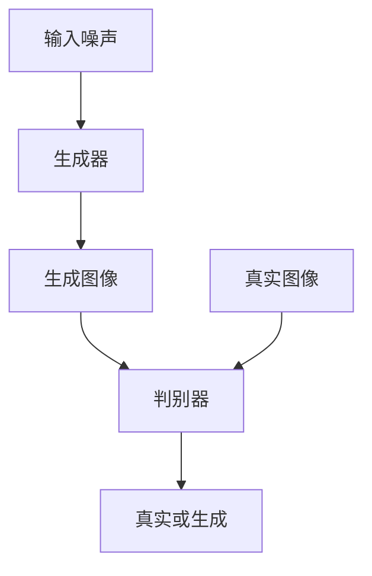

# 基于生成对抗网络的精细化图像内容编辑与风格迁移

## 1.背景介绍

生成对抗网络（Generative Adversarial Networks，简称GANs）自2014年由Ian Goodfellow等人提出以来，迅速成为机器学习和计算机视觉领域的研究热点。GANs通过两个神经网络——生成器（Generator）和判别器（Discriminator）——的对抗训练，能够生成逼真的图像、视频和其他数据。近年来，GANs在图像内容编辑和风格迁移方面展现了巨大的潜力，推动了这一领域的快速发展。

图像内容编辑和风格迁移是计算机视觉中的两个重要任务。前者旨在对图像中的特定内容进行修改或增强，而后者则是将一种图像的风格应用到另一种图像上。传统的方法通常依赖于手工设计的特征和复杂的优化算法，难以实现高质量的结果。GANs的引入为这些任务提供了新的解决方案，通过深度学习模型的强大表达能力，实现了更高的精度和灵活性。

## 2.核心概念与联系

### 2.1 生成对抗网络（GANs）

GANs由生成器和判别器组成。生成器负责生成逼真的图像，而判别器则负责区分真实图像和生成图像。两者通过对抗训练不断提升各自的能力，最终生成器能够生成足以欺骗判别器的高质量图像。

### 2.2 图像内容编辑

图像内容编辑涉及对图像中的特定内容进行修改，如改变颜色、添加物体、移除背景等。GANs通过学习图像的分布和特征，可以实现自动化的内容编辑。

### 2.3 风格迁移

风格迁移是将一种图像的风格（如绘画风格）应用到另一种图像上。GANs通过学习不同风格的特征，可以实现高质量的风格迁移。

### 2.4 核心联系

图像内容编辑和风格迁移都依赖于对图像特征的深度理解和表达。GANs通过生成器和判别器的对抗训练，能够捕捉图像的复杂特征，从而在这两个任务中表现出色。

## 3.核心算法原理具体操作步骤

### 3.1 生成对抗网络的基本结构

GANs的基本结构如下：



### 3.2 训练过程

1. **初始化**：初始化生成器和判别器的参数。
2. **生成图像**：生成器接收随机噪声，生成图像。
3. **判别器训练**：判别器接收真实图像和生成图像，输出分类结果。
4. **生成器训练**：生成器通过判别器的反馈调整参数，以生成更逼真的图像。
5. **迭代**：重复上述步骤，直到生成器和判别器达到平衡。

### 3.3 图像内容编辑的具体操作

1. **输入图像**：提供需要编辑的图像。
2. **特征提取**：使用预训练的深度学习模型提取图像特征。
3. **编辑操作**：根据需要修改特征，如改变颜色、添加物体等。
4. **生成图像**：通过生成器生成编辑后的图像。

### 3.4 风格迁移的具体操作

1. **内容图像和风格图像**：提供内容图像和风格图像。
2. **特征提取**：使用预训练的深度学习模型提取图像特征。
3. **特征融合**：将内容图像的特征与风格图像的特征融合。
4. **生成图像**：通过生成器生成风格迁移后的图像。

## 4.数学模型和公式详细讲解举例说明

### 4.1 GANs的数学模型

GANs的目标是通过生成器 $G$ 和判别器 $D$ 的对抗训练，使生成器生成的图像尽可能逼真。其损失函数定义为：

$$
\min_G \max_D V(D, G) = \mathbb{E}_{x \sim p_{data}(x)}[\log D(x)] + \mathbb{E}_{z \sim p_z(z)}[\log(1 - D(G(z)))]
$$

其中，$p_{data}(x)$ 是真实数据的分布，$p_z(z)$ 是噪声的分布。

### 4.2 图像内容编辑的数学模型

图像内容编辑可以看作是对图像特征的操作。假设 $I$ 是输入图像，$F(I)$ 是特征提取函数，$E$ 是编辑操作，则编辑后的图像 $I'$ 可以表示为：

$$
I' = G(E(F(I)))
$$

### 4.3 风格迁移的数学模型

风格迁移的目标是将内容图像 $I_c$ 和风格图像 $I_s$ 的特征融合，生成新的图像 $I_{cs}$。其损失函数定义为：

$$
L_{total} = \alpha L_{content} + \beta L_{style}
$$

其中，$L_{content}$ 是内容损失，$L_{style}$ 是风格损失，$\alpha$ 和 $\beta$ 是权重系数。

内容损失定义为：

$$
L_{content} = \sum_{i} \| F_i(I_{cs}) - F_i(I_c) \|^2
$$

风格损失定义为：

$$
L_{style} = \sum_{j} \| G_j(I_{cs}) - G_j(I_s) \|^2
$$

其中，$F_i$ 和 $G_j$ 分别是内容和风格特征提取函数。

## 5.项目实践：代码实例和详细解释说明

### 5.1 环境配置

首先，确保安装了必要的库，如 TensorFlow 或 PyTorch。

```bash
pip install tensorflow
pip install numpy
pip install matplotlib
```

### 5.2 数据准备

使用公开的图像数据集，如 CIFAR-10 或 ImageNet。

```python
import tensorflow as tf
from tensorflow.keras.datasets import cifar10

(x_train, y_train), (x_test, y_test) = cifar10.load_data()
x_train = x_train / 255.0
x_test = x_test / 255.0
```

### 5.3 生成器和判别器的实现

```python
from tensorflow.keras import layers

def build_generator():
    model = tf.keras.Sequential()
    model.add(layers.Dense(256, input_dim=100))
    model.add(layers.LeakyReLU(alpha=0.2))
    model.add(layers.Dense(512))
    model.add(layers.LeakyReLU(alpha=0.2))
    model.add(layers.Dense(1024))
    model.add(layers.LeakyReLU(alpha=0.2))
    model.add(layers.Dense(32 * 32 * 3, activation='tanh'))
    model.add(layers.Reshape((32, 32, 3)))
    return model

def build_discriminator():
    model = tf.keras.Sequential()
    model.add(layers.Flatten(input_shape=(32, 32, 3)))
    model.add(layers.Dense(512))
    model.add(layers.LeakyReLU(alpha=0.2))
    model.add(layers.Dense(256))
    model.add(layers.LeakyReLU(alpha=0.2))
    model.add(layers.Dense(1, activation='sigmoid'))
    return model
```

### 5.4 训练过程

```python
import numpy as np

def train_gan(generator, discriminator, epochs=10000, batch_size=64):
    for epoch in range(epochs):
        # 训练判别器
        idx = np.random.randint(0, x_train.shape[0], batch_size)
        real_images = x_train[idx]
        noise = np.random.normal(0, 1, (batch_size, 100))
        fake_images = generator.predict(noise)
        d_loss_real = discriminator.train_on_batch(real_images, np.ones((batch_size, 1)))
        d_loss_fake = discriminator.train_on_batch(fake_images, np.zeros((batch_size, 1)))
        d_loss = 0.5 * np.add(d_loss_real, d_loss_fake)

        # 训练生成器
        noise = np.random.normal(0, 1, (batch_size, 100))
        g_loss = gan.train_on_batch(noise, np.ones((batch_size, 1)))

        # 输出训练进度
        if epoch % 1000 == 0:
            print(f"{epoch} [D loss: {d_loss[0]}] [G loss: {g_loss}]")

# 构建和编译GAN
generator = build_generator()
discriminator = build_discriminator()
discriminator.compile(loss='binary_crossentropy', optimizer='adam', metrics=['accuracy'])

gan_input = tf.keras.Input(shape=(100,))
generated_image = generator(gan_input)
discriminator.trainable = False
gan_output = discriminator(generated_image)
gan = tf.keras.Model(gan_input, gan_output)
gan.compile(loss='binary_crossentropy', optimizer='adam')

# 开始训练
train_gan(generator, discriminator)
```

### 5.5 图像内容编辑和风格迁移的实现

```python
from tensorflow.keras.applications import VGG19
from tensorflow.keras.models import Model

# 加载预训练的VGG19模型
vgg = VGG19(include_top=False, weights='imagenet')
content_layer = 'block5_conv2'
style_layers = ['block1_conv1', 'block2_conv1', 'block3_conv1', 'block4_conv1', 'block5_conv1']

# 构建内容和风格模型
content_model = Model(inputs=vgg.input, outputs=vgg.get_layer(content_layer).output)
style_models = [Model(inputs=vgg.input, outputs=vgg.get_layer(layer).output) for layer in style_layers]

# 定义内容和风格损失
def content_loss(content, generated):
    return tf.reduce_mean(tf.square(content - generated))

def gram_matrix(tensor):
    channels = int(tensor.shape[-1])
    a = tf.reshape(tensor, [-1, channels])
    n = tf.shape(a)[0]
    gram = tf.matmul(a, a, transpose_a=True)
    return gram / tf.cast(n, tf.float32)

def style_loss(style, generated):
    s = gram_matrix(style)
    g = gram_matrix(generated)
    return tf.reduce_mean(tf.square(s - g))

# 定义总损失
def total_loss(content, style, generated, alpha=1.0, beta=1e-4):
    c_loss = content_loss(content, generated)
    s_loss = sum([style_loss(s, g) for s, g in zip(style, generated)])
    return alpha * c_loss + beta * s_loss

# 训练风格迁移模型
def train_style_transfer(content_image, style_image, epochs=1000, learning_rate=0.02):
    generated_image = tf.Variable(content_image, dtype=tf.float32)
    optimizer = tf.optimizers.Adam(learning_rate)

    for epoch in range(epochs):
        with tf.GradientTape() as tape:
            content_output = content_model(generated_image)
            style_outputs = [model(generated_image) for model in style_models]
            c_loss = content_loss(content_model(content_image), content_output)
            s_loss = sum([style_loss(model(style_image), output) for model, output in zip(style_models, style_outputs)])
            loss = c_loss + s_loss

        grads = tape.gradient(loss, generated_image)
        optimizer.apply_gradients([(grads, generated_image)])

        if epoch % 100 == 0:
            print(f"Epoch {epoch}, Loss: {loss.numpy()}")

    return generated_image

# 加载内容和风格图像
content_image = tf.image.decode_image(tf.io.read_file('content.jpg'))
style_image = tf.image.decode_image(tf.io.read_file('style.jpg'))
content_image = tf.image.resize(content_image, (224, 224))
style_image = tf.image.resize(style_image, (224, 224))

# 训练风格迁移模型
output_image = train_style_transfer(content_image, style_image)
```

## 6.实际应用场景

### 6.1 图像修复

GANs可以用于图像修复，如去除噪声、修复损坏的图像等。通过学习图像的分布，生成器可以生成高质量的修复图像。

### 6.2 图像生成

GANs可以生成逼真的图像，如人脸、风景等。这在娱乐、广告等领域有广泛的应用。

### 6.3 图像风格迁移

GANs可以将一种图像的风格应用到另一种图像上，如将照片转换为绘画风格。这在艺术创作、设计等领域有重要应用。

### 6.4 图像内容编辑

GANs可以对图像中的特定内容进行编辑，如改变颜色、添加物体等。这在图像处理、增强现实等领域有广泛应用。

## 7.工具和资源推荐

### 7.1 开源框架

- TensorFlow：一个广泛使用的深度学习框架，支持GANs的实现和训练。
- PyTorch：另一个流行的深度学习框架，具有灵活的动态计算图和强大的社区支持。

### 7.2 数据集

- CIFAR-10：一个常用的图像数据集，包含10类图像。
- ImageNet：一个大规模的图像数据集，包含数百万张图像和数千个类别。

### 7.3 参考文献

- Ian Goodfellow等人提出的GANs原始论文：《Generative Adversarial Nets》
- 相关的深度学习和计算机视觉书籍，如《深度学习》 by Ian Goodfellow, Yoshua Bengio, Aaron Courville

## 8.总结：未来发展趋势与挑战

### 8.1 未来发展趋势

1. **更高质量的生成图像**：随着模型和算法的不断改进，GANs生成的图像质量将进一步提升。
2. **多模态生成**：未来的GANs将能够生成多种类型的数据，如图像、视频、音频等。
3. **实时应用**：随着计算能力的提升，GANs将能够在实时应用中发挥更大作用，如实时图像编辑、增强现实等。

### 8.2 挑战

1. **训练稳定性**：GANs的训练过程容易不稳定，可能导致模式崩溃等问题。
2. **数据需求**：GANs的训练需要大量高质量的数据，这在某些应用场景中可能难以获得。
3. **计算资源**：GANs的训练和推理需要大量的计算资源，这对硬件设备提出了较高要求。

## 9.附录：常见问题与解答

### 9.1 GANs的训练为什么容易不稳定？

GANs的训练涉及生成器和判别器的对抗训练，容易出现模式崩溃、梯度消失等问题。可以通过改进损失函数、使用正则化等方法来缓解这些问题。

### 9.2 如何选择合适的生成器和判别器结构？

生成器和判别器的结构应根据具体任务和数据集进行选择。一般来说，生成器应具有较强的表达能力，而判别器应具有较强的分类能力。

### 9.3 如何评估GANs的生成效果？

可以通过定量和定性两种方法评估GANs的生成效果。定量方法包括使用FID（Fréchet Inception Distance）等指标，定性方法则包括人工评估生成图像的质量。

### 9.4 GANs在实际应用中有哪些限制？

GANs在实际应用中可能面临数据需求高、计算资源消耗大、训练不稳定等问题。需要根据具体应用场景进行优化和调整。

---

作者：禅与计算机程序设计艺术 / Zen and the Art of Computer Programming