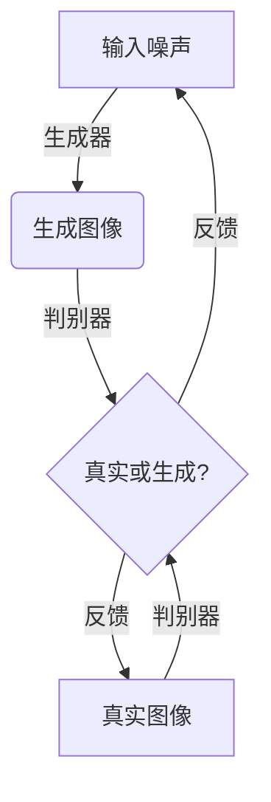
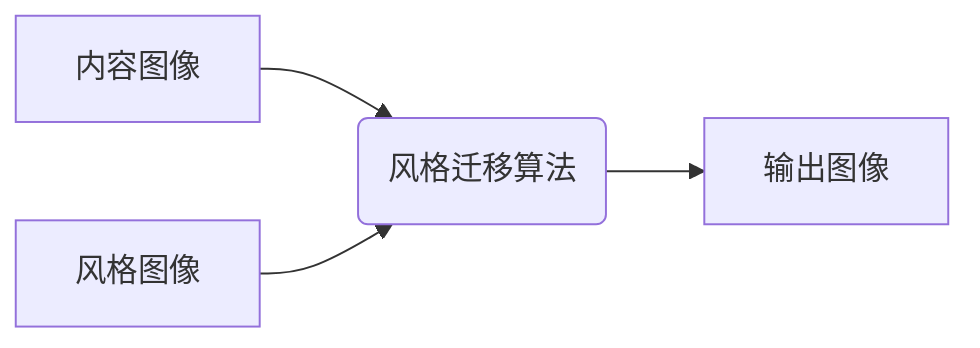
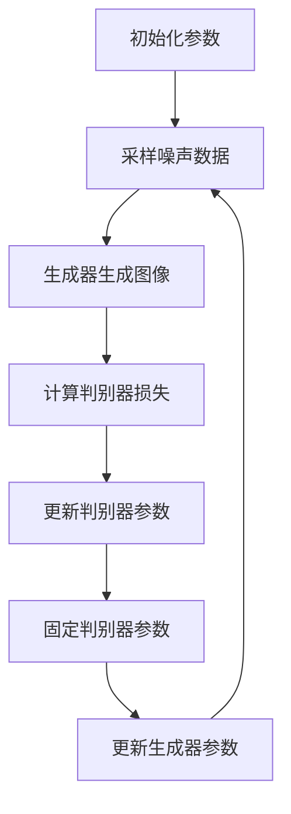
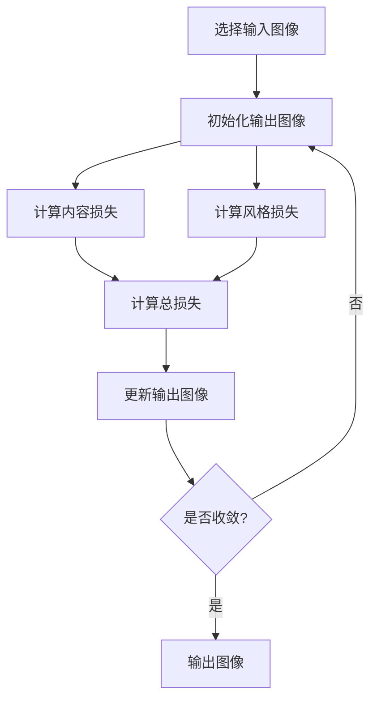

# 基于生成对抗网络的艺术品仿真与风格迁移技术

## 1.背景介绍

### 1.1 艺术品仿真的重要性

艺术品仿真一直是计算机视觉和图像处理领域的一个热门话题。由于艺术品通常价值昂贵且独一无二,因此能够准确地复制和保护这些文化遗产对于艺术品的保存和传播至关重要。传统的艺术品复制方法通常依赖于人工手工制作,不仅耗时耗力,而且难以完全复制原作品的细节和质感。

### 1.2 风格迁移在艺术领域的应用

除了艺术品仿真之外,风格迁移技术也在艺术创作领域受到广泛关注。风格迁移技术可以将一种艺术风格迁移到另一种内容上,使得原本风格迥异的两种内容融合在一起,产生全新的艺术作品。这种技术不仅可以为艺术家提供创作灵感,还能为普通大众提供个性化的艺术体验。

### 1.3 生成对抗网络(GAN)在艺术品仿真和风格迁移中的作用

近年来,生成对抗网络(Generative Adversarial Networks, GAN)在计算机视觉和图像处理领域取得了巨大成功,尤其是在艺术品仿真和风格迁移任务中表现出色。GAN能够从数据中学习内在的特征分布,并生成逼真的图像,因此非常适合用于艺术品仿真。同时,GAN也可以捕捉和迁移图像的风格特征,实现风格迁移的效果。

## 2.核心概念与联系

### 2.1 生成对抗网络(GAN)

生成对抗网络(GAN)是一种由两个神经网络组成的框架,包括一个生成器(Generator)和一个判别器(Discriminator)。生成器的目标是从噪声数据中生成逼真的图像,而判别器的目标是区分生成的图像和真实图像。两个网络相互对抗,生成器试图欺骗判别器,而判别器则努力识别出生成的图像。通过这种对抗训练过程,生成器最终能够生成逼真的图像。



### 2.2 卷积神经网络(CNN)

卷积神经网络(Convolutional Neural Networks, CNN)是一种常用于图像处理任务的深度学习模型。CNN通过卷积层和池化层来提取图像的特征,最后通过全连接层进行分类或回归。在艺术品仿真和风格迁移任务中,CNN通常被用作判别器的基础网络结构。


### 2.3 风格迁移

风格迁移是指将一种艺术风格迁移到另一种内容上的过程。通常需要两个输入:内容图像和风格图像。内容图像提供了需要保留的内容信息,而风格图像提供了需要迁移的风格特征。风格迁移算法的目标是生成一个新的图像,该图像不仅保留了内容图像的内容信息,还融合了风格图像的风格特征。



### 2.4 损失函数

在训练GAN进行艺术品仿真和风格迁移时,需要定义合适的损失函数来指导模型的训练。常用的损失函数包括:

1. **对抗损失(Adversarial Loss)**: 用于训练生成器和判别器,使生成器能够生成逼真的图像,而判别器能够正确区分真实图像和生成图像。

2. **内容损失(Content Loss)**: 用于保留生成图像中的内容信息,通常是将生成图像和内容图像的特征图进行比较。

3. **风格损失(Style Loss)**: 用于迁移风格特征,通常是将生成图像和风格图像的格拉姆矩阵(Gram Matrix)进行比较。

通过将这些损失函数进行加权求和,可以得到最终的总损失函数,用于优化模型的参数。

## 3.核心算法原理具体操作步骤

### 3.1 GAN训练过程

GAN的训练过程可以概括为以下步骤:

1. 初始化生成器和判别器的参数。

2. 从噪声数据中采样,将其输入到生成器中生成图像。

3. 将生成的图像和真实图像输入到判别器中,计算判别器的损失。

4. 更新判别器的参数,使其能够更好地区分真实图像和生成图像。

5. 固定判别器的参数,更新生成器的参数,使其能够生成更加逼真的图像,欺骗判别器。

6. 重复步骤2-5,直到模型收敛。



### 3.2 风格迁移算法步骤

风格迁移算法的具体步骤如下:

1. 选择内容图像和风格图像作为输入。

2. 初始化一个随机噪声图像作为输出图像。

3. 计算内容损失,即输出图像与内容图像的特征图之间的差异。

4. 计算风格损失,即输出图像与风格图像的格拉姆矩阵之间的差异。

5. 计算总损失,通常是内容损失和风格损失的加权和。

6. 使用优化算法(如梯度下降)更新输出图像的像素值,最小化总损失。

7. 重复步骤3-6,直到输出图像收敛。



## 4.数学模型和公式详细讲解举例说明

### 4.1 内容损失

内容损失用于保留生成图像中的内容信息,通常是将生成图像和内容图像的特征图进行比较。假设我们使用卷积神经网络提取图像的特征,那么内容损失可以定义为:

$$J_{\text{content}}(G) = \frac{1}{2} \sum_{i,j} (F_{ij}^l - P_{ij}^l)^2$$

其中,$ F_{ij}^l $是内容图像在第l层的特征图,$ P_{ij}^l $是生成图像在第l层的特征图,i和j分别表示特征图的高度和宽度。通过最小化内容损失,可以使生成图像的特征图尽可能接近内容图像的特征图,从而保留内容信息。

### 4.2 风格损失

风格损失用于迁移风格特征,通常是将生成图像和风格图像的格拉姆矩阵(Gram Matrix)进行比较。格拉姆矩阵可以捕捉图像的风格信息,定义如下:

$$G_{ij}^l = \sum_k F_{ik}^l F_{jk}^l$$

其中,$ F_{ik}^l $是第l层特征图的第k个滤波器响应,i和j表示滤波器的索引。风格损失可以定义为:

$$J_{\text{style}}(G) = \frac{1}{4n_ln_m^2} \sum_{l=0}^L \sum_{i,j} (G_{ij}^l - A_{ij}^l)^2$$

其中,$ G_{ij}^l $是生成图像在第l层的格拉姆矩阵,$ A_{ij}^l $是风格图像在第l层的格拉姆矩阵,n_l是第l层的特征图数量,n_m是每个特征图的大小。通过最小化风格损失,可以使生成图像的格拉姆矩阵尽可能接近风格图像的格拉姆矩阵,从而迁移风格特征。

### 4.3 总损失函数

总损失函数通常是内容损失和风格损失的加权和,定义如下:

$$J_{\text{total}}(G) = \alpha J_{\text{content}}(G) + \beta J_{\text{style}}(G)$$

其中,$ \alpha $和$ \beta $分别是内容损失和风格损失的权重系数,用于控制两者的相对重要性。通过最小化总损失函数,可以生成既保留了内容信息,又融合了风格特征的图像。

### 4.4 示例:风格迁移应用

假设我们有一张内容图像(一只狗)和一张风格图像(一幅梵高的油画作品),我们希望将风格图像的风格迁移到内容图像上,生成一幅新的艺术作品。我们可以使用上述公式计算内容损失和风格损失,并最小化总损失函数。下面是一个示例结果:


可以看到,生成的图像不仅保留了内容图像(狗)的内容信息,还融合了风格图像(梵高油画)的风格特征,呈现出一种独特的艺术效果。

## 5.项目实践:代码实例和详细解释说明

在这一部分,我们将提供一个基于PyTorch实现的GAN风格迁移项目代码示例,并对关键步骤进行详细解释。

### 5.1 导入所需库

```python
import torch
import torch.nn as nn
import torchvision.models as models
import torchvision.transforms as transforms
from PIL import Image
import matplotlib.pyplot as plt
```

### 5.2 定义内容损失和风格损失函数

```python
class ContentLoss(nn.Module):
    def __init__(self, target):
        super(ContentLoss, self).__init__()
        self.target = target.detach()

    def forward(self, input):
        self.loss = torch.mean((input - self.target) ** 2)
        return input

class StyleLoss(nn.Module):
    def __init__(self, target_feature):
        super(StyleLoss, self).__init__()
        self.target = self.gram_matrix(target_feature).detach()

    def forward(self, input):
        G = self.gram_matrix(input)
        self.loss = torch.mean((G - self.target) ** 2)
        return input

    def gram_matrix(self, input):
        batch_size, channel, height, width = input.size()
        features = input.view(batch_size, channel, height * width)
        features_t = features.transpose(1, 2)
        gram = features.bmm(features_t) / (channel * height * width)
        return gram
```

上述代码定义了内容损失函数`ContentLoss`和风格损失函数`StyleLoss`。`ContentLoss`计算输入特征图与目标特征图之间的均方差,而`StyleLoss`计算输入特征图与目标特征图的格拉姆矩阵之间的均方差。`gram_matrix`函数用于计算特征图的格拉姆矩阵。

### 5.3 定义风格迁移模型

```python
class StyleTransferModel(nn.Module):
    def __init__(self, content_img, style_img, content_layers, style_layers):
        super(StyleTransferModel, self).__init__()
        self.vgg = models.vgg19(pretrained=True).features
        self.content_losses = []
        self.style_losses = []

        self.content_layers = content_layers
        self.style_layers = style_layers

        self.model, self.content_losses, self.style_losses = self.get_model_and_losses(content_img, style_img)

    def get_model_and_losses(self, content_img, style_img):
        content_losses = []
        style_losses = []
        model = nn.Sequential()

        gram_style = [StyleLoss(batch_get_features(style_img, self.vgg, layer)) for layer in self.style_layers]

        i = 1
        for layer in list(self.vgg):
            if isinstance(layer, nn.Conv2d):
                name = f"conv_{i}"
            elif isinstance(layer, nn.ReLU):
                name = f"relu_{i}"
                layer = nn.ReLU(inplace=False)
            elif isinstance(layer, nn.MaxPool2d):
                name = f"pool_{i