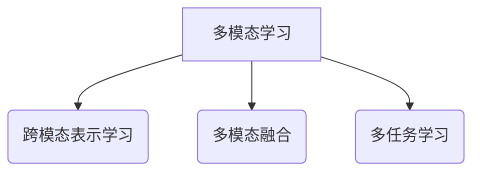
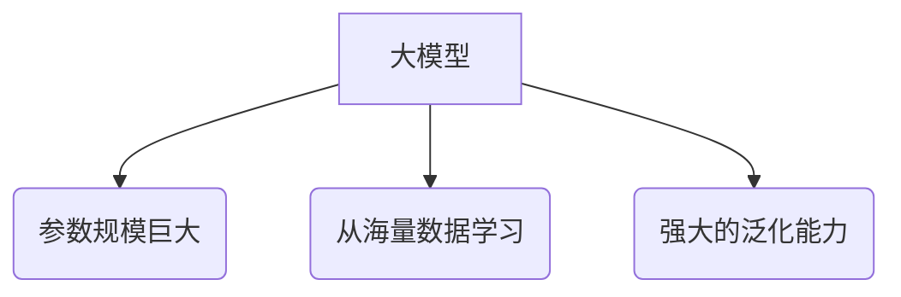
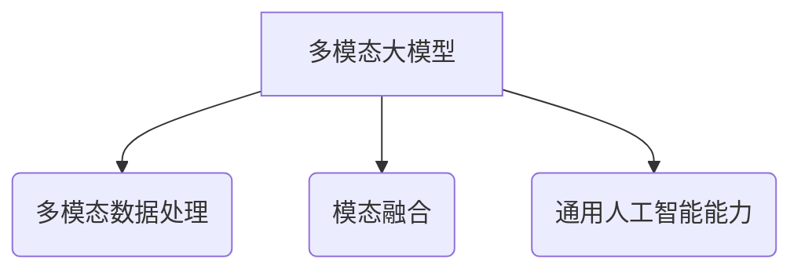
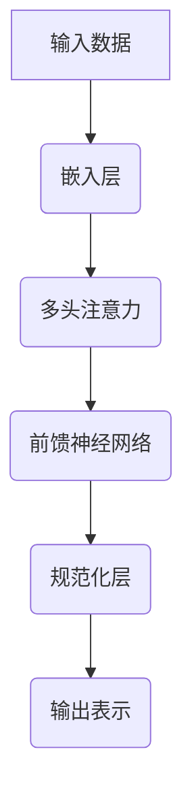
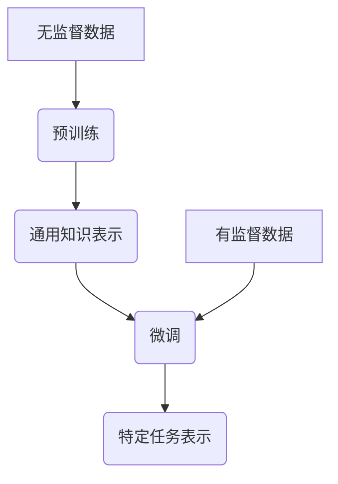
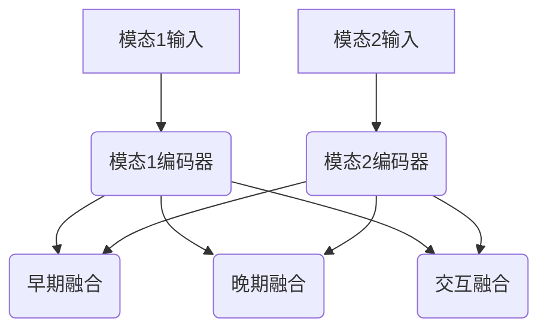
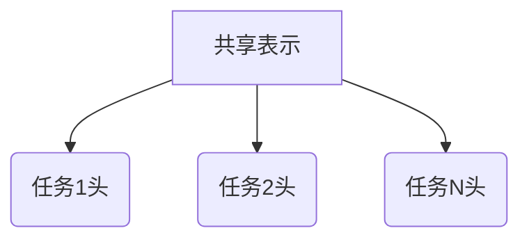

# 多模态大模型：技术原理与实战 GPT的创新点总结

## 1. 背景介绍

### 1.1 人工智能的发展历程

人工智能(Artificial Intelligence, AI)是当代科技发展的前沿领域,自20世纪50年代问世以来,已经经历了几个重要的发展阶段。早期的人工智能系统主要集中在特定领域的专家系统,如医疗诊断、游戏对弈等。随着机器学习算法的不断发展,人工智能逐步向通用化、智能化方向演进。

### 1.2 深度学习的兴起

21世纪初,深度学习(Deep Learning)技术的兴起,使得人工智能在计算机视觉、自然语言处理等领域取得了突破性进展。深度神经网络能够从海量数据中自主学习特征表示,极大提高了人工智能系统的性能和泛化能力。

### 1.3 大模型时代的来临

近年来,benefitting from算力、数据和算法的飞速发展,大规模的深度神经网络模型(大模型)开始崭露头角。以GPT(Generative Pre-trained Transformer)、BERT(Bidirectional Encoder Representations from Transformers)等为代表的大模型,展现出了强大的文本生成、理解和推理能力,推动了人工智能向通用人工智能(Artificial General Intelligence, AGI)的目标迈进。

### 1.4 多模态大模型的兴起

然而,现有的大模型主要局限于单一模态(如文本)的处理,无法充分利用多源异构数据(如图像、视频、语音等)中蕴含的丰富信息。为了突破这一瓶颈,多模态大模型(Multimodal Large Model)应运而生,旨在融合并利用多种模态数据,实现更强大、更通用的人工智能能力。

## 2. 核心概念与联系

### 2.1 多模态学习

多模态学习(Multimodal Learning)是指从不同模态(如文本、图像、视频等)的数据中学习知识表示和任务建模的过程。它涉及多个子领域,包括跨模态表示学习、多模态融合、多任务学习等。



### 2.2 大模型

大模型(Large Model)通常指具有数十亿甚至上万亿参数的深度神经网络模型。这些庞大的模型能够从海量数据中学习丰富的知识表示,展现出强大的泛化能力。



### 2.3 多模态大模型

多模态大模型(Multimodal Large Model)是将多模态学习和大模型相结合的新兴范式。它旨在构建统一的大规模模型,能够同时处理并融合多种模态数据,实现更强大、更通用的人工智能能力。



### 2.4 GPT与创新点

GPT(Generative Pre-trained Transformer)是一种基于Transformer的大型语言模型,最初由OpenAI提出。GPT通过在大规模无监督语料库上预训练,学习了丰富的语言知识,可以应用于多种自然语言处理任务。

GPT的创新点在于:

1. 自回归语言模型架构,支持高质量的文本生成。
2. 大规模无监督预训练,学习丰富的语言知识。
3. 通过微调(Fine-tuning)将预训练模型应用于下游任务。

后续的GPT-2、GPT-3等版本进一步扩大了模型规模,展现出更强大的文本生成和理解能力。

## 3. 核心算法原理具体操作步骤

### 3.1 Transformer架构

Transformer是多模态大模型的核心架构之一,它完全基于注意力机制(Attention Mechanism)构建,不依赖于循环神经网络(RNN)或卷积神经网络(CNN)。

Transformer的主要组成部分包括:

1. **嵌入层(Embedding Layer)**: 将输入数据(如文本、图像等)映射为嵌入向量表示。

2. **多头注意力机制(Multi-Head Attention)**: 捕获输入序列中不同位置元素之间的依赖关系。

3. **前馈神经网络(Feed-Forward Network)**: 对注意力输出进行非线性变换,提取高级特征表示。

4. **规范化层(Normalization Layer)**: 加速模型收敛,提高训练稳定性。

Transformer架构具有并行计算优势,能够有效利用硬件加速(如GPU、TPU),适合于大规模模型的训练。



### 3.2 预训练与微调

多模态大模型通常采用两阶段训练策略:

1. **预训练(Pre-training)**: 在大规模无监督数据上训练模型,学习通用的知识表示。

2. **微调(Fine-tuning)**: 在特定任务的有监督数据上,微调预训练模型的部分参数,适应目标任务。

预训练阶段通常采用自监督学习(Self-Supervised Learning)或对比学习(Contrastive Learning)等方法,从无标注数据中学习有效的表示。微调阶段则利用有监督数据对模型进行进一步调整,提高在特定任务上的性能。



### 3.3 模态融合

多模态大模型需要有效融合来自不同模态的信息。常见的模态融合策略包括:

1. **早期融合(Early Fusion)**: 在底层将不同模态的输入数据拼接或融合。

2. **晚期融合(Late Fusion)**: 在高层将不同模态的特征表示进行融合。

3. **交互融合(Interactive Fusion)**: 在不同层次交互融合模态信息,捕获模态间的相关性。

不同的融合策略适用于不同的任务场景,需要根据具体问题进行选择和设计。



### 3.4 多任务学习

多任务学习(Multi-Task Learning)是指在同一模型中同时学习多个相关任务,利用不同任务之间的相关性提高模型的泛化能力。

在多模态大模型中,通常采用硬参数共享(Hard Parameter Sharing)或软参数共享(Soft Parameter Sharing)等策略,实现多任务的联合学习。



## 4. 数学模型和公式详细讲解举例说明

### 4.1 Transformer中的注意力机制

注意力机制(Attention Mechanism)是Transformer的核心组件,它能够捕获输入序列中不同位置元素之间的依赖关系。

给定查询向量 $\boldsymbol{q}$、键向量 $\boldsymbol{K}$ 和值向量 $\boldsymbol{V}$,注意力计算公式如下:

$$\mathrm{Attention}(\boldsymbol{Q}, \boldsymbol{K}, \boldsymbol{V}) = \mathrm{softmax}\left(\frac{\boldsymbol{Q}\boldsymbol{K}^\top}{\sqrt{d_k}}\right)\boldsymbol{V}$$

其中, $d_k$ 是缩放因子,用于防止内积过大导致梯度饱和。

多头注意力机制(Multi-Head Attention)则是将注意力计算过程分成多个并行的"头"(Head),每个头捕获不同的依赖关系,最后将多个头的结果拼接起来:

$$\mathrm{MultiHead}(\boldsymbol{Q}, \boldsymbol{K}, \boldsymbol{V}) = \mathrm{Concat}(\mathrm{head}_1, \ldots, \mathrm{head}_h)\boldsymbol{W}^O$$
$$\mathrm{head}_i = \mathrm{Attention}(\boldsymbol{Q}\boldsymbol{W}_i^Q, \boldsymbol{K}\boldsymbol{W}_i^K, \boldsymbol{V}\boldsymbol{W}_i^V)$$

其中, $\boldsymbol{W}_i^Q$、$\boldsymbol{W}_i^K$、$\boldsymbol{W}_i^V$ 和 $\boldsymbol{W}^O$ 是可学习的线性变换矩阵。

注意力机制能够动态地捕获输入序列中不同位置元素之间的依赖关系,是Transformer取得巨大成功的关键所在。

### 4.2 对比学习中的InfoNCE损失函数

对比学习(Contrastive Learning)是一种自监督学习方法,通过最大化正例对之间的相似性,最小化正例与负例之间的相似性,学习有效的数据表示。

InfoNCE损失函数是对比学习中常用的损失函数之一,它基于噪声对比估计(Noise Contrastive Estimation)原理,公式如下:

$$\mathcal{L}_\mathrm{InfoNCE} = -\mathbb{E}_{(x, x^+) \sim p_\mathrm{pos}}\left[\log \frac{\exp(\mathrm{sim}(z, z^+) / \tau)}{\exp(\mathrm{sim}(z, z^+) / \tau) + \sum_{x^- \sim p_\mathrm{neg}} \exp(\mathrm{sim}(z, z^-) / \tau)}\right]$$

其中, $x$ 和 $x^+$ 是一对正例样本(如同一个图像的两种增强形式), $z$ 和 $z^+$ 是它们对应的表示向量, $x^-$ 是负例样本, $\mathrm{sim}(\cdot, \cdot)$ 是相似度函数(如内积), $\tau$ 是温度超参数。

InfoNCE损失函数通过最大化正例对的相似度,最小化正例与负例的相似度,从而学习出高质量的数据表示。

### 4.3 视觉-语言对比学习

视觉-语言对比学习(Vision-Language Contrastive Learning)是一种用于学习视觉和语言的联合表示的方法。它将图像和文本作为正例对,最大化它们之间的相似度,同时最小化正例与负例之间的相似度。

给定图像 $I$ 和文本 $T$,它们的联合表示可以通过如下公式计算:

$$z_I = f_I(I), \quad z_T = f_T(T)$$
$$z = g(z_I, z_T)$$

其中, $f_I$ 和 $f_T$ 分别是图像编码器和文本编码器, $g$ 是融合函数(如简单拼接或更复杂的交互机制)。

然后,可以使用InfoNCE损失函数或其变体,最大化正例对 $(I, T)$ 的相似度,最小化正例与负例之间的相似度:

$$\mathcal{L}_\mathrm{VLC} = -\mathbb{E}_{(I, T) \sim p_\mathrm{pos}}\left[\log \frac{\exp(\mathrm{sim}(z_I, z_T) / \tau)}{\exp(\mathrm{sim}(z_I, z_T) / \tau) + \sum_{(I^-, T^-) \sim p_\mathrm{neg}} \exp(\mathrm{sim}(z_I, z_T^-) / \tau) + \exp(\mathrm{sim}(z_I^-, z_T) / \tau)}\right]$$

通过这种方式,模型能够学习到视觉和语言的联合表示,捕获两种模态之间的相关性,为多模态任务奠定基础。

## 5. 项目实践:代码实例和详细解释说明

以下是一个使用PyTorch实现的简单视觉-语言对比学习示例:

```python
import torch
import torch.nn as nn
import torch.nn.functional as F

# 图像编码器
class ImageEncoder(nn.Module):
    def __init__(self, embed_dim):
        super().__init__()
        self.conv = nn.Conv2d(3, embed_dim, kernel_size=