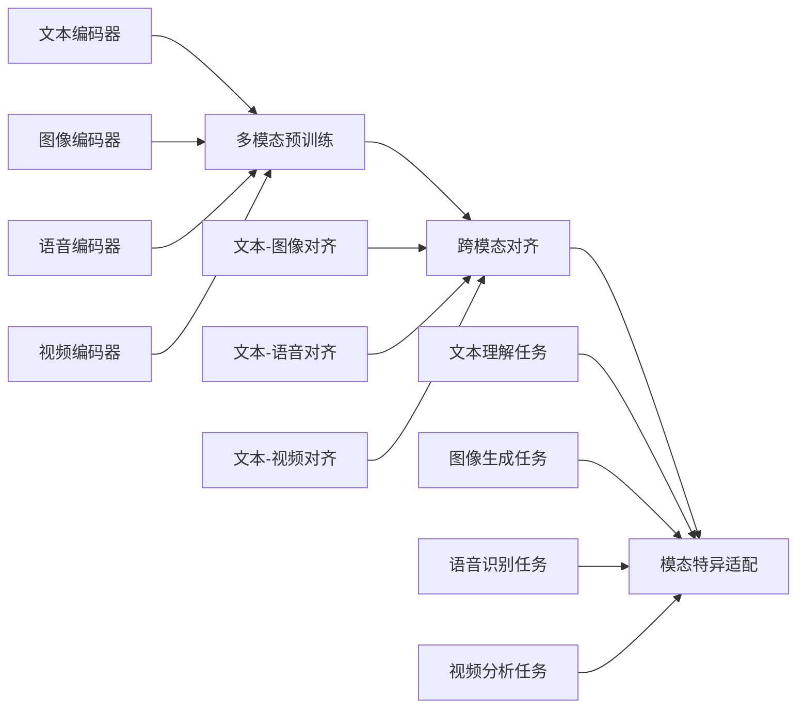

# 多模态大模型：技术原理与实战 OpenAI特殊的股权设计带来的启示

## 1. 背景介绍
### 1.1 多模态大模型的兴起
近年来,随着深度学习技术的快速发展,多模态大模型(Multimodal Large Model)成为人工智能领域的研究热点。多模态大模型能够同时处理文本、图像、语音等不同模态的数据,实现跨模态的信息理解和生成。从OpenAI的GPT-3、DALL·E到DeepMind的Gato,多模态大模型展现出了惊人的能力,引发了学术界和产业界的广泛关注。

### 1.2 OpenAI的创新之路  
OpenAI作为人工智能领域的先行者,一直走在多模态大模型的最前沿。从早期的GPT、CLIP到如今的GPT-4、DALL·E 2,OpenAI不断突破技术边界,推动多模态大模型的发展。而支撑OpenAI创新的,不仅有顶尖的AI科学家和强大的算力,还有其独特的组织架构和股权设计。

### 1.3 本文的主要内容
本文将深入探讨多模态大模型的技术原理,剖析其核心算法和数学模型,并结合OpenAI的实践案例,讨论如何开发和部署多模态大模型。同时,本文还将分析OpenAI特殊的股权设计,探讨其对于保障公司长期使命、吸引顶尖人才、确保资金供给等方面的积极作用,为其他AI公司的发展提供有益启示。

## 2. 核心概念与联系
### 2.1 多模态学习
多模态学习(Multimodal Learning)指利用多种感官通道获取信息,并将这些异构数据映射到一个共同的表示空间,从而实现跨模态的理解和生成。人类就是一个天然的多模态学习系统,可以同时处理视觉、听觉、触觉等多种感官信息。多模态学习对于构建通用人工智能至关重要。

### 2.2 大模型
大模型(Large Model)是指参数量极其庞大(数亿到上千亿)的深度神经网络模型。得益于海量训练数据和强大算力,大模型能够学习到丰富的知识和强大的泛化能力。GPT-3拥有1750亿参数,在自然语言处理任务上实现了惊人的few-shot和zero-shot能力。大模型是实现通用人工智能的有力工具。

### 2.3 Transformer结构
Transformer是一种基于自注意力机制(Self-Attention)的神经网络结构,最初应用于自然语言处理领域。相比RNN和CNN等结构,Transformer能够更好地处理长程依赖,且计算高度并行。Transformer已成为大模型的首选基础结构。

### 2.4 预训练与微调
预训练(Pre-training)指在大规模无标注数据上训练通用的语言模型或视觉模型,学习丰富的语义特征表示。在此基础上,通过在下游任务的小规模标注数据上微调(Fine-tuning),即可实现特定任务的快速适配。预训练-微调范式大大提升了大模型的泛化能力和样本效率。

### 2.5 零样本/少样本学习
零样本学习(Zero-shot Learning)指模型无需在特定任务的标注数据上微调,即可直接完成新任务。少样本学习(Few-shot Learning)指模型在少量标注样本(如10个)上微调,即可快速适应新任务。大模型强大的语言理解和跨模态映射能力,使其在零样本/少样本学习方面表现出色。

### 2.6 多模态大模型的技术架构
下图展示了一个典型的多模态大模型的技术架构,主要包括三个部分:

- 多模态预训练:利用大规模文本、图像、语音、视频等多模态数据,分别训练相应的编码器,学习不同模态的通用特征表示。
- 跨模态对齐:通过对比学习等方法,将不同模态映射到一个共同的语义空间,实现文本-图像、文本-语音、文本-视频等跨模态对齐。
- 模态特异适配:在统一的多模态表示基础上,针对不同任务进行模态特异的适配和优化,如文本分类、图像生成、语音识别、视频分析等。

## 3. 核心算法原理与操作步骤
### 3.1 多模态预训练
#### 3.1.1 文本预训练
对于文本数据,采用Transformer结构的语言模型如GPT进行预训练。具体步骤如下:
1) 构建大规模高质量的无标注文本语料库
2) 对文本进行tokenization,转化为数值化的输入表示
3) 搭建Transformer结构的语言模型
4) 采用自回归的生成式预训练任务,最大化下一个token的概率
5) 在语料库上进行大规模预训练,优化语言模型参数

#### 3.1.2 图像预训练
对于图像数据,主要采用两类预训练方法:
- 基于CNN的分类预训练:
1) 构建大规模高质量的图像分类数据集如ImageNet
2) 搭建CNN结构的视觉模型如ResNet
3) 以图像分类为监督信号,训练CNN模型学习图像特征
4) 在下游任务中,取CNN顶层输出作为图像特征

- 基于Transformer的生成式预训练:
1) 构建大规模无标注图像数据集
2) 将图像分割为patch,并线性投影为视觉token
3) 搭建Transformer结构的图像生成模型如ViT、iGPT
4) 采用自回归的生成式预训练任务,最大化图像patch的概率
5) 在数据集上进行大规模预训练,优化图像生成模型参数

#### 3.1.3 语音预训练
对于语音数据,主要采用两步预训练:
1) 构建大规模无标注语音数据集
2) 对语音进行特征提取,如Mel频谱、MFCC等
3) 搭建Transformer结构的声学模型
4) 采用自回归的生成式预训练任务,最大化语音特征序列的概率 
5) 在数据集上进行大规模预训练,优化声学模型参数
6) 在声学模型之上,添加语言模型如BERT进行二次预训练,提升语义理解能力

#### 3.1.4 视频预训练
视频预训练通常分为两个阶段:
- 帧级特征提取:
1) 采用在图像分类任务上预训练的CNN模型
2) 在每一帧上应用CNN,提取帧级视觉特征
3) 将视频表示为帧级特征的序列

- 序列级语义建模:
1) 将帧级特征序列输入到Transformer结构中
2) 采用掩码语言模型、次序预测等预训练任务
3) 在大规模视频数据集上预训练,学习视频的语义表示

### 3.2 跨模态对齐
#### 3.2.1 文本-图像对齐
将文本和图像映射到一个共同的语义空间,使得匹配的文本-图像对具有相近的表示。主要方法有:
- 对比学习:
1) 构建文本-图像对作为正样本,采样不匹配的文本-图像对作为负样本
2) 将文本和图像分别输入预训练的文本编码器和图像编码器,提取特征表示
3) 通过对比损失函数(如InfoNCE),拉近正样本的距离,推远负样本的距离
4) 端到端训练文本编码器和图像编码器,实现跨模态对齐

- 对偶编码:
1) 搭建两个互逆的跨模态生成模型:文本到图像和图像到文本
2) 给定文本,前向生成匹配的图像;给定生成的图像,反向重构原始文本。对偶地,给定图像,前向生成匹配的文本;给定生成的文本,反向重构原始图像
3) 通过重构损失函数,优化两个互逆的跨模态生成模型,实现文本-图像的对偶编码对齐

#### 3.2.2 文本-语音对齐
将文本和语音映射到一个共同的语义空间,使得匹配的文本-语音对具有相近的表示。主要方法有:
- 语音-文本互预测:
1) 搭建Transformer结构的语音-文本互预测模型
2) 给定语音特征序列,预测对应的文本序列;给定文本序列,预测对应的语音特征序列
3) 通过互预测损失函数,优化语音-文本互预测模型,实现两个模态的对齐

- 共享语义表示:
1) 搭建共享Transformer结构的语音编码器和文本编码器
2) 语音编码器将语音特征序列映射为语义表示,文本编码器将文本序列映射为语义表示
3) 在语义表示空间中,对语音-文本对进行对比学习,拉近匹配对的距离
4) 通过对比损失函数,优化语音编码器和文本编码器,实现跨模态语义表示的对齐

#### 3.2.3 文本-视频对齐
将文本和视频映射到一个共同的语义空间,使得匹配的文本-视频片段对具有相近的表示。主要方法有:
- 时序对比学习:
1) 构建文本-视频片段对作为正样本,采样不匹配的文本-视频片段对作为负样本
2) 将文本输入文本编码器,将视频帧级特征序列输入Transformer,提取整个视频片段的特征表示
3) 通过对比损失函数,拉近文本-视频正样本的距离,推远负样本的距离
4) 端到端训练文本编码器和视频编码器,实现跨模态时序对齐

- 共同注意力对齐:
1) 搭建共享注意力机制的文本编码器和视频编码器
2) 将文本序列输入文本编码器,得到每个token的注意力权重
3) 将视频帧级特征序列输入视频编码器,同样得到每一帧的注意力权重
4) 通过最小化文本token注意力和视频帧注意力的JS散度,实现两个模态注意力分布的对齐
5) 联合优化两个编码器,使得匹配的文本-视频对在注意力分布上达成一致

### 3.3 模态特异适配
#### 3.3.1 文本理解任务
在统一的多模态语义空间中,针对文本分类、文本匹配、阅读理解、命名实体识别等理解任务进行模态特异优化:
1) 在下游任务数据集上,取出多模态大模型中的文本编码器部分
2) 根据任务类型,在文本编码器之上添加特异的预测头,如分类层、span提取层等 
3) 冻结文本编码器参数,只微调预测头,实现快速任务适配
4) 若任务数据较多,可以联合优化文本编码器和预测头,进一步提升性能

#### 3.3.2 图像生成任务
利用多模态大模型实现从文本到图像的跨模态生成:
1) 在统一语义空间中,将文本表示作为图像生成的条件
2) 搭建Transformer结构的图像生成器,以文本表示为条件,自回归地生成图像patch序列
3) 通过最大化图像序列条件概率,端到端优化图像生成器
4) 推理时,给定文本输入,自回归解码生成图像输出

#### 3.3.3 语音识别任务
利用多模态大模型实现语音到文本的转换:
1) 在统一语义空间中,取出语音编码器将语音特征序列映射为语义表示
2) 在语义表示之上,搭建Transformer结构的语言模型解码器
3) 通过最大化文本序列的条件概率,联合优化语音编码器和语言模型解码器
4) 推理时,语音编码器提取特征