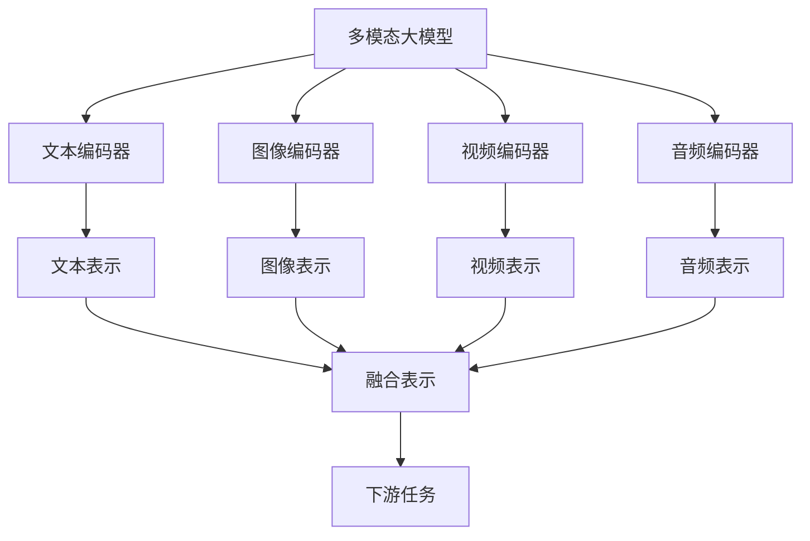

# 多模态大模型：技术原理与实战方法论介绍

## 1.背景介绍

### 1.1 人工智能的演进

人工智能(AI)的发展经历了多个阶段,从早期的专家系统和机器学习算法,到近年来的深度学习模型的兴起。随着计算能力的不断提高和大量数据的积累,深度学习在计算机视觉、自然语言处理等领域取得了突破性进展。然而,这些模型通常专注于单一模态(如文本或图像),无法充分利用多模态信息。

### 1.2 多模态学习的兴起

现实世界中的信息通常以多种形式存在,如文本、图像、视频和音频等。能够同时处理和融合这些不同模态数据的人工智能模型,被称为多模态模型。多模态学习旨在从不同模态的数据中提取特征,并学习它们之间的关联,从而实现更准确、更丰富的理解和决策。

### 1.3 大模型时代的到来

近年来,随着计算能力和数据量的飞速增长,大规模预训练语言模型(如GPT、BERT)和大规模视觉模型(如CLIP、Stable Diffusion)取得了令人瞩目的成就。这些模型通过在海量数据上进行预训练,学习到了丰富的知识和语义表示,为下游任务提供了强大的基础。然而,它们仍然局限于单一模态,无法充分利用多模态信息。

## 2.核心概念与联系

### 2.1 多模态大模型的定义

多模态大模型是指能够同时处理多种模态数据(如文本、图像、视频等)的大规模预训练模型。它们通过在海量多模态数据上进行预训练,学习到了丰富的跨模态知识表示,可以在下游任务中灵活地融合和利用不同模态的信息。



### 2.2 多模态融合

多模态融合是多模态大模型的核心挑战之一。不同的模态数据具有不同的表示形式和语义特征,如何有效地融合这些异构信息是关键。常见的融合方法包括:

1. **早期融合**:在编码器层面将不同模态的数据concatenate后输入到同一个编码器中。
2. **晚期融合**:分别对每个模态进行编码,然后在更高层次上融合不同模态的表示。
3. **交互式融合**:不同模态之间的表示在编码过程中相互影响和更新,实现动态交互融合。

### 2.3 预训练任务

为了在大量多模态数据上学习到有效的跨模态表示,多模态大模型通常采用自监督的方式进行预训练。常见的预训练任务包括:

1. **掩码语言模型**(Masked Language Modeling, MLM):预测被掩码的文本token。
2. **图像文本对比**(Image-Text Contrastive):最大化图像和对应文本描述之间的相似性,最小化与其他描述的相似性。
3. **视频文本对比**:类似于图像文本对比,但涉及视频和文本的对比。
4. **多模态生成**:根据一个模态的输入(如文本)生成另一个模态的输出(如图像)。

通过这些预训练任务,多模态大模型能够学习到模态间的关联,并形成统一的语义空间表示。

## 3.核心算法原理具体操作步骤

多模态大模型的核心算法原理可以概括为以下几个步骤:

### 3.1 模态编码

首先,将不同模态的输入数据(如文本、图像、视频等)输入到对应的编码器中,生成模态特征表示。常用的编码器包括:

- 文本编码器:通常采用Transformer编码器,将文本token序列编码为向量表示。
- 视觉编码器:使用卷积神经网络(CNN)或视觉Transformer对图像或视频帧进行编码。
- 其他模态编码器:根据具体任务,可以添加音频、点云等其他模态的编码器。

$$
\begin{aligned}
\mathbf{h}^{text} &= \text{TextEncoder}(x^{text}) \\
\mathbf{h}^{image} &= \text{ImageEncoder}(x^{image}) \\
\mathbf{h}^{video} &= \text{VideoEncoder}(x^{video})
\end{aligned}
$$

其中,$\mathbf{h}^{text}$、$\mathbf{h}^{image}$和$\mathbf{h}^{video}$分别表示文本、图像和视频的编码特征。

### 3.2 模态融合

接下来,将不同模态的特征表示进行融合,生成统一的多模态表示。常见的融合方法包括:

1. **特征拼接**:直接将不同模态的特征向量拼接在一起,作为多模态表示。

$$
\mathbf{h}^{fusion} = [\mathbf{h}^{text}; \mathbf{h}^{image}; \mathbf{h}^{video}]
$$

2. **注意力融合**:使用注意力机制动态地融合不同模态的特征,赋予不同模态不同的权重。

$$
\begin{aligned}
\mathbf{a}^{text} &= \text{AttentionScore}(\mathbf{h}^{text}, \mathbf{h}^{image}, \mathbf{h}^{video}) \\
\mathbf{a}^{image} &= \text{AttentionScore}(\mathbf{h}^{image}, \mathbf{h}^{text}, \mathbf{h}^{video}) \\
\mathbf{a}^{video} &= \text{AttentionScore}(\mathbf{h}^{video}, \mathbf{h}^{text}, \mathbf{h}^{image}) \\
\mathbf{h}^{fusion} &= \mathbf{a}^{text} \odot \mathbf{h}^{text} + \mathbf{a}^{image} \odot \mathbf{h}^{image} + \mathbf{a}^{video} \odot \mathbf{h}^{video}
\end{aligned}
$$

3. **交互式融合**:不同模态的特征在编码过程中相互影响和更新,实现动态交互融合。这种方法通常需要设计复杂的交互机制。

### 3.3 预训练

得到多模态融合表示$\mathbf{h}^{fusion}$后,可以使用各种预训练任务对模型进行训练,例如:

- 掩码语言模型(MLM):预测被掩码的文本token。
- 图像文本对比:最大化图像和对应文本描述之间的相似性,最小化与其他描述的相似性。
- 多模态生成:根据一个模态的输入(如文本)生成另一个模态的输出(如图像)。

通过这些预训练任务,模型可以学习到模态间的关联,并形成统一的语义空间表示。

### 3.4 微调

在下游任务上,可以根据任务的具体需求,对预训练的多模态大模型进行微调(fine-tuning),使其适应特定的任务。例如,对于视觉问答任务,可以在模型的输出层添加一个分类器,并使用带有(问题、图像、答案)的数据集对模型进行微调。

## 4.数学模型和公式详细讲解举例说明

在多模态大模型中,数学模型和公式扮演着重要的角色,用于描述和优化模型的各个组成部分。以下是一些常见的数学模型和公式:

### 4.1 自注意力机制

自注意力机制是Transformer模型的核心,它能够捕捉输入序列中元素之间的长程依赖关系。对于一个长度为$n$的输入序列$\mathbf{X} = (\mathbf{x}_1, \mathbf{x}_2, \dots, \mathbf{x}_n)$,自注意力机制计算每个位置$i$的输出表示$\mathbf{y}_i$如下:

$$
\begin{aligned}
\mathbf{Q}_i &= \mathbf{X}_i \mathbf{W}^Q \\
\mathbf{K}_j &= \mathbf{X}_j \mathbf{W}^K \\
\mathbf{V}_j &= \mathbf{X}_j \mathbf{W}^V \\
\alpha_{ij} &= \text{softmax}\left(\frac{\mathbf{Q}_i \mathbf{K}_j^\top}{\sqrt{d_k}}\right) \\
\mathbf{y}_i &= \sum_{j=1}^n \alpha_{ij} \mathbf{V}_j
\end{aligned}
$$

其中,$\mathbf{W}^Q$、$\mathbf{W}^K$和$\mathbf{W}^V$分别是查询(Query)、键(Key)和值(Value)的线性变换矩阵,$d_k$是缩放因子,用于防止点积过大导致softmax梯度较小。

自注意力机制广泛应用于文本编码器和视觉编码器中,能够有效地捕捉不同位置元素之间的依赖关系。

### 4.2 对比损失函数

对比损失函数(Contrastive Loss)是多模态大模型中常用的预训练目标之一,它旨在最大化正样本对(如图像和对应文本描述)之间的相似性,同时最小化负样本对之间的相似性。

设$\mathcal{P}$为正样本对集合,$\mathcal{N}$为负样本对集合,对于一个正样本对$(i, j) \in \mathcal{P}$,其对比损失定义为:

$$
\ell_{i,j} = -\log \frac{e^{\text{sim}(i, j) / \tau}}{\sum_{k} e^{\text{sim}(i, k) / \tau}}
$$

其中,$\text{sim}(i, j)$表示样本$i$和$j$之间的相似性得分(如余弦相似度),$\tau$是温度超参数,用于控制相似性分数的尺度。

对比损失函数的目标是最小化所有正样本对的损失之和:

$$
\mathcal{L} = \sum_{(i, j) \in \mathcal{P}} \ell_{i,j}
$$

通过优化这个损失函数,模型可以学习到一个统一的语义空间,在该空间中,相似的样本对(如图像和对应文本描述)的表示向量彼此靠近,而不相似的样本对的表示向量彼此远离。

### 4.3 多模态生成模型

多模态生成模型旨在根据一个模态的输入(如文本)生成另一个模态的输出(如图像)。这种模型通常采用编码器-解码器架构,其中编码器将输入模态编码为潜在表示,解码器则根据该潜在表示生成目标模态的输出。

对于一个文本到图像的生成任务,模型的目标是最大化输入文本$\mathbf{x}$和生成图像$\mathbf{y}$之间的条件概率$p(\mathbf{y} | \mathbf{x})$。这可以通过最小化负对数似然损失来实现:

$$
\mathcal{L}(\theta) = -\mathbb{E}_{\mathbf{x}, \mathbf{y} \sim p_{\text{data}}} \log p_\theta(\mathbf{y} | \mathbf{x})
$$

其中,$\theta$表示模型参数,$p_{\text{data}}$是训练数据的真实分布。

在实践中,由于直接优化像素级别的损失函数存在困难,通常采用生成对抗网络(GAN)或变分自编码器(VAE)等框架,引入隐式或显式的潜在变量,从而简化优化过程。

## 5.项目实践:代码实例和详细解释说明

为了更好地理解多模态大模型的实现细节,我们将通过一个具体的代码示例来演示如何构建一个简单的多模态模型。在这个示例中,我们将使用PyTorch框架,并采用早期融合的策略来融合文本和图像模态。

### 5.1 数据准备

首先,我们需要准备一个包含文本和图像对的数据集。为了简单起见,我们将使用MNIST数据集,并为每个手写数字图像生成一个简单的文本描述。

```python
import torch
from torchvision import datasets, transforms

# 加载MNIST数据集
mnist_data = datasets.MNIST(root='data', train=True, download=True, transform=transforms.ToTensor())

# 为每个图像