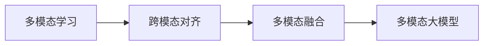

# 多模态大模型：技术原理与实战 智能客服

## 1. 背景介绍
### 1.1 人工智能的发展历程
#### 1.1.1 早期人工智能
#### 1.1.2 机器学习时代 
#### 1.1.3 深度学习的崛起
### 1.2 大模型的出现
#### 1.2.1 大模型的定义
#### 1.2.2 大模型的优势
#### 1.2.3 大模型的应用前景
### 1.3 多模态技术的兴起
#### 1.3.1 多模态的概念
#### 1.3.2 多模态技术的发展
#### 1.3.3 多模态技术与大模型的结合

## 2. 核心概念与联系
### 2.1 多模态学习
#### 2.1.1 多模态学习的定义
#### 2.1.2 多模态学习的优势
#### 2.1.3 多模态学习的挑战
### 2.2 跨模态对齐
#### 2.2.1 跨模态对齐的概念
#### 2.2.2 跨模态对齐的方法
#### 2.2.3 跨模态对齐的应用
### 2.3 多模态融合
#### 2.3.1 多模态融合的定义
#### 2.3.2 多模态融合的策略
#### 2.3.3 多模态融合的效果
### 2.4 核心概念之间的联系

## 3. 核心算法原理具体操作步骤
### 3.1 多模态预训练
#### 3.1.1 无监督预训练
#### 3.1.2 有监督预训练
#### 3.1.3 对比学习
### 3.2 跨模态对齐算法
#### 3.2.1 对抗学习
#### 3.2.2 度量学习
#### 3.2.3 知识蒸馏
### 3.3 多模态融合算法
#### 3.3.1 早期融合
#### 3.3.2 晚期融合
#### 3.3.3 混合融合
### 3.4 端到端微调
#### 3.4.1 参数高效微调
#### 3.4.2 提示学习微调
#### 3.4.3 零样本/少样本学习

## 4. 数学模型和公式详细讲解举例说明
### 4.1 多模态表示学习
#### 4.1.1 潜在语义分析 LSA
$$ X = U \Sigma V^T $$
#### 4.1.2 多模态自编码器 MAE  
$$ \mathcal{L}_{MAE} = \sum_{m=1}^M \mathcal{L}_{recon}^{(m)} + \lambda \mathcal{L}_{corr} $$
#### 4.1.3 多模态变分自编码器 MVAE
$$ \mathcal{L}_{MVAE} = \sum_{m=1}^M \mathbb{E}_{q_{\phi}(z|x^{(m)})}[\log p_{\theta}(x^{(m)}|z)] - D_{KL}(q_{\phi}(z|x^{(m)})||p(z)) $$
### 4.2 跨模态对齐模型 
#### 4.2.1 对抗学习 
$$ \mathcal{L}_{adv} = \mathbb{E}_{x \sim p_{data}(x)}[\log D(x)] + \mathbb{E}_{z \sim p_{z}(z)}[\log (1-D(G(z)))] $$
#### 4.2.2 度量学习
$$ \mathcal{L}_{triplet} = \max(d(a,p) - d(a,n) + \alpha, 0) $$
#### 4.2.3 知识蒸馏
$$ \mathcal{L}_{KD} = \mathcal{H}(y_{true}, P_{student}) + \lambda \mathcal{H}(P_{teacher}, P_{student}) $$
### 4.3 多模态融合模型
#### 4.3.1 多模态Transformer
$$ \text{Attention}(Q,K,V) = \text{softmax}(\frac{QK^T}{\sqrt{d_k}})V $$
#### 4.3.2 多模态图神经网络
$$ h_i^{(l+1)} = \sigma(\sum_{j \in \mathcal{N}(i)} \alpha_{ij} W^{(l)} h_j^{(l)}) $$

## 5. 项目实践：代码实例和详细解释说明
### 5.1 多模态预训练实例
#### 5.1.1 CLIP预训练
#### 5.1.2 ALBEF预训练
#### 5.1.3 FLAVA预训练
### 5.2 跨模态对齐实例 
#### 5.2.1 对抗学习对齐
#### 5.2.2 度量学习对齐
#### 5.2.3 知识蒸馏对齐
### 5.3 多模态融合实例
#### 5.3.1 ViLBERT融合
#### 5.3.2 LXMERT融合 
#### 5.3.3 UNITER融合
### 5.4 端到端微调实例
#### 5.4.1 VQA任务微调
#### 5.4.2 Image Caption任务微调
#### 5.4.3 Referring Expression任务微调

## 6. 实际应用场景
### 6.1 智能客服系统
#### 6.1.1 客户意图理解
#### 6.1.2 多轮对话管理
#### 6.1.3 知识库问答
### 6.2 跨模态检索
#### 6.2.1 图文检索
#### 6.2.2 视频文本检索
#### 6.2.3 音频文本检索
### 6.3 内容生成
#### 6.3.1 图像描述生成
#### 6.3.2 视频描述生成
#### 6.3.3 多模态对话生成

## 7. 工具和资源推荐
### 7.1 开源工具包
#### 7.1.1 PyTorch
#### 7.1.2 TensorFlow
#### 7.1.3 Hugging Face
### 7.2 预训练模型
#### 7.2.1 CLIP
#### 7.2.2 ALBEF
#### 7.2.3 FLAVA
### 7.3 数据集
#### 7.3.1 MS COCO
#### 7.3.2 Visual Genome
#### 7.3.3 VQA

## 8. 总结：未来发展趋势与挑战
### 8.1 多模态大模型的发展趋势
#### 8.1.1 模型规模不断增大
#### 8.1.2 训练范式持续创新
#### 8.1.3 下游任务不断拓展 
### 8.2 面临的挑战
#### 8.2.1 计算资源瓶颈
#### 8.2.2 数据质量问题
#### 8.2.3 可解释性不足
### 8.3 未来的机遇
#### 8.3.1 模态互补与协同
#### 8.3.2 知识融合与推理
#### 8.3.3 人机交互新范式

## 9. 附录：常见问题与解答
### 9.1 多模态大模型与单模态大模型的区别？
### 9.2 多模态大模型需要多大规模的数据和算力？
### 9.3 多模态大模型在实际应用中会面临哪些问题？
### 9.4 多模态大模型是否有可能实现人类水平的智能？

作者：禅与计算机程序设计艺术 / Zen and the Art of Computer Programming