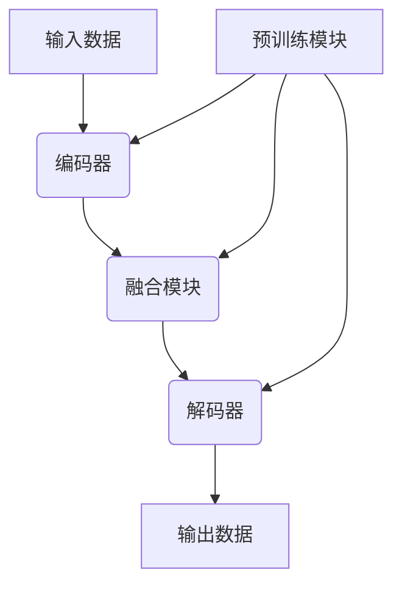

# 多模态大模型：技术原理与实战 智能顾问

## 1.背景介绍

### 1.1 人工智能的发展历程

人工智能(Artificial Intelligence, AI)是一门研究赋予机器智能的学科,旨在使计算机能够模拟人类的认知功能,如学习、推理、感知和行为能力。人工智能的发展经历了几个重要阶段:

- 1950年代:人工智能概念的提出和早期研究
- 1960-1970年代:专家系统和逻辑推理的发展
- 1980-1990年代:机器学习和神经网络的兴起
- 2010年后:深度学习和大数据的融合,推动人工智能取得突破性进展

### 1.2 大模型的兴起

随着计算能力的提高和海量数据的积累,人工智能模型变得越来越大和复杂。大模型(Large Model)是指具有数十亿甚至上万亿参数的巨大神经网络模型。这些模型通过在海量数据上进行预训练,获得了强大的表示能力和泛化性能。

代表性的大模型包括:

- GPT-3(2020年)
- PanGu-Alpha(2021年)
- DALL-E(2022年)
- ChatGPT(2022年)

大模型展现出了令人惊叹的性能,在自然语言处理、计算机视觉、多模态任务等领域取得了突破性进展。

### 1.3 多模态大模型的兴起

多模态大模型(Multimodal Large Model)是指能够同时处理多种模态数据(如文本、图像、视频、音频等)的大规模神经网络模型。相比于单一模态模型,多模态模型能够更好地理解和表示复杂的多模态信息,具有更强的泛化能力和实用价值。

多模态大模型的兴起是人工智能发展的一个重要里程碑,标志着人工智能系统正在朝着更加通用和智能的方向发展。

## 2.核心概念与联系

### 2.1 多模态学习

多模态学习(Multimodal Learning)是指从多种模态数据(如文本、图像、视频等)中学习知识表示和任务模型的过程。多模态学习旨在利用多种模态之间的互补信息,提高模型的泛化能力和鲁棒性。

多模态学习的核心挑战包括:

1. 模态融合(Modal Fusion):如何有效地融合来自不同模态的信息。
2. 模态对齐(Modal Alignment):如何建立不同模态之间的语义对应关系。
3. 模态不平衡(Modal Imbalance):如何处理不同模态数据的数量和质量差异。

### 2.2 大模型预训练

大模型预训练(Large Model Pretraining)是指在海量无标注数据上训练大规模神经网络模型,获得通用的知识表示和语义理解能力。预训练过程通常采用自监督学习(Self-Supervised Learning)或半监督学习(Semi-Supervised Learning)的方式进行。

常见的大模型预训练范式包括:

- 蒸馏预训练(Distillation Pretraining)
- 对比学习(Contrastive Learning)
- 自监督预训练(Self-Supervised Pretraining)

预训练后的大模型可以通过微调(Fine-tuning)或提示学习(Prompt Learning)等方式,在下游任务上获得良好的性能表现。

### 2.3 多模态大模型架构

多模态大模型架构通常由以下几个核心组件组成:

1. **编码器(Encoder)**:用于对不同模态的输入数据进行编码,获得模态特征表示。
2. **融合模块(Fusion Module)**:将来自不同模态的特征表示进行融合,获得多模态联合表示。
3. **解码器(Decoder)**:根据多模态联合表示,生成目标输出(如文本、图像等)。
4. **预训练模块**:在大规模无标注数据上进行自监督或半监督预训练,获得通用的多模态表示能力。

不同的多模态大模型架构在具体的编码器、融合模块和解码器设计上存在差异,但都遵循上述基本框架。



## 3.核心算法原理具体操作步骤

### 3.1 多模态编码器

多模态编码器的作用是将不同模态的输入数据转换为对应的特征表示。常见的编码器包括:

1. **文本编码器**:通常采用Transformer或BERT等模型,将文本序列转换为上下文语义表示。
2. **视觉编码器**:通常采用CNN或ViT等模型,将图像或视频转换为视觉特征表示。
3. **音频编码器**:通常采用CNN或Transformer等模型,将音频信号转换为声学特征表示。

编码器的具体操作步骤如下:

1. 输入预处理:对原始输入数据进行必要的预处理,如文本分词、图像归一化等。
2. 嵌入层:将预处理后的输入数据映射到模型可识别的嵌入空间。
3. 编码层:通过多层神经网络(如Transformer或CNN),对嵌入向量进行编码,获得模态特征表示。
4. 特征归一化:对编码后的特征进行归一化处理,以便后续的融合操作。

### 3.2 多模态融合

多模态融合是将来自不同模态的特征表示进行融合,获得多模态联合表示的过程。常见的融合策略包括:

1. **特征拼接(Feature Concatenation)**:直接将不同模态的特征向量拼接在一起。
2. **特征加权求和(Feature Weighted Sum)**:对不同模态的特征向量进行加权求和。
3. **注意力融合(Attention Fusion)**:通过注意力机制动态地融合不同模态的特征。
4. **门控融合(Gated Fusion)**:使用门控机制控制不同模态特征的融合程度。

多模态融合的具体操作步骤如下:

1. 特征对齐:对不同模态的特征进行维度对齐和归一化处理。
2. 融合策略选择:根据任务需求和模型架构,选择合适的融合策略。
3. 融合计算:执行选定的融合策略,获得多模态联合表示。
4. 特征投影(可选):对融合后的特征进行投影,以适应后续的解码器输入。

### 3.3 多模态解码器

多模态解码器的作用是根据多模态联合表示,生成目标输出。常见的解码器包括:

1. **文本解码器**:通常采用Transformer或LSTM等模型,根据多模态表示生成文本序列。
2. **图像解码器**:通常采用CNN或Transformer等模型,根据多模态表示生成图像或像素级输出。
3. **分类解码器**:通常采用全连接层或Transformer等模型,根据多模态表示进行分类或回归任务。

多模态解码器的具体操作步骤如下:

1. 解码器初始化:根据任务需求,初始化解码器的起始状态或输入。
2. 自回归解码:通过自回归(Autoregressive)方式,逐步生成目标输出序列。
3. 输出后处理:对生成的输出进行必要的后处理,如文本分词、图像上采样等。
4. 损失计算:计算生成输出与真实标注之间的损失,用于模型训练和优化。

## 4.数学模型和公式详细讲解举例说明

### 4.1 Transformer编码器

Transformer编码器是多模态大模型中常用的文本编码器,其核心是自注意力(Self-Attention)机制。自注意力机制能够捕捉输入序列中任意两个位置之间的关系,从而获得更好的上下文表示。

Transformer编码器的输入是一个长度为 $n$ 的嵌入序列 $X = (x_1, x_2, \dots, x_n)$,其中 $x_i \in \mathbb{R}^{d_\text{model}}$ 是第 $i$ 个位置的嵌入向量。Transformer编码器的计算过程如下:

1. **位置编码(Positional Encoding)**:添加位置信息到嵌入向量中,获得位置编码向量 $\tilde{x}_i$。

$$\tilde{x}_i = x_i + \text{PositionEncoding}(i)$$

2. **多头自注意力(Multi-Head Self-Attention)**:计算查询(Query)、键(Key)和值(Value)向量,并通过缩放点积注意力(Scaled Dot-Product Attention)计算自注意力输出。

$$
\begin{aligned}
\text{Attention}(Q, K, V) &= \text{softmax}\left(\frac{QK^\top}{\sqrt{d_k}}\right)V \\
\text{MultiHead}(Q, K, V) &= \text{Concat}(\text{head}_1, \dots, \text{head}_h)W^O \\
\text{where}\,\text{head}_i &= \text{Attention}(QW_i^Q, KW_i^K, VW_i^V)
\end{aligned}
$$

其中 $Q$、$K$、$V$ 分别表示查询、键和值矩阵,通过线性变换 $W_i^Q$、$W_i^K$、$W_i^V$ 从输入获得。$W^O$ 是一个可训练参数矩阵。

3. **前馈网络(Feed-Forward Network)**:对自注意力输出进行全连接前馈网络变换,获得最终的编码器输出。

$$\text{FFN}(x) = \max(0, xW_1 + b_1)W_2 + b_2$$

其中 $W_1$、$W_2$、$b_1$、$b_2$ 是可训练参数。

通过堆叠多个编码器层,Transformer编码器能够学习到输入序列的深层次表示,为后续的多模态融合和解码提供有力支持。

### 4.2 视觉-语言对比学习

视觉-语言对比学习(Vision-Language Contrastive Learning)是一种常用的多模态预训练范式,旨在学习视觉和语言模态之间的对应关系。对比学习的核心思想是最大化正样本对(如图像-文本对)之间的相似度,同时最小化负样本对之间的相似度。

给定一个包含图像-文本对 $(I, T)$ 的数据集 $\mathcal{D}$,对比学习的目标是最大化以下对比损失函数:

$$\mathcal{L}_\text{contrast} = -\mathbb{E}_{(I, T) \sim \mathcal{D}}\left[\log \frac{\exp(\text{sim}(I, T) / \tau)}{\sum_{(I', T') \in \mathcal{D}'} \exp(\text{sim}(I, T') / \tau)}\right]$$

其中 $\text{sim}(\cdot, \cdot)$ 是一个相似度函数,用于测量图像和文本表示之间的相似程度。$\tau$ 是一个温度超参数,用于控制相似度分布的平滑程度。$\mathcal{D}'$ 是一个包含正负样本对的集合,通常由数据增强或在批内构建负对获得。

对比损失函数的目标是最大化正样本对的相似度,同时最小化负样本对的相似度,从而学习到视觉和语言模态之间的对应关系。

在实践中,对比学习通常与其他预训练目标(如掩码语言模型、图像重构等)结合使用,以获得更好的多模态表示能力。

## 5.项目实践:代码实例和详细解释说明

以下是一个使用PyTorch实现的简单多模态融合模型示例,用于图像描述任务。该模型包括一个CNN视觉编码器、一个Transformer文本编码器和一个简单的融合模块。

### 5.1 导入必要的库

```python
import torch
import torch.nn as nn
from torchvision.models import resnet18
```

### 5.2 定义视觉编码器

```python
class VisualEncoder(nn.Module):
    def __init__(self, pretrained=True):
        super(VisualEncoder, self).__init__()
        self.cnn = resnet18(pretrained=pretrained)
        self.cnn.fc = nn.Identity()  # 去掉最后一层全连接层

    def forward(self, images):
        features = self.cnn(images)
        return features
```

该视觉编码器使用预训练的ResNet-18模型作为CNN backbone,输出图像的特征表示。

### 5.3 定义文本编码器

```python
class TextEncoder(nn.Module):
    def __init__(self, vocab_size, embed_dim, hidden_dim, num_layers):
        super(TextEncoder, self).__init__