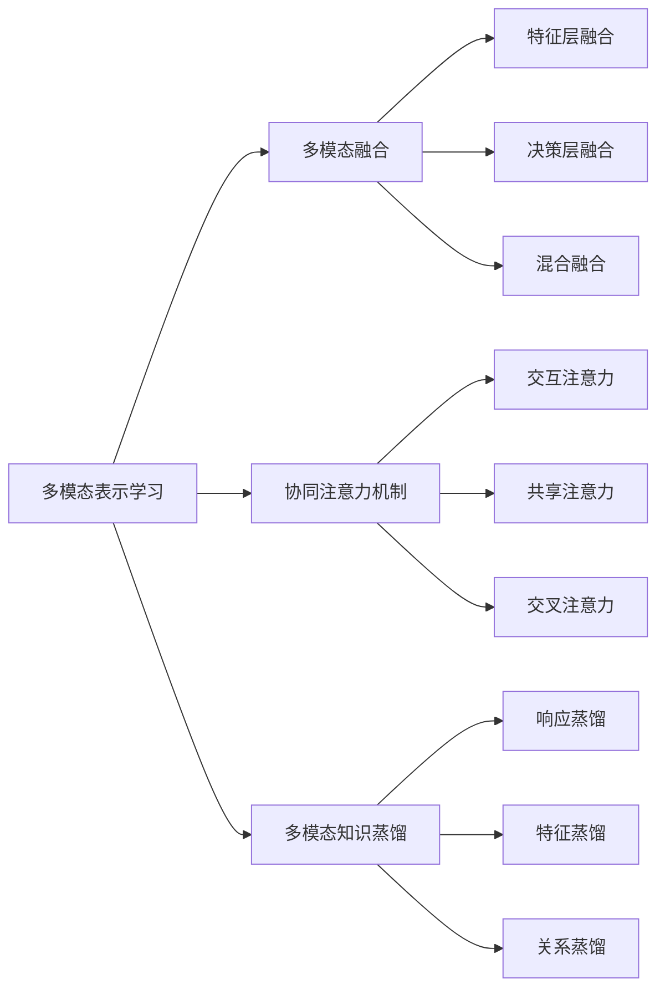

# 多模态学习原理与代码实战案例讲解

## 1. 背景介绍
### 1.1 多模态学习的定义与发展历程
多模态学习(Multimodal Learning)是一种利用多种感官信息进行机器学习的方法。它结合了计算机视觉、自然语言处理、语音识别等多个领域的技术,旨在让计算机像人类一样,能够同时处理和理解图像、文本、语音等不同模态的信息,从而更全面、准确地感知外部世界。

多模态学习的研究可以追溯到20世纪90年代。1997年,MIT媒体实验室的Picard等人提出了"情感计算"的概念,开始探索如何让计算机理解人类的情感。这可以看作是多模态学习的雏形。此后,随着深度学习的兴起,尤其是卷积神经网络(CNN)和循环神经网络(RNN)等模型的广泛应用,多模态学习进入了快速发展阶段。

近年来,谷歌、微软、Facebook等科技巨头以及众多高校和研究机构都在多模态学习领域投入了大量资源,取得了一系列突破性进展。比如视频问答、图像描述生成、语音合成等任务的性能大幅提升。多模态学习正在逐渐走向实用化,为人机交互、智能助理、医疗诊断、自动驾驶等应用场景带来新的想象空间。

### 1.2 多模态学习的优势与挑战
与单一模态学习相比,多模态学习的主要优势在于:

1. 信息互补性:不同模态的数据可以相互补充和验证,减少了单一模态的局限性和不确定性。
2. 鲁棒性更强:多模态融合有助于提高模型对噪声、遮挡、缺失等干扰的容忍度。 
3. 更接近人类认知:人类感知世界也是多通道、多层次的,多模态学习更符合人类智能的特点。

同时,多模态学习也面临着一些独特的挑战:

1. 模态异构性:不同模态数据的特征表示、时空对齐等问题增加了建模难度。
2. 模态间关联性:如何有效建模不同模态间的语义联系是一大难点。
3. 数据稀缺性:大规模、高质量的多模态标注数据难以获取,限制了模型性能的进一步提升。

尽管存在挑战,但多模态学习代表了人工智能的重要发展方向。随着数据积累和技术进步,它有望在更多领域发挥重要作用,为人类认知智能提供新的思路和借鉴。

## 2. 核心概念与联系
### 2.1 多模态表示学习
多模态表示学习的目标是将不同模态的数据映射到一个公共的语义空间,学习到统一的特征表示。常见的方法包括:

- 联合嵌入(Joint Embedding):通过优化模态间的相似度或排序损失,将不同模态数据映射到同一低维空间。
- 协同学习(Coordinated Representation):引入模态间的对齐约束,让不同模态的特征在语义层面同步。
- 对抗学习(Adversarial Learning):利用生成对抗网络,将多模态数据转化为同一分布的特征表示。

### 2.2 多模态融合
多模态融合是将不同模态的信息进行整合,输出联合决策的过程。按融合层次可分为:

- 特征层融合(Feature-level Fusion):在特征提取后,将不同模态的特征拼接或组合,送入后续的分类器或回归器。
- 决策层融合(Decision-level Fusion):每个模态独立做出预测,再通过投票、加权等机制做出最终决策。
- 混合融合(Hybrid Fusion):同时利用多个层次的融合策略,如先特征融合再决策融合。

### 2.3 协同注意力机制
协同注意力机制通过引入不同模态间的注意力交互,让模型自适应地调整对不同模态信息的关注程度。主要方式有:

- 交互注意力(Interaction Attention):利用一个模态的注意力图引导另一模态的特征提取。
- 共享注意力(Shared Attention):学习一个统一的注意力分布,用于指导多模态特征的融合。
- 交叉注意力(Co-attention):多个模态相互为对方提供注意力信息,实现注意力的协同引导。

### 2.4 多模态知识蒸馏
多模态知识蒸馏利用教师-学生网络范式,将一个模态学到的知识迁移到另一模态,实现模态间的信息互补和能力增强。主要策略包括:

- 响应蒸馏(Response-based Distillation):利用教师模型的输出概率分布来指导学生模型。 
- 特征蒸馏(Feature-based Distillation):利用教师模型的中间特征图来监督学生模型。
- 关系蒸馏(Relation-based Distillation):利用不同样本间的相对关系来传递知识。

下图总结了多模态学习的核心概念及其关联:

## 3. 核心算法原理与具体操作步骤
本节以多模态视频问答任务为例,介绍一种典型的多模态学习算法流程。该任务的目标是根据视频内容和相关的文本问题,给出正确的答案。核心步骤如下:

### 3.1 多模态特征提取
1. 视频特征:使用预训练的3D CNN网络(如C3D、I3D等)对视频帧序列进行特征提取,得到时序特征矩阵$V \in \mathbb{R}^{T \times d_v}$,其中$T$为帧数,$d_v$为视频特征维度。

2. 文本特征:使用预训练的词嵌入模型(如GloVe、BERT等)将问题$Q$和候选答案$\{A_i\}$映射为词向量序列$Q \in \mathbb{R}^{L_q \times d_t}$和$\{A_i \in \mathbb{R}^{L_{a_i} \times d_t}\}$,其中$L_q$和$L_{a_i}$分别为问题和答案的长度,$d_t$为文本特征维度。

### 3.2 多模态表示学习
1. 使用双向LSTM对问题$Q$进行编码,得到问题特征$\mathbf{q} \in \mathbb{R}^{2d_h}$:
$$
\overrightarrow{\mathbf{h}}_t = \text{LSTM}(\mathbf{q}_t, \overrightarrow{\mathbf{h}}_{t-1}),
\overleftarrow{\mathbf{h}}_t = \text{LSTM}(\mathbf{q}_t, \overleftarrow{\mathbf{h}}_{t+1})
$$
$$
\mathbf{q} = [\overrightarrow{\mathbf{h}}_{L_q}; \overleftarrow{\mathbf{h}}_1]
$$

2. 使用注意力机制对视频特征$V$进行加权求和,得到问题相关的视频特征$\tilde{\mathbf{v}} \in \mathbb{R}^{d_v}$:
$$
\alpha_t = \text{softmax}(\mathbf{q}^{\top}\mathbf{W}_a\mathbf{v}_t)
$$
$$
\tilde{\mathbf{v}} = \sum_{t=1}^T \alpha_t \mathbf{v}_t
$$

3. 将问题特征$\mathbf{q}$和视频特征$\tilde{\mathbf{v}}$拼接后通过MLP映射到公共空间,得到多模态融合特征$\mathbf{f} \in \mathbb{R}^{d_f}$:
$$
\mathbf{f} = \text{ReLU}(\mathbf{W}_f[\mathbf{q};\tilde{\mathbf{v}}] + \mathbf{b}_f)
$$

### 3.3 答案预测与优化
1. 使用注意力机制对每个候选答案$A_i$进行编码,得到答案特征$\mathbf{a}_i \in \mathbb{R}^{2d_h}$:
$$
\alpha_{i,j} = \text{softmax}(\mathbf{f}^{\top}\mathbf{W}_{aa}\mathbf{a}_{i,j}) 
$$
$$
\mathbf{a}_i = \sum_{j=1}^{L_{a_i}} \alpha_{i,j} [\overrightarrow{\mathbf{h}}_{i,j}; \overleftarrow{\mathbf{h}}_{i,j}]
$$

2. 计算融合特征$\mathbf{f}$与每个答案特征$\mathbf{a}_i$的相似度,并通过softmax归一化得到答案概率分布:
$$
s_i = \mathbf{f}^{\top}\mathbf{W}_s\mathbf{a}_i
$$
$$
p_i = \text{softmax}(s_i)
$$

3. 以交叉熵损失为优化目标,对整个模型进行端到端的训练:
$$
\mathcal{L} = -\sum_{i=1}^N y_i \log p_i
$$
其中$y_i \in \{0,1\}$为答案$A_i$的真实标签。

## 4. 数学模型和公式详细讲解举例说明
本节对多模态学习中的几个关键数学模型进行详细讲解和举例说明。

### 4.1 多模态联合嵌入
多模态联合嵌入的目标是学习一个映射函数$f(\cdot)$,将不同模态的数据$\mathbf{x}_i^{(m)}$映射到同一低维空间,使得在该空间内,语义相似的数据点距离尽可能近,而不相似的数据点距离尽可能远。形式化地,该模型可表示为:
$$
\min_{\theta} \sum_{i,j} \mathcal{L}(f(\mathbf{x}_i^{(m)}; \theta), f(\mathbf{x}_j^{(n)}; \theta))
$$
其中$\mathcal{L}(\cdot)$为距离度量函数,常见的有欧氏距离、余弦相似度等;$\theta$为映射函数$f(\cdot)$的参数。

举例来说,对于图像-文本对$(I_i, T_i)$,我们可以分别用CNN和LSTM提取特征$\mathbf{v}_i$和$\mathbf{t}_i$,然后通过两个全连接层将它们映射到同一空间:
$$
f(\mathbf{v}_i) = \mathbf{W}_v\mathbf{v}_i + \mathbf{b}_v,
f(\mathbf{t}_i) = \mathbf{W}_t\mathbf{t}_i + \mathbf{b}_t
$$
再使用最大间隔排序损失(Margin Ranking Loss)进行优化:
$$
\mathcal{L} = \max(0, \alpha - s(f(\mathbf{v}_i), f(\mathbf{t}_i)) + s(f(\mathbf{v}_i), f(\mathbf{t}_j)))
$$
其中$s(\cdot)$为相似度函数,$\alpha$为间隔阈值。该损失函数鼓励正样本对$(I_i,T_i)$的相似度比负样本对$(I_i,T_j)$高出一个边际$\alpha$。

### 4.2 多模态注意力机制
多模态注意力机制用于自适应地调整不同模态信息的重要程度。以协同注意力为例,给定两个模态的特征矩阵$\mathbf{X} \in \mathbb{R}^{n \times d_x}$和$\mathbf{Y} \in \mathbb{R}^{m \times d_y}$,我们首先计算它们之间的相似度矩阵$\mathbf{S} \in \mathbb{R}^{n \times m}$:
$$
\mathbf{S} = \tanh(\mathbf{X}\mathbf{W}_x\mathbf{W}_y^{\top}\mathbf{Y}^{\top})
$$
然后通过行/列归一化得到两个模态上的注意力分布:
$$
\mathbf{A}_x = \text{softmax}(\mathbf{S}), \mathbf{A}_y = \text{softmax}(\mathbf{S}^{\top})
$$
最后利用注意力分布对原始特征进行加权求和,得到注意力引导下的新特征:
$$
\tilde{\mathbf{X}} = \mathbf{A}_y\