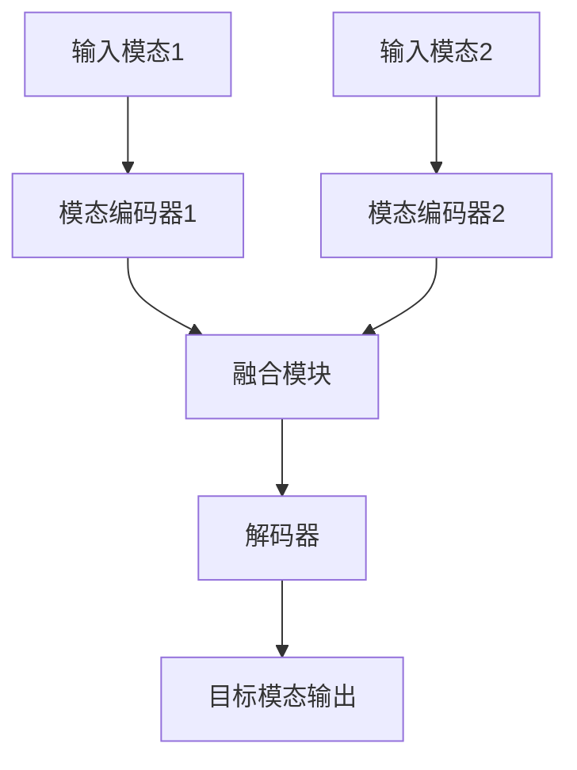

# 多模态生成(Multimodal Generation) - 原理与代码实例讲解

## 1.背景介绍

### 1.1 什么是多模态生成

多模态生成(Multimodal Generation)是一种将不同模态(modalities)的数据(如文本、图像、音频等)作为输入,并生成另一种模态的数据作为输出的任务。例如,将图像和文本作为输入,生成相应的音频描述;或者将文本和音频作为输入,生成相关的图像。

随着深度学习技术的不断发展,多模态生成任务在计算机视觉、自然语言处理、多媒体等领域引起了广泛关注,并取得了令人瞩目的进展。

### 1.2 多模态生成的应用场景

多模态生成技术有着广泛的应用前景,包括但不限于:

- 视觉问答(Visual Question Answering)
- 图像字幕生成(Image Captioning)
- 文本到图像生成(Text-to-Image Generation)
- 音频到图像生成(Audio-to-Image Generation)
- 多模态机器翻译(Multimodal Machine Translation)
- 虚拟现实(Virtual Reality)和增强现实(Augmented Reality)

## 2.核心概念与联系

### 2.1 模态编码器(Modal Encoders)

模态编码器的作用是将不同模态的输入数据编码为语义向量表示。常见的编码器包括:

- 文本编码器(Text Encoder):使用预训练语言模型(如BERT、GPT)对文本进行编码。
- 图像编码器(Image Encoder):使用卷积神经网络(CNN)或视觉转换器(ViT)对图像进行编码。
- 音频编码器(Audio Encoder):使用卷积神经网络或循环神经网络(RNN)对音频进行编码。

### 2.2 融合模块(Fusion Module)

融合模块的作用是将不同模态的语义向量表示进行融合,生成一个多模态的联合表示。常见的融合策略包括:

- 简单拼接(Concatenation)
- 元素级别相加(Element-wise Addition)
- 注意力融合(Attention Fusion)
- 跨模态编码器(Cross-Modal Encoder)

### 2.3 解码器(Decoder)

解码器的作用是将融合后的多模态表示解码为目标模态的输出。常见的解码器包括:

- 文本解码器(Text Decoder):使用自回归语言模型(如GPT)生成文本输出。
- 图像解码器(Image Decoder):使用卷积神经网络或像素CNN生成图像输出。
- 音频解码器(Audio Decoder):使用循环神经网络或WaveNet生成音频输出。

### 2.4 核心架构

多模态生成的核心架构通常由以下几个部分组成:



## 3.核心算法原理具体操作步骤

多模态生成的核心算法原理可以概括为以下几个步骤:

1. **模态编码**:将不同模态的输入数据(如文本、图像、音频等)通过相应的编码器(如BERT、CNN、RNN等)编码为语义向量表示。

2. **模态融合**:将不同模态的语义向量表示通过融合模块(如拼接、相加、注意力机制等)融合为一个多模态的联合表示。

3. **解码生成**:将融合后的多模态表示通过解码器(如GPT、像素CNN、WaveNet等)解码为目标模态的输出(如文本、图像、音频等)。

4. **训练优化**:使用监督学习或自监督学习的方式,基于大量的多模态数据对整个模型进行端到端的训练,优化模型参数,提高生成质量。

下面以文本到图像生成(Text-to-Image Generation)为例,具体介绍核心算法的操作步骤:

1. **文本编码**:使用预训练的BERT模型对输入文本进行编码,得到文本的语义向量表示$\boldsymbol{h}_\text{text}$。

2. **图像编码**:使用预训练的CNN模型(如VGG、ResNet等)对配对的图像进行编码,得到图像的语义向量表示$\boldsymbol{h}_\text{image}$。

3. **模态融合**:将文本向量$\boldsymbol{h}_\text{text}$和图像向量$\boldsymbol{h}_\text{image}$通过拼接或元素级相加的方式融合,得到多模态融合向量$\boldsymbol{h}_\text{fused}$。

4. **图像解码**:将融合向量$\boldsymbol{h}_\text{fused}$输入到像素CNN或者转换器解码器中,逐步解码生成目标图像。

5. **损失计算**:计算生成图像与真实图像之间的像素级损失(如均方误差损失、对比度损失等),并通过反向传播算法优化模型参数。

6. **模型训练**:在大规模的文本-图像配对数据集上反复训练模型,直至模型收敛,达到满意的生成质量。

## 4.数学模型和公式详细讲解举例说明

在多模态生成任务中,常常需要使用一些数学模型和公式来表示和优化模型。下面将详细介绍一些常用的数学模型和公式。

### 4.1 注意力机制(Attention Mechanism)

注意力机制是多模态融合中常用的一种技术,它可以自适应地捕获不同模态之间的相关性,并对相关的特征赋予更高的权重。

在文本到图像生成任务中,常用的注意力机制是双向注意力机制(Bidirectional Attention Mechanism),它可以同时建模文本到图像和图像到文本的注意力关系。

设文本特征为$\boldsymbol{H}_\text{text} = \{\boldsymbol{h}_\text{text}^1, \boldsymbol{h}_\text{text}^2, \ldots, \boldsymbol{h}_\text{text}^{L_\text{text}}\}$,图像特征为$\boldsymbol{H}_\text{image} = \{\boldsymbol{h}_\text{image}^1, \boldsymbol{h}_\text{image}^2, \ldots, \boldsymbol{h}_\text{image}^{L_\text{image}}\}$,其中$L_\text{text}$和$L_\text{image}$分别表示文本和图像的特征长度。

文本到图像的注意力权重可以计算为:

$$\boldsymbol{A}_\text{text2image} = \text{softmax}(\boldsymbol{H}_\text{text} \boldsymbol{W}_\text{text2image} \boldsymbol{H}_\text{image}^\top)$$

其中$\boldsymbol{W}_\text{text2image}$是一个可学习的权重矩阵。

图像到文本的注意力权重可以类似地计算为:

$$\boldsymbol{A}_\text{image2text} = \text{softmax}(\boldsymbol{H}_\text{image} \boldsymbol{W}_\text{image2text} \boldsymbol{H}_\text{text}^\top)$$

通过注意力权重,我们可以获得文本和图像的加权特征表示:

$$\boldsymbol{H}_\text{text}^\text{att} = \boldsymbol{A}_\text{image2text}^\top \boldsymbol{H}_\text{text}$$
$$\boldsymbol{H}_\text{image}^\text{att} = \boldsymbol{A}_\text{text2image}^\top \boldsymbol{H}_\text{image}$$

最终的多模态融合向量可以通过拼接或元素级相加的方式得到:

$$\boldsymbol{h}_\text{fused} = \boldsymbol{H}_\text{text}^\text{att} \oplus \boldsymbol{H}_\text{image}^\text{att}$$

或者

$$\boldsymbol{h}_\text{fused} = \boldsymbol{H}_\text{text}^\text{att} + \boldsymbol{H}_\text{image}^\text{att}$$

其中$\oplus$表示拼接操作。

### 4.2 对比度损失(Contrastive Loss)

在多模态生成任务中,我们常常需要最大化不同模态之间的相关性,而最小化不相关模态之间的相关性。对比度损失就是一种实现这一目标的有效方法。

设$\boldsymbol{h}_\text{pos}$为正样本对的多模态融合向量,$\boldsymbol{h}_\text{neg}^1, \boldsymbol{h}_\text{neg}^2, \ldots, \boldsymbol{h}_\text{neg}^K$为$K$个负样本对的多模态融合向量。对比度损失可以定义为:

$$\mathcal{L}_\text{contrast} = -\log \frac{\exp(\text{sim}(\boldsymbol{h}_\text{pos}, \boldsymbol{h}_\text{pos}) / \tau)}{\sum_{k=1}^K \exp(\text{sim}(\boldsymbol{h}_\text{pos}, \boldsymbol{h}_\text{neg}^k) / \tau)}$$

其中$\text{sim}(\cdot, \cdot)$是一个相似性函数(如内积或余弦相似度),$\tau$是一个温度超参数。

对比度损失的目标是最大化正样本对的相似性,同时最小化正样本与负样本之间的相似性。通过优化这一损失函数,可以使模型学习到更好的多模态表示。

### 4.3 生成对抗网络(Generative Adversarial Networks, GANs)

生成对抗网络(GANs)是一种常用于图像生成任务的有效模型,它由一个生成器(Generator)和一个判别器(Discriminator)组成。生成器的目标是生成逼真的图像,而判别器的目标是区分生成图像和真实图像。

在文本到图像生成任务中,生成器$G$接受文本嵌入$\boldsymbol{h}_\text{text}$和一个随机噪声向量$\boldsymbol{z}$作为输入,生成一个图像$\boldsymbol{I}_\text{fake} = G(\boldsymbol{h}_\text{text}, \boldsymbol{z})$。判别器$D$则接受生成图像$\boldsymbol{I}_\text{fake}$和真实图像$\boldsymbol{I}_\text{real}$作为输入,输出一个标量值,表示输入图像是真实的概率。

生成器和判别器的损失函数可以定义为:

$$\begin{aligned}
\mathcal{L}_D &= -\mathbb{E}_{\boldsymbol{I}_\text{real}} \log D(\boldsymbol{I}_\text{real}) - \mathbb{E}_{\boldsymbol{z}, \boldsymbol{h}_\text{text}} \log(1 - D(G(\boldsymbol{h}_\text{text}, \boldsymbol{z})))\\
\mathcal{L}_G &= -\mathbb{E}_{\boldsymbol{z}, \boldsymbol{h}_\text{text}} \log D(G(\boldsymbol{h}_\text{text}, \boldsymbol{z}))
\end{aligned}$$

在训练过程中,生成器和判别器通过最小化各自的损失函数,进行对抗式的优化。最终,生成器可以生成逼真的图像,而判别器也可以准确地区分真实图像和生成图像。

## 5.项目实践:代码实例和详细解释说明

为了更好地理解多模态生成的原理和实现,我们将通过一个文本到图像生成的代码示例进行详细说明。

### 5.1 数据准备

我们将使用一个常用的文本-图像配对数据集CUB-200-2011进行训练和测试。该数据集包含200种不同的鸟类,每种鸟类有大约60张图像,并配有相应的文本描述。

```python
import torchvision.datasets as datasets

# 加载CUB-200-2011数据集
dataset = datasets.CUB200(root='./data', download=True)
```

### 5.2 模型定义

我们将定义一个基于注意力机制的文本到图像生成模型。该模型包括文本编码器、图像编码器、注意力融合模块和图像解码器四个主要部分。

```python
import torch
import torch.nn as nn

class TextEncoder(nn.Module):
    # 文本编码器实现...

class ImageEncoder(nn.Module):
    # 图像编码器实现...

class AttentionFusion(nn.Module):
    # 注意力融合模块实现...

class ImageDecoder(nn.Module):
    # 图像解码器实现...

class TextToImageModel(nn.Module):
    def __init__(self):
        super(TextToImageModel, self).__init__()
        self.text_encoder = TextEncoder()
        self.image_encoder = ImageEncoder()
        self.attention_fusion = AttentionFusion()
        self.image_decoder = ImageDecoder()

    def forward(self