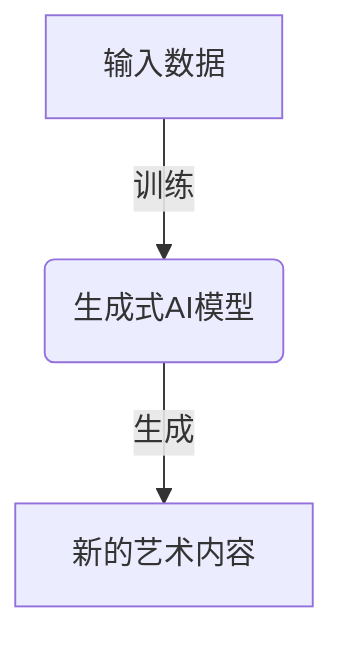
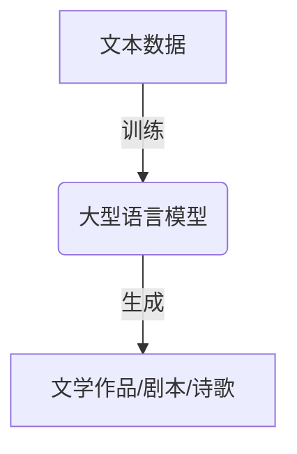
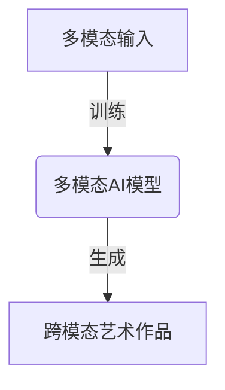
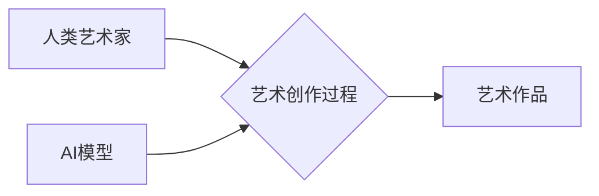

# 大模型与AI辅助艺术创作：从模仿到创新

## 1. 背景介绍

艺术创作一直被视为人类独有的能力,需要创造力、想象力和审美意识。然而,近年来人工智能(AI)的飞速发展正在改变这一格局。大型语言模型(Large Language Models,LLM)和生成式人工智能(Generative AI)展现出惊人的创作潜力,在文学、绘画、音乐等多个艺术领域发挥着重要作用。

### 1.1 人工智能艺术的兴起

人工智能艺术(AI Art)是指利用人工智能技术创作的艺术品。早在20世纪90年代,一些先驱者就开始尝试使用计算机程序生成艺术作品。随着深度学习等技术的不断进步,AI艺术逐渐获得关注。2018年,人工智能绘画作品"肖像of Edmond Belamy"在佳士得拍卖会上拍出43.25万美元的天价,成为首件拍卖的AI艺术品。

### 1.2 大模型的艺术创作潜力

近年来,大型语言模型和生成式AI模型的出现为AI艺术创作带来了新的契机。这些模型通过学习海量数据,掌握了丰富的知识和创作技巧,可以生成高质量的文本、图像、音频等内容。著名的GPT-3、DALL-E、Stable Diffusion等模型在艺术创作领域展现出巨大潜力。

### 1.3 AI辅助艺术创作的优势

相比传统的人工创作,AI辅助艺术创作具有一些独特的优势:

- 高效性:AI可以快速生成大量创意草稿,为艺术家提供灵感和素材。
- 多样性:AI模型可以探索更多风格和创意,打破人类认知的局限。
- 协作性:人工智能可以与人类艺术家协作创作,实现"人机合璧"。

## 2. 核心概念与联系

### 2.1 生成式人工智能(Generative AI)

生成式AI是一类能够生成新内容(如文本、图像、音频等)的人工智能模型。它们通过学习大量数据,捕捉数据中的模式和规律,从而生成新的、看似合理的内容。

生成式AI模型通常采用深度学习技术,如变分自编码器(VAE)、生成对抗网络(GAN)、扩散模型(Diffusion Models)等。这些模型可以在各种艺术领域发挥作用,如文本生成、图像生成、音乐创作等。

### 2.2 大型语言模型(LLM)

大型语言模型是一类基于自然语言处理(NLP)技术的人工智能模型,能够理解和生成人类语言。这些模型通过学习海量文本数据,掌握了丰富的语言知识和表达能力。

著名的大型语言模型包括GPT-3、BERT、PALM等。它们不仅可以生成高质量的文本内容,还可以在文学创作、剧本撰写、诗歌创作等艺术领域发挥作用。

### 2.3 多模态AI模型

多模态AI模型是指能够处理多种形式数据(如文本、图像、音频等)的人工智能模型。它们可以捕捉不同模态之间的关联,实现跨模态的理解和生成。

多模态AI模型在艺术创作中具有重要应用,可以将不同形式的输入(如文本描述、音乐旋律等)转换为艺术作品(如图像、视频等)。著名的多模态模型包括DALL-E、Stable Diffusion、Imagen等。

### 2.4 AI与人类艺术家的协作

AI辅助艺术创作并非完全取代人类艺术家,而是与人类艺术家形成协作关系。AI可以提供创意灵感和辅助工具,而人类艺术家则负责审美把控、创作决策等核心环节。这种"人机合璧"的方式可以充分发挥AI和人类各自的优势,创造出更加出色的艺术作品。

## 3. 核心算法原理具体操作步骤

### 3.1 生成式对抗网络(GAN)

生成式对抗网络(Generative Adversarial Networks, GAN)是一种常用于生成式AI的深度学习架构。它由两个神经网络组成:生成器(Generator)和判别器(Discriminator)。两个网络通过对抗训练的方式,生成器学习生成逼真的数据分布,而判别器学习区分真实数据和生成数据。

1. **初始化生成器和判别器网络**
2. **从真实数据和生成器采样数据**
3. **训练判别器**
    - 最大化判别器正确分类真实数据和生成数据的能力
4. **训练生成器**
    - 最大化生成器欺骗判别器的能力,使生成数据被判别为真实数据
5. **重复3和4,直到生成器和判别器达到平衡**

GAN已被广泛应用于图像生成、音乐生成等艺术创作领域。著名的AI艺术模型DALL-E、Stable Diffusion等都采用了GAN架构。

### 3.2 变分自编码器(VAE)

变分自编码器(Variational Autoencoder, VAE)是一种生成式模型,能够学习数据的潜在分布,并从该分布中采样生成新数据。它由编码器(Encoder)和解码器(Decoder)两个神经网络组成。

1. **编码器将输入数据编码为潜在变量的分布**
2. **从潜在变量的分布中采样一个潜在变量**
3. **解码器将采样的潜在变量解码为输出数据**
4. **通过重构损失和KL散度损失优化编码器和解码器**

VAE可以应用于图像生成、音乐生成等领域,通过学习数据的潜在分布,生成新的、具有多样性的艺术作品。

### 3.3 扩散模型(Diffusion Models)

扩散模型是一种新兴的生成式AI模型,在图像、音频等领域展现出优秀的生成能力。它通过学习从噪声到数据的逆过程,从而实现数据的生成。

1. **前向扩散过程**
    - 将数据逐步添加高斯噪声,直到完全变为纯噪声
2. **反向生成过程**
    - 训练一个神经网络,从纯噪声开始,逐步去噪,最终生成目标数据
3. **通过最小化去噪过程的损失函数,优化神经网络参数**

扩散模型已被应用于AI艺术创作,如Stable Diffusion等知名模型,可以生成高质量、多样化的图像和音频作品。

### 3.4 大型语言模型(LLM)

大型语言模型通过自监督学习和大规模预训练,掌握了丰富的语言知识和生成能力。常见的语言模型架构包括Transformer、BERT、GPT等。

1. **预训练阶段**
    - 在大规模文本语料上进行自监督学习,获取语言知识
2. **微调阶段**
    - 在特定任务上进行监督微调,使模型适应特定领域
3. **生成阶段**
    - 给定一个提示,模型生成与提示相关的文本内容

大型语言模型可以应用于文学创作、剧本撰写、诗歌创作等艺术领域,为艺术家提供灵感和辅助创作。

## 4. 数学模型和公式详细讲解举例说明

### 4.1 生成式对抗网络(GAN)损失函数

在GAN中,生成器G和判别器D通过最小化不同的损失函数进行对抗训练。常用的损失函数是最小二乘损失(Least Squares Loss)和交叉熵损失(Cross Entropy Loss)。

**最小二乘损失:**
$$\begin{aligned}
\min_G \max_D V(D,G) &= \mathbb{E}_{x\sim p_\text{data}(x)}\left[(D(x)-1)^2\right] \\
&+ \mathbb{E}_{z\sim p_z(z)}\left[D(G(z))^2\right]
\end{aligned}$$

其中:
- $p_\text{data}(x)$是真实数据分布
- $p_z(z)$是噪声先验分布
- $G(z)$是生成器生成的假数据

**交叉熵损失:**
$$\begin{aligned}
\min_G \max_D V(D,G) &= \mathbb{E}_{x\sim p_\text{data}(x)}\left[\log D(x)\right] \\
&+ \mathbb{E}_{z\sim p_z(z)}\left[\log(1-D(G(z)))\right]
\end{aligned}$$

通过优化这些损失函数,生成器G学习生成逼真的数据分布,而判别器D学习区分真实数据和生成数据。

### 4.2 变分自编码器(VAE)损失函数

VAE的损失函数包括重构损失(Reconstruction Loss)和KL散度损失(KL Divergence Loss)两部分。

**重构损失:**
$$\mathcal{L}_\text{rec} = \mathbb{E}_{q_\phi(z|x)}\left[\log p_\theta(x|z)\right]$$

重构损失衡量解码器从潜在变量重构数据的精度。

**KL散度损失:**
$$\mathcal{L}_\text{KL} = D_\text{KL}\left(q_\phi(z|x) \| p(z)\right)$$

KL散度损失衡量编码器输出的潜在变量分布与先验分布(通常是标准高斯分布)的差异。

**总损失函数:**
$$\mathcal{L} = \mathcal{L}_\text{rec} + \beta \mathcal{L}_\text{KL}$$

其中$\beta$是一个超参数,用于平衡两个损失项的权重。通过优化总损失函数,VAE可以学习数据的潜在分布,并从中生成新数据。

### 4.3 扩散模型(Diffusion Models)损失函数

扩散模型的损失函数是基于从噪声到数据的逆过程,即去噪过程。常用的损失函数是加性高斯噪声的均方误差(Mean Squared Error, MSE)。

**MSE损失函数:**
$$\mathcal{L}_\text{simple} = \mathbb{E}_{x_0, \epsilon \sim \mathcal{N}(0,I), t}\left[\left\|\epsilon - \epsilon_\theta(x_t, t)\right\|_2^2\right]$$

其中:
- $x_0$是原始数据
- $x_t$是在时间步$t$添加噪声后的数据
- $\epsilon$是从标准高斯分布采样的噪声
- $\epsilon_\theta(x_t, t)$是神经网络预测的去噪值

通过优化这个损失函数,神经网络可以学习从噪声数据$x_t$预测去噪值$\epsilon_\theta(x_t, t)$,从而实现数据的生成。

扩散模型还可以采用更复杂的损失函数,如加权MSE损失、DDPM损失等,以提高生成质量和效率。

### 4.4 大型语言模型(LLM)损失函数

大型语言模型通常采用自回归(Autoregressive)架构,预测下一个词的概率条件于前面的词序列。常用的损失函数是交叉熵损失(Cross Entropy Loss)。

**交叉熵损失:**
$$\mathcal{L} = -\frac{1}{N}\sum_{i=1}^N \log p(x_i|x_{<i})$$

其中:
- $N$是序列长度
- $x_i$是第$i$个词
- $x_{<i}$是前$i-1$个词的序列
- $p(x_i|x_{<i})$是模型预测的第$i$个词的条件概率

通过最小化这个损失函数,语言模型可以学习到更准确的词预测能力,从而生成高质量的文本内容。

在预训练阶段,语言模型通常采用掩码语言模型(Masked Language Modeling)和下一句